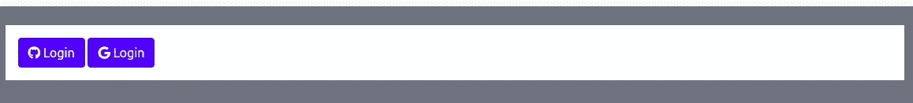
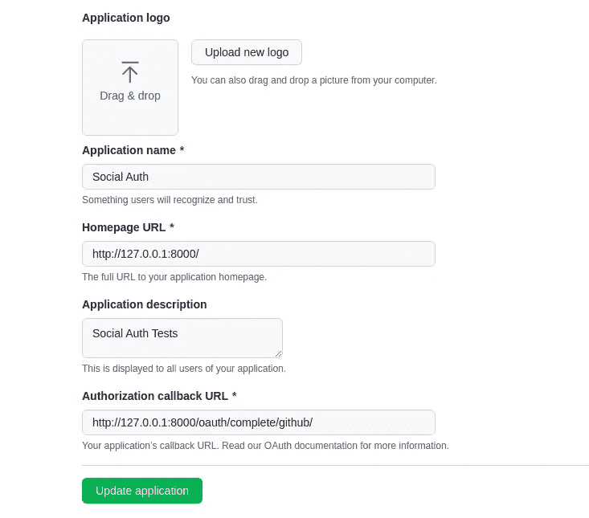
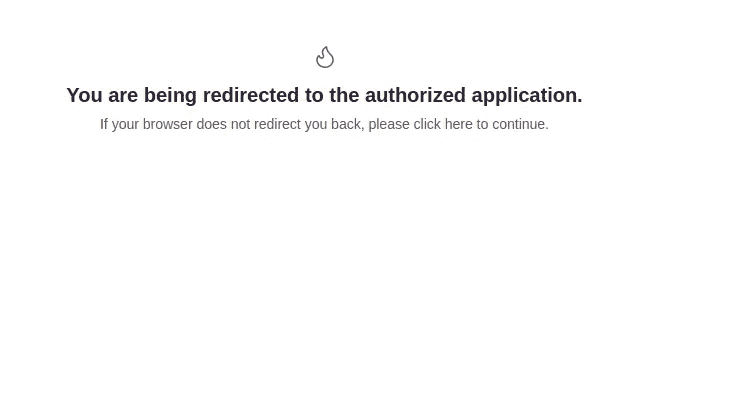
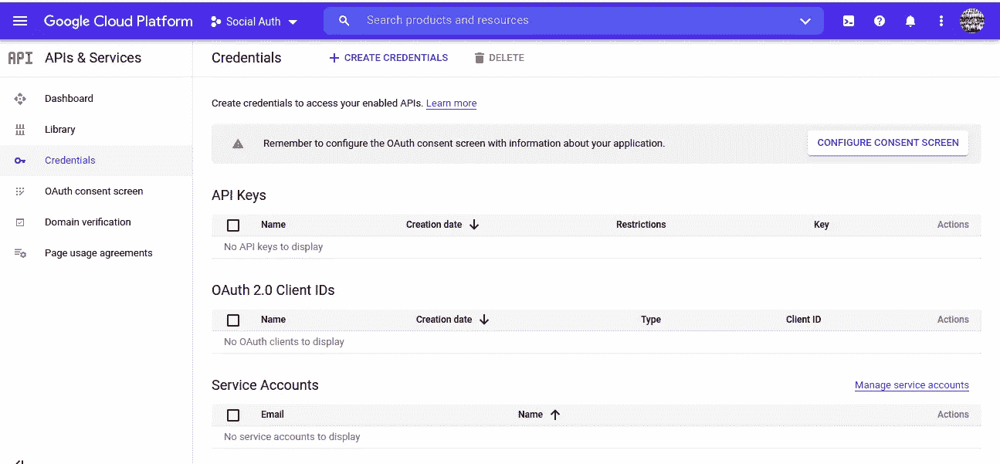
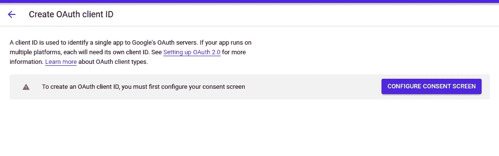
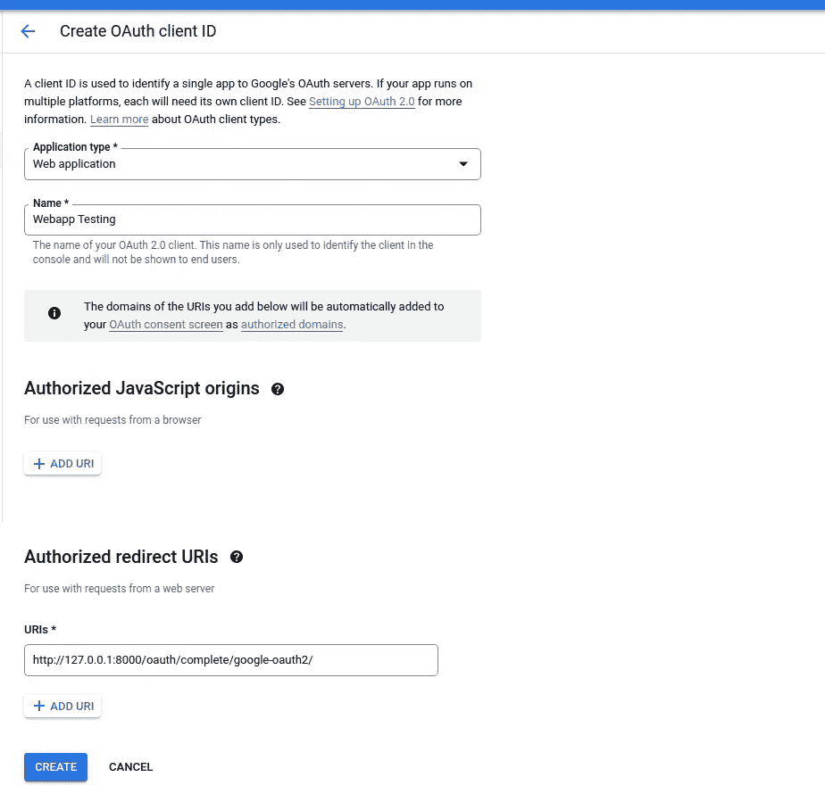
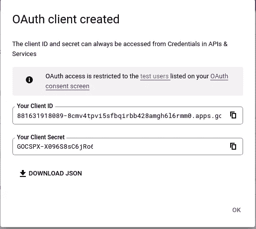
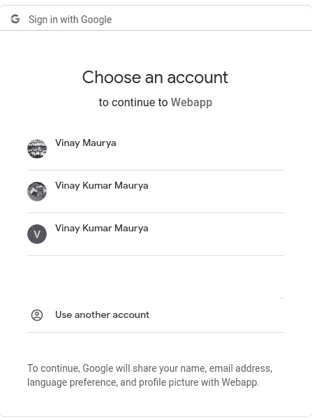

# 在 Django 实现社交登录

> 原文：<https://medium.com/analytics-vidhya/implementing-social-login-in-django-3ba8f59ec6f2?source=collection_archive---------0----------------------->

使用 social-auth-app-django 库


诺德伍德主题公司在 [Unsplash](https://unsplash.com?utm_source=medium&utm_medium=referral) 上拍摄的照片

在这篇博客中，我将指导你如何在 Django 中实现社交登录。基本上，我将涵盖谷歌和 Github 认证，你可以用同样的方式做 Twitter 和脸书认证。

确保您已经创建了 Django 项目。下一步是你需要安装[*social-auth-app-django*](https://python-social-auth.readthedocs.io/en/latest/configuration/django.html)包。

# 装置

我们将通过 pip 安装它。

```
pip install social-auth-app-django
```

# 配置

将 *social_django* 添加到 settings.py 中的 **INSTALLED_APPS** 中，然后迁移数据库。

```
INSTALLED_APPS = [
    'django.contrib.admin',
    'django.contrib.auth',
    'django.contrib.contenttypes',
    'django.contrib.sessions',
    'django.contrib.messages',
    'django.contrib.staticfiles',
    'polls',
    'social_django',

]python manage.py migrate  
Operations to perform:   
Apply all migrations: admin, auth, contenttypes, sessions, social_django Running migrations:   Applying social_django.0001_initial... OK   Applying social_django.0002_add_related_name... OK   Applying social_django.0003_alter_email_max_length... OK   Applying social_django.0004_auto_20160423_0400... OK   Applying social_django.0005_auto_20160727_2333... OK   Applying social_django.0006_partial... OK
```

现在我们需要更新中间件，在最后添加 SocialAuthExceptionMiddleware。

```
MIDDLEWARE = [
    'django.middleware.security.SecurityMiddleware',
    'django.contrib.sessions.middleware.SessionMiddleware',
    'django.middleware.common.CommonMiddleware',
    'django.middleware.csrf.CsrfViewMiddleware',
    'django.contrib.auth.middleware.AuthenticationMiddleware',
    'django.contrib.messages.middleware.MessageMiddleware',
    'django.middleware.clickjacking.XFrameOptionsMiddleware',
    'social_django.middleware.SocialAuthExceptionMiddleware',  # <--
]
```

现在是更新**上下文处理器**的时候了

```
TEMPLATES = [
    {
        'BACKEND': 'django.template.backends.django.DjangoTemplates',
        'DIRS': [os.path.join(BASE_DIR, 'templates')],
        'APP_DIRS': True,
        'OPTIONS': {
            'context_processors': [
                'django.template.context_processors.debug',
                'django.template.context_processors.request',
                'django.contrib.auth.context_processors.auth',
                'django.contrib.messages.context_processors.messages',
                'social_django.context_processors.backends',  # <--
                'social_django.context_processors.login_redirect', # <--
            ],
        },
    },
]
```

下一步是添加社会认证后端。

```
AUTHENTICATION_BACKENDS = (
    'social_core.backends.github.GithubOAuth2', # github <----
    'social_core.backends.twitter.TwitterOAuth', # twitter <----
    'social_core.backends.facebook.FacebookOAuth2', # facebook <----
    'social_core.backends.google.GoogleOAuth2',  # google <----
    'django.contrib.auth.backends.ModelBackend',
)
```

在这里，我为 GitHub，Twitter，脸书，谷歌添加了后端，但正如我所说，我将向你展示 Github 和谷歌认证。现在在你的 urls.py 中添加**social-auth-app-django**URL。

```
from django.contrib import admin
from django.urls import path,include
from django.conf import settings
from django.conf.urls.static import static

urlpatterns = [
    path('admin/', admin.site.urls),
    path('',include('polls.urls')),
    **path('oauth/', include('social_django.urls'namespace='social'))** 
] + static(settings.STATIC_URL, document_root=settings.STATIC_ROOT) + static(settings.MEDIA_URL, document_root=settings.MEDIA_ROOT)
```

添加您的视图和模板来处理登录。

```
# In views.pydef social_login(request):

    return render(request,'social_login.html')# Inside template 



<div class="container mt-4 bg-white p-3">
   <a class="btn btn-primary" href=""><i class="fab fa-github"></i>&nbsp;Login</a>
      <a class="btn btn-primary" href=""> <i class="fab fa-google"></i>&nbsp;Login</a>
</div>

```



现在我将从 GitHub 认证开始。

# GitHub 认证

登录你的 **GitHub** 账号，进入**设置**。在左侧栏中，有**开发者设置**选项。点击 **OAuth 应用**并点击新建 OAuth 应用。将出现一个表格，填写相关信息并提交。



GitHub OAuth 表单

上面截图中的信息只是用于测试目的，它将在本地服务器上工作。提交表格后，您将获得客户 ID 和客户密码。您需要复制这两个键，并将其粘贴到 setting.py 文件中。

```
SOCIAL_AUTH_GITHUB_KEY = '072fdd566d6e054wfe346f'
SOCIAL_AUTH_GITHUB_SECRET = 'e89072f86d42f3f44b4d9d67997b326bc0'
```

这就是我们登录 GitHub 所需的全部内容。现在尝试用 GitHub 登录。



GitHub 登录成功

# 谷歌认证

对于谷歌认证，我们再次需要谷歌客户端 ID 和客户端机密。进入 [***谷歌开发者控制台***](https://console.cloud.google.com/apis/dashboard) ***和*** 点击**新建项目，**我已经创建了一个名为 Social Auth 的项目。



现在点击**+创建凭证**并选择 **OAuth 客户端 ID** 一个表单将打开，填写相关信息。在此之前，您需要配置同意屏幕。



OAuth 客户端 ID

点击**配置同意屏幕**按钮，配置完成后，点击下面的创建凭证，选择 web 应用程序作为选项，表单将打开。



OAuth 客户端 ID

点击创建按钮，您将获得您的客户 ID 和客户机密。



客户端 ID

这就是我们想要的。现在复制客户端 ID 和客户端密码，并将它们粘贴到 settings.py 文件中。

```
SOCIAL_AUTH_GITHUB_KEY = '072fdd56598626f'
SOCIAL_AUTH_GITHUB_SECRET = 'e89072f86d42f3f4997b326bc0'
SOCIAL_AUTH_GOOGLE_OAUTH2_KEY = '6390808614-qjduvv0eu1ehdf6pr1aqesc.apps.googleusercontent.com'
SOCIAL_AUTH_GOOGLE_OAUTH2_SECRET = 'zY5rWkqetCWnnQ'
```

现在试着用谷歌登录。选择你的谷歌帐户，你想验证这就是全部。恭喜你！！



> 现在的情况是，我想只允许某些谷歌电子邮件认证。假设在一个组织中，所有员工都有基于组织的 google 帐户域，我们希望通过基于组织的帐户授权，而不是个人帐户，为此我们可以做一些调整。

假设该组织的名称是 XYZ，员工的电子邮件以@xyz.com 结尾。在您的**设置中**

```
# domain white list
SOCIAL_AUTH_GOOGLE_OAUTH2_WHITELISTED_DOMAINS = ['xyz.com']
```

就这些吗？上面这段代码可以正常工作，但是用户将无法知道为什么个人 Gmail 帐户的身份验证被拒绝。为了传达一些信息，我们可以添加管道。创建一个文件 ***piplines.py***

```
from django.shortcuts import redirect
from django.contrib import messages
from django.contrib.auth.models import User

def auth_allowed(backend, details, response,request, *args, **kwargs):
    if not backend.auth_allowed(response, details):
        messages.error(request, 'Please Login with the Organization Account')
        return redirect('login') 
```

将此管道添加到 settings.py 文件中

```
# Social Auth pipeline
SOCIAL_AUTH_PIPELINE = (
    'social_core.pipeline.social_auth.social_details',
    'social_core.pipeline.social_auth.social_uid',
    'social_core.pipeline.social_auth.social_user',
    **'webapp.pipeline.auth_allowed',    # <------**
    'social_core.pipeline.user.get_username',
    'social_core.pipeline.social_auth.associate_by_email',
    'social_core.pipeline.user.create_user',
    'social_core.pipeline.social_auth.associate_user',
    'social_core.pipeline.social_auth.load_extra_data',
    'social_core.pipeline.user.user_details',

)
```

现在，您可以只认证有限的基于域的 Gmail 帐户。

**祝贺你！**您已经在 Django 成功完成 Google 和 GitHub 认证。

更多详情可以访问 [Django Social Auth Doc](https://python-social-auth.readthedocs.io/en/latest/configuration/django.html) 。

关注我更多即将发布的帖子，如果我的帖子对你有帮助，谢谢！！