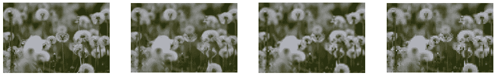

# 用 Tensorflow 实现 SRResnet/SRGAN 超分辨率

> 原文：<https://medium.com/analytics-vidhya/implementing-srresnet-srgan-super-resolution-with-tensorflow-89900d2ec9b2?source=collection_archive---------4----------------------->

原文：<https://arxiv.org/abs/1609.04802>

# **简介**

上面的论文提出了一种基于残差块的神经网络来超分辨率图像，一种 VGG 损失来改善 MSE 损失，该 MSE 损失经常不能实施精细的 SR 图像生成。来自该论文的 SRGAN 方法还涉及利用对抗损失以及上下文损失来训练模型，以进一步提高图像重建质量。

我们在之前的文章中总结了论文的概念和方法[2]。在这篇文章中，我们将实现本文提出的方法的网络架构、损耗和训练过程。本帖中使用的完整代码可以在这里查看[。](https://colab.research.google.com/drive/15MGvc5h_zkB9i97JJRoy_-qLtoPEU2sp?usp=sharing)

# **加载数据**

论文通过著名的 ImageNet 图像识别数据集的裁剪来训练他们的网络。虽然在大量数据中训练模型是有益的，但数据集太重了，我决定使用 [tf_flowers](https://www.tensorflow.org/datasets/catalog/tf_flowers) 数据集，它由 3670 张图像组成，看起来似乎太小，但对于一个玩具数据集来说，足以评估和比较论文中每种训练方法的性能。

```
data=tfds.load('tf_flowers')train_data=data['train'].skip(600)
test_data=data['train'].take(600)
```

我们使用“tensorflow_datasets”模块加载 tf_flowers 数据集，并将前 600 幅图像作为验证数据集。

```
@tf.function
def build_data(data):
  cropped=tf.dtypes.cast(tf.image.random_crop(data['image'] / 255,(128,128,3)),tf.float32)
  lr=tf.image.resize(cropped,(32,32))
  return (lr,cropped * 2 - 1)train_dataset_mapped = train_data.map(build_data,num_parallel_calls=tf.data.AUTOTUNE)
for x in train_dataset_mapped.take(1):
  plt.imshow(x[0].numpy())
 plt.show() plt.imshow(bicubic_interpolate(x[0].numpy(),(128,128)))
  plt.show() plt.imshow(x[1].numpy())
  plt.show()
```

然后，我们定义一个函数，将数据集中的每幅图像映射到(128，128)裁剪及其(32，32)低分辨率副本。我们可以通过`train_data.map(build_data, …)`将这个函数应用到我们的数据集。这将在每个训练时段之前执行。

# 模型定义


```
def residual_block_gen(ch=64,k_s=3,st=1):
  model=tf.keras.Sequential([
  tf.keras.layers.Conv2D(ch,k_s,strides=(st,st),padding='same'),
  tf.keras.layers.BatchNormalization(),
  tf.keras.layers.LeakyReLU(),
  tf.keras.layers.Conv2D(ch,k_s,strides=(st,st),padding='same'),
  tf.keras.layers.BatchNormalization(),
  tf.keras.layers.LeakyReLU(),
  ])
  return modeldef Upsample_block(x, ch=256, k_s=3, st=1):
  x = tf.keras.layers.Conv2D(ch,k_s, strides=(st,st),padding='same')(x)
  x = tf.nn.depth_to_space(x, 2) # Subpixel pixelshuffler
  x = tf.keras.layers.LeakyReLU()(x)
 return xinput_lr=tf.keras.layers.Input(shape=(None,None,3))
input_conv=tf.keras.layers.Conv2D(64,9,padding='same')(input_lr)
input_conv=tf.keras.layers.LeakyReLU()(input_conv)
SRRes=input_convfor x in range(5):
  res_output=residual_block_gen()(SRRes)
  SRRes=tf.keras.layers.Add()([SRRes,res_output])SRRes=tf.keras.layers.Conv2D(64,9,padding='same')(SRRes)
SRRes=tf.keras.layers.BatchNormalization()(SRRes)SRRes=tf.keras.layers.Add()([SRRes,input_conv])SRRes=Upsample_block(SRRes)
SRRes=Upsample_block(SRRes)
output_sr=tf.keras.layers.Conv2D(3,9,activation='tanh',padding='same')(SRRes)SRResnet=tf.keras.models.Model(input_lr,output_sr)
```

我们使用张量流定义剩余生成器架构。定义了构建整个残差块的函数，并且还实现了逐元素的 sum skip 连接。连接 5 个剩余块，并通过在`Upsample_block`函数中实现的像素混洗器方法对最终图像进行上采样。该模型被构建如下。因为这个网络是完全卷积组成的，我们不必定义输入形状，因此，该模型也可以处理任何大小的图像。


```
def residual_block_disc(ch=64,k_s=3,st=1):
  model=tf.keras.Sequential([
  tf.keras.layers.Conv2D(ch,k_s,strides=(st,st),padding='same'),
  tf.keras.layers.BatchNormalization(),
  tf.keras.layers.LeakyReLU(),
  ])
  return modelinput_lr=tf.keras.layers.Input(shape=(128,128,3))
input_conv=tf.keras.layers.Conv2D(64,3,padding='same')(input_lr)
input_conv=tf.keras.layers.LeakyReLU()(input_conv)channel_nums=[64,128,128,256,256,512,512]
stride_sizes=[2,1,2,1,2,1,2]disc=input_convfor x in range(7):
  disc=residual_block_disc(ch=channel_nums[x],st=stride_sizes[x])(disc)disc=tf.keras.layers.Flatten()(disc)
disc=tf.keras.layers.Dense(1024)(disc)
disc=tf.keras.layers.LeakyReLU()(disc)disc_output=tf.keras.layers.Dense(1,activation='sigmoid')(disc)discriminator=tf.keras.models.Model(input_lr,disc_output)
```

鉴别器架构也是基于论文的规范实现的。该网络是传统的 CNN，它输入图像并判断图像的真实性。

# 损失实现

```
def PSNR(y_true,y_pred):
  mse=tf.reduce_mean( (y_true - y_pred) ** 2 )
  return 20 * log10(1 / (mse ** 0.5))def log10(x):
  numerator = tf.math.log(x)
  denominator = tf.math.log(tf.constant(10, dtype=numerator.dtype))
  return numerator / denominatordef pixel_MSE(y_true,y_pred):
  return tf.reduce_mean( (y_true - y_pred) ** 2 )
```

我们定义了用于训练和评估的像素级 MSE 损失和 PSNR 度量。这些损失公式在关于本文概念的前一篇文章中有更多的解释。

```
VGG19=tf.keras.applications.VGG19(weights='imagenet',include_top=False,input_shape=(128,128,3)) VGG_i,VGG_j=2,2def VGG_loss(y_hr,y_sr,i_m=2,j_m=2):
  i,j=0,0
  accumulated_loss=0.0
  for l in VGG19.layers:\
    cl_name=l.__class__.__name__
    if cl_name=='Conv2D':
      j+=1
    if cl_name=='MaxPooling2D':
      i+=1
      j=0
    if i==i_m and j==j_m:
      break
    y_hr=l(y_hr)
    y_sr=l(y_sr)
    if cl_name=='Conv2D':
      accumulated_loss+=tf.reduce_mean((y_hr-y_sr)**2) * 0.006
  return accumulated_lossdef VGG_loss_old(y_true,y_pred):
  accumulated_loss=0.0
  for l in VGG19.layers:
    y_true=l(y_true)
    y_pred=l(y_pred)
    accumulated_loss+=tf.reduce_mean((y_true-y_pred)**2) * 0.006
  return accumulated_loss
```

论文中提出的 VGG 损失比较了预测图像时预训练的 VGG-19 网络的中间激活。我们通过 VGG 模型的每一层逐一向前传播，并比较每个中间输出。我们将直观的 VGG 损耗定义为`VGG_loss_old`，精确的损耗定义为`VGG_loss`。

```
cross_entropy = tf.keras.losses.BinaryCrossentropy()
def discriminator_loss(real_output, fake_output):
  real_loss = cross_entropy(tf.ones_like(real_output), real_output)
  fake_loss = cross_entropy(tf.zeros_like(fake_output), fake_output)
  total_loss = real_loss + fake_loss
  return total_loss
def generator_loss(fake_output):
  return cross_entropy(tf.ones_like(fake_output), fake_output)
```

对抗性损失的定义如上。与对抗训练程序相关的代码主要参考 Tensorflow DCGAN 教程[3]。

# 培养

```
generator_optimizer=tf.keras.optimizers.Adam(0.001)
discriminator_optimizer=tf.keras.optimizers.Adam(0.001)
adv_ratio=0.001
evaluate=['PSNR']# MSE
loss_func,adv_learning = pixel_MSE,False# VGG2.2
loss_func,adv_learning = lambda y_hr,h_sr:VGG_loss(y_hr,y_sr,i_m=2,j_m=2),False# VGG 5.4
loss_func,adv_learning = lambda y_hr,h_sr:VGG_loss(y_hr,y_sr,i_m=5,j_m=4),False# SRGAN-MSE
loss_func,adv_learning = pixel_MSE,True# SRGAN-VGG 2.2
loss_func,adv_learning = lambda y_hr,h_sr:VGG_loss(y_hr,y_sr,i_m=2,j_m=2),True# SRGAN-VGG 5.4
loss_func,adv_learning = lambda y_hr,h_sr:VGG_loss(y_hr,y_sr,i_m=5,j_m=4),Trueloss_func,adv_learning = lambda y_hr,h_sr:VGG_loss(y_hr,y_sr,i_m=5,j_m=4),True#Real loss
loss_func,adv_learning = pixel_MSE,False
```

我们首先为要优化的模型定义超参数和损失函数。摘录提供了论文中提出的损失的一些配置。

训练步骤基于 Tensorflow DCGAN 教程，训练循环可以概括所有可能的损失。对抗训练只有在`adv_learning=True`的情况下才会进行。我们使用生成器模型超解析图像，用给定的度量测量损失，并记录梯度。如果下面的代码看起来过于复杂，我强烈建议看一下 DCGAN 教程。

```
@tf.function()
def train_step(data,loss_func=pixel_MSE,adv_learning=True,evaluate=['PSNR'],adv_ratio=0.001):
  logs={}
  gen_loss,disc_loss=0,0
  low_resolution,high_resolution=data
  with tf.GradientTape() as gen_tape, tf.GradientTape() as disc_tape:
    super_resolution = SRResnet(low_resolution, training=True)
    gen_loss=loss_func(high_resolution,super_resolution)
    logs['reconstruction']=gen_loss
    if adv_learning:
      real_output = discriminator(high_resolution, training=True)
      fake_output = discriminator(super_resolution, training=True)

      adv_loss_g = generator_loss(fake_output) * adv_ratio
      gen_loss += adv_loss_g

      disc_loss = discriminator_loss(real_output, fake_output) logs['adv_g']=adv_loss_g
      logs['adv_d']=disc_loss gradients_of_generator = gen_tape.gradient(gen_loss, SRResnet.trainable_variables)
  generator_optimizer.apply_gradients(zip(gradients_of_generator, SRResnet.trainable_variables))

  if adv_learning:
    gradients_of_discriminator = disc_tape.gradient(disc_loss, discriminator.trainable_variables)
    discriminator_optimizer.apply_gradients(zip(gradients_of_discriminator, discriminator.trainable_variables))

  for x in evaluate:
    if x=='PSNR':
      logs[x]=PSNR(high_resolution,super_resolution)
  return logs
```

训练由以下代码执行，该代码循环数据集并为每批调用预定义的`train_step`函数。如上所述，图像在每个时期之前再次被裁剪。

```
for x in range(50):
  train_dataset_mapped = train_data.map(build_data,num_parallel_calls=tf.data.AUTOTUNE).batch(128)
  val_dataset_mapped = test_data.map(build_data,num_parallel_calls=tf.data.AUTOTUNE).batch(128)
  for image_batch in tqdm.tqdm(train_dataset_mapped, position=0, leave=True):
    logs=train_step(image_batch,loss_func,adv_learning,evaluate,adv_ratio)
  for k in logs.keys():
    print(k,':',logs[k],end='  ')
    print()
```

# 估价

我们通过训练的模型可视化一些超分辨率的示例图像。第一个图像是原始 HR 图像，第二个图像是 SR 图像，第三和第四个图像是低分辨率和双三次插值图像。虽然每个模型都没有训练足够长的时间，但我们可以比较每个模型的性能。用 VGG 和对抗性损失训练的模型生成的图像似乎具有更好的质量。仔细观察第一张图中重建的木材纹理。

我没有测试出所有建议的损失。如果你能在训练更多方法后分享结果，并用我的 [COLAB 链接](https://colab.research.google.com/drive/15MGvc5h_zkB9i97JJRoy_-qLtoPEU2sp?authuser=3#scrollTo=jBD0Rsn9FmHf)中提供的代码评估性能，并尝试在更大的数据集(如 ImageNet 数据集)上训练模型，那就太好了。此外，我确信随着训练次数的增加，这个模型会表现得更好。在训练的当前阶段，由于不成熟的 ESPCN 重建层，我们可以在重建图像中看到人工滤波器。这可以通过更多的训练迭代来解决，尽管该模型在感知上仍然优于基于 MSE 的模型。


*   SRResNet + MSE


*   SRResNet + VGG 2.2


*   SRResNet + VGG 5.4
*   SRGAN 0.001 + MSE



*   斯尔甘 0.001 + VGG 2.2
*   斯尔甘 0.001 + VGG 5.4


# 参考

我的 COLAB 实现 SRResnet/SRGAN:[https://COLAB . research . Google . com/drive/15 mgvc 5h _ zkb 9i 97 jjroy _-qltopeu2 sp？usp =共享](https://colab.research.google.com/drive/15MGvc5h_zkB9i97JJRoy_-qLtoPEU2sp?usp=sharing)

[1] Ledig，Christian 等，“使用生成式对抗网络的照片级单幅图像超分辨率”*IEEE 计算机视觉和模式识别会议论文集*。2017.

[2]采用 SRResnet、SRGAN 的超分辨率。[https://medium . com/analytics-vid hya/super-resolution-with-srresnet-srgan-2859 b 87 c 9 c 7 f](/analytics-vidhya/super-resolution-with-srresnet-srgan-2859b87c9c7f)

[3] Tensorflow DCGAN 教程:[https://www.tensorflow.org/tutorials/generative/dcgan](https://www.tensorflow.org/tutorials/generative/dcgan)