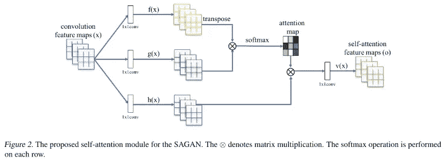
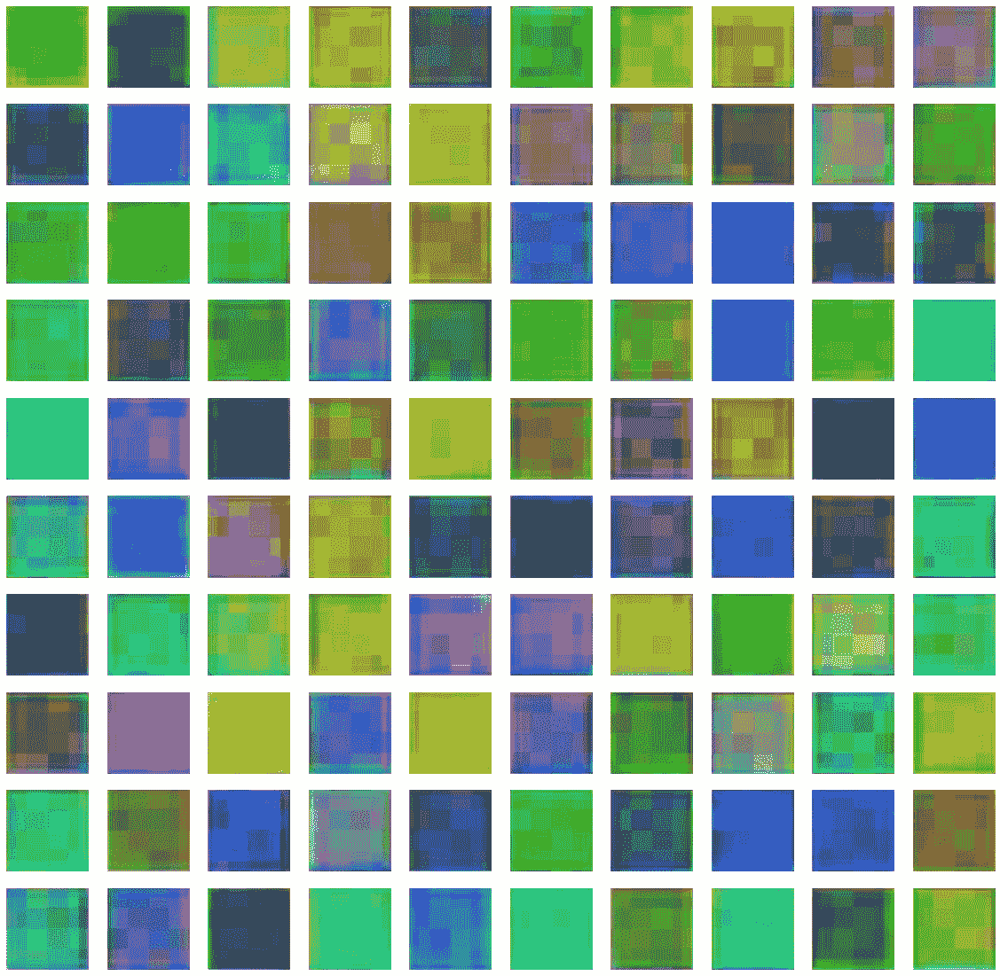

# 用 Tensorflow 实现 BigGAN 模型架构

> 原文：<https://medium.com/analytics-vidhya/implementing-the-biggan-model-architecture-with-tensorflow-8360ff094357?source=collection_archive---------7----------------------->

论文[“高保真自然图像合成的大规模 GAN 训练”提出的概念和方法参见](https://arxiv.org/abs/1809.11096)[本帖](/analytics-vidhya/key-concepts-of-biggan-training-and-assessing-large-scale-image-generation-4c8303dcf73f)。

# 机器规格的限制

显然，最初的 BigGAN 模型是在具有巨大计算能力和内存的环境中训练出来的。在 Colab 中执行 256x256 biggan 无论如何都会崩溃，至少批处理大小大于 4。尽管在我们的本地环境中它不太可能是可训练的，但是我们将回顾如何实现本文中提出的技术和模型架构。

摘自 [Reddit](https://www.reddit.com/r/MachineLearning/comments/b461zt/p_want_to_train_your_own_biggan_on_just_48_gpus/)

# 履行

这篇文章的完整代码可在[这里](https://colab.research.google.com/drive/1WGG8d22KoxXWBThYOeFDcHvt_z9EirHV)获得，尽管在执行时会产生 OOM(内存不足)或 ResourceExhaustedError。

我们首先实现本文中使用的自定义层。有条件的批量标准化意味着批量标准化的先前均值和方差集参数被设置为神经网络的输出。在这种情况下，它是基于潜在切片 z 的级联向量和类嵌入来调节的。该层学习线性映射以输出具有尺寸通道号的两个向量，每个向量替换原始批量归一化的均值和方差。

然后，我们实现非线性模块或自我关注模块。该块生成两个映射:f、g，并将 softmax 激活应用于 f*g 以生成注意力映射，并将该映射应用于图像 h 的另一个映射。最后，随后应用一个卷积层 o 并生成最终输出。自我注意中的 s 张量消耗了非常大的内存，因为分配给 s 的矩阵是(bs，h*w，h*w ),因此是 ResourceExhaustedError 的核心原因。

然后，我们基于上述预定义的层来定义残差块。两个剩余块都实现了跳过连接，并且由两个卷积组成。先前定义的 ConditionalBatchNormalization 在生成器中用于应用类和噪声信息。

同样，基于定义的剩余块和自定义层，我们定义了一个 128x128 的 BigGAN 生成器模型。我们连接 5 个剩余块，并馈送共享类嵌入的级联向量和噪声潜在向量的切片。非线性块以 64×64 的分辨率放置。Colab 实现中也实现了 256x256 模型(只需要稍微调整一下超参数)。由于多重噪声投射，发电机架构的结果图是混乱的。

最后，我们定义了 128x128 BigGAN 鉴别器模型。

我们还实现了铰链损耗的训练。

我们绘制了一些比根的示例图像。

我们根据[这个](https://keras.io/examples/generative/dcgan_overriding_train_step/) Keras 教程来定义训练循环。我们重写了 tf.Keras.Model 的 compile 和 train_step 函数，我强烈推荐去看看。

我们尝试训练模型，尽管由于 ResourceExhaustedError 或内核崩溃而失败。

结果-->

————————
resource exhaust error trace back(最近一次调用 last)
<<模块>()
9)
10
—>11 gan . fit(train _ dataset . batch(128)，epochs=epochs

在这篇文章中，我们回顾了

*   如何在 Tensorflow 中实现生成网络的条件批量规范化和自关注？
*   如何在 Tensorflow 中实现 BigGAN 模型架构？

BigGAN-deep 架构也可以通过对该代码的剩余块进行少量修改来轻松实现。当我获得 8 个 GPU 的配额权限并分享结果时，我会尝试在谷歌云平台中训练这些代码。