# 在 R 中实现 Cox 模型

> 原文：<https://medium.com/analytics-vidhya/implementing-the-cox-model-in-r-b1292d6ab6d2?source=collection_archive---------7----------------------->

## 弥合数学和代码之间的鸿沟


弗洛里安·奥利佛在 Unsplash[上的照片](https://unsplash.com?utm_source=medium&utm_medium=referral)

# 动机

有许多教学资源解释了考克斯模型背后的理论。也有许多资源提供了使用现有统计软件包进行生存分析的 Cox 模型应用指南。然而，很少有资料来源通过解释 Cox 模型的程序化实现来弥合理论和实践之间的差距。在本文中，我 1)解释实现 Cox 模型所必需的关键数学结果，2)举例说明可用于实现 Cox 模型的样本代码，以及 3)比较手动实现的函数与`survival::coxph()`的输出。

# 介绍

估计几乎任何(半)参数回归模型都遵循类似的过程:

1.  用我们想要估计的参数 *β* 指定一个模型
2.  确定 a)最小化的损失函数，或 b)最大化的可能性
3.  通过对感兴趣的参数求导并将其设置为零(使用微积分),找到上述表达式的最大值(对于可能性)或最小值(对于损失函数)
4.  找出产生零导数的感兴趣参数值( *β̂* )(使用代数或数值优化)

每个回归模型都有自己的怪癖，可能会使其中任何一个步骤变得或多或少的困难。例如，线性回归的损失函数(平方误差)具有“干净的”导数，这意味着步骤(4)只是通过代数求解最佳参数值的问题。另一方面，逻辑回归的损失函数具有“混乱的”导数，这意味着步骤(4)需要使用数值优化算法，而不是简单的代数。

下面是上述五个步骤的概要，具体到 Cox 比例风险模型。

1.  我们的模型是:λ(*t*|*x*)= λ₀(*t*e*ˣᵝ*
2.  我们将最大化可能性(而不是最小化损失函数)。考克斯模型的一个怪癖是它的估计使用了所谓的“部分似然”而不是完全似然。
3.  我们将通过设置导数为零来最大化部分可能性。
4.  导数是“混乱的”，所以我们将使用牛顿-拉夫森算法来计算得出参数估计，从而产生零导数(而不是用代数方法求解)。

# 1.模型设定

Cox 模型是λ(*t*|*x*)= λ₀(*t*)*eˣᵝ*，其中 x 是协变量矩阵， *β* 是我们要估计的系数的向量，λ₀是所谓的基线风险函数。危险函数可以解释为患者在时间 *t* 的失败“风险”。数学上，它定义如下:

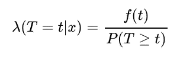

其中 *f* ( *t* )是 *T* 的 PDF，即所有患者的生存时间。

当 Cox 模型中的协变量为零时，患者的风险函数λ( *t* | *X* )等于基线风险函数λ₀( *t* )。非零协变量通过将基线风险乘以 *eˣᵝ* 项来影响患者的风险。

对我们来说，这个解释就足够了。许多其他来源已经彻底地解释了 Cox 模型规范的更多细节(例如，参见 Therneau 和 Grambsch 2000)。

# 2.指定可能性

Cox 模型的一个关键特征是它可以表达如下:

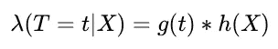

其中 *g* 是基线风险函数，而 *h* 是协变量和β的指数。重要的是， *g* 不依赖于 *X* 和 *h* 不依赖于 *t* 。这允许我们比较两个不同患者的风险函数，而不必估计 *g* ( *t* ):

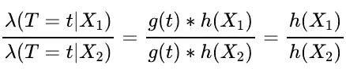

这允许所谓的半参数推断，其中我们将 *h* ( *X* )参数化，但是允许 *g* ( *t* )更加自由。

当我们指定可能性 *L* (λ₀， *β* )时，我们看到了这个想法。考克斯证明: *L* (λ₀， *β* )可以表示为 *L* ₁(λ₀，*β*)**l*₂(*β*，其中 *L* ₂'s 最大值 *β̂* 是 *β* 的渐近正态无偏估计量，而考克斯实际上建议忽略₁，把所有的推论建立在最大化₂.的基础上因此， *L* ₂可以称为偏似然。参见[这里的](https://web.stanford.edu/~lutian/coursepdf/unitcox1.pdf)可以很好地了解这一点。

为了简单起见，我们将把 *L* ₂简称为 *L* ，但是要理解的是 *L* 代表部分可能性。Cox 将患者 *j* 对部分可能性的贡献指定如下:

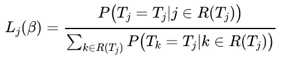

分子是病人 *j* 在时间 *Tⱼ* 失败的概率(病人 *j* 的失败时间)，假定病人 *j* 在时间 *Tⱼ* 有死亡风险。处于风险集 *R* ( *Tⱼ* )本质上意味着患者还没有失败，或者他们的审查日期还没有过去。分母是患者 *k* 在 *Tⱼ* 失败的概率，假设他们在 *R* ( *Tⱼ* 中所有患者 *k* 的风险集合 *R* ( *Tⱼ* )中。

在数学上，这可以表示如下:

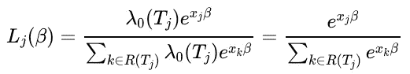

整个部分可能性可以写成:

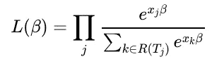

如果数据集有删截，似然表达式可以修改:

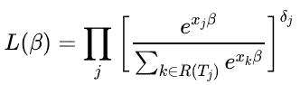

其中 *δⱼ* 在患者被审查时为 0，否则为 1。为简单起见，我们不考虑对其余的数学结果或代码进行审查。

# 3.最大化可能性

**在继续之前，关于符号的一个注意事项:**
因为我们最终将在代码中实现下面的数学，所以清楚符号是很重要的，特别是矩阵/向量代数:

1. *X* 是一个 *n* × *p* 矩阵，代表 *p* 对于 *n* 患者
2 的协变量。 *xⱼ* 是一个 1 × *p* 向量，代表患者*j*t52】3 的 *p* 协变量。 *β* 是一个 *p* × 1 向量，代表 *p* 协变量
4 的系数。基于上面的符号， *Xβ* 产生一个 *n* × 1 的向量，而 *xⱼβ* 产生一个长度为 1 的向量。

正如在许多 MLE 的情况下，最大化对数似然更容易，并且等价于最大化似然，因为*f*(*x*)=*log*(*x*)是单调递增的。Cox 模型的部分对数似然性为:

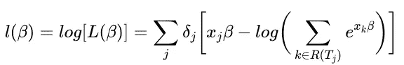

对 *β* 求导:

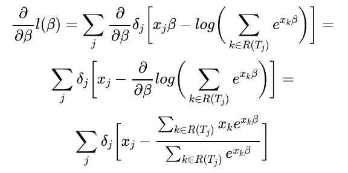

注意，由于我们对 *β* 求导，这是一个 *p* × 1 的向量，我们期望得到一个 *p* × 1 的维导数，或梯度。由于 *xⱼ* 的尺寸为 *p* × 1，x_ke^{x_k\beta}$的尺寸为 *p* × 1，而$e^{x_k\beta}$的尺寸为 1 × 1，因此整体渐变的尺寸为 *p* × 1。

此时，我们已经从技术上完成了实现 Cox 模型所需的所有数学计算。然而，上面的梯度公式只允许我们估计 *β̂* ，而不是它的方差。为了估计 *β̂* 的方差，我们可以使用似然二阶导数的负逆。这涉及到商法则(和一些链式法则):

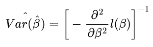

可能性相对于 *β* 的二阶导数为:

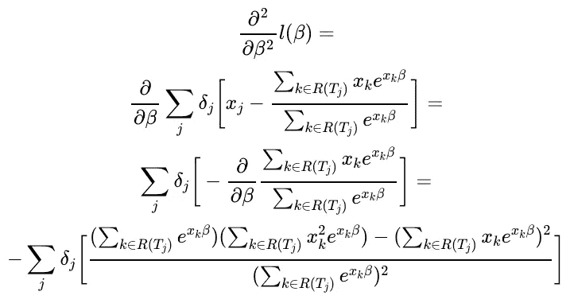

对 *β* 求导需要注意矩阵维数。计算部分\beta}x_ke^{x_k\beta}$需要将$x_ke^{x_k\beta}$乘以 x_k 美元。因为二阶导数必须有维度 *p* × 1，所以 R(T_j)}x_ke^{x_k\beta}$中的$ \ frac { \ partial } { \ partial \ beta } \ sum _ { k \也必须有维度 *p* × 1。记住这一点，我们可以看到＄\ frac { \ partial } \beta}x_ke^{x_k\beta}$必须是＄x _ k e^{x_k\beta}$，其中＄x _ k＄不是$x_k^Tx_k$或$x_kx_k^T$，而是＄x _ k＄的元素方。这是我们保持理想尺寸的唯一方法。

我们可以把这个二阶导数代入方差公式来估计方差。现在我们有了实现我们的模型所需的所有数学结果！

# 4.找到最小化梯度(和最大化可能性)的参数值

我们关于部分可能性的零导数的等式是

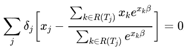

解析求解 *β* 是不可能的，因此我们将采用牛顿-拉夫森算法来寻找 *β* 的最优值。

牛顿-拉夫森算法是标准梯度下降程序的变体:

1.先说一些初步的猜测*β̂₀*2
。计算 *β* = *β̂₀*
3 处的似然梯度。更新你最初的猜测*β̂₁*=*β̂₀*+*θ***u*(*β̂₀*)其中 *U* 是梯度 *θ* 是学习率
4。重复步骤 2-3，直到 *U* ( *β̂n* )收敛(希望为零！)

梯度下降背后的直觉如下:我们可以将似然函数想象成具有某个最大值的曲线。你最初的猜测 *β̂₀* 会把你放在曲线上的某个地方，但你可能不会在最大值(除非你最初的猜测非常幸运)。为了弄清楚你是在曲线向上倾斜的部分还是向下倾斜的部分，求梯度。如果它是正的，你在向上倾斜的部分，你应该继续向正的方向移动以达到最大值。如果它是负的，你在向下倾斜的部分，你应该向负方向移动以达到最大值。步骤 3 通过将缩放的梯度添加到初始猜测来更新初始猜测。比例参数$\theta$是学习率，通常是 0 到 1 之间的一个小数字。

牛顿-拉夫逊的唯一区别是 *θ* = Vâr( *β̂n* ₋₁).这在计算上更昂贵，因为你必须在每一步计算方差，但导致更快的收敛。

# 履行

## 设置参数

```
library(survival)
library(ggplot2)
library(dplyr)
```

牛顿-拉夫森收敛很快，所以我们可以把迭代次数设为 10。瑟瑙和格兰伯奇建议将 *β̂₀* = **设为 0。**

```
ITERS <- 10
INITIAL_BETA <- 0
```

## 助手功能

我们可以为以下项目编写助手函数:

1.  给定时间 *t* 寻找风险集 *R* ( *t*

```
GetRiskSet <- function(time_of_interest,
                       entry_vector,
                       time_vector,
                       event_vector) {
  return(which((time_of_interest >= entry_vector) & ((time_vector == time_of_interest & event_vector == 1) | (time_vector > time_of_interest))))
}
```

2.计算可能性的梯度

```
CoxGradient <- function(beta,
                        Xs,
                        entry,
                        Ts,
                        event) {
  p <- ncol(Xs)

  gradient <- apply(cbind(Ts, Xs), 1, 
                    function(df){

                      df <- matrix(df, nrow = 1)
                      ts <- df[, 1]
                      xs <- df[, 2:ncol(df)]
                      X_risk_set <- Xs[GetRiskSet(ts, entry, Ts, event),] %>% 
                        matrix(ncol = ncol(Xs))

                      t1 <- t(X_risk_set) %*% exp(X_risk_set %*% beta)
                      t2 <- sum(exp(X_risk_set %*% beta))

                      return(xs - t1 / t2)

                    }) %>% 
    matrix(nrow = p) %>%
    rowSums()

  return(gradient)

}
```

3.计算可能性的方差

```
CoxVariance <- function(beta,
                        Xs,
                        entry,
                        Ts,
                        event) {

  p <- ncol(Xs)

  variance <- apply(cbind(Ts, Xs), 1, 
                    function(df){

                      df <- matrix(df, nrow = 1)
                      ts <- df[, 1]
                      xs <- df[, 2:ncol(df)]
                      X_risk_set <- Xs[GetRiskSet(ts, entry, Ts, event),] %>% 
                        matrix(ncol = ncol(Xs))

                      sum1 <- sum(exp(X_risk_set %*% beta))
                      sum2 <- rowSums(t(X_risk_set^2) %*% exp(X_risk_set %*% beta))
                      sum3 <- rowSums(t(X_risk_set) %*% exp(X_risk_set %*% beta))^2

                      return(- (sum1 * sum2 - sum3) / sum1^2)

                    }) %>%
    matrix(nrow = p) %>%
    rowSums()

  return(-1 / variance)

}
```

4.绘制我们的梯度随时间的变化来观察收敛

```
GradientPlot <- function(gradients){

  gradient_track <- reshape2::melt(gradients) %>%
    `names<-`(c("iteration", "beta", "gradient"))

  p <- ggplot(gradient_track, aes(y = gradient, x = iteration)) +
    geom_line() +
    facet_wrap(~factor(beta))

  return(p)

}
```

5.绘制我们估计的 *β̂* 与来自`survival::coxph()`函数的那些比较

```
BetaPlot <- function(store_betas, store_variance, coxph_output){

  variance_track <- reshape2::melt(store_variance) %>%
    `names<-`(c("iteration", "variable", "coxph_AS_variance"))

  plot_df <- reshape2::melt(store_betas) %>%
    `names<-`(c("iteration", "variable", "coxph_AS_beta")) %>%
    left_join(coxph_output, by = "variable") %>%
    left_join(variance_track, by = c("variable", "iteration")) %>%
    mutate(coxph_AS_lci = coxph_AS_beta - 1.96 * sqrt(coxph_AS_variance),
           coxph_AS_uci = coxph_AS_beta + 1.96 * sqrt(coxph_AS_variance))

  ggplot(plot_df) +
    geom_line(aes(y = coxph_AS_beta, x = iteration), size = .8) + 
    geom_line(aes(y = coxph_AS_lci, x = iteration), linetype = "dashed", size = .8) +
    geom_line(aes(y = coxph_AS_uci, x = iteration), linetype = "dashed", size = .8) +
    geom_line(aes(y = coxph_beta, x = iteration, color = "red")) +
    geom_line(aes(y = coxph_lci, x = iteration), linetype = "dashed", color = "red") +
    geom_line(aes(y = coxph_uci, x = iteration), linetype = "dashed", color = "red") +
    facet_wrap(~factor(variable_name)) +
    ylab("beta estimate") +
    theme(legend.position = "none")

}
```

6.一个包装器函数把它们放在一起

```
coxph_AS <- function(formula, data){

  # Fit using coxph()
  model <- coxph(formula, data)
  cox_beta <- data.frame(variable = 1:length(coef(model)), 
                         coxph_beta = coef(model))
  cox_ci <- cbind(1:length(coef(model)), confint(model)) %>% 
    `colnames<-`(c("variable", "coxph_lci", "coxph_uci")) %>%
    data.frame()
  coxph_output <- left_join(cox_beta, cox_ci, by = "variable") %>%
    mutate(variable_name = names(coef(model)))

  # Load data
  x <- data %>% select(all.vars(formula[-1])) %>% as.matrix
  lhs <- setdiff(all.vars(formula), all.vars(formula[-1]))

  if (length(lhs) == 1) { # no censoring
    times <- data %>% select(all.vars(formula)[1]) %>% as.matrix
    event <- rep(1, dim(times)[1]) %>% as.matrix
    entry <- rep(0, dim(times)[1]) %>% as.matrix
  } else if (length(lhs) == 2) { # censoring but no entry time specified
    times <- data %>% select(all.vars(formula)[1]) %>% as.matrix
    event <- data %>% select(all.vars(formula)[2]) %>% as.matrix
    entry <- rep(0, dim(times)[1]) %>% as.matrix
  } else if (length(lhs) == 3) { # censoring but no entry time specified
    times <- data %>% select(all.vars(formula)[2]) %>% as.matrix
    event <- data %>% select(all.vars(formula)[3]) %>% as.matrix
    entry <- data %>% select(all.vars(formula)[1]) %>% as.matrix
  }# Initialize matrices
  store_gradient <- matrix(NA, nrow = ITERS, ncol = ncol(x))
  store_betas <- matrix(NA, nrow = ITERS, ncol = ncol(x))
  store_variance <- matrix(NA, nrow = ITERS, ncol = ncol(x))
  beta <- matrix(rep(INITIAL_BETA, ncol(x)), nrow = ncol(x))

  # Newton-Raphson iterations
  for(i in 1:ITERS){
    store_gradient[i,] <- CoxGradient(beta, x, entry, times, event)
    store_variance[i,] <- CoxVariance(beta, x, entry, times, event)
    store_betas[i,] <- beta <- beta + store_gradient[i,] * store_variance[i,]
  } 

  # Plot
  beta_plot <- BetaPlot(store_betas, store_variance, coxph_output)
  gradient_plot <- GradientPlot(store_gradient)

  # Final output data.frame
  coxph_output$coxph_AS_beta <- store_betas[i,]
  coxph_output$coxph_AS_lci <- store_betas[i,] - 1.96 * sqrt(store_variance[i,])
  coxph_output$coxph_AS_uci <- store_betas[i,] + 1.96 * sqrt(store_variance[i,])

  coxph_output <- coxph_output %>%
    transmute(variable = variable_name,
              beta = coxph_beta,
              beta_AS = coxph_AS_beta,
              LCI = coxph_lci,
              LCI_AS = coxph_AS_lci,
              UCI = coxph_uci,
              UCI_AS = coxph_AS_uci)

  return(list(beta_plot = beta_plot,
              gradient_plot = gradient_plot,
              model_output = coxph_output))
}
```

# 测试它

```
data(veteran)
set.seed(12345)
sim <- coxph_AS(Surv(time) ~ trt + karno + age, data = veteran)
```

比较两个模型的数字输出表明，我们的估计值(带有后缀“_AS”)与`survival::coxph()`非常接近。

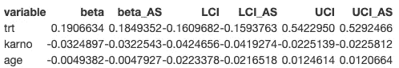

我们还可以看到我们的 *β̂* 估计值和相应的置信区间与`survival::coxph()`(红色)相比如何。

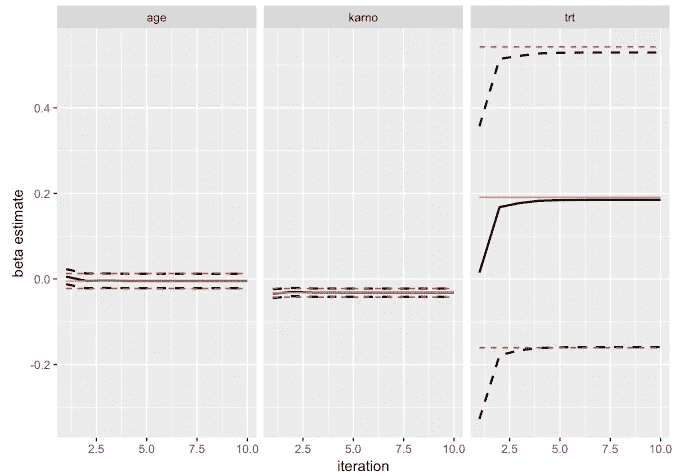

最后，我们可以看到如何(迅速！)我们的梯度收敛到零。

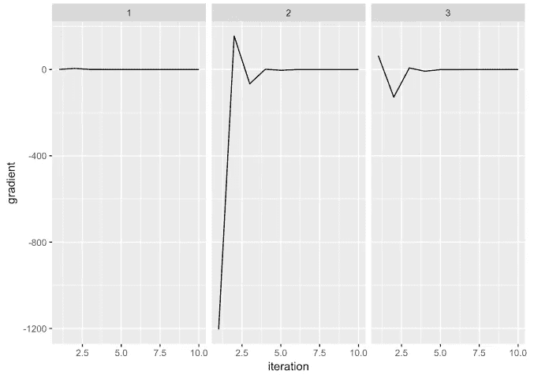

# 参考

*   [https://www4.stat.ncsu.edu/~dzhang2/st745/chap6.pdf](https://www4.stat.ncsu.edu/~dzhang2/st745/chap6.pdf)
*   [http://www.math.ucsd.edu/~rxu/math284/slect5.pdf](http://www.math.ucsd.edu/~rxu/math284/slect5.pdf)
*   [https://web.stanford.edu/~lutian/coursepdf/unitcox1.pdf](https://web.stanford.edu/~lutian/coursepdf/unitcox1.pdf)
*   Therneau 和 Grambsch 2000,《生存数据建模》, Springer