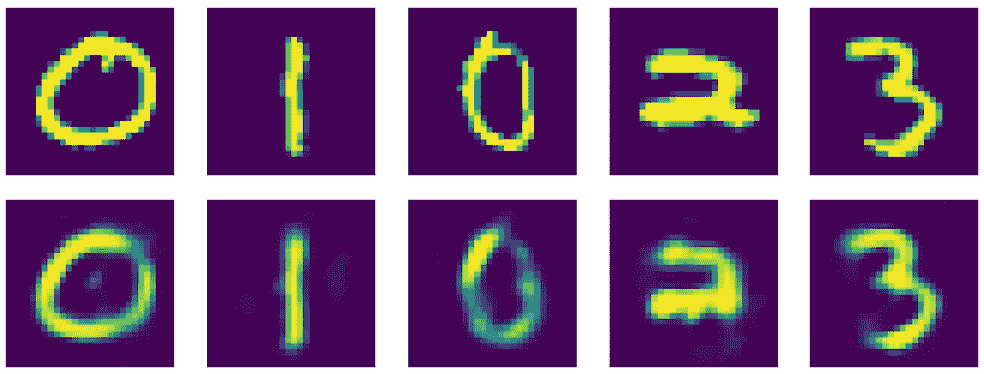
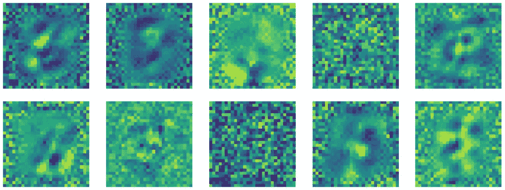
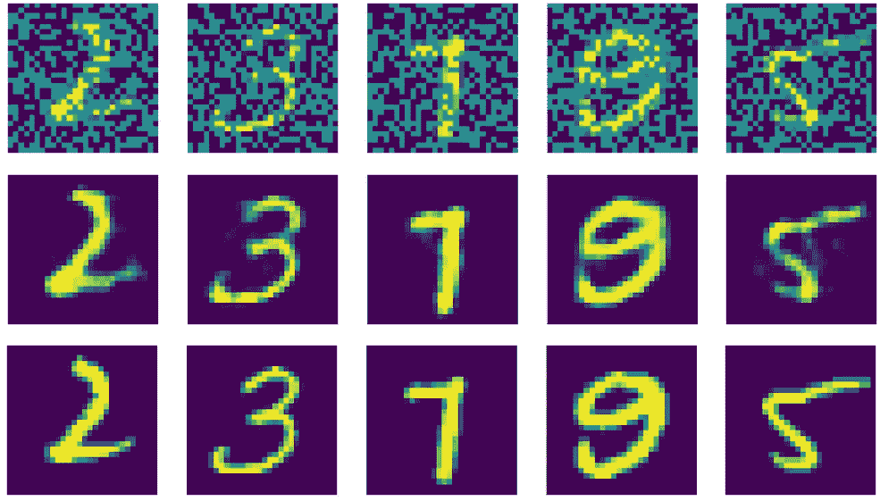
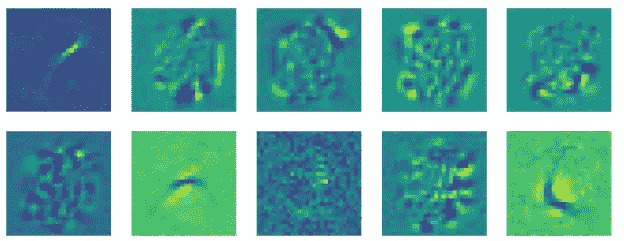
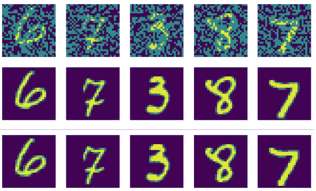

# 使用 PyTorch 实现欠/过自动编码器

> 原文：<https://medium.com/analytics-vidhya/implementing-under-over-autoencoders-using-pytorch-4ddaf458947e?source=collection_archive---------2----------------------->


照片由[克里斯托弗·罗宾·艾宾浩斯](https://unsplash.com/@cebbbinghaus?utm_source=medium&utm_medium=referral)在 [Unsplash](https://unsplash.com?utm_source=medium&utm_medium=referral) 上拍摄

# 介绍

Autoencoder 是一种神经网络，它使用编码器将数据转换为潜在空间中更有效的表示，然后尝试使用解码器从潜在空间中导出原始数据。应用于信息流的瓶颈或约束避免了编码器和解码器之间的数据的直接复制，因此网络学习保持数据的最通用和最有效的表示，同时忽略噪声或临时模式。

可以使用 numpy 在 python 中从头开始实现自动编码器，这需要手动实现渐变框架。然而，[可区分编程](https://en.wikipedia.org/wiki/Differentiable_programming)在 python 中是可用的，通过高效的框架，如 [PyTorch](https://en.wikipedia.org/wiki/PyTorch) ，它们将用于本文。

# 短暂参观建筑

正如我在[文章](/@jha-vikas/under-and-over-autoencoders-3d695f428c1a)中所描述的，查看自动编码器的许多方法之一是基于隐藏/中间层或潜在空间维度来表征它们。如果通过限制隐藏/中间层的维度来应用 autoencoder 中的信息流瓶颈，那么它是欠 autoencoder，否则它是过 autoencoder。在后一种情况下，通过在输入数据中引入噪声，或者修改损失函数，减少潜在空间表示可以存在的有效空间，来应用信息瓶颈。

# 数据

【torch 的 DataLoader 用于为多个批处理创建数据集上的可迭代/映射样式。torchvision 包含包含转换方法的*转换*模块。可以将它们链接在一起，一次性对图像应用所有变换。MNIST 数据集中的像素值的范围是-1 到+1，从 0 到 1。

PyTorch 期望数据是形式的(批量大小、通道、高度、宽度)。如果数据是某种其他形式的，应该执行适当的转换，使其成为所需的形式。

还要注意，torch.nn.Functional(通常作为 F 导入)包含一些有用的函数，如可以使用的激活函数和卷积运算。然而，这些是**而不是**全层。所以，要指定一个层，应该使用 torch.nn.module。

# 全连接和卷积自动编码器

自动编码器将以两种方式实现，全连接网络和循环网络。前者权重更大，可以在大多数类型的数据中实现。CNN 适用于以多维数组形式出现的信号/输入，并具有三个主要属性:局部性(值之间存在强局部相关性)、平稳性(信号的属性会自我重复，因此可以使用共享权重)和合成性(特征以分层方式合成图像，证明使用多层来识别不同的细节层次是合理的)。

## 模型架构:全连接自动编码器

我们定义从父类`nn.Module`继承的 Autoencoder 类。输入是大小为`28x28`的张量(因为 MNIST 图像的大小为`28x28`)。编码器和解码器层在 Autoencoder 类中指定。正向传递定义为数据先通过编码器，然后通过解码器。向前传递后的输出与输入进行比较，给出损耗。由于像素强度是连续的，所以这里将均方误差作为损失函数。对于分类数据，像交叉熵这样的损失函数会更合适。

完全连接的自动编码器。根据隐藏层的大小，它可以低于或高于自动编码器

## 模型架构:通用自动编码器

convulational autoencoder 的架构与此类似，不同之处在于，它不是提供一个具有指定通道和批次大小的长单个向量(因此是一个三维向量)，而是提供一个具有批次大小、通道、高度和宽度的四维向量。

## 训练循环

这是用于训练任何神经网络的典型训练循环:

*   图像被移动到设备(CPU 或 GPU)。计算输出。
*   基于输出，计算损耗。
*   梯度被归零。
*   实现反向传播和累加。
*   Optimizer.step()在学习率的指导下，将权重移动到梯度方向的相反方向。

自动编码器的训练循环

# 结果

## 欠自动编码器

对于与`28x28=784`的输入维度相比，隐藏层/潜在空间维度为 30 的欠自动编码器，在 20 个时期之后，我们得到 MSE 的以下减少:

```
epoch [1/20], loss:0.1892
epoch [2/20], loss:0.1600
epoch [3/20], loss:0.1274
epoch [4/20], loss:0.1137
…..
epoch [18/20], loss:0.0520
epoch [19/20], loss:0.0558
epoch [20/20], loss:0.0574
```



来自欠自动编码器的图像

顶行显示实际的图像，底行显示相应的重新创建的图像。正如我们所看到的，在第三列和第四列的情况下，娱乐不是很清楚。



欠自动编码器的编码器线性层中的权重

查看编码的线性层的一些权重，很明显存在看起来只是随机噪声的权重(第一行的第四列和第二行的第三列)，在激活中没有模式。其他权重似乎在捕捉一些模式。

让我们将它们与 over-autoencoder 的输出进行比较。

## 过度自动编码器

考虑隐藏层/潜在空间维度为 500 的过度自动编码器。但是，由于我们知道输入数据的维数是`28x28=784`，这怎么能称为 over-autoencoder 呢？答案在于输入的有效维度。超过 80%的输入图像像素对图像的数值没有贡献。因此，输入层的有效尺寸仅为 150 左右，这是图像中有效像素的平均数量。周围区域大部分是黑暗的。



来自自动编码器的图像

有三行来自自动编码器的图像。顶行是被破坏的输入，即被馈送到自动编码器的图像(在添加噪声之后)。第二行显示重建的图像，第三行显示损坏前的实际输入图像。

即使通过目视检查，很明显过自动编码器比欠自动编码器执行得更好。如果看一下损失值，这一论断会变得更加清晰:

```
epoch [1/20], loss:0.0702
epoch [2/20], loss:0.0594
epoch [3/20], loss:0.0551
epoch [4/20], loss:0.0519
epoch [5/20], loss:0.0534
epoch [6/20], loss:0.0463
....
epoch [16/20], loss:0.0415
epoch [17/20], loss:0.0416
epoch [18/20], loss:0.0423
epoch [19/20], loss:0.0400
epoch [20/20], loss:0.0407
```

过度自动编码器比不足自动编码器收敛得更快。甚至最终的损失值也低于欠自动编码器。这是因为输入被扩展到更高维度的空间，在那里它可以以多得多的方式移动，以使模型适合实际的流形，即使在数据流方面存在约束时也是如此。对于欠自动编码器，我们从一个更高维的超空间移动到一个更低维的空间，在那里的移动受到更多的限制。



用于过自动编码器的编码器的线性层中的权重

重量似乎也学会了更好的表达方式，几乎没有重量缺少任何模式。

## 卷积自动编码器

这里介绍的卷积自动编码器也是一种过度自动编码器，因为 1 通道数据被移动到 16 通道。此外，由于 CNN 层专门用于图像类型数据，因此与上述自动编码器相比，它们更适合。考虑各时期的损失值:

```
epoch [1/20], loss: 0.0497
epoch [2/20], loss: 0.0227
epoch [3/20], loss: 0.0172
epoch [4/20], loss: 0.0143
epoch [5/20], loss: 0.0124
epoch [6/20], loss: 0.0114
epoch [7/20], loss: 0.0105
epoch [8/20], loss: 0.0088
...
epoch [16/20], loss: 0.0050
epoch [17/20], loss: 0.0045
epoch [18/20], loss: 0.0043
epoch [19/20], loss: 0.0040
epoch [20/20], loss: 0.0038
```

正如所预期的，与基于传统全连接层的欠编码器和过编码器相比，损耗迅速降低并达到低得多的值。



来自 convulation-auto encoder 的图像

对生成图像的视觉检查证实了我们的假设。这三行分别代表作为输入发送到编码器的噪声数据、生成的干净输出和实际的干净输入。

# 结论

基于 MNIST 数据集上的实现和结果，很明显，过自动编码器优于欠自动编码器，因为它有更大的潜在空间，可以更准确地对流形建模。然而，它也更容易过度拟合。

另一方面，卷积自动编码器(也是过度自动编码器)优于基于全连接层的自动编码器，因为它们考虑了图像的属性，以提取手头数据的更好表示。

在上面提到的所有自动编码器中，有一个缺陷是它们将输入多维空间中的一个点映射到流形上的一个点。然而，通过将点映射到流形中的向量场而不是离散点来进行概括会更好，这将给出更平滑的流形映射。变分自动编码器(VAE)通过引入条件分布来实现，该条件分布具有作为潜在表示的点值的平均值和一些方差。我们将在后续文章中研究 VAEs。

完整剧本:[https://github.com/jha-vikas/pyTorch-implementations](https://github.com/jha-vikas/pyTorch-implementations)