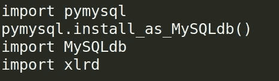
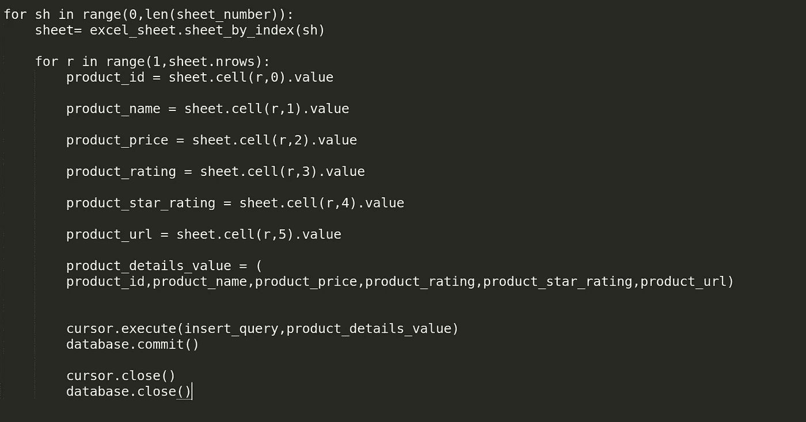
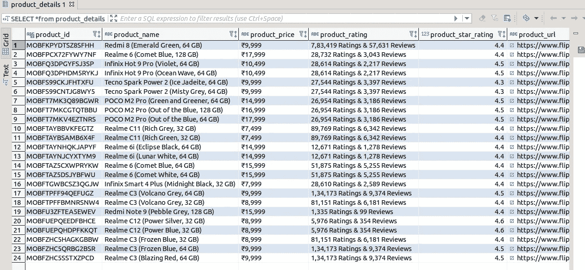

# 使用 Python 将数据从 Excel 导入 MySQL

> 原文：<https://medium.com/analytics-vidhya/import-data-from-excel-into-mysql-using-python-c80c2bd8676a?source=collection_archive---------0----------------------->


阿米特的博客

你好世界！

在这篇博客中，我将解释如何将 Excel 文件中的数据导入 MySQL。让我们看看 Python 中的实现。

## **使用的 Python 模块:**

*   **pymysql** : pymysql 是一个 python 库，用于从 Python 连接到 MySQL 数据库服务器。这个模块有很多特点，如它疯狂 CRUD 操作简单。

要使用此库，您需要安装。对于安装，请使用以下命令

```
pip install PyMySQL
```

如果你想了解更多的 pymysql，那么使用下面的链接参考 pyMySQL 文档

[](https://pypi.org/project/PyMySQL/) [## PyMySQL

### 这个包包含一个纯 Python 的 MySQL 客户端库，基于 PEP 249。大多数公共 API 都兼容…

pypi.org](https://pypi.org/project/PyMySQL/) 

*   **xlrd :** xlrd 是一个 python 库，用于从 Excel 文件中读取数据和格式化信息。

要安装此库，请使用以下命令:

```
pip install xlrd
```

欲了解更多 xlrd 文档。

[](https://pypi.org/project/xlrd/) [## xlrd

### xlrd 是一个从 Excel 文件中读取数据和格式化信息的库。xls 格式。警告…

pypi.org](https://pypi.org/project/xlrd/) 

## 让我们编码:

*   为了使用这些库，我们需要先导入，所以让我们先导入。



*   与您的数据库连接


*   连接到数据库后，我们需要创建表格


*   执行创建表查询


*   阅读 Excel 表格


*   我们还可以打印纸张名称和纸张编号


*   现在编写插入查询


插入查询

*   现在最后一步是从 excel 表中读取每一个值，并执行插入查询。



**这里是我们数据库中的数据:**



数据库中的数据

**你可以在我的** [GitHub 库](https://github.com/commityourdream/Import-Data-from-Excel-into-MySQL)查看这段代码

**感谢您的阅读。请分享您的宝贵建议，感谢您的真诚反馈！**