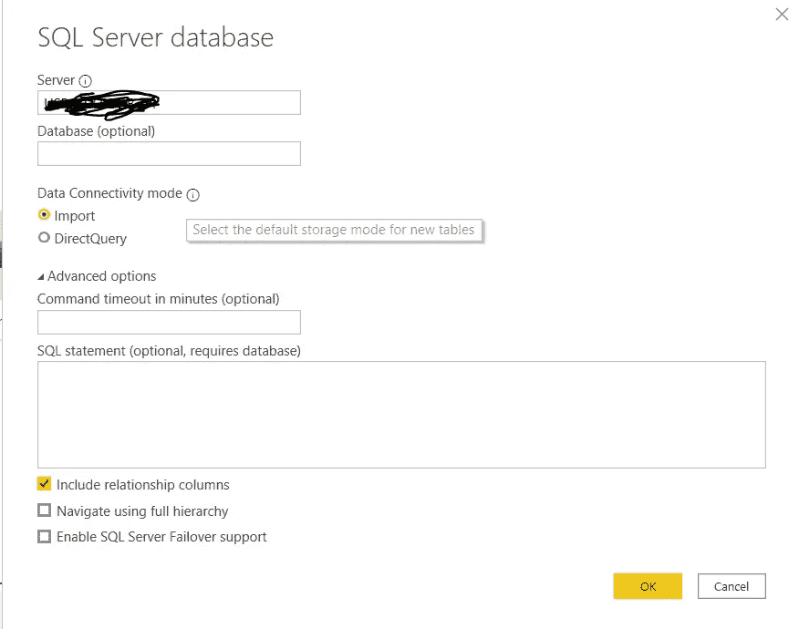

# 导入还是直接查询？

> 原文：<https://medium.com/analytics-vidhya/import-or-direct-query-which-way-is-better-for-you-to-load-data-from-db-to-power-bi-6731c4ea63ac?source=collection_archive---------33----------------------->

## 哪种方式更适合将数据从 DB 加载到 Power BI

当我们在 Power BI 桌面上创建仪表板时，大多数时候我们连接到数据库来提取数据。在 Power BI 中，有两种方法可以用来从 DB 加载数据，即导入或直接查询。我会解释每种方式的区别和优势，让你明白哪种方式适合你。

数据库连接的数据导入选项

# **差异**

**进口**

使用导入功能，您可以从 DB 加载数据，如果您计划发布到 BI 服务，桌面有 1 GB 的限制。根据您的设置，刷新频率每天最多 8 次。

import-method 的最大优点是**你可以通过 DAX** 创建你自己的列，以增加你计算的灵活性和定制仪表板上的指数。但是如果你的源包含 4 个以上的表，并且需要通过键相互关联，你需要考虑**数据量限制**和你维护导入数据的复杂性。您需要考虑的另一件事是，由于您设置的更新计划，**数据并不是那么“即时”**。

**直接查询**

这种方法使您能够在调用仪表板时通过查询数据库获得实时数据显示。它向利益相关者提供“实时”数据。

这种方法的优点是让**实时更新**到每个利益相关方，避免两者之间的识别差距，特别适合字体方即时控制局面。然而，它**限制了你操作数据的能力**，你不能用这种输入方式进行你自己的 DAX 计算。支持这种查询方式对数据库服务来说也是一个挑战。

最佳实践并不适用于每种业务情况，您需要考虑您的业务类型、仪表板的用途、您的数据库功能、利益相关方的需求，以及您将如何维护结构。希望本文有所帮助，敬请关注。