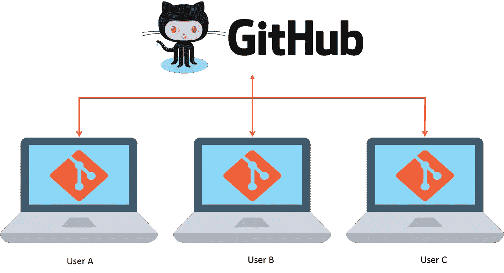

# 开源的重要性:GitHub 如何帮助你做出更多贡献？

> 原文：<https://medium.com/analytics-vidhya/importance-of-open-source-how-github-helps-you-in-contributing-more-c7687715be3a?source=collection_archive---------13----------------------->

来源:Iris 网络系统

开源实际上是一个热门话题，你没有理由不知道它。开源软件是那些公开提供给公众使用和修改的软件。一些最受欢迎的开源软件是 Linux 操作系统、Android、Mozilla Firefox 和 WordPress。我们所有人都遇到过这些，并且在生活中的某个时候至少使用过其中的一种。为他们的成长和提高做出贡献不仅能给我们带来自我满足感，还能带来许多其他的好处。

# 为什么开源如此重要？

1.开源无处不在。如果你认为你没有使用过开源，那你就错了。你使用的浏览器(Chrome / Mozilla)本身就是开源软件。这意味着他们的代码可供用户自由修改，供自己使用，并与他人共享。

2.它是免费的，但又如此强大。开源推动创新和创造性解决问题。合作努力是开源的支柱。有问题吗？开源贡献者在这里帮你解决。

3.开源贡献者，无论是初学者还是专家都有机会学习和提升技能。甚至雇主和招聘人员都认为这是他们简历上的加分项。

4.你是否认为你使用的软件过于一般化，有不必要的功能？您是否希望添加额外的功能来满足贵公司的需求？开源代码免费提供给公众修改。继续并应用你想要的改变。

5.非开发者不必担心对开源软件的需求。即使有一个神话说你需要知道编码来为开源做贡献，我们也支持你。任何技能——写作、设计、除错、测试、反馈、指导、社区建设——都受到开源软件的欢迎。

6.机会向所有人开放。你不需要一个学位，或者一个证书，或者一个 4 GPA 来为开源做贡献。你所需要的只是改变他人生活的技能和愿望。

# 你将如何为开源做出贡献？

来源:连线

1)创建自己的开源项目。

2)为现有的开源项目做贡献。(初学者首选)

3)参与教育人们和建立开源意识团体。

# 开源的先决条件

1.  了解简单的版本控制工具，如 Git 和 Github
2.  对编程语言的了解|有助于开源的技能

# 什么是 Git 和 Github？

资料来源:DZone

Git 是最常用的版本控制工具，在过去几年中加速了开源软件的贡献。但是什么是版本控制，什么是 Git？想象一下，和一个由不同技能的人组成的团队一起远程工作。通过一个一个上传到云端来共享代码意味着浪费空间和时间。即使忽略了这一点，你也不能忽视这样一个事实，即大量的源代码版本丢失了，而这些版本在以后的阶段可能会派上用场。Git 和 GitHub 在这种情况下伸出了援手。他们不仅跟踪代码中的修改，而且帮助开发人员以更有效的方式远程工作。GitHub 是一个用于版本控制和协作的代码托管平台。它让你和其他人在任何地方一起工作。

# GitHub 对开源有什么贡献？

连续统

1.  使项目对其他开发人员可见，他们可以帮助您工作和升级项目。使得为开源项目做贡献变得容易。你只需要知道使用 Github。
2.  GitHub 简化了协作，而且你总是有代码的备份。
3.  GitHub 有简单的文档，这使得它更容易使用。
4.  GitHub 作为展示你作品的平台。它提高了在招聘人员中的知名度，也是对其他开发人员的一种宣传。
5.  当涉及到大量贡献持续发生的开源项目时，跟踪代码的变化就变得很有必要。GitHub 以最有效的方式解决了这个问题。
6.  GitHub 可以与众多平台和服务集成。

GitHub 是最近一段时间开发者最大的福音。由于其简单的文档，对开源软件的贡献变得比以往容易得多。开始探索 GitHub 的特性，你会在开源之旅中学到更多。