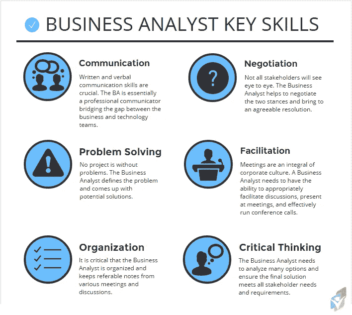

# 每个业务分析师都需要的重要软技能。

> 原文：<https://medium.com/analytics-vidhya/important-soft-skills-every-business-analyst-needs-9ae62d7e7338?source=collection_archive---------3----------------------->

你是否正在探索一个业务分析师的角色，并且想知道你是否具备所需的业务分析技能和经验？

作为一名业务分析师，你需要广泛的基本技能，从沟通技能到技术技能，我在这里向你展示每个业务分析师需要的核心技能。

# 沟通

业务分析师花费大量的时间与客户、用户、管理层和开发人员互动。因此，成为一个有效的沟通者是关键。你需要主持工作会议，提出正确的问题，积极倾听同事的意见，以获取新信息并建立关系。一个项目的成功可能围绕着你交流项目需求、变更和测试结果的能力。

请记住，在当今世界，交流并不总是面对面进行的。在虚拟环境中成为强有力的沟通者(通过电话会议或网络会议)的能力同样重要。

# 问题解决

你从事的每一个项目，本质上都是在开发一个问题的解决方案。业务分析师致力于建立对问题的共同理解，概述项目的参数，并确定潜在的解决方案。

# 组织

业务分析师还需要具备很强的组织能力、多任务处理能力，以及根据多种因素对任务进行优先排序的能力。

规划项目范围、指导员工、处理变更请求、预测预算以及让每个人都按时参与项目只是业务分析师应该具备的一些管理技能。监督各种规模的项目，从开始到实施——通常同时进行——需要高度的组织。

# 谈判

业务分析师是各种不同性格的人之间的中间人:客户、开发人员、用户、管理人员和数据专业人员。你必须能够为你的公司实现盈利，同时为客户找到让他们满意的解决方案。这种平衡行为要求有能力协商出一个双方都满意的解决方案。

# 批判性思维

业务分析师负责在带领团队确定解决方案之前评估多个选项。在发现要解决的问题时，业务分析师必须倾听涉众的意见，但也要批判性地考虑他们的需求，并提出探索性的问题，直到理解了全部需求。有效地做到这一点需要对数据、文档、用户输入文档和需求进行严格的审查。

# 引出

启发意味着能够“提取”,而 BAs 应该能够从他/她的利益相关者那里提炼、收集或提取信息和需求。这些要求是任何项目的基础，BA 必须精通如何促进讨论，使用不同的技术，如头脑风暴、采访、观察和研讨会，以引出功能性、技术性和非功能性要求，同时提出“正确的问题”以确保信息是相关的。

# 协力

另一个受欢迎的个人属性包括在快节奏的环境中与跨职能团队合作的能力。工作场所不断与多个部门合作，将大型数据集转化为洞察力和战略机遇。

业务分析师会问一些试探性的问题，直到对每个问题进行全面评估，以确定最佳的冲突解决方案。希望从事商业分析师职业的专业人士应该能够适应多种性格和工作风格。

# 适应性

与大多数 IT 角色一样，业务分析师的职业生涯可能会花费在处理频繁和随机的变化上。当这些专业人员致力于开发定制的业务解决方案时，没有什么是 100%可预测的——因此，找到快速解决问题并成功完成项目的方法对于业务分析师的角色来说非常重要。

作为管理层的顾问和开发人员的顾问，业务分析师需要在各种各样的业务问题上做出正确的判断，其中任何一个问题都可能决定业务的生存能力。

# 建立关系的技巧

你需要很强的人际关系和利益相关者关系技巧来帮助你的团队一起工作并提供良好的服务。这些技能包括主持会议、发表演讲、解决冲突，以及谈判和影响他人的能力。这种技能包括建立信任，并且通常意味着在项目团队中扮演领导角色以弥合差距。

# 额外收获:两项最重要的技能

# 计算机技能

为了确定业务解决方案，业务分析师应该知道正在使用什么信息技术应用程序，通过当前平台可以实现什么新的可能结果，以及最新技术提供了什么。

BA 将需要能够使用多种类型的软件，从流行的 Microsoft Office 套件到不太常见的软件包，如 SharePoint、Visio 和数据可视化软件。您经常使用的一些程序是:

*   Microsoft Office 程序(Access、Excel、Project、PowerPoint 等。)
*   SharePoint
*   SQL 查询
*   矢量图绘制软件
*   电源 BI 或 Tableau

# 分析技能

业务分析师的技能集应该包括出色的分析技能，以便正确地解释客户的业务需求，并将其转化为应用程序和操作需求。工作的一个方面是分析数据、文档、用户输入调查和工作流，以确定哪种行动将纠正业务问题。

你还需要发展你的模特技能。业务分析师需要有建模方面的专业知识和支持工具，使他们的团队能够传递大量信息。可视化模型将使分析师和他们的利益相关者能够以一种每个人都能理解的清晰格式来解释研究结果。

在我们上面讨论的技能中，我们只关注那些真正与塑造业务分析师职业相关的技能。由于商业分析领域是发展最快的领域之一，商业分析师必须努力跟上软件和分析技术的最新发展。