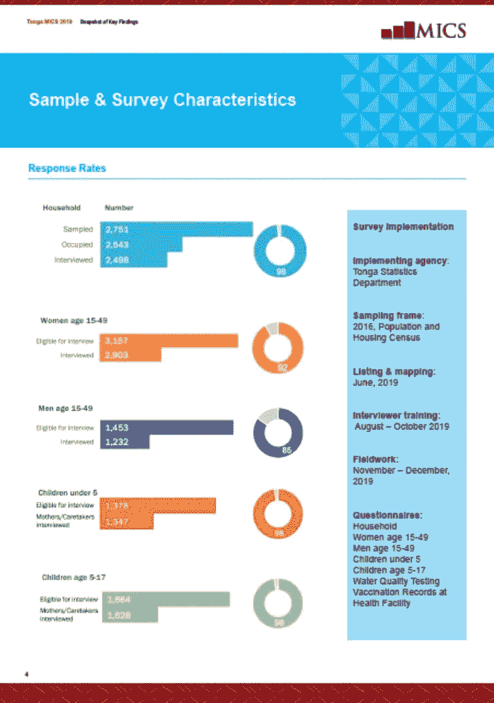

# 从 SPSS 调查数据导入和清理到 Power BI(使用 R 脚本或 SPSS 语法)

> 原文：<https://medium.com/analytics-vidhya/importing-and-cleaning-up-from-spss-survey-data-to-power-bi-with-r-script-or-spss-syntax-8abd1c223d64?source=collection_archive---------7----------------------->

来自家庭调查的数据通常以一张又一张有用信息表的形式呈现，这些有用信息具有重要的独特背景特征，如受访者的财富，无论他们是生活在城市还是农村地区。他们居住的地区、年龄、性别或种族。

问题是大多数用户发现表格不如数据可视化时友好和容易浏览。包括多指标类集调查在内的大多数调查已经开始制作主要调查结果报告的附件，以各种可视化的表格形式发布。对于多指标类集调查，这些将是[快照](https://youtu.be/mQ0ZArXlbiQ)，一个传单或小册子的形式，以图表形式呈现数据，按主题分组，添加关键信息，为数据提供一些背景信息。



这些都是好的方向，但是数据也可以很容易地以动态方式呈现，使用一些可用的数据可视化工具，如 Tableau 或 Power BI。他们可以使用交互式仪表盘自由探索数据，而不是向用户显示固定的图表。

和其他情况一样，每个调查项目都有一个使用特定统计分析包的标准。[多指标类集调查](https://mics.unicef.org/)调查通常会从每次调查中创建多达七个数据集，并在 SPSS *中生成数据集。sav '格式。SPSS 不是开源的，各种许可证可能会变得很贵。

Tableau 可以自动读取 SPSS 文件，将它们导入到平台没有问题。另一方面，BI 不能。这真的是一个遗憾，因为以交互方式表示复杂的家庭调查数据应该是这样一个平台的优先事项，但是对于 SPSS 和 Power BI 之间目前的不兼容，当然还有许多工作要做。


要在 Power BI 中导入数据，如果用户拥有 SPSS 软件许可证，他们只需运行一个语法来转换*。将文件保存为兼容的格式，清理数据(删除仪表板中不会使用的变量或计算不在原始数据集中的额外变量)。这篇文章描述的另一种方法是在 Power BI 中运行 R 脚本，并使用 R 代码将 SPSS 调查数据导入 Power BI 平台，这是一个非常酷的选择。

根据我的经验，Power BI 和 Tableau 都非常适合可视化数据。这两个包都有自己的语言(分别是 DAX 和 VizQL ),可以用来对导入的数据进行额外的操作和分析。然而，这种分析有点笨拙，像 SPSS 或 R 这样的平台是进行任何分析的更好的方式。例如，在 DAX 中进行计算，尤其是在大型数据集上，会导致仪表板加载速度变慢，在某种程度上，Tableau 中也会发生这种情况。根据我的经验，最好是在数据分析包中尽可能多地准备所需的数据集，并只上传数据集中实际用于数据可视化平台的变量，而不是将整个文件放在那里，或者创建额外的计算变量，特别是如果有很多变量的话。

在本练习中，使用多指标类集调查快照模板为[汤加多指标类集调查 2019](https://mics-surveys-prod.s3.amazonaws.com/MICS6/East%20Asia%20and%20the%20Pacific/Tonga/2019/Snapshots/Tonga%20MICS%202019%20Snapshot_English.pdf) 调查制作的快照被复制，重点是显示调查和样本特征信息系列中的第一个快照。如前所述，只有在 Power BI 或 Tableau 中将此快照重新创建为交互式仪表板所需的变量才会被导入，其他变量(如不同调查问卷的完成率)将在导入前进行计算。请注意，多指标类集调查中的数据集仅显示问卷中的值，在大多数情况下没有任何额外的计算。在这篇文章中，我们将只关注数据清理，在接下来的文章中，我们将展示如何在 Power BI 和 Tableau 中创建这些仪表盘。

**使用 SPSS 导入**


这种方法要求用户安装 SPSS。正如建议的那样，用户将削减文件并计算 SPSS 中原始数据集中没有的所有附加变量，然后才进行导入。语法然后创建一个 excel 文件(这可能是一些其他类型的数据格式，如' *。csv '文件),可以很容易地导入到 Power BI 平台中。语法和一些附加注释如下:

```
cd 'C:\path\file'.* Call include file for the working directory and the survey name. * Open the household data file.
get file = 'hh.sav'.* Give value 1 to each HH to calculate total number of hhs sampled.
compute sampled = 1.* Give value 1 to each HH occupied to calculate total number of hhs occupied.
recode HH46 (1,2,4,7 = 1) (else = 0) into occupied.* Give value 1 to each hh interviewed to calculate total no of interviewed HHs.
recode HH46 (1 = 1) (else = 0) into complete.recode HH52 (1 thru hi = 1)(else = 0) into HH52A.* Give value 1 to each hh selected for water quality test.
recode HH9 (1 = 1) (else = 0) into wqSelect.
* exclude cases with incomplete household interview.
if HH46 <> 1 wqSelect = 0.* Give value 1 to each water quality test completed at household.
recode WQ11 (1 = 1) (else = 0) into wqhhcomplete.* Give value 1 to each water quality test completed at source.
recode WQ19 (1 = 1) (else = 0) into wqsocomplete.* Give value 1 to highest each wm questionnaire eligible.
recode HH49 (sysmis = 0) (else = copy) into wmTot.* Give value 1 to each wm questionnaire completed.
recode HH53 (sysmis = 0) (else = copy) into wmComp.* Give value 1 to highest each mn questionnaire eligible.
recode HH50A (sysmis = 0) (else = copy) into mnTot.* Give value 1 to each mn questionnaire completed.
recode HH53 (sysmis = 0) (else = copy) into mnComp.* Give value 1 to highest each ch questionnaire eligible.
recode HH51 (sysmis = 0) (else = copy) into ch05Tot.* Give value 1 to each mn questionnaire completed.
recode HH55 (sysmis = 0) (else = copy) into ch05Comp.* Give value 1 to highest each ch questionnaire eligible.
recode HH52A (sysmis =0) (else = copy) into ch517Tot.* Give value 1 to each mn questionnaire completed.
recode HH55 (sysmis =0) (else = copy) into ch517Comp.compute total = 1.
variable labels total "".
value labels total 1 "Total".save outfile = dataPowerBI2.sav 
  /keep 
HH1
HH2
occupied
complete
HH52A
wqSelect
wqhhcomplete
wqsocomplete
HH49
HH53
HH50A
HH50
HH54
HH51
HH55
HH52
HH56
total
HH6 HH7 religion windex5 HHSEX.SAVE TRANSLATE OUTFILE = 'C:\Users\Power BI SPSS\dataPowerBI22.xls'
 /TYPE=XLS
  /keep 
HH1
HH2
occupied
complete
HH52A
wqSelect
wqhhcomplete
wqsocomplete
HH49
HH53
HH50A
HH50
HH54
HH51
HH55
HH52
HH56
total
HH6 HH7 religion windex5 HHSEX
  /MISSING=IGNORE
```

**使用 R 输入**


Power BI 是一个强大的工具，集成在 MS Office 环境中。我最喜欢的特性之一是它与 R 和 Phyton 脚本的集成。当然，使用 R，您可以从 SPSS 文件中创建一个 Power BI 可读格式的文件，然后将其导入到程序中。但是，您也可以打开 Power BI，在那里粘贴或编写您的 R 脚本，并在那里创建所需的数据集版本。

在这个例子中，我保留并计算了与使用 SPSS 语法创建的 excel 文件中导入的变量相同的变量。然而，不是创建要导入的文件，而是编写脚本，以便它基于 Power BI 中的 ran 脚本生成数据集。因为我将制作切片器(Power BI 的另一个伟大特性),我还将一些变量从数字响应类别重新编码为文本类别，使用户更容易浏览。

```
library(foreign)path = 'C:/Users/R SPSS'
setwd(path)# Tonga Data
data = read.spss('C:/Users/SPSS/hh.sav', to.data.frame = T, use.value.labels = FALSE)# Give value 1 to each HH to calculate total number of hhs sampled.
data$sampled<-1data$total<-1# Give value 1 to each HH occupied to calculate total number of hhs occupied.
data$occupied<-ifelse(data$HH46 %in% c(1,2,4,7),1,0)# Give value 1 to each hh interviewed to calculate total no of interviewed HHs.
data$complete <-ifelse(data$HH46==1,1,0)
data$HH52<-as.numeric(data$HH52)
data$HH52A <-ifelse(data$HH52<0,1,0)# * Give value 1 to each water quality test completed at household.
data$wqhhcomplete <-ifelse(data$WQ11==1,1,0)# Give value 1 to each water quality test completed at source.
data$wqsocomplete <-ifelse(data$WQ19==1,1,0)#Give value 1 to highest each wm questionnaire eligible.
data$wmTot <-ifelse(is.na(data$HH49),0,data$HH49)
data$wmComp <-ifelse(is.na(data$HH53),0,data$HH53)
#Give value 1 to highest each mn questionnaire eligible.
data$mnTot <-ifelse(is.na(data$HH50A),0,data$HH50A)
data$mnComp <-ifelse(is.na(data$HH54),0,data$HH54)
# Give value 1 to highest each ch questionnaire eligible.
data$ch05Tot <-ifelse(is.na(data$HH51),0,data$HH51)
data$ch05Comp <-ifelse(is.na(data$HH55),0,data$HH55)data$ch518Tot <-ifelse(is.na(data$HH52),0,data$HH52)
data$ch517Comp <-ifelse(is.na(data$HH56),0,data$HH56)data <- subset(data, select = c("HH1",
                                "HH2",
                                "occupied",
                                "complete",
                                "HH52A",
                                "wqhhcomplete",
                                "wqsocomplete",
                                "HH49",
                                "HH53",
                                "HH50A",
                                "HH50",
                                "HH54",
                                "HH51",
                                "HH55",
                                "HH52",
                                "HH56",
                                "total",
                                "HH6", "HH7", "religion", "windex5", "HHSEX", "ethnicity"))#adding Text Labels to Slicers
#Wealth indexdata$wealth[data$windex5 == 1] <- "Poorest"
data$wealth[data$windex5 == 2] <- "Second"
data$wealth[data$windex5 == 3] <- "Middle"
data$wealth[data$windex5 == 4] <- "Fourth"
data$wealth[data$windex5 == 5] <- "Richest"
#Area
data$area[data$HH6 == 1] <- "Urban"
data$area[data$HH6 == 2] <- "Rural"
#Island Divisiondata$region[data$HH7 == 1] <- "TONGATAPU"
data$region[data$HH7 == 2] <- "VAVA'U"
data$region[data$HH7 == 3] <- "HA'APAI"
data$region[data$HH7 == 4] <- "'EUA"
data$region[data$HH7 == 5] <- "ONGO NIUA"#religiondata$religion[data$religion == 1] <- "Free Wesleyan Church"
data$religion[data$religion == 2] <- "Latter Day Saints"
data$religion[data$religion == 3] <- "Roman Catholic"
data$religion[data$religion == 4] <- "Free Church of Tonga"
data$religion[data$religion == 5] <- "Other religion"data
```

此处提供了将详细讨论的 Power BI 仪表盘:

 [## 电源 BI 报告

### 由 Power BI 支持的报告

www.powerbi.com](https://www.powerbi.com/view?r=eyJrIjoiZjNhMTIwMDAtNWNhNC00N2RkLWI5ZTQtZTc2MWQyYmMyZjQzIiwidCI6IjdlYTk4ZmYzLWRmY2EtNDgwNi1iYjU3LWMxNmY2ZWY0N2Q0NyIsImMiOjl9&embedImagePlaceholder=true&pageName=ReportSection)