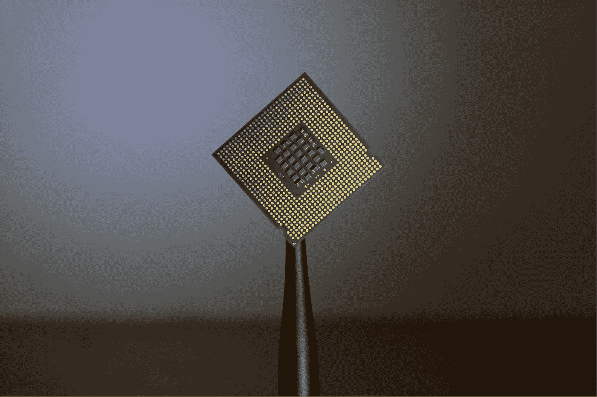
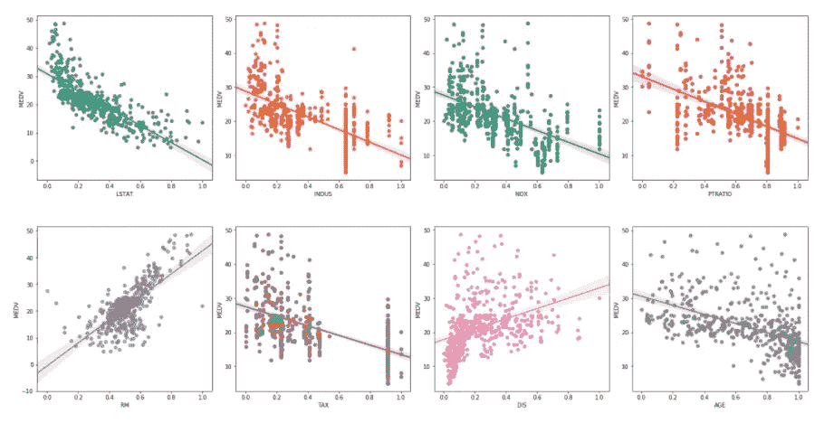
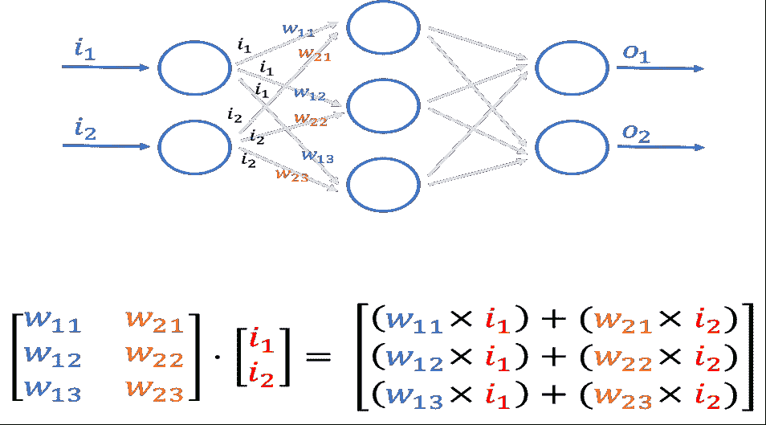

# 通过矢量化在 Python 中使用 numpy 数组时提高数据处理速度

> 原文：<https://medium.com/analytics-vidhya/improve-data-processing-speeds-while-using-numpy-arrays-in-python-through-vectorization-49ea6cc9004e?source=collection_archive---------5----------------------->


[去飞溅](https://medium.com/u/2053395ac335?source=post_page-----49ea6cc9004e--------------------------------)

现在许多互联网公司在他们的后端服务器应用程序中使用 python。当处理大量数据时，例如，一个为用户给定的大型数据集创建仪表板的应用程序，需要注意的是，数据处理是为用户提供快速响应的瓶颈。此外，在数据科学应用程序中，预处理数据和运行特征生成功能或清理数据集记录的操作对于大量记录来说可能非常耗时。从字面上看，矢量化是 python 性能提高的原因，因为 numpy 的矢量化函数使用了优化的预编译 C 代码。

# 什么是矢量化？

Python 是一种动态类型的编程语言，这意味着数据的类型检查发生在运行时。c 是一种静态类型的编程语言，所以类型检查发生在编译时。执行过程中的类型检查是一个耗时的过程，这也是 python 与 C 相比性能较低的原因，尤其是在 for 循环中。Numpy 的矢量化函数不会为每次迭代执行显式类型检查，从而节省了宝贵的 CPU 和 GPU 资源时间。与传统的 for 循环不同，矢量化意味着函数现在可以并行应用于 iterable 的许多值。CPU 使用 SIMD(单指令多数据)来实现更快的速度，从而充分利用更多的内核和并行性。



[Unsplash](https://medium.com/u/2053395ac335?source=post_page-----49ea6cc9004e--------------------------------)

在本文中，我将讨论 numpy 库中最流行的矢量化函数，比较我的本地计算机与传统 for 循环相比的速度，以及我们如何对自定义函数进行矢量化

# 转换操作的矢量化

转换数据是数据预处理的重要部分。例如，对于神经网络，在 0 和 1 之间缩放图像像素值，在应用回归模型之前对数据集的某些特征进行对数变换，对数据集的特征进行归一化，等等。

让我们使用 sklearn 库中的 MNIST 数据集来比较传统 for 循环和矢量化的速度。sklearn 中的 MNIST 数据的形状为 1797x64。每个图像存储在长度为 64 的一维 numpy 数组中

```
Scaling images between 0 and 1 for deep learning applications########################################################Using traditional for-loops
s = mnist.shape
tic = time.time()
for i in range(s[0]):
    for j in range(s[1]):
        mnist[i][j] = mnist[i][j]/255
toc = time.time()
print("Time taking with training loop is : {0}ms".format((toc-tic)*1000))Output - Time taking with training loop is : 96.99487686157227ms#Using vectorization
tic = time.time()
mnist = mnist/255
toc = time.time()
print("Time taking with Vectorization is : {0}ms".format((toc-tic)*1000))Output - Time taking with Vectorization is : 6.717443466186523ms
```

我们可以清楚地看到，扩展所需的时间提高了 10 倍。改进的速度取决于您的本地计算机，但是您肯定会看到执行时间的显著改进

+、-、*、/操作矢量化版本可以通过直接在 numpy 数组上执行操作来执行

```
print(arr * 3) #Multiply array by a number
print((arr/4+100)*3) #Divide each element by 4, then +100 and /3
#Performing vectorized operations on 2 arrays
print(arr1 + arr2) # Element wise addition
print(arr1 * arr2) # Element wise multiplication
print((arr1-arr2)**2) # Eucledian distance
#Ensure the 2 arrays have the same shape
```

通过在数组和标量(int，float 对象)之间直接应用基本操作，我们可以节省代码行和执行时间。

现在让我们看看日志转换。在执行回归时，尤其是在数据有偏差的情况下，日志转换是必不可少的



波士顿住房数据特征成对绘图

让我们应用波士顿住房数据的对数转换(可以在 Kaggle 中找到)。对数转换实质上意味着将对数应用于数据集中的每一项

```
#Using traditional for-loop
s = data.shape
tic = time.time()
for i in range(s[0]):
    for j in range(s[1]):
        data[i][j] = math.log(data[i][j])
toc = time.time()
print("Time taken with For-loop: {0}ms".format((toc-tic)*1000))
Output - Time taken with For-loop : 2.0296573638916016ms
#Using vectorized numpy function
tic = time.time()
data = np.log(data)
toc = time.time()
print("Time taken with vectorization: {0}ms".format((toc-tic)*1000))
Output - Time taken with Vectorization : 0.0ms
```

对数的矢量化版本几乎不需要任何时间，它是最小的时间单位。time()无法测量差异。在你自己的电脑上尝试一下，看看有什么不同

Numpy 提供了一系列矢量化的变换函数。所有这些都可以在[https://numpy.org/doc/stable/reference/routines.math.html](https://numpy.org/doc/stable/reference/routines.math.html)的链接中找到

# 线性代数运算的向量化

像矩阵乘法这样的线性代数运算被用于像神经网络这样的各种应用中。



通过一层神经网络的输入只不过是矩阵乘法

在神经网络应用中，使用向量化函数将显著减少生产中的训练时间和执行时间。

```
A = np.random.randn(10000).reshape((100, 100))
B = np.random.randn(10000).reshape((100, 100))
C = np.zeros((100, 100))
tic = time.time()
#Using traditional For-Loops
for i in range(100):
    for j in range(100):
        for k in range(100):
            C[i][j] += A[i][k]*B[k][j]
toc = time.time()
print("Time taken by For-Loop: {0}ms".format((toc - tic)*1000))Output - Time taken by For-Loop: 1195.0178146362305ms#Using vectorized function of numpy
tic = time.time()
C = np.dot(A, B)
toc = time.time()
print("Time taken by vectorization: {0}ms".format((toc - tic)*1000))Output - Time taken by vectorization: 1.0304450988769531ms
```

使用矢量化函数是一个巨大的改进。我们可以清楚地看到为什么深度学习应用程序更喜欢向量化代码，这可以节省大量的模型训练和部署时间

访问 https://numpy.org/doc/stable/reference/routines.linalg.html 的[查看 numpy 库提供的所有 linalg 函数](https://numpy.org/doc/stable/reference/routines.linalg.html)

# 向量化自定义函数

尽管 numpy 库提供了许多矢量化函数，但我们需要在整个数据集中为我们的应用程序应用一个自定义函数，这在 numpy 库中是不可用的。有一种方法可以让我们使用 numpy 库对自定义函数进行矢量化

将自定义函数分解成 numpy 库中可用的矢量化函数。举个例子，

```
A = np.random.randn(1000)
B = np.zeros(1000)
def func(a):
    return a**2 + 5*a +35 
for i in range(1000):
    B[i] = func(A[i])#We can vectorize the above func as followsB = A**2 + 5*A +35
```

如果我们无法在 numpy 中将自定义函数分解为矢量化函数，我们也可以使用 numpy.vectorize 函数

```
A= np.random.randn(10000)
C = np.zeros(10000)
def f(a):
    if a>10:
        return a**2
    else:
        return a
tic = time.time() #Using for-loops
for i in range(10000):
    C[i] = f(A[i])
toc = time.time()
print("Time taken: {0}ms".format((toc-tic)*1000))Output - 10msv = np.vectorize(f) #Vectorizing the function
tic = time.time()
C = v(A)
toc = time.time()
print("Time taken: {0}ms".format((toc-tic)*1000))Output - 2ms
```

# 结论

在预处理数值数据时，速度是优先考虑的因素，建议使用通常矢量化的 numpy 函数，并使用预编译的 C 代码以获得更好的性能。当涉及大量数据时，这将显著提高后端 API 的响应时间。

在以下链接中找到本文的 jupyter 笔记本:[https://github . com/shivaditya-meduri/Articles/blob/AC 614 ff 77 bad 275834 b 211813 AE 0 fa 2 f 946 aa 3 e 1/vectorization . ipynb](https://github.com/shivaditya-meduri/Articles/blob/ac614ff77bad275834b211813ae0fa2f946aa3e1/Vectorization.ipynb)