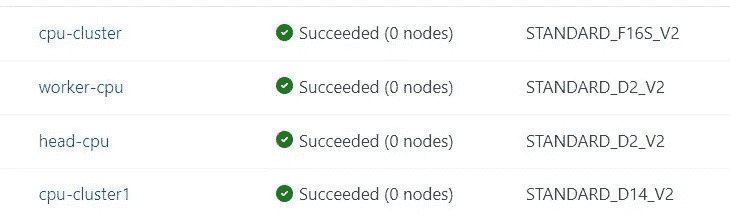

# 提高 Azure 自动化 ML 的速度

> 原文：<https://medium.com/analytics-vidhya/improve-speed-in-azure-automated-ml-3746f5ae9de8?source=collection_archive---------13----------------------->

# 如何提高自动机器学习的性能

# 加速基于 CPU 的模型中的自动运行

# 用例

*   改善模型训练时间
*   使用 CPU
*   添加更多节点
*   提高并发性
*   成本优化
*   测试回归模型

# 介绍

*   选择 data.gov 的 NasaPred 数据
*   使用回归的剩余使用寿命模型
*   使用 2 个训练集群配置运行
*   称为 cpu-cluster1 的计算集群，具有 2 个节点 Standard_D14_v2 (16 个内核、112 GB RAM、800 GB 磁盘)
*   具有 4 个节点的计算集群称为 cpu 集群 Standard_F16s_v2 (16 个内核、32 GB 内存、128 GB 磁盘)
*   相同的数据集
*   相同的回归模型
*   相同的默认配置
*   计算集群详细信息

*   计算机群集运行详细信息

*   节点状态

*   运行比较

*   第一轮是 3 个小时
*   第二轮是 23 分钟
*   4 节点配置下的默认计算运行

*   F16 的配置

*   再次运行 AutoML 以查看它是如何运行的
*   接近 27 分钟

原文：<https://github.com/balakreshnan/Samples2021/blob/main/AzureML/AutoMLoptspeed.md>