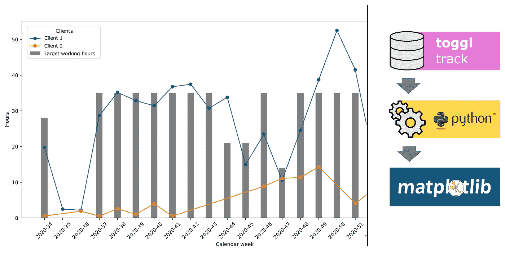

# 如何使用 Toggl 的 API 来自动化您的工作时间分析

> 原文：<https://medium.com/analytics-vidhya/improve-your-time-management-with-toggl-and-python-1e4be2b3bb06?source=collection_archive---------8----------------------->

作者图片

oggl Track 是一个时间追踪器，可以让你以最简单的方式追踪和管理你的时间。安装在你的电脑上，Toggl 会提醒你记录你的时间，这让我对我的工作时间有了更准确和无压力的记录。

虽然用 Toggl 记录时间是无与伦比的，但对工作时间的评估并不符合我的所有要求