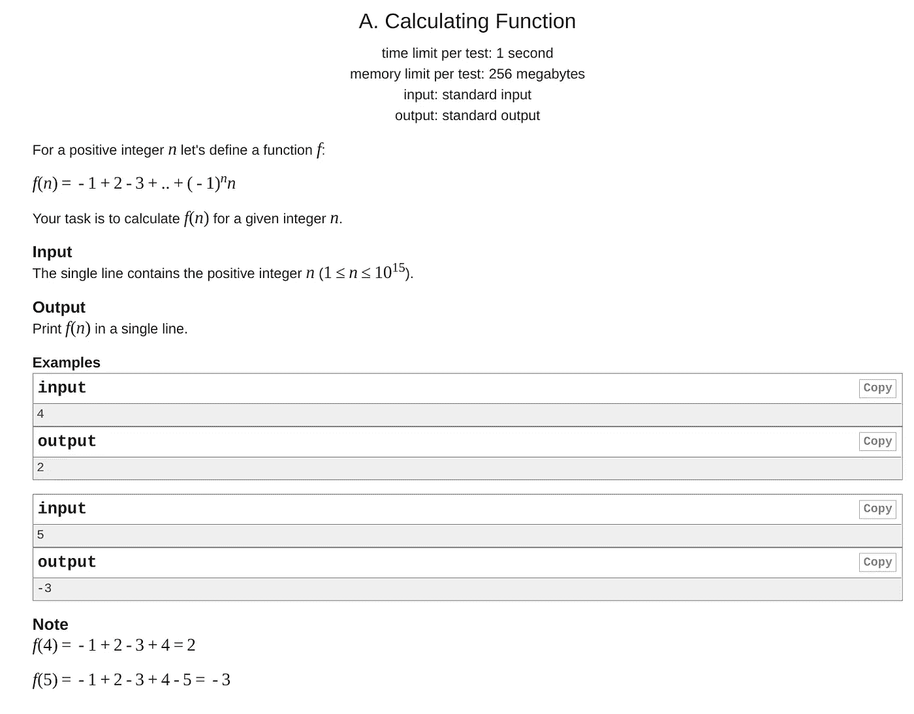

# 丰富

> 原文：<https://medium.com/analytics-vidhya/improvements-abcde0b64f9b?source=collection_archive---------18----------------------->


# 背景

最近在一个叫 Codeforces 的网站上做一些编程。我想这是一个提高我编程技能的好机会，因为我正在放春假。Codeforces 提供了许多困难问题的档案。由于我在竞争性编程方面相当缺乏经验，我只能做评分为 800 的问题。我几乎不费吹灰之力就连续完成了大约 10 道这样的题，但当我完成一道名为“计算函数”的题时，遇到了更多的挑战。



问题详情

# 示范

当我第一次看到这个问题时，我想我可以对输入使用 Python range()函数，并将它们添加到一个列表中。创建完列表后，我将遍历列表并检查元素的索引是奇数还是偶数。如果它是奇数，我会从一个我设置为 0 的**答案**变量中减去它。如果是偶数，我会把它加到**答案**变量中。在循环所有的数字后，我会打印出答案。

```
info = int(input())
values = [int(x) for x in range(info + 1)]
answer = 0
for i, value in enumerate(values):
    if i % 2 == 0:
        answer -= int(value)
    else:
        answer += int(value)print(answer)
```

我上面的解决方案对一些测试案例有效，但是当输入是一个相当大的数字时，速度会大大降低。列表理解和检查每个数字的模是非常耗时的。这个解决方案是草率的，甚至不能满足每次测试 1 秒钟的时间限制。它的时间复杂度为 O(n ),所以输入越大，程序运行越慢。我不得不更努力地思考，看看是否有什么模式。

首先，我决定去掉模数和列表理解，因为它们肯定会使我的程序变慢。我没有检查一个数字是否是偶数，而是在减法和加法之间切换，因为我知道第一个数字总是负数。尽管做出了这些努力，但仍超过了 1 秒的时限。这可能是因为解也像前一个一样运行在 O(n)中。

```
info = int(input())
answer = 0
negative = True
for i in range(1, info + 1):
    if negative:
        answer -= int(i)
    else:
        answer += int(i)
    negative = not negativeprint(answer)
```

一旦我注意到问题底部的注释部分，我的解决方案就会呈现在我面前。在这里，我注意到如果数字是偶数，序列将由多对 1 组成。例如，数字 6 将由-1 + 2，-3 + 4，-5 + 6 组成，所有这些数字都等同于 1。这些较小的方程加起来都等于 3，基本上就是 6 除以 2。对于奇数，情况是相同的，除了从序列中减去输入的数字。例如，数字 7 将由数字 6 的所有小等式组成，但总和将减去 7。这意味着 f(7)将是 3 -7，也就是-4。

```
info = int(input())
answer = info // 2
if info & 1 != 0:
    answer -= infoprint(answer)
```

在上面的代码片段中，我像第一个解决方案一样接受输入，但随后发现所有偶数的函数都是这个数除以 2，所以我为此设置了一个答案变量。对于奇数，我使用了一个按位操作符作为快速检查数字是否是奇数的方法，因为我以前每个案例都超过了时间。然后，它会从先前偶数的函数中减去输入的数字。再次以 7 为例，7 // 2 会是 3，这是 6 的函数的答案，6 是前面的偶数。然后从 3 中减去输入值 7，得到的结果是-4。这个解的运行时间为 O(1 ),所以不管输入有多大，解的时间都是常数。

# 思想

我认为在解决这个问题的过程中，我从总体上提高了我作为程序员和问题解决者的整体技能。有时候用蛮力来解决问题，就像我在第一个解决方案中做的那样，是行不通的。为了在时间和空间的限制下解决这个问题，我不得不更深入地分析这个问题。花时间想一个比直接解决问题更有效的解决方案是很重要的，因为这并不总是有效的。我希望我的代码和思想的进展能够帮助任何刚接触竞争性编程的人。感谢阅读。

# 参考

code forces:[https://codeforces.com/](https://codeforces.com/)
计算函数:[https://codeforces.com/contest/486/problem/A](https://codeforces.com/contest/486/problem/A)

# 放弃

我只做过被认为容易的问题，所以我的代码不会是最干净或最有效的。我对竞争性编程也很陌生，因为我有很多东西要学。我写这些文章希望能学到更多，与其他感兴趣的人分享我的学习，并在此过程中提高我的写作技能。感谢阅读。