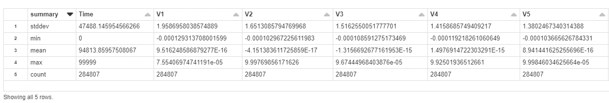
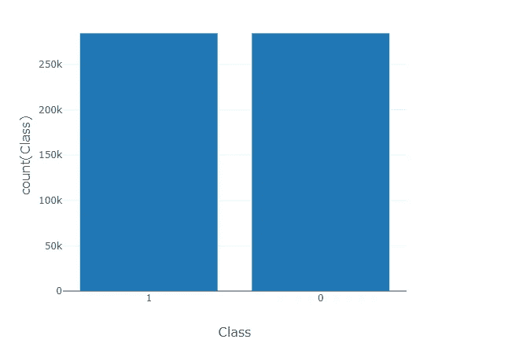
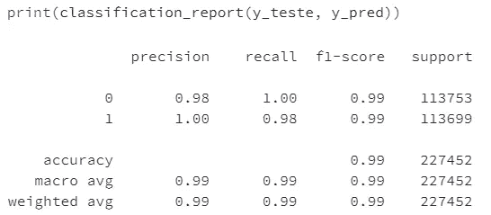
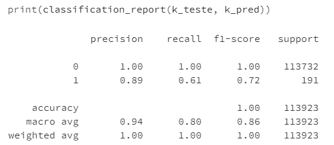
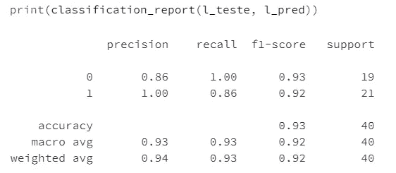

# 使用 PySpark 通过数据过采样改进信用卡欺诈检测

> 原文：<https://medium.com/analytics-vidhya/improving-credit-card-detection-fraud-by-data-oversampling-using-pyspark-73293a60177?source=collection_archive---------6----------------------->

欺诈活动被视为不常见或异常交易，这可能是欺诈的主要特征之一。正如《使用描述性、预测性和社交网络技术的欺诈分析:欺诈检测数据科学指南》一书的作者所指出的:

> “这使得[由于异常值的特征]很难检测欺诈，因为欺诈案例被非欺诈案例所覆盖，同时也很难从历史案例中学习，以建立一个强大的欺诈检测系统，因为只有很少的例子可用”

因此，考虑到数据的不平衡性质，必须解决这个问题。在本帖中，我们将使用在 https://www.kaggle.com/mlg-ulb/creditcardfraud 的[可用的信用卡数据。此外，我们将使用 PySpark，这是 Python 中 Apache Spark 的接口，因为它是处理大数据的优秀工具。](https://www.kaggle.com/mlg-ulb/creditcardfraud)

```
# Importing some libraries**import** numpy **as** np
**from** pyspark.sql **import** functions **as** F
**from** pyspark.sql.types **import** DoubleType# Reading credit card fraud transactionsdf1 = spark.read.format("csv").options(header='true').load("dbfs:/FileStore/shared_uploads/eric.fontes.databricks@gmail.com/creditcard.csv")# Some basic statisticsdf_describe = df1.describe()
display(df_describe)
```



的。describe 方法对于显示数据的一些基本统计很重要。这个 spark DataFrame 对象有 31 列和 284807 行。时间特征表示本次交易与数据集中第一次交易之间经过的秒数，V1 → V28 列可能是 PCA 降维的结果，以保护用户身份和敏感特征，金额特征是交易金额，类目标变量 1 代表欺诈性交易，0 代表非欺诈性交易。

```
df2_rdd = (df_describe
.rdd.filter(
**lambda** x: x.summary == 'mean')
.map(**lambda** x: x.asDict()
))# Mean
float(df2_rdd.collect()[0]['V1'])
Out[5]: 9.516248586879277e-16df3_rdd = (df_describe
.rdd.filter(
**lambda** x: x.summary == 'stddev')
.map(**lambda** x: x.asDict()
))# Std-deviation
float(df3_rdd.collect()[0]['V1'])
Out[7]: 1.9586958038574889
```

上面的代码是使用 RDD API 为 V1 要素提取 df_describe 中的平均值和标准差而编写的。这是一个例子，说明我们将如何提取所有 Vk，k=1…28 的这些值。现在，我们将使用其他一些库，包括考拉。

```
#Importing some other libraries**from** random **import** randrange, uniform
**from** pyspark.sql **import** SparkSession, Row
**from** pyspark.sql.types **import** ArrayType, StructField, StructType, StringType, IntegerType, DecimalType, FloatType
**from** decimal **import** Decimal
**import** databricks.koalas **as** ks
```

现在，我们可以创建新的过采样数据帧了。为此，我们必须注意，所有 Vk 特征都类似于正态分布(这不是我们在此证明这一假设的目的)，并且金额特征可以被均匀地过采样。我们的过采样方法包括使用正态和均匀分布中的随机数对原始数据进行上采样。我们已经为正常特征的每个新特征使用了“原始”平均值和标准差。这个讨论可以转换成下面的代码:

```
# Oversampling the initial data with random numbers within normal distributions for the PCA variables and# random numbers within uniform distribution for the Amount featuredict1 = {'V1':np.random.normal(loc=float(df2_rdd.collect()[0]['V1']), scale=float(df3_rdd.collect()[0]['V1']), size=(283823)).tolist(), 'V2': np.random.normal(loc=float(df2_rdd.collect()[0]['V2']), scale=float(df3_rdd.collect()[0]['V2']), size=(283823)).tolist(), 'V3': np.random.normal(loc=float(df2_rdd.collect()[0]['V3']), scale=float(df3_rdd.collect()[0]['V3']), size=(283823)).tolist(), 'V4': np.random.normal(loc=float(df2_rdd.collect()[0]['V4']), scale=float(df3_rdd.collect()[0]['V4']), size=(283823)).tolist(), 'V5': np.random.normal(loc=float(df2_rdd.collect()[0]['V5']), scale=float(df3_rdd.collect()[0]['V5']), size=(283823)).tolist(), 'V6': np.random.normal(loc=float(df2_rdd.collect()[0]['V6']), scale=float(df3_rdd.collect()[0]['V6']), size=(283823)).tolist(), 'V7': np.random.normal(loc=float(df2_rdd.collect()[0]['V7']), scale=float(df3_rdd.collect()[0]['V7']), size=(283823)).tolist(), 'V8': np.random.normal(loc=float(df2_rdd.collect()[0]['V8']), scale=float(df3_rdd.collect()[0]['V8']), size=(283823)).tolist(), 'V9': np.random.normal(loc=float(df2_rdd.collect()[0]['V9']), scale=float(df3_rdd.collect()[0]['V9']), size=(283823)).tolist(), 'V10': np.random.normal(loc=float(df2_rdd.collect()[0]['V10']), scale=float(df3_rdd.collect()[0]['V10']), size=(283823)).tolist(), 'V11': np.random.normal(loc=float(df2_rdd.collect()[0]['V11']), scale=float(df3_rdd.collect()[0]['V11']), size=(283823)).tolist(), 'V12': np.random.normal(loc=float(df2_rdd.collect()[0]['V12']), scale=float(df3_rdd.collect()[0]['V12']), size=(283823)).tolist(), 'V13': np.random.normal(loc=float(df2_rdd.collect()[0]['V13']), scale=float(df3_rdd.collect()[0]['V13']), size=(283823)).tolist(), 'V14': np.random.normal(loc=float(df2_rdd.collect()[0]['V14']), scale=float(df3_rdd.collect()[0]['V14']), size=(283823)).tolist(), 'V15': np.random.normal(loc=float(df2_rdd.collect()[0]['V15']), scale=float(df3_rdd.collect()[0]['V15']), size=(283823)).tolist(), 'V16': np.random.normal(loc=float(df2_rdd.collect()[0]['V16']), scale=float(df3_rdd.collect()[0]['V16']), size=(283823)).tolist(), 'V17': np.random.normal(loc=float(df2_rdd.collect()[0]['V17']), scale=float(df3_rdd.collect()[0]['V17']), size=(283823)).tolist(), 'V18': np.random.normal(loc=float(df2_rdd.collect()[0]['V18']), scale=float(df3_rdd.collect()[0]['V18']), size=(283823)).tolist(), 'V19': np.random.normal(loc=float(df2_rdd.collect()[0]['V19']), scale=float(df3_rdd.collect()[0]['V19']), size=(283823)).tolist(), 'V20': np.random.normal(loc=float(df2_rdd.collect()[0]['V20']), scale=float(df3_rdd.collect()[0]['V20']), size=(283823)).tolist(), 'V21': np.random.normal(loc=float(df2_rdd.collect()[0]['V21']), scale=float(df3_rdd.collect()[0]['V21']), size=(283823)).tolist(), 'V22': np.random.normal(loc=float(df2_rdd.collect()[0]['V22']), scale=float(df3_rdd.collect()[0]['V22']), size=(283823)).tolist(), 'V23': np.random.normal(loc=float(df2_rdd.collect()[0]['V23']), scale=float(df3_rdd.collect()[0]['V23']), size=(283823)).tolist(), 'V24': np.random.normal(loc=float(df2_rdd.collect()[0]['V24']), scale=float(df3_rdd.collect()[0]['V24']), size=(283823)).tolist(), 'V25': np.random.normal(loc=float(df2_rdd.collect()[0]['V25']), scale=float(df3_rdd.collect()[0]['V25']), size=(283823)).tolist(), 'V26': np.random.normal(loc=float(df2_rdd.collect()[0]['V26']), scale=float(df3_rdd.collect()[0]['V26']), size=(283823)).tolist(), 'V27': np.random.normal(loc=float(df2_rdd.collect()[0]['V27']), scale=float(df3_rdd.collect()[0]['V27']), size=(283823)).tolist(), 'V28': np.random.normal(loc=float(df2_rdd.collect()[0]['V28']), scale=float(df3_rdd.collect()[0]['V28']), size=(283823)).tolist(), 'Amount':[], 'Class':[]}**for** k **in** range(283823):dict = {'Amount_1': uniform(0, 25691), 'Class_1': int((k+1)/(k+1))} dict1['Amount'].append(dict['Amount_1']) dict1['Class'].append(dict['Class_1'])df2 = ks.DataFrame(dict1).to_spark()
```

这里，棘手的部分是使用考拉，然后转换回 spark 数据帧，为新的数据帧自动生成新的模式。因此，现在我们将连接原始数据帧和新数据帧。在原始数据帧(df1)中，我们将删除时间列，因为这个特性对我们的模型并不重要。

```
df1_final = df1.drop('Time')
concatenado_koalas = df2.union(df1_final).to_koalas()
concatenado_spark = concatenado_koalas.to_spark()
concatenado_spark.createOrReplaceTempView('concatenado_spark_var')# New balanced target variable%sql
select Class, count(Class) **from** concatenado_spark_var group by Class
```

使用 databricks 中的 SQL magic 命令，我们可以轻松地使用 SQL 进行查询。因此，对于类目标变量，我们现在有了一个完全平衡的集合。



“类”目标变量现在完全平衡了

然后，我们将通过逻辑回归模型评估我们的过采样数据，然后将其与原始数据进行比较。此外，我们还将过采样数据与通过欠采样程序获得的新数据进行比较。为此，我们需要导入 pandas 和 scikit-learn 库:

```
**import** pandas **as** pd
**from** sklearn.model_selection **import** train_test_split
**from** sklearn.linear_model **import** LogisticRegression
**from** sklearn.metrics **import** classification_report, confusion_matrix, roc_auc_score
**from** sklearn.datasets **import** make_classification
**from** sklearn.pipeline **import** make_pipeline
**from** sklearn.preprocessing **import** StandardScalerconcatenado_pandas = concatenado_koalas.to_pandas()
```

定义我们的一组特征和目标变量:

```
features_eric = concatenado_pandas.drop('Class', axis=1)
target_eric = concatenado_pandas['Class'].ravel()
```

我们有，

```
X, y = make_classification(random_state=42)X_treino, X_teste, y_treino, y_teste = train_test_split(features_eric, target_eric, test_size=0.4, random_state=42)pipe = make_pipeline(StandardScaler(), LogisticRegression())pipe.fit(X_treino, y_treino)
```

模型结果如下所示:

```
y_pred=pipe.predict(X_teste)
```



```
print("AUC score is: ", roc_auc_score(y_teste, y_pred))AUC score is:  0.9884036712683695
```

现在，我们将我们的结果与不平衡的“原始”数据进行比较:

```
df1_pandas = df1_final.toPandas()# Unbalanced data
features_original = df1_pandas.drop('Class', axis=1)
target_original = df1_pandas['Class'].ravel()K, k = make_classification(random_state=42)K_treino, K_teste, k_treino, k_teste = train_test_split(features_original, target_original, test_size=0.4, random_state=42)pipe.fit(K_treino, k_treino)k_pred=pipe.predict(K_teste)
```

模型结果如下所示:



```
print("AUC score is: ", roc_auc_score(k_teste, k_pred))AUC score is:  0.8035989769648607
```

最后，我们现在将我们的结果与通过欠采样程序获得的另一个数据进行比较，该程序的代码最初可在[https://www . kdnugges . com/2019/05/fix-unbalanced-dataset . html](https://www.kdnuggets.com/2019/05/fix-unbalanced-dataset.html)找到:

```
# Undersampling dataL = df1_pandas.drop('Class', axis=1).sample(n=984, random_state=42)
# Shuffling the data
shuffled_df = df1_pandas[['Class']].sample(frac=1, random_state=42)# Put all the fraud class in a separate dataset.
fraud_df = shuffled_df.loc[shuffled_df['Class'] == 1]#Randomly select 492 observations from the non-fraud (majority class)
non_fraud_df = shuffled_df.loc[shuffled_df['Class'] == '0'].sample(n=492, random_state=42)# Concatenate both dataframes again
l = normalized_df = pd.concat([fraud_df, non_fraud_df]).squeeze().ravel()
```

将该模型应用于欠采样数据，我们得到:

```
L, l = make_classification(random_state=42)L_treino, L_teste, l_treino, l_teste = train_test_split(L, l, test_size=0.4, random_state=42)pipe.fit(L_treino, l_treino)l_pred=pipe.predict(L_teste)
```

模型结果如下所示:



```
print("AUC score is: ", roc_auc_score(l_teste, l_pred))AUC score is:  0.9285714285714286
```

结论:与不平衡数据集相比，适当的过采样程序可以提供更好的结果。我们已经证明了不平衡数据的统计知识对于数据的上采样是很重要的。通过这样做，与原始数据和欠采样数据相比，我们获得了过采样数据的更好结果。这里需要强调的是，我们无意优化模型的超参数，也无意证明本文中提到的统计假设。