# 使用机器学习提高客户保持率

> 原文：<https://medium.com/analytics-vidhya/improving-customer-retention-using-machine-learning-dc51f5f49fb6?source=collection_archive---------3----------------------->

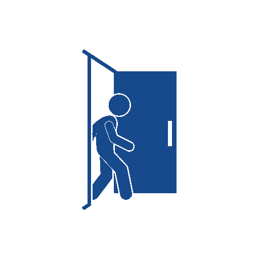

**商业视角**

拥有一个能帮助你留住花钱争取来的客户的模式，对任何企业的成功都至关重要。鉴于吸引一个新客户的成本是保持一个现有客户成本的五倍**，企业需要像关注获得新客户一样关注留住客户。事实上，根据贝恩公司的说法，客户保持率仅提高 5%就能增加 25%到 95%的利润。**

**那么企业如何提高客户保持率呢？虽然企业可以用许多方法来留住客户，但有时很难预测客户何时会离开企业。这归因于这样一个事实，即大多数不满的客户不会说话，而是直接离开业务。事实上， [**统计数据**](https://www.linkedin.com/pulse/20130604134550-284615-15-statistics-that-should-change-the-business-world-but-haven-t) 显示，96%不开心的顾客不会抱怨，91%的顾客会直接离开，再也不会回来。因此，依靠物理归因来预测流失可能相当具有挑战性。然而，随着技术进步，企业越来越多地采用机器学习来创建能够根据客户数据预测客户流失的模型。**

**这篇文章旨在说明企业如何通过预测可能离开的客户来利用机器学习减少客户流失。分类问题使用来自 IBM 的电信样本数据来创建一个模型，该模型可以根据给定的特征预测客户流失。比较几种分类模型，并选择最佳模型用于分类目的。目标变量“客户流失”是一个二元变量，有两种可能的结果；“搅动”，“不搅动”。你可以从我的 [**Github 库**](https://github.com/wanyangajnr/eda/blob/main/churn_prediction.ipynb) 访问完整的代码**

****探索性数据分析****

**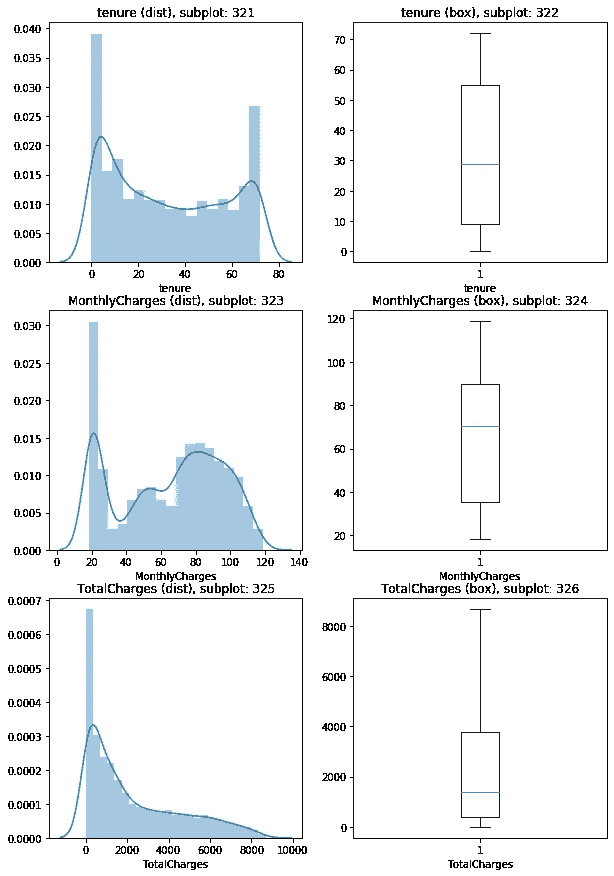**

**任期代表客户在公司工作的月数。直方图显示，大多数客户与该公司的合作时间少于 5 个月或超过 70 个月。向客户收取的费用总额向右倾斜，大多数费用低于 2000 英镑。没有多重共线性的证据。**

**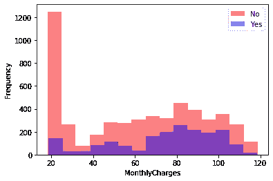****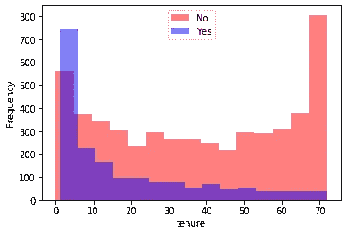****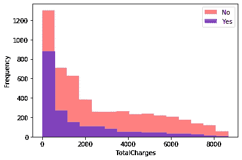**

**大多数有过不愉快经历的客户拥有更短的任期，而那些没有不愉快经历的客户拥有更长的任期。**

**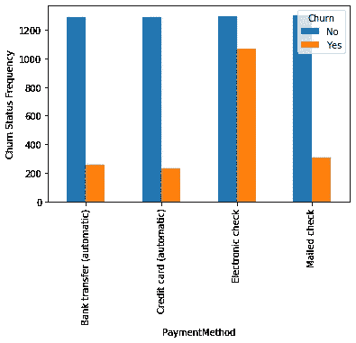****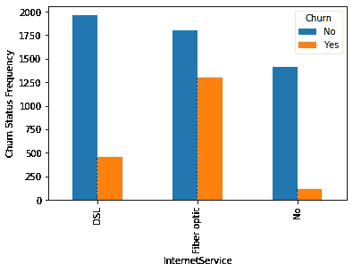****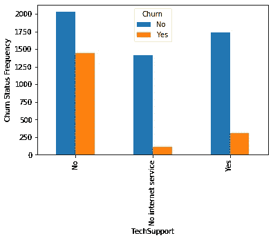**

**就支付方式而言，使用电子支票记账的账户的流失率最高。光纤模式的互联网服务的流失率最高。未能提供技术支持是流失最多的原因。**

****建模****

**在建模中，使用了基于随机森林分类器的基线模型，精度达到了 0.796。**

**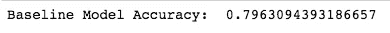**

**在使用分层交叉验证和分析排序以使用不同的分类器来查看准确性是否会有任何提高之后，准确性没有变化。**

**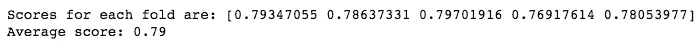**

**使用梯度增强分类器进行交叉验证，获得 0.80 的准确度。这个分类器被用于最终模型。**

**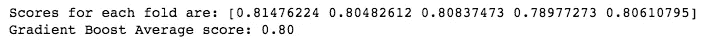**

****特征重要性****

**进行了特征重要性分析，变量，合同(逐月)，任期，互联网服务(光纤)，总费用和每月费用是模型的最重要的变量；**

**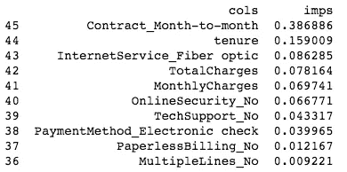**

****最终型号****

**网格搜索交叉验证用于选择最终模型。最佳选择模型的精确度为 0.814**

**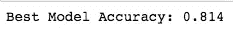**

****模型评估****

**曲线下的区域用于评估最终模型和分类报告。总精度为 0.814，曲线下面积为 0.89。**

****结论****

**在这篇报道中达到的精度大约是大多数 kaggle 比赛达到的精度，略低于达到 0.82 精度的[**Adaboos**](https://www.kaggle.com/bandiatindra/telecom-churn-prediction)**t**。因此，我们可以得出结论，这将是一个很好的基线，在此基础上建立未来的流失预测模型。**

**来源**

** [## 电信流失预测

### 使用 Kaggle 笔记本电脑探索和运行机器学习代码|使用电信客户流失数据

www.kaggle.com](https://www.kaggle.com/bandiatindra/telecom-churn-prediction)**