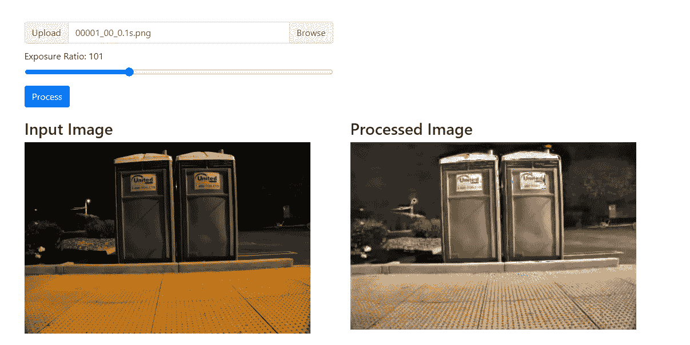
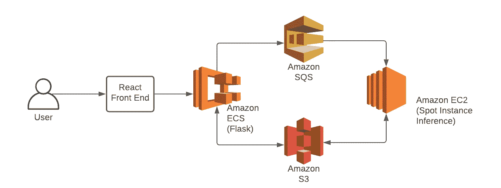

# 改进机器学习推理的现场实例冷启动时间

> 原文：<https://medium.com/analytics-vidhya/improving-spot-instance-cold-start-time-for-machine-learning-inference-4021e967bfdb?source=collection_archive---------12----------------------->

最近，我在做一个项目，构建一个 web 应用程序来处理低光图像，并使它们变得更亮。为此，我从一篇机器学习论文的 PyTorch 实现开始；学习在黑暗中看东西。对我来说，挑战是建立一个低成本的推理 API 作为我的网站的演示。



处理暗图像的 Web 应用程序

# 介绍

完成这个问题需要一些独特的挑战和决策。首先，高效的图像处理需要至少 8GB 的 RAM，理想情况下还需要一个 GPU。这些类型的实例类型对于低利用率的爱好项目来说是昂贵的。

最初，我使用我的后端 Flask API 在图像上传后立即连续执行推理。这在开发中工作得很好，但是当我开始使用 uWSIGI 时，我遇到了一个问题，python 代码会无限地停留在一行上，但是从来不会抛出错误。在尝试逐行调试代码并检查机器上的资源没有耗尽之后，我得出结论，由于使用了 PyTorch，uWSIGI 的默认前置 fork 选项不能用于我的应用程序。

> [http://zarnovican . github . io/2016/02/15/uws gi-graceful-reload/](http://zarnovican.github.io/2016/02/15/uwsgi-graceful-reload/)

这篇博客文章有助于我理解 uWSIGI 配置，并得出结论，为了防止代码卡住，我需要设置 uWSIGI 配置:`lazy-apps = true`。我发现这种安排不理想，因为它需要为每个工人加载一次机器学习模型，这将导致应用程序的无效扩展。因此，我决定将推理工作器从 Flask API 中分离出来，这样两个组件都可以独立伸缩。

我考虑过使用 AWS Lambda 函数，但最终决定不使用它，因为 Lambda 不支持 GPU，使用容器化的推理工作器可以使项目更加灵活，以便将来部署到其他云平台。

最后，我决定使用 AWS EC2 Spot 实例，并在 Flask 收到推理请求时按需启动一个实例。其优势在于，spot 实例可以提供高达 90%的按需价格折扣，并且可以通过灵活调整实例大小和可用性区域来最大限度地节省成本。缺点是 AWS 可以在 2 分钟的警告后随时终止这些实例。然而，这是可以接受的，因为每个推理只需要几秒钟，如果一个实例被终止，它可能会立即被替换。

# 系统结构



架构图

最终，我决定使用上面显示的架构。前端使用 React 构建，并将图像作为 POST 请求发送到 Flask 后端。后端负责以下工作。

1.  检查图像的有效性和格式
2.  使用 uuid 创建唯一的文件 id。
3.  上传图像到 S3
4.  将文件 id 添加到 SQS，这是 EC2 Spot 实例在启动时知道要处理哪些图像的方式
5.  将文件 id 作为响应发送回前端。

然后，前端可以定期轮询后端，以检查推断是否完成。

下面是后端用于处理图像上传的代码片段:

# 冷启动挑战

我面临的主要挑战是尽快启动实例，并最大限度地减少冷启动时间。我的初始部署需要 5 分钟以上才能启动，我采取了几项措施将启动时间缩短到 1-2 分钟左右。

1.  创建了我自己的 AMI (Amazon 机器映像),已经安装了 Docker，上传了我训练过的模型，并提取了我的基本 Docker 映像。这节省了大量时间，因为在机器启动后，python 代码无需任何额外安装即可运行。
2.  我确保 docker 文件是有序的，这样源代码`COPY ./app`的复制就发生在需求被安装之后。如果顺序颠倒了，那么每次更新源代码时，所有的需求都必须在每次发布时重新安装。

```
FROM python:latest
RUN apt-get updateWORKDIR /app
COPY requirements.txt /app
RUN pip install -r requirements.txtCOPY . /app
RUN mkdir /app/checkpointCMD ["python", "main.py"]
```

采取这些步骤后，瓶颈不再是 docker 容器的安装和运行，而是实例的启动时间。因此，我尝试在用户点击我网站上的页面时先发制人地启动实例。尽管存在用户可能不会实际使用演示程序的风险，但它给了我的 spot 实例在请求实际发送之前启动的时间。为了实现这一点，我设置了一个函数，向服务器发送一个 GET 请求，检查页面加载后实例是否正在运行。

# 改进的余地

经过这些步骤来有效地使用 spot 实例进行我的机器学习推理后，我发现我的项目的性能是可以接受的。最后，在部署之后，我发现了一些遗留的问题。

1.  目前，推理工作器不直接与后端通信，S3 会定期轮询，直到映像就绪。这很快就成了一个问题，因为往 S3 打电话的费用很高。目前，我已经将轮询限制为每 5 秒一次。
2.  推理机的故障恢复。后端能够检查以确保 spot 实例正在运行，并能够在终止时启动新的实例。不幸的是，如果推理挂起或崩溃，那么就没有足够的恢复。目前，我的解决方案是将关键代码包装在“try/except”块中，以尽量保持容器运行。
3.  最大的瓶颈之一是图像上传到 S3，根据分辨率的不同，这可能是流程中最慢的一步。另一种方法是在 EC2 实例间共享 EFS(弹性文件系统),这样可以提高吞吐量。

# 源代码

最后，该项目的代码分布在几个存储库中，链接如下:

1.  前端(React) [https://github . com/SEANDOUGHTY/learning-to-see-in-the-dark-React](https://github.com/SEANDOUGHTY/learning-to-see-in-the-dark-react)
2.  后端 API 服务器(Flask)
    [https://github . com/SEANDOUGHTY/learning-to-see-in-the-dark-Flask](https://github.com/SEANDOUGHTY/learning-to-see-in-the-dark-flask)
3.  现场实例工作者
    [https://github . com/SEANDOUGHTY/learning-to-see-in-the-dark-Worker](https://github.com/SEANDOUGHTY/learning-to-see-in-the-dark-worker)
4.  PyTorch 推论
    [https://github . com/frankgu 968/learning-to-see-in-the-dark-py torch](https://github.com/frankgu968/learning-to-see-in-the-dark-pytorch)

[1]:陈晨，陈奇峰，贾旭，弗拉德伦·科尔敦，“学会在黑暗中看东西”，CVPR，2018 年。