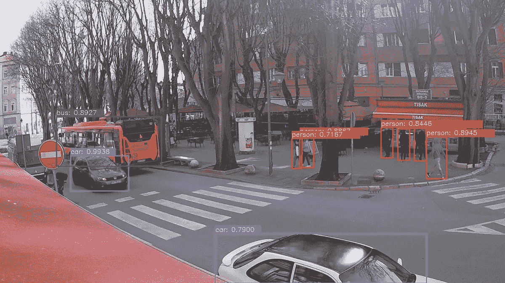
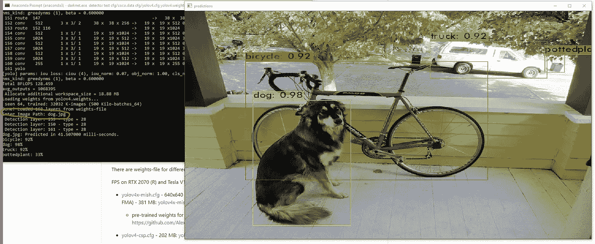
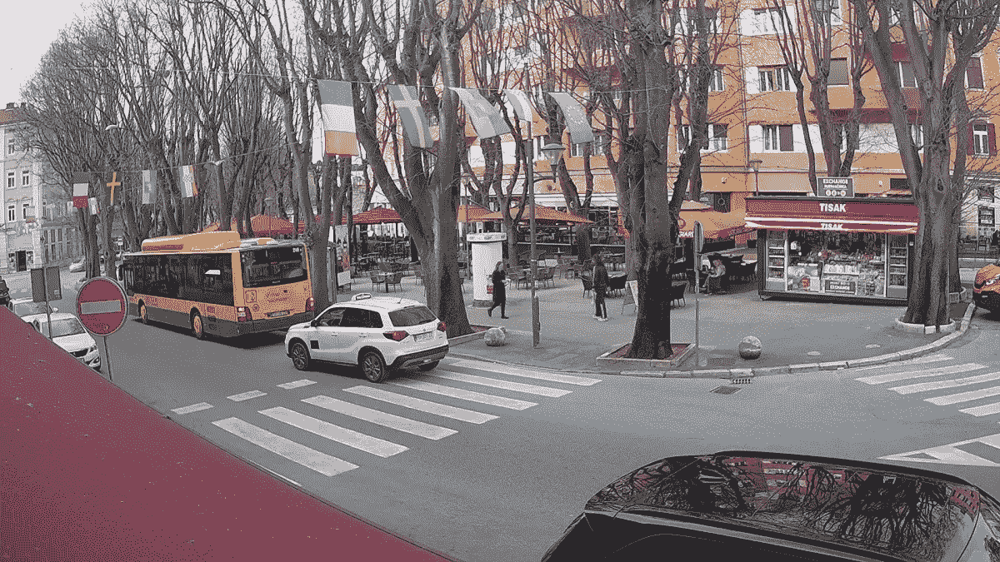
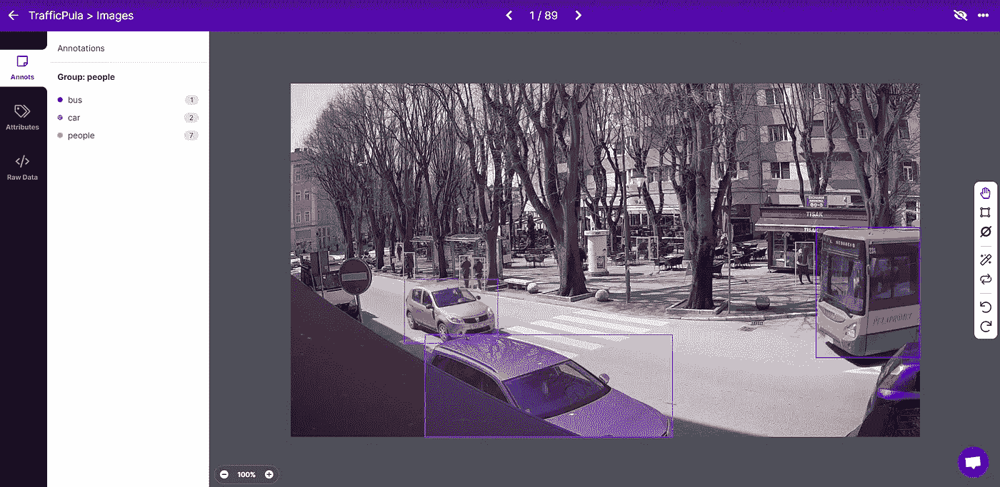
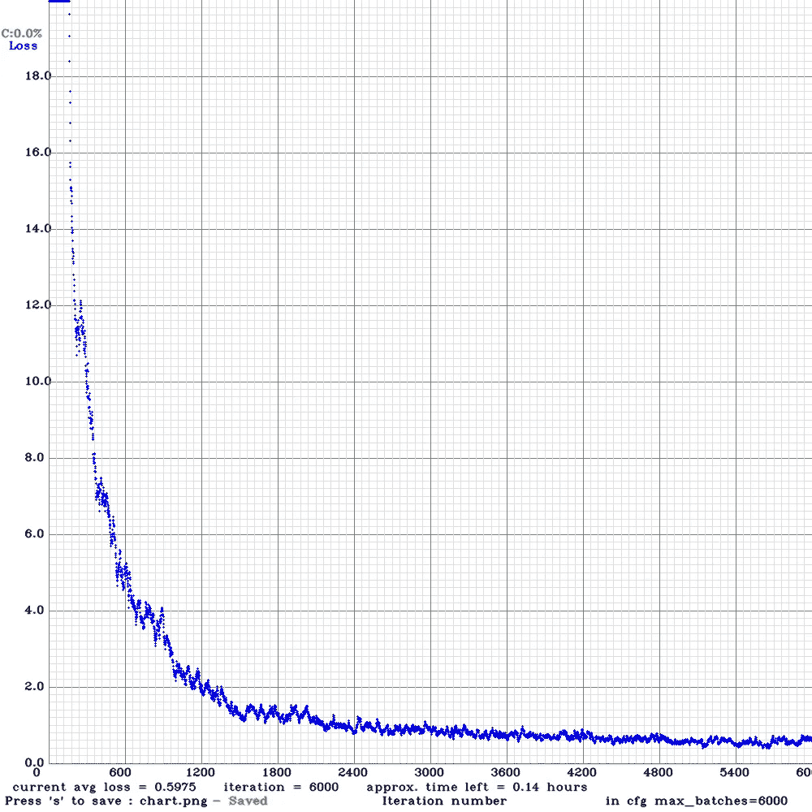
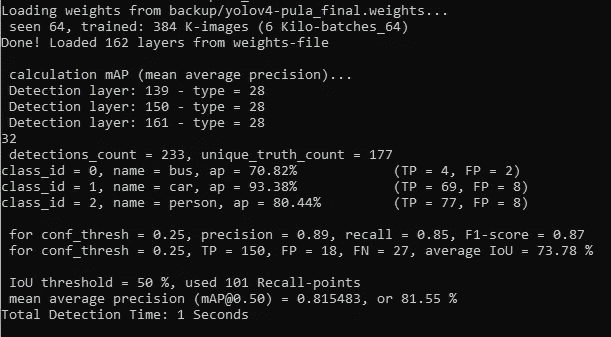

# 提高 YOLOv4 检测常见物体的准确性

> 原文：<https://medium.com/analytics-vidhya/improving-yolov4-accuracy-on-detecting-common-objects-38f3baa5041c?source=collection_archive---------0----------------------->



YOLOv4 带有 80 个内置的对象类，它能够检测到这些对象类。我一直试图用 YoloV4 和 Darknet 检测公共网络摄像头上的人。我的经验是，当人距离摄像机**、T2 光照条件**异常或者人站在**特殊背景**前面时，预先训练的模型不能正确地检测到人。为了提高人物检测的准确性，我决定在 YoloV4 的基础上建立自己的模型。

# YOLO 和暗网

为了理解 YOLOv4 是如何工作的，我们必须谈一点关于 Darknet 的事情。
YOLO 是一种物体检测算法，有一些实现，包括 Pytorch、Keras 和 Darknet。
Darknet 本身，根据[它自己的描述](https://pjreddie.com/darknet/)“一个用 C 和 CUDA 编写的开源神经网络框架。它速度快，易于安装，支持 CPU 和 GPU 计算。”

# 从源代码构建 OpenCV 和 Darknet

为了在暗网上执行自定义对象检测，我们必须在我们的模型上进行训练。为此，我们必须从它们的源代码构建 Darknet 和 OpenCV。在像我这样的 Windows 10 机器上，这意味着我们必须生产必要的产品。dll 和。exe 文件。

> 请注意本章的内容。这是整个过程中最无聊但又不得不做的部分:)
> 如果你只对物体检测部分感兴趣，你可以跳过。

## 从源代码构建 OpenCV

我在之前的文章中详细描述了如何在 Windows 10 环境下从源代码构建 OpenCV。

[](/analytics-vidhya/object-detection-on-public-webcam-with-opencv-and-yolov4-9ed51d5896a9) [## 基于 OpenCV 和 YOLOv4 的公共摄像头目标检测

### 公共网络摄像头可以是对象检测的一个很好的数据源。让我展示一下我是如何用 YOLOv4 和 OpenCV 做到这一点的…

medium.com](/analytics-vidhya/object-detection-on-public-webcam-with-opencv-and-yolov4-9ed51d5896a9) 

为了从源代码构建 OpenCV，您必须遵循相同的步骤，除了您必须在生成项目文件之前在 CMake GUI 中设置一个额外的属性: *BUILD_opencv_world。*您可以勾选该属性，并按照上述文章中的教程继续后续步骤。

## 从源代码构建暗网

我按照 CodingBug 频道的[这个](https://www.youtube.com/watch?v=FE2GBeKuqpc)惊人的一步一步的教程从源代码构建 Darknet。在这里，我只是总结了下面的步骤，为进一步参考检查以上链接的视频。

从 [Darknet 的 github 页面](https://github.com/AlexeyAB/darknet)下载源代码为。zip 文件并解压到一个新文件夹 *darknet* 。

提取时。将 CUDA 目录中的 cuDNN dll 复制到*darknet/build/darknet/x64*文件夹中。对我来说，它是“*c:\ Program Files \ NVIDIA GPU Computing Toolkit \ CUDA \ v 11.2 \ bin \ cud nn 64 _ 8 . dll*”，但它可能会因您的 CUDA 版本和 GPU 支持的架构而异。

转到 OpenCV 构建文件夹，复制*install/x64/vc16/bin/OpenCV _ world *。dll* 放入*darknet/build/darknet/x64*文件夹。

打开*darknet/build/darknet/darknet . vcx proj*文件进行编辑，在两个地方设置你的 CUDA 版本:*$(VCTargetsPath)\ build customizations \ CUDA****11.2****。道具*和*$(VCTargetsPath)\ build customizations \ CUDA****11.2****. targets .* 我的是 11.2 如上图所示但你的可能不同。

同样，对*darknet/build/darknet/yolo _ CPP _ dll . vcx proj*做同样的操作。

> **注** : *为我所用。道具和。目标文件在 Visual Studio 文件夹*的$(VCTargetsPath)\ build customizations*中丢失:c:\ Program Files(x86)\ Microsoft Visual Studio \ 2019 \ Community \ MSBuild \ Microsoft \ VC \ v 160 \ build customizations \*因此我必须从 CUDA 目录*c:\ Program Files \ NVIDIA GPU Computing Toolkit \ CUDA \ v 11.2 \ extras \ Visual _ Studio _ integration \ MSBuild extensions*中复制它们。**

现在用 Visual Studio 打开*darknet/build/darknet/yolo _ CPP _ dll . vcx proj*。首先，在菜单栏中将解决方案配置**从 Debug 改为 Release/X64** 。然后在解决方案浏览器中，右击 *yolo_cpp_dll* 并点击 *Build* 。

一旦构建成功完成，用 Visual Studio 打开*darknet/build/darknet/darknet . SLN*。在建造暗网之前，你必须设置一些属性。右击暗网并选择属性。
现在设置以下属性:

*   将 OpenCV 包含文件夹添加到包含路径的*C/c++/General/Additional Include directory*属性中。对我来说，包含路径是 *< opencv 根目录>\ build \ install \ include \；*
*   将 OpenCV lib 文件夹添加到包含路径的*链接器/通用/附加库目录*属性中。对我来说，lib 路径是 *< opencv 根目录>\ build \ install \ x64 \ vc16 \ lib \*
*   从*C/c++/预处理器/预处理器定义*的列表中删除 *CUDNN_HALF*
*   从*CUDA C/c++/设备/代码生成*中移除 *compute_75、sm_75*

一旦这些都完成了，右键点击*解决方案浏览器*中的*暗网*并点击*构建。*当构建完成后，你会在*darknet/build/darknet/x64*文件夹*中找到 darknet.exe。*

## 测试暗网构建

为了测试我们刚刚构建的 Darknet，从 darknet github 页面下载 [yolov4.weights](https://github.com/AlexeyAB/darknet/releases/download/darknet_yolo_v3_optimal/yolov4.weights) 文件到*Darknet/build/Darknet/x64*文件夹。
现在在 Anaconda 提示符下发出以下命令:

```
darknet.exe detector test cfg/coco.data cfg/yolov4.cfg yolov4.weights
```

在控制台上显示 Darknet 神经网络层的不同信息后，Darknet 会提示输入要检测的对象的图像名称。您可以提供*dog.jpg*作为 x64 文件夹中的默认测试图像。或者您可以使用任意图像。如果您成功构建了 Darknet，您应该会得到类似的输出:



暗网构建测试映像

现在我们有了预训练模型，但这次我们想要一个定制模型，与原始预训练模型相比，它具有更好的识别人和车的能力。
那么让我们来构建这个定制模型。

# 用 Roboflow 注释图像

## 从网络摄像头收集训练图像

任何自定义模型都需要对图像进行训练。因为是街景，我决定只检测人、汽车和公共汽车。所以我的模型将只包含 3 个类。
出于训练目的，我从我在[上一篇文章](/analytics-vidhya/object-detection-on-public-webcam-with-opencv-and-yolov4-9ed51d5896a9)中使用的 Pula 公共网络摄像头收集了数百张图像。

> 为了收集图像，我使用了一个脚本，每 30 秒从**的网络摄像头中捕捉一帧。我跑了几个小时，包括白天和晚上。它给了我数百张照片。此外，我还内置了一个机制，这样当我按下**键时，它也会捕捉图像**。当屏幕上发生一些不寻常的事情，可能会混淆模型时，我用它来捕捉图像。然后我整理出那些包含人、汽车或公共汽车的帧，并使用大约 200 张图像进行训练。**



来自街道网络摄像头的样本训练图像

## 利用机器人流程

以前我使用开源的 LabelImg 工具进行图像标注，但是这次我想尝试一些不同的东西，一些可能比 LabelImg 有更多功能的东西。我决定尝试一下我之前听说过的机器人流程。使用 Roboflow 的免费版本，您可以为您的项目注释 1000 张图像。在不详细介绍 Roboflow 的情况下，让我列出它们最吸引我的功能:

*   **标签辅助**:在 Coco v1 模型的帮助下，在各种置信度下，帮助标注已知对象。它大大减少了注释时间。
*   **缩放**:它有助于标注小物体，你可以将原始图像放大 4000%
*   **标记空图像**:只需点击一个按钮，您就可以轻松创建没有任何可检测对象的图像。这些图像对于模型识别信息的缺乏是有用的
*   **在训练、测试和验证集之间轻松移动图像**:难以解读的图像可用于验证
*   **数据集健康检查**:您可以检查您的数据集是否缺少注释或不平衡的类，无论您的任何类是过多还是过少
*   **以多种格式导出数据集**:只需点击一个按钮，即可以 Yolo Darknet 格式导出数据集，但支持大多数主要的图像注释格式，包括 Pascal VOC、Tensorflow TFRecord 或 Yolo 格式的 Keras 和 Pytorch 等。



Roboflow 注释工具的实际应用

# 用于自定义对象检测的训练暗网

## 为训练准备数据集

当我完成注释后，我以 Yolo Darknet 格式从 Roboflow 中导出了我的数据集。出于训练的目的，我选择了 416 x 416 像素的图像大小，这是 Yolov4 支持的大小之一。

> 我选择这个较低的分辨率来加快训练。为了稍微提高精确度，您可以使用更大的图像尺寸 512x512 或 608x608，但这将需要更长的训练时间。

下载数据集后，我有一个类似的文件夹结构:

```
- train
|--- file1.jpg
|--- file1.txt
|--- file2.jpg
|--- file2.txt
- valid
|--- file1.jpg
|--- file1.txt
|--- file2.jpg
|--- file2.txt
- test
|--- file1.jpg
|--- file1.txt
|--- file2.jpg
|--- file2.txt
```

所以我有一个 *train* 、 *valid* 和 *test* 文件夹，其中包含图像和相应的文本文件，这些文件在图像上标记了类及其边界框。
然后我创建了一个新文件夹‘pula ’,并将整个数据集复制到该文件夹下的*darknet \ build \ darknet \ x64 \ data \ pula*中

出于训练目的，我们需要一个文本文件中所有图像文件路径的列表。
为此，我准备了一个小的 Python 脚本，为训练集和验证集(我现在忽略的测试集)生成这样的文本文件:

```
import globfor dataset in ['train','valid']:
    imglist = glob.glob("data/pula/%s/*.jpg" % dataset, recursive=False)

    with open("data/pula/%s.txt" % dataset, 'w', encoding = 'utf-8') as f:
        for img in imglist:
            img = img.replace("\\", "/")
            f.write(img + '\n')
```

文件的内容看起来像这样:

```
data/pula/train/timed_000000259_jpg.rf.24168a1d896b1c57c717ee217e967582.jpg
data/pula/train/timed_000000262_jpg.rf.c98c33d813c019b4e4d64ebb076b94f1.jpg
data/pula/train/timed_000000263_jpg.rf.3c3b031aa46817f2248aad0f65041d1c.jpg
data/pula/train/timed_000000534_jpg.rf.4b77175b4b83fa2cff5b9714e6f70353.jpg
data/pula/train/timed_000000823_jpg.rf.aa55800b7d72d13e0e9e3ec1e64845e9.jpg
...
```

然后将 *coco.names* 和 *coco.data* 复制到*darknet \ build \ darknet \ x64 \ data*下，并使用新的名称。我用了 *pula.names* 和 *pula.data* 然后内容是这样的:

```
pula.dataclasses= 3
train  = data/pula/train.txt
valid  = data/pula/valid.txt
names = data/pula.names
backup = backup/
```

*。数据*文件描述了你有多少个类，在哪里可以找到训练和验证集，类的名称是什么，以及临时训练文件必须存储在哪个备份文件夹中。

```
pula.namesbus
car
person
```

*。names* 文件只包含类名，与您在 Roboflow 导出的 *_darknet.labels* 文件中看到的顺序相同。

## 为训练准备暗网

准备好图像数据集后，我们必须向 Darknet 添加一些配置，以便能够根据我们自己的数据进行训练。

首先，复制*darknet \ build \ darknet \ x64 \ CFG \ yolov 4-custom . CFG*，使用类似 *yolov4-pula.cfg.* 的新名称，我只更改了以下参数，但是您可以自由地更改它们中的任何一个，直到您知道自己在做什么为止:)

```
# refer to [https://github.com/AlexeyAB/darknet#how-to-train-to-detect-your-custom-objects](https://github.com/AlexeyAB/darknet#how-to-train-to-detect-your-custom-objects)subdivisions=32# this should match your training image size
width=416
height=416# this should be 2000 * number of classes
max_batches = 6000# this should be 80% and 90% percent of max_batches respectively
steps=4800,5400# for all [yolo] layers set the number of classes
classes=3# for all [convolutional] layers right before the [yolo] layers change the number of filters to (number of classes + 5) * 3
filters=24
```

然后从[这里](https://github.com/AlexeyAB/darknet/releases/download/darknet_yolo_v3_optimal/yolov4.conv.137)下载预先训练好的 YoloV4 权重文件到*dark net \ build \ dark net \ x64*文件夹。

现在，您可以使用以下命令开始训练 Darknet:

```
darknet.exe detector train data/pula.data cfg/yolov4-pula.cfg yolov4.conv.137
```

我在我的 NVIDIA GeForce RTX 2080 GPU 上进行了大约 5 个小时的培训。在培训过程中，您可以看到一张图表，显示随着批次的增加，损耗是如何减少的。



YoloV4 训练期间的损耗图

# 在 OpenCV 中使用模型

要在 OpenCV 中使用这个新训练的模型进行对象检测，您只需替换。姓名，。cfg 和。在我的 github 库中找到的[检测脚本中的权重文件，以及这些文件的新版本。](https://github.com/dschwalm/deeplearning/blob/master/opencv/yolov4_webcam.py)

# 评估结果

有两种方法可以评估结果:

*   通过模型统计评估
*   通过在检测过程中实际观察模型进行评估

至于统计数据，您可以使用以下命令让 Darknet 为您准备一些统计数据:

```
darknet.exe detector map data/pula.data cfg/yolov4-pula.cfg backup/yolov4-pula_final.weights
```

这应该为您提供一些类似的统计数据:



YoloV4 性能统计

通过分析这些统计数据，您可以看到该模型在检测汽车方面表现出色，平均精度为 93.38%。对于人来说，这一比例约为 80%，而对于公共汽车来说，这一比例约为 71%。这不是很好，但与默认模型相比，这绝对是一个进步。

让我们看看模型的运行情况。我上传了一个 6 分钟的视频到 Youtube 上。

一般来说，我对结果比默认模型更满意。但是，仍然会出现一些问题:

*   人有时是不会被发现的，尤其是在背景中
*   有时，公共汽车站的一部分被检测为人
*   当两个人走得很近时，他们会被认为是一个人

这些问题可以通过更多的训练图像来解决-

# 结论

感谢您通读我的文章。如您所见，如果您想用 Darknet 创建您自己的定制 YoloV4 模型，您需要做一些无聊的样板任务，比如从源代码构建 OpenCV 和 Darknet。当注释图像时，事情开始变得更加令人兴奋。你会发现一些有趣的情况，你可能想准备你的模型，使它更健壮。
在你完成培训并看到你的模型实际工作后，那是相当令人满意的:)
所以我鼓励你开始你自己的项目，并在评论中告诉我进展如何。