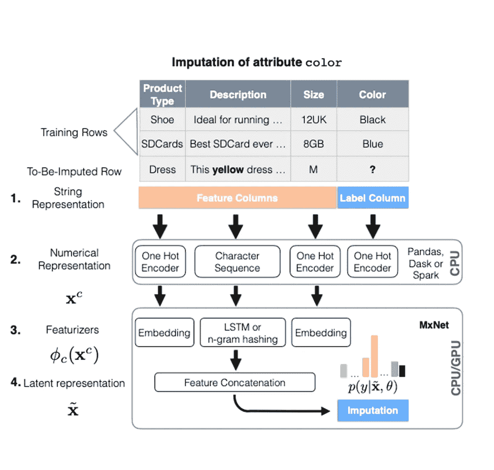
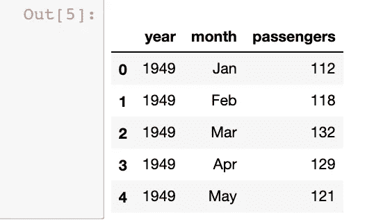
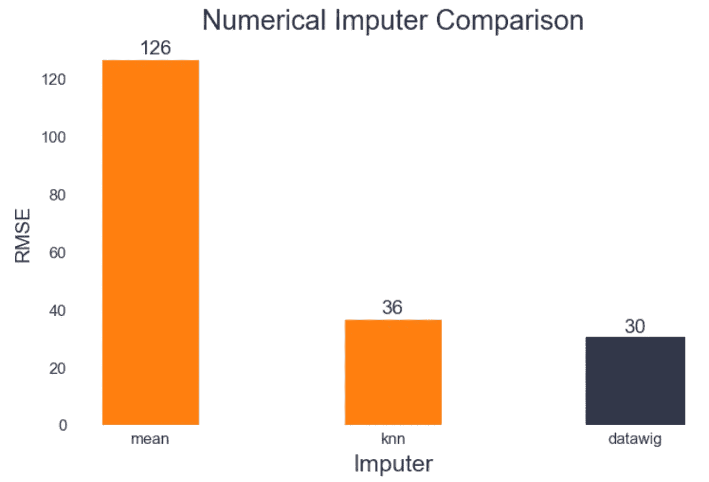
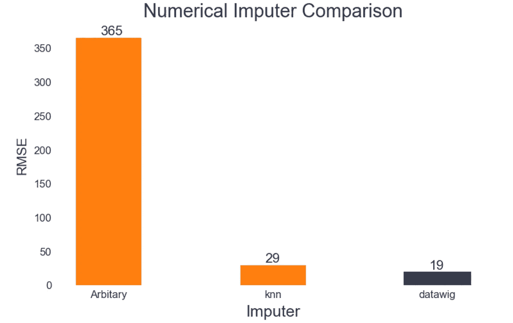

# 用 DataWig 智能输入缺失值

> 原文：<https://medium.com/analytics-vidhya/imputing-missing-values-smartly-with-datawig-f2f6b4a07c27?source=collection_archive---------0----------------------->


艾米丽·莫特在 [Unsplash](https://unsplash.com?utm_source=medium&utm_medium=referral) 上的照片

数据，尤其是高质量的数据(以及其他东西)，在机器学习模型的成功中起着关键作用。不幸的是，真实世界的数据集远非完美，并且经常被噪声和缺失值所污染。尤其是缺少值可能会有问题。将它们一起删除会产生更小的数据集-当数据集很小时，这不是理想的情况。而且，即使你试图填补那些烦人的*、*的数据，估算的数据也不一定能代表缺失的数据。


这就是 DataWig 的用武之地。正如你可能已经猜到的名字，这是一个假发的秃头补丁在您的数据。看，虽然有很多方法来估算你的数据，但 DataWig 是最重要的。

我们将首先了解什么是 DataWig 以及它是如何工作的，然后我们将它与一些最流行的方法进行比较，看看它的性能如何。

DataWig 是大约 3 年前由 AWS 实验室开发的。它试图理解你的数据，并使用这种学习做插补。因此，如果您有 3 列—‘X’、‘Y’和‘Z’—并且我们想要估算‘Z’，DataWig 会学习其他两列的内容来施展它的魔法。

DataWig 支持分类列和数字列的插补。许多插补方法仅适用于数值插补，而那些适用于[分类的方法在生产中并不那么好或可伸缩](https://dl.acm.org/doi/pdf/10.1145/3269206.3272005)。因此，当您想要估算分类列时，这变得非常有用。

让我们更深入地了解一下 DataWig 是如何工作的。这是基于它的[研究论文](https://dl.acm.org/doi/pdf/10.1145/3269206.3272005)，所以如果你不想进入技术细节，请随意跳到下一节如何使用它。虽然我建议你读这一部分，但在我看来它非常有趣。



该图像显示了几列，其中列“颜色”是要估算的。DataWig 首先确定每个列的类型。之后，每一列都被转换成数字表示(以便机器理解)。分类列是热编码的，而顺序(文本)列则根据字符串的长度和字符转换成序列。接下来是最重要的一步——特色化。独热编码数据通过嵌入层传递，而顺序数据通过 LSTM 层传递，或者在其上进行 n-gram 散列。最后，所有特征被合并并通过逻辑层(因为“颜色”是分类的)进行插补。

这就是理论，让我们看看如何使用 DataWig。它可以作为 Python 包安装。

```
pip install datawig
```

注意:当我最后一次尝试时，有一个关于依赖项的安装问题。查看这个[链接](https://github.com/awslabs/datawig/issues/121)，将' == '替换为'> = '以获得依赖关系。

使用 DataWig 也非常简单。它提供了两种类型的估算器——简单估算器和估算器。当你不关心 DataWig 如何工作时，使用 SimpleImputer。但是如果你想根据你的需求定制工作，使用估算器。例如，您可以选择是否要使用 LSTM 或 n-gram 散列进行特征化。两个估算器都带有易于使用的 fit()和 predict()方法(类似于 sklearn)。下面我们会做一些编码，你会了解更多关于这些功能。但是如果你想成为一个数据怪才，参考他们的[文档](https://datawig.readthedocs.io/en/latest/)。

**实用**

让我们从例子开始。在这里，我们将使用 DataWig 进行数值插补，并将其与其他流行的方法进行比较。我们首先加载一个航班数据集，其中包含每个航班的字段- **年、月和乘客-** 。

```
import seaborn as sns
flights = sns.load_dataset("flights")
flights['month'] = flights['month'].astype(str)
flights['year'] = flights['year'].astype(str)flights.head()
```



让我们在*乘客*字段中随机选择一些单元格进行隐藏。

```
flights_train, flights_test = datawig.utils.random_split(flights)
```

现在是表演时间了。让我们使用 DataWig 来预测 flights_test 中的值。

```
imputer = datawig.SimpleImputer(
    input_columns=['year', 'month'],
    output_column='passengers'
    )imputer.fit(train_df = flights_train)imputed = imputer.predict(flights_test)
```

这里我们使用简单估算器。我们为它提供输入和输出列，使它适合训练数据，并预测测试中的缺失值。

我还比较了另外两种流行的方法——均值法和 KNN 插补法。这两种方法的代码可以在我的 GitHub 上找到。在使用这两种插补策略后，我将它们与 RMSE 度量的 DataWig 进行了比较。结果如下:



在这方面，DataWig 表现最好，紧随其后的是 KNN。

根据数据是随机缺失[还是非随机缺失](https://www.theanalysisfactor.com/mar-and-mcar-missing-data/)，估算器的性能也会有所不同。例如，均值插补假设数据随机缺失，而[任意值插补假设相反](https://heartbeat.fritz.ai/hands-on-with-feature-engineering-techniques-imputing-missing-values-6c22b49d4060)。所以我又用非随机缺失的数据做了一个对比。从我们的航班数据集中，我屏蔽了夏季的 5 月和 6 月，并将 DataWig 与 KNN 和任意值估算器进行了比较。



结果与我们之前观察到的相似，DataWig 名列前茅，KNN 紧随其后。仅供参考，仅仅因为任意值插补在这里表现不好，并不意味着你不应该尝试它。它的性能很大程度上取决于您选择的任意值，因此如果您碰巧选择了正确的值(但这有点靠运气)，您可能会得到好的结果。

在这本 [Jupyter 笔记本](https://github.com/anshbordia/DataWig-examples)中，我还比较了使用 DataWig 的分类插补和其他方法，如果你感兴趣的话，可以看看。需要记住的是，DataWig 或 KNN 等估算工具的一个缺点是，在处理大量分类和序列数据时，它们会很慢。在这种情况下，像最频繁或随机抽样插补这样的简单方法可能要快得多(但可能没有那么准确)。

作为一项有趣的活动，为了进一步了解 DataWig 有多好，为什么不使用[不同的技术](https://heartbeat.fritz.ai/hands-on-with-feature-engineering-techniques-imputing-missing-values-6c22b49d4060)估算您的数据，然后比较您用于预测的 ML 模型的性能；看到结果你会大吃一惊的。

感谢你阅读这篇文章，我希望你现在能更好地应对缺失的价值观。

