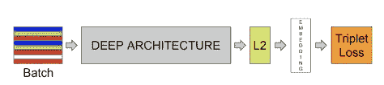
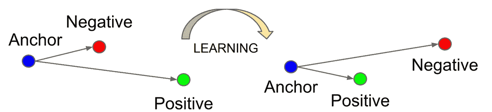

# 进出 FaceNet

> 原文：<https://medium.com/analytics-vidhya/in-and-out-of-facenet-41822ff6a87?source=collection_archive---------26----------------------->

面网模型

本文旨在对 FaceNet 人脸识别模型进行简单介绍。该模型的大部分术语和工作方式将在本文中解释。如果对更深入的分析感兴趣，链接部分提供了参考资料的链接。

**目标:**

嗯，facenet 的目标很容易理解，这是一个可以使用个人的面部识别和验证个人的模型，甚至可以执行聚类，即根据他们的面部找到普通人。

**方法:**

使用深度卷积神经网络来创建人脸图像的欧几里德嵌入，其中嵌入空间中学习到的[平方 L2 距离](https://www.google.com/search?q=squared+l2+distance&oq=squared+L2+distance&aqs=chrome.0.35i39i457.980j0j7&sourceid=chrome&ie=UTF-8)告诉我们一张脸与另一张脸有多相似。简单来说，我们希望使用深度卷积神经网络将人脸图像转换为 n 维向量(嵌入)，当在 n 维空间上绘制这些嵌入时，我们应该能够分辨出，因为两个 n 维向量非常接近，所以那些嵌入的人脸图像有很大概率属于同一个人，如果相距更远，则人脸图像属于不同的人。这样一来，人脸识别就变成了一个分类问题和/或聚类问题。这完全取决于手头的任务。

**深度卷积神经网络架构:**

facenet 使用的深度卷积网络是两种架构的结合。第一种架构由多个“交错”卷积层、非线性激活、局部响应标准化层和最大池层的混合组成。添加了几个 1x1xd 卷积来解决图像通过网络时增加特征图的问题，1x1xd 通过减少特征图来解决这个问题(这有点类似于降维)。“d”是图像上使用的数字过滤器。第二种架构基于初始模型，该模型是一个混合了多个并行卷积层和池层的网络，其输出是来自所有并行层的响应的串联。从[研究论文](https://arxiv.org/abs/1503.03832)中可以看出，这样做的好处是它将参数减少了 20 倍，并且有可能减少同等性能所需的触发器。

每秒浮点运算次数。

flops 衡量计算机性能，在需要浮点计算的科学计算领域非常有用。

使用具有标准反向投影和 Adagrad 的随机梯度下降来训练 CNN 模型。

Adagrad 是一种用于自适应学习速率的随机梯度下降优化方法。更多关于 Adagrad 的信息可以在链接部分找到。

**三重丢失:**

对于三重缺失，你需要理解锚、积极和消极的概念。所以问题是这样的…什么是锚，什么是积极的，什么是消极的？嗯，三联功能由三个缩略图组成，两个相同的缩略图和一个不相同的缩略图。两个相同的缩略图中的一个是锚，而另一个是正的，不相同的是负的。在训练 CNN 网络时，损失函数试图最小化相同缩略图(锚点和正片)之间的距离，同时试图增加锚点和负片(两个不同缩略图)之间的距离。

值得注意的是，损失函数(三重损失)使用 128-D 嵌入的卷积神经网络的输出，因此两个相同的嵌入被表示为相同的缩略图，而不相同的嵌入被表示为不相同的缩略图。

缩略图是紧密贴合的面部图像。

现在，三元组(嵌入)是如何选择的？这都要归功于球形集群。简而言之，利用球形聚类，所有向量都被归一化，然后余弦相似性被用于测量这些归一化向量之间的距离。

在更复杂的词语中，三重损失将图像 *x* 嵌入到 d 维欧几里得空间中，在最近邻域分类的上下文中，我们试图使人“A”的图像更接近人“A”的所有其他图像，同时增加人“A”的图像到人“A”的所有其他非图像的距离。正如在[的论文](https://arxiv.org/abs/1503.03832)中所指出的，为了保持嵌入在 d 维超球面上，做了额外的约束。n 超球(或 n 球)是称为 2 球的圆的推广。正球面称为三维球面(这些术语是几何学家使用的)。

**嵌入维度:**

在创建 facenet 模型时使用了各种嵌入，但产生最佳结果的嵌入是 128-D，以下是所使用的嵌入的结果及其结果:64，128，256，512，精度分别为 86.8%，87.9%，87.7%，85.6%正负 1.7，1.9，1.9，2.0。

至此，我希望您已经对 FaceNet 人脸识别模型有了一些了解。

链接:

 [## FaceNet:人脸识别和聚类的统一嵌入

### 尽管最近在人脸识别领域取得了重大进展，但实现人脸验证和识别…

arxiv.org](https://arxiv.org/abs/1503.03832)  [## 三重态损失的直觉

### 了解如何在 great FaceNet 人脸识别模型中计算损失的本质。

medium.com](/analytics-vidhya/triplet-loss-b9da35be21b8)  [## 超球面

### 超球(通常简称为球)是圆(几何学家称之为二维球)的推广…

mathworld.wolfram.com](https://mathworld.wolfram.com/Hypersphere.html)  [## 初始网络版本的简单指南

### 初始网络是 CNN 分类器发展的一个重要里程碑。在其开始之前(双关语…

towardsdatascience.com](https://towardsdatascience.com/a-simple-guide-to-the-versions-of-the-inception-network-7fc52b863202)  [## 为深度学习可视化过滤器和特征图

### 深度神经网络是最强大的机器学习模型之一。有了足够的数据，他们在…

towardsdatascience.com](https://towardsdatascience.com/visualising-filters-and-feature-maps-for-deep-learning-d814e13bd671)  [## 局部响应标准化和批量标准化的区别

### 深度神经网络中使用的不同规范化技术的简短教程。

towardsdatascience.com](https://towardsdatascience.com/difference-between-local-response-normalization-and-batch-normalization-272308c034ac)  [## 深度神经网络中使用卷积 1x1 是出于什么原因？

### 你可以把 1x1xD 卷积当作一种降维技术，当它放在一个…

stackoverflow.com](https://stackoverflow.com/questions/39366271/for-what-reason-convolution-1x1-is-used-in-deep-neural-networks)  [## 管理模型复杂性的 1×1 卷积简介-机器学习掌握

### 池化可用于对特征地图的内容进行下采样，减少其宽度和高度，同时保持…

machinelearningmastery.com](https://machinelearningmastery.com/introduction-to-1x1-convolutions-to-reduce-the-complexity-of-convolutional-neural-networks/)  [## 随机梯度下降——解释清楚！！

### 随机梯度下降是各种机器学习算法中非常流行和常用的算法，大多数…

towardsdatascience.com](https://towardsdatascience.com/stochastic-gradient-descent-clearly-explained-53d239905d31)  [## 阿达格勒简介

### 我们已经在前两篇文章中讨论了几种算法，并且有一个超级参数在所有算法中使用…

medium.com](/konvergen/an-introduction-to-adagrad-f130ae871827)  [## 有代码的文件——阿达格拉德解释道

### AdaGrad 是一种随机优化方法，它使学习速率适应参数。它表现得更小…

paperswithcode.com](https://paperswithcode.com/method/adagrad)