# 深度主成分分析

> 原文：<https://medium.com/analytics-vidhya/in-depth-principal-component-analysis-3052479f5484?source=collection_archive---------6----------------------->

主成分分析或 PCA 是一种无监督的学习方法，用于降维。在这篇博客中，我们将深入了解它，并学习如何使用它。

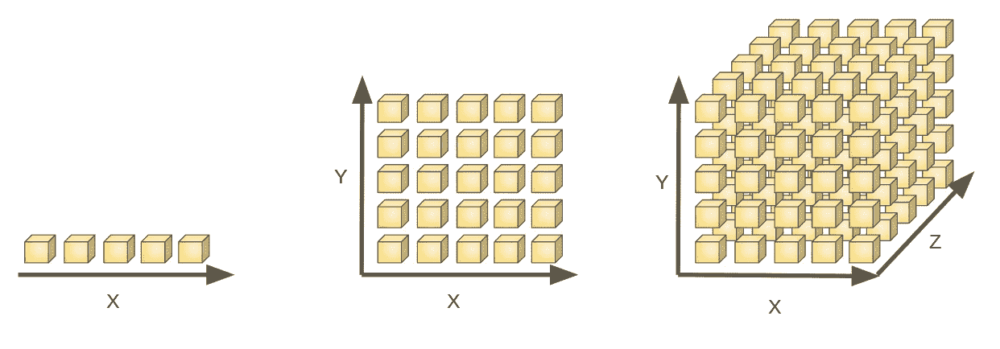

可视化维度的诅咒。维数越高，处理难度越大。参考文献[1]

**了解 PCA 的先决条件:**

你需要知道什么是协方差矩阵，什么是特征值

以及特征向量来理解 PCA 的概念。

**本博客内容:**

1.  对认证后活动的需求
2.  什么是 PCA？
3.  PCA 背后的数学
4.  使用 scikit-learn 在 Python 中实现。

# 对认证后活动的需求:

当我们拥有大量数据集时，机器学习模型的工作令人惊讶，因为根据经验，拥有大量数据可以让我们建立更好的预测模型。但是，拥有高维(或拥有大量特征)数据会带来自身的问题。最大的缺点是维数灾难。由于特征的不一致性，高维数据很难处理，这将增加我们的计算时间，并使数据处理和 EDA 难以进行。

高维数据集在图像处理、自然语言处理等领域非常常见。因此，减少维数对于提高机器学习模型的性能至关重要。有各种技术可以做到这一点。在本文中，我们将学习一种叫做 PCA 的技术。

# 什么是 PCA:

PCA 是一种维度技术，它使我们能够识别数据集中的相关性和模式，以便可以将其转换为低维数据集，同时保留重要信息。换句话说，PCA 帮助我们提取包含更多信息的特征集，并从数据集中移除高度相关的特征。例如，在一个图像处理问题中，使用 PCA，我们可以将 100 维的数据集减少到 20 维，同时保留 80%的信息。

# 理解 PCA 背后的数学:

现在，我们已经正式理解了 PCA 的定义，让我们来理解 PCA 在数学上是如何执行的。

PCA 中遵循的步骤是

1.  标准化数据
2.  计算协方差矩阵
3.  计算特征值和特征向量
4.  计算主成分
5.  减少维度的数量

**第一步:标准化数据:**

考虑一个电影数据集，从中提取两个特征，如下所示:

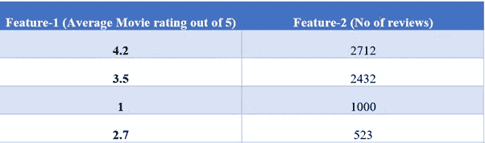

用于说明的数据集

如果我们按原样将数据提供给机器学习模型，该模型将偏向特征 2，因为它具有更高的值和更大的值范围。因此，我们需要使数据标准化。为此，我们使用以下公式:

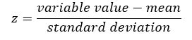

现在我们有了标准化的值，让我们继续下一步。

**第二步:计算协方差矩阵:**

协方差矩阵为我们提供了数据集变量之间的相关性。它有助于我们识别高度相关的特征，这些特征彼此高度依赖，因此包含使 ML 模型的性能恶化的冗余信息。

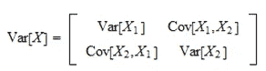

协方差矩阵。图像参考[2]

协方差矩阵的重要要点是，协方差值表示–

*1。两个变量有多相关。*

*2。负协方差表示成反比*

*3。正协方差-正比。*

**第三步。计算特征值和特征向量:**

这一步解释了主成分分析的要点。

这里，我们从协方差矩阵计算特征值和相应的特征向量。这一步骤背后的主要思想是理解数据中的方差。众所周知，数据中的差异越大，意味着信息越多。所以，特征向量和特征值帮助我们找出数据在哪个方向有最大的方差。

利用它们，我们可以找出数据的主要成分。主成分是从原始变量集中获得的一组新变量。这些组件压缩并拥有大部分有用的信息。为了理解如何提取主成分，我们进入下一步。

**第四步。计算主成分:**

现在，在我们已经计算了特征值和特征向量之后，我们将按照特征值的降序排列它们，因为具有最高特征值的特征向量是最重要的，并且形成第一主分量。

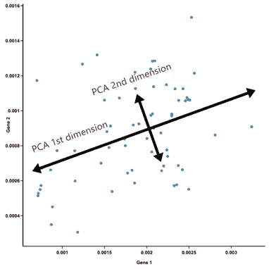

主要成分。图像参考文献[3]

如图所示，基因 1 和基因 2 是原始变量集，我们从中提取一组新的变量。因此，PCA 第一维具有最高的方差，PCA 第二维垂直于 PC1 并且具有第二高的方差，因此保留了最大的剩余信息。

**第五步。减少数据集的维度:**

这是我们用代表最重要信息的最终主成分重新排列数据集的最后一步。

# 使用 Python 实现 PCA

我们将以图像处理数据集为例。

*a .导入数据集*

我们将使用 scikit-learn 库提供的标准图像数据集(在 Wild face dataset 中标记为 Faces)。首先，按如下方式导入所有必需的库，并提取数据集:

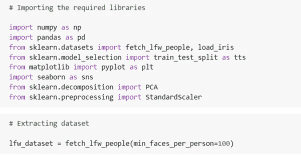

数据集有 1140 行或数据点和 2914 个要素。因此，这是一个很好的 PCA 图解数据集。

*b .准备数据集:*

我们现在将特征和目标变量分开，以便进一步处理

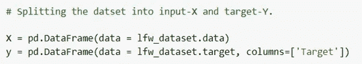

最后，在进行 PCA 之前，我们将使用测试大小= 0.30 的测试序列分割来分割数据集

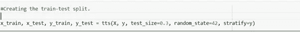

*c .应用 PCA:*

首先标准化数据集:

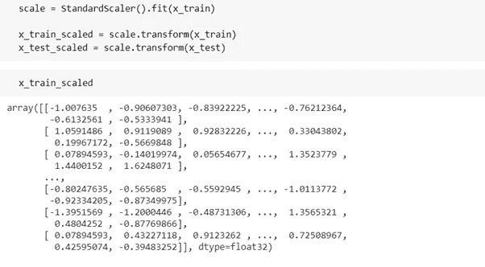

在应用 PCA 之前，我们的数据集中有 2914 个特征。现在，我们将使用 scikit-learn 库应用 PCA，并将其缩减为 100 维数据集。

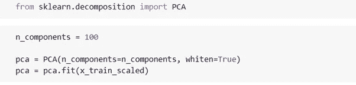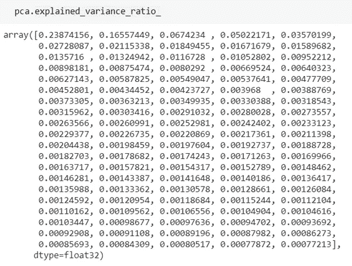

从上面的片段中，我们可以看到方差比率是递减的。现在，我们将最终把我们的数据集转换成一个简化的熊猫数据框架。

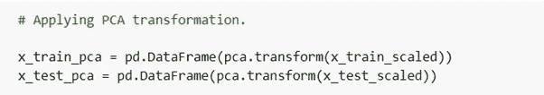

现在，精简的数据集已准备好输入到我们的机器学习模型中。

*d .替代方法(应用主成分分析法减少维度以保留一定的方差百分比)*

我们还可以使用主成分分析来减少表示方差(或信息)的给定百分比(比如 80%)的维数。

让我们实现 PCA 来保留 80%的方差:

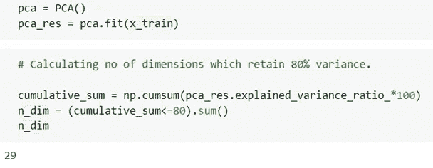

正如我们在上图中看到的，数据集将给出代表 80%数据集的维数，在我们的例子中是 29。为了更好地理解，让我们绘制保留方差与维数的关系图。

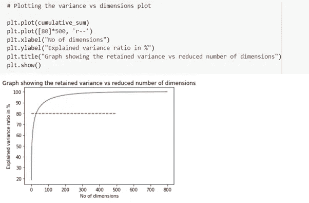

我们可以观察到初始成分包含更多的信息，而后面的主成分不包含太多的信息。

现在，最后，我们将转换数据集并减少维数。

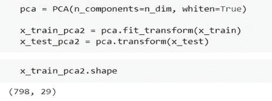

如果你想看工作代码，请[点击这里](https://colab.research.google.com/drive/1ueXRLGgzuTKEbvv28drSun8gJLVoE2d-?usp=sharing)打开 colab 笔记本。

感谢你的耐心和阅读我的文章，我希望它给了你一些知识。如果你想联系我，你可以通过 [LinkedIn](https://www.linkedin.com/in/hrushikesh-shelar/) 联系我

图像参考:

[1][https://www . I2 tutorials . com/what-do-you-mean-by-curse-of-dimensionality-the-different-way-to-deal-it/](https://www.i2tutorials.com/what-do-you-mean-by-curse-of-dimensionality-what-are-the-different-ways-to-deal-with-it/)

[2][https://www . stat lect . com/fundamentals-of-probability/协方差矩阵](https://www.statlect.com/fundamentals-of-probability/covariance-matrix)

[3][https://blog . bio turing . com/2018/06/14/principal-component-analysis-explained-simplely/](https://blog.bioturing.com/2018/06/14/principal-component-analysis-explained-simply/)