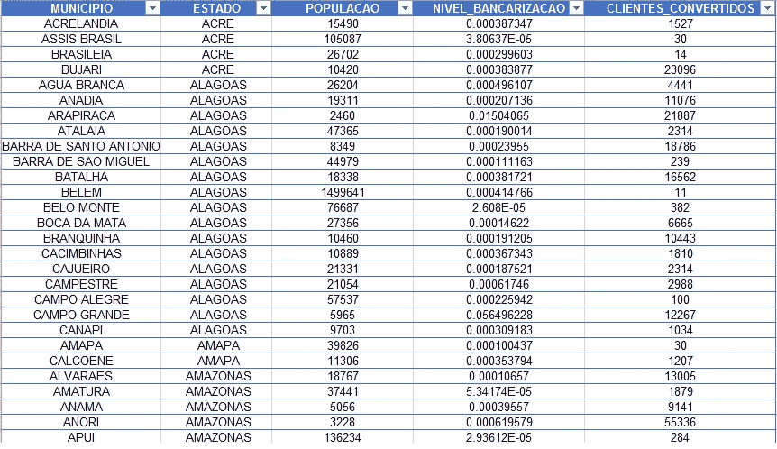

# 集客营销

> 原文：<https://medium.com/analytics-vidhya/inbound-marketing-e7b32eef8212?source=collection_archive---------25----------------------->

该分析的数据库由一家技术公司提供。使用 R 编程进行整个分析，并分析了 6 个变量的 5570 个观察值。

要了解更多信息:

[](https://github.com/rachderossi/data-analysis-R) [## GitHub-rachderossi/data-analysis-R:用 R 做的项目。

### 该数据集包含约 2，240 名联系过的客户的社会人口统计和公司地理特征…

github.com](https://github.com/rachderossi/data-analysis-R) 

一种新的创新产品即将推出，这种产品将帮助人们通过智能手机获得银行服务。目标是在巴西最没有烧烤的城市中转化 1000 名顾客。

确定活动城市的行动:

1.  根据银行业水平对巴西城市进行分类。
2.  估计每个城市转化的客户数量。

最终数据库应包含:

*   城市名称
*   状态
*   人口
*   银行业水平
*   转化的客户


我知道罗斯，有很多事要做！！

我在 R 中创建了一个名为 join_table 的文件，在这个文件中，我连接了按自治市分组的 POSTOS、PAE、AGENCIES 数据库，以便在一个表中包含分行数量+服务点数量+电子服务点数量的总和。

```
# group by municipio
library(dplyr)
tabela_eletronico <- dados_eletronico %>%
                     group_by(MUNICIPIO) %>%
                     count()
tabela_postos <- dados_postos %>%
                 group_by(MUNICIPIO) %>%
                 count()
tabela_agencias <- dados_agencias %>%
                   group_by(MUNICIPIO) %>%
                   count()
# join table
library(data.table)
nova_tabela <- rbindlist(list(tabela_agencias,tabela_eletronico,
               tabela_postos), fill = FALSE) 
tabela_final <- aggregate(. ~MUNICIPIO, data = nova_tabela,
                 FUN = sum)

# transform into excel file
library(xlsx)
write.xlsx(tabela_final, "freq_municipio.xls")
```

我在 R 中创建了另一个名为 bank_level 的文件，在那里我加入了按自治市分组的 freq_municipio、pop 和 IDHM 数据库。在进行分组之前，我必须将所有的城市用大写字母标出，并且不带重音符号，因为基数来自不同的地方，所以我必须将一切标准化。

```
library(tidyverse)
library(magrittr)

# convert to uppercase
populacao %<>% 
mutate_if(is.character, toupper)
IDHM %<>% 
mutate_if(is.character, toupper)

# function to remove string accents
RemoveAcentos <- function(textoComAcentos) {

 if(!is.character(textoComAcentos)){
 on.exit()
 }

 letrasComAcentos <- "áéíóúÁÉÍÓÚýÝàèìòùÀÈÌÒÙâêîôûÂÊÎÔÛãõÃÕñÑäëïöüÄËÏÖÜÿçÇ´`^~¨"

 letrasSemAcentos <- "aeiouAEIOUyYaeiouAEIOUaeiouAEIOUaoAOnNaeiouAEIOUycC "

 textoSemAcentos <- chartr(
 old = letrasComAcentos,
 new = letrasSemAcentos,
 x = textoComAcentos
 )
return(textoSemAcentos)
}

# drop accents
populacao %<>% 
mutate_if(is.character, RemoveAcentos)
IDHM %<>% 
mutate_if(is.character, RemoveAcentos)
```

分组后，我创建了一个名为银行级别的新变量，然后创建了一个包含变量的表:自治市、州、人口、银行级别和 IDHM。最后，我选择了 1000 个最没有烧烤的城市，并按升序排列。

```
# join databases through common municipalities
nova_tabela<- inner_join(freq_municipio,populacao,
              IDHM,by="MUNICIPIO")

# creating banking level
nivel_bancarizacao = (nova_tabela$n)/(nova_tabela$POPULACAO)
round(nivel_bancarizacao, digits = 5)
nivel_bancarizacao <- data.table(MUNICIPIO = nova_tabela$MUNICIPIO,
                                 ESTADO = nova_tabela$ESTADO,
                                 POPULACAO =nova_tabela$POPULACAO,
                                 BANCARIZACAO = nivel_bancarizacao,
                                 IDHM = IDHM$IDHM)

# selecting the 1000 most unbanked cities
tabela_final <- arrange(nivel_bancarizacao,sort(BANCARIZACAO))
tabela_final[order(tabela_final)]
cidades <- tabela_final[1:1000,]
# transform into excel file
write.xlsx(cidades, "nivel_bancarizacao.xls")
```

R 中最后一个名为 prob_inbound 的文件使用了 bank_level 表，该表包含了了解转换概率所需的所有变量。在我为后付费手机创建了州电话密度变量、城市人口调整系数和转换概率(百分比)之后。

```
# state teledensity of postpaid cell phones
teledensidade_estad <- (nivel_bancarizacao$POS_PAGOS)/
                       (nivel_bancarizacao$POPULACAO)
round(teledensidade_estad, digits = 4)

# municipal population adjustment coefficient
CP <- ifelse(nivel_bancarizacao$POPULACAO < 5000, 5,
             ifelse(nivel_bancarizacao$POPULACAO > 5000 & nivel_bancarizacao$POPULACAO <20000, 10,
                    ifelse(nivel_bancarizacao$POPULACAO > 20000 & nivel_bancarizacao$POPULACAO <100000, 15,
                           ifelse(nivel_bancarizacao$POPULACAO > 100000 & nivel_bancarizacao$POPULACAO <500000, 20,
                                  ifelse(nivel_bancarizacao$POPULACAO > 500000, 25, NA)))))

# conversion probability (in percent)
prob_conversao <- (nivel_bancarizacao$IDHM^CP)*(teledensidade_estad/1.5)*100
```

最后，我创建了感兴趣的变量，即转化客户的数量，创建了一个表，其中包含:自治市、州、人口、银行级别和转化客户。

```
# number of converted customers
clientes_conv <- (nivel_bancarizacao$POPULACAO*prob_conversao)/100
round(clientes_conv, digits = 1)
clientes_conv <- data.table(MUNICIPIO = nivel_bancarizacao$MUNICIPIO,
                            ESTADO = nivel_bancarizacao$ESTADO,
                            POPULACAO =nivel_bancarizacao$POPULACAO,
                            NIVEL_BANCARIZACAO = nivel_bancarizacao$BANCARIZACAO,
                            CLIENTES_CONVERTIDOS = clientes_conv)
```

名为 entrega.final 的 Excel 表包含实现目标所需的最少城市数列表以及每个城市的信息。



这个项目做起来很有趣，因为除了标准化变量和创建新的变量来解决问题之外，我还必须处理多个表。我希望你喜欢，看你对我的下一个故事！