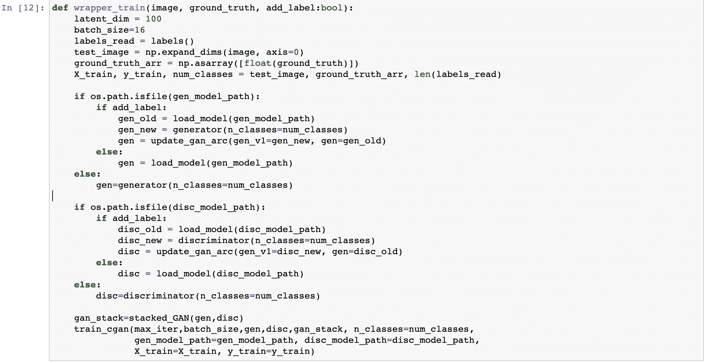
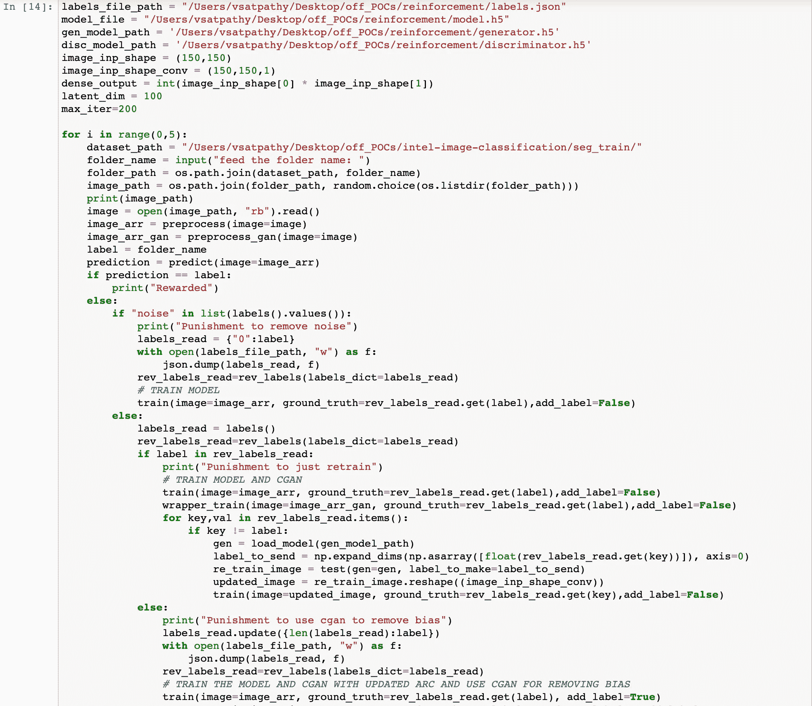
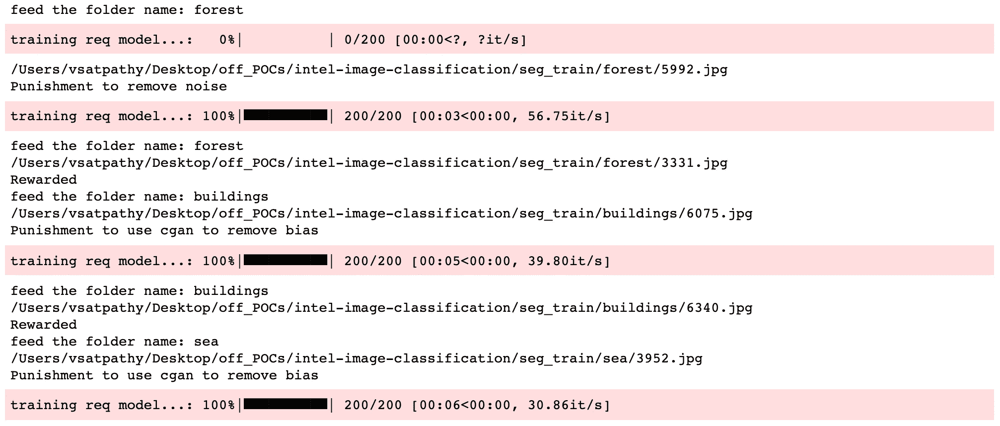

# 用于图像分类的增量和强化学习

> 原文：<https://medium.com/analytics-vidhya/incremental-and-reinforced-learning-for-image-classification-d02b7a6b7d07?source=collection_archive---------10----------------------->


# 介绍

深度学习今天面临的最大挑战之一是在不改变架构或存储先前数据集的情况下，向神经模型添加新标签。这些问题通常围绕这样一个事实:随着时间的推移存储数据会导致系统内存膨胀，并且还会显著增加训练时间。至于神经架构，它几乎是在训练的第一阶段定义的，或者我们可以称之为零模型，在添加新标签的同时使用以前的学习实际上是不可能的。

我们通常采用的解决方案是迁移学习，这有助于我们使用已训练模型的权重和偏差，并使用它来训练定制模型，这里的问题是，以前的标签不会结转。因此，要么我们需要系统被训练过的所有数据，要么我们需要现成的东西。

这就是在具有混合神经架构的修改系统中的增量学习可以帮助我们获得期望结果的地方，而不损害准确性，或者不需要大量数据。

> 如果我告诉你，我们打算从这篇文章中学习的不仅仅是增量学习，而是动态地将新数据和标签强化到系统中。
> 
> ***如果不需要海量数据来训练一个模型呢？梦想成真？***

不要浪费太多时间，让我们开始吧。**你可以在这里** **找到右** [**下面的代码。**](https://github.com/vaibhavsatpathy/incremental-reinforcement-learning)

下面的步骤提到了必要的代码片段和对各个功能需求的解释。

## 1.导入所有必需的库

```
import tensorflow as tf
from tensorflow.keras.layers import Input, Conv2D, Dense, MaxPooling2D, Flatten, BatchNormalization, Reshape, LeakyReLU, multiply, Embedding, UpSampling2D, Dropout
from tensorflow.keras.models import Model, load_model, Sequential
from tensorflow.keras.optimizers import Adam
from tensorflow.keras.preprocessing.sequence import pad_sequencesimport os
import numpy as np
import json
import cv2
import matplotlib.pyplot as plt
import random
from tqdm import tqdm
```

## 2.我们为测试目的定义了一个非常简单的架构。您可以构建自己的定制架构来满足您的需求。

```
def req_model(no_of_labels):
    input_layer = Input(shape=image_inp_shape_conv)
    conv_1 = Conv2D(filters=64, kernel_size=(2,2),activation='relu', padding='same')(input_layer)
    flatten_1 = Flatten()(conv_1)
    out_layer = Dense(no_of_labels, activation="softmax")(flatten_1)

    model = Model(input_layer, out_layer)
    model.compile(optimizer='adam', loss='sparse_categorical_crossentropy', metrics=['accuracy'])
    return model
```

## 3.创建一个基本的函数来跟踪你的标签，并根据需要对文件进行必要的更新。

```
def labels():
    if os.path.isfile(labels_file_path):
        labels_file = open(labels_file_path, "r")
        labels = json.load(labels_file)
    else:
        labels_dict = {0:"noise"}
        with open(labels_file_path, "w") as f:
            json.dump(labels_dict, f)
        labels = labels_dict
    return labels
```

## 4.对于一个简单的图像分类类型问题，我们不要创建任何花哨的预处理。如果需要，您可以创建自己的定制预处理管道并替换现有管道。

```
def preprocess(image):
    image_arr = cv2.imdecode(np.frombuffer(image, np.uint8), -1)
    image_processed = cv2.resize(image_arr, image_inp_shape)
    image_processed = cv2.cvtColor(image_processed, cv2.COLOR_BGR2GRAY)
    image_processed = (image_processed) / 255.0
    return image_processeddef preprocess_gan(image):
    image_arr = cv2.imdecode(np.frombuffer(image, np.uint8), -1)
    image_processed = cv2.resize(image_arr, image_inp_shape)
    image_processed = cv2.cvtColor(image_processed, cv2.COLOR_BGR2GRAY).reshape((dense_output,))
    image_processed = (image_processed) / 255.0
    return image_processed
```

## 5.为您的用户创建一个能够利用该模型的预测函数。

```
def predict(image):
    labels_read = labels()
    if os.path.isfile(model_file):
        model = load_model(model_file)
    else:
        model = req_model(no_of_labels=len(labels_read))
    test_image = np.expand_dims(image, axis=0)
    results = model.predict(test_image)
    predicted_label = labels_read.get(str(np.argmax(results[0])))
    return predicted_label
```

## 6.现在是具有挑战性的部分。本质上，我们需要在下一个函数中写的是能够改变神经架构的权重和偏差的 NumPy 数组。

对于要添加到系统中的新标签，神经模型的最后一层需要具有额外的元素来适应改变。与此同时，模型先前的权重需要带入网络的更新形状中。

如您所见，GAN 模型也有一个更新的脚本。不要担心，我们将在后面的步骤中谈到这一点。

## 7.为模型创建一个训练脚本。

```
def train(image, ground_truth, add_label:bool):
    labels_read = labels()
    if os.path.isfile(model_file):
        if add_label:
            model_old = load_model(model_file)
            model_new = req_model(no_of_labels=len(labels_read))
            model = update_model_arc(model_v1=model_new, model=model_old)
        else:
            model = load_model(model_file)
    else:
        model = req_model(no_of_labels=len(labels_read))
    test_image = np.expand_dims(image, axis=0)
    ground_truth_arr = np.asarray([float(ground_truth)])
    for i in tqdm(range(0,max_iter), desc="training req model..."):
        history = model.train_on_batch(test_image,ground_truth_arr)
    model.save("model.h5")
```

## 8.创建 GAN 模型架构。

在我们进一步处理之前，让我们讨论同样的需要。为了训练和验证的目的，可以通过输入用户在测试系统时上传的样本来增强系统。问题是，当向系统显示太多新标签样本用于训练时，会发生什么。

在一条直线上——这会在系统中产生偏差。为了避免这种情况，我们可以使用有条件的 GAN，它本质上为所有已经在系统中训练过的标签创建虚拟数据，并将最新的用户数据与其一起传递。

从而在系统被训练的样本或种类的数量上建立平衡。

## 9.现在让我们创建训练和更新模型所需的包装函数。

> ***CGAN 的训练和使用是可选的。为了获得立竿见影的效果，避免使用 CGAN 进行培训，并注释掉相同的培训管道。***



## 10.保存标签，以便它们可以重新用于预测和强化。

```
def rev_labels(labels_dict):
    rev_labels_read = {}
    for key,val in labels_dict.items():
        rev_labels_read[val] = key
    return rev_labels_read
```

## 11.现在我们需要做的就是编译所有的东西并创建可能的场景。

场景 1-您的模型第一次接受训练。
场景 2 —您的模型已经过训练，但由于预测错误而需要更新
场景 3 —您的模型已经在某些标签上进行了训练，现在需要添加一个新标签。



## 12.最后，让我们看看大量编码的结果。



有了这个，你将能够在不需要存储大量数据的情况下训练图像分类模型。当有大量用户使用这种系统并希望随着时间的推移获得更高的准确性时，这种系统可以证明是非常高效的。

相同的架构可以调整并用于各种用例，如情感分析、文档分类、声音分析等。

我希望本教程能帮助你开发突破性的技术。

谢谢你…

# 作者


最简单的描述我的方式是技术爱好者。我有一颗非常好奇的心，善于修补趋势技术，并通过尝试从不同的角度可视化问题来解决现实世界的问题。最后但同样重要的是，在一天结束的时候，我真的希望我的工作能对社会的进步产生建设性的影响。

您也可以在我们的移动应用程序上阅读这篇文章。

*原载于 2021 年 2 月 27 日 https://www.analyticsvidhya.com**[*。*](https://www.analyticsvidhya.com/blog/2021/02/incremental-and-reinforced-learning-for-image-classification/)*