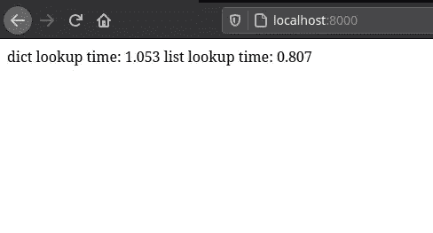
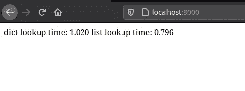
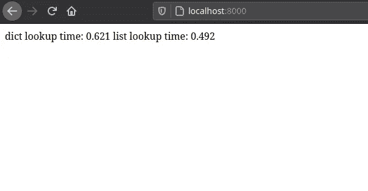
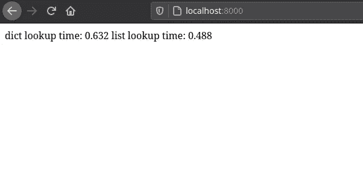
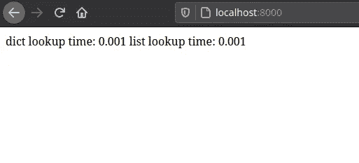
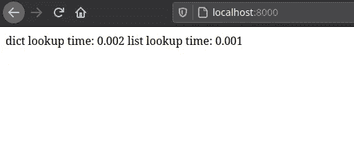

# 在 Django 和 PostgreSQL 中索引 JsonField

> 原文：<https://medium.com/analytics-vidhya/indexing-jsonfield-in-django-and-postgresql-89b7571df830?source=collection_archive---------7----------------------->

几天前，我们接到了市场部的一个任务，为了执行这个任务，我们需要存储一些特定的数据，因为这些数据没有任何方案，除了一个端点之外，我们没有对其进行查询，所以我们决定使用 django 的 JsonField。但是对于技术团队来说，在 JsonField 上查询大量数据的性能是有疑问的，所以我们在 django 中创建了一个样本项目来测试查询 Jsonfield。

*该项目的全部代码可在* [*github*](https://github.com/abtinmo/django_jsonfield_index) *上获得。*

要阅读本文，您需要对 django 和命令行环境有一个基本的了解。

首先我们要安装 django 和 postgres 适配器

```
pip install django psycopg2-binary
```

然后创建一个 django 项目，名为 jstest(智能名称:)

```
django-admin startproject jstest
cd jstest 
python3 manage.py migrate
```

为了创建端点，我们将启动一个新的 django 应用程序

```
python3 manage.py startapp testapp
```

现在让我们去改变代码。
在 **jstest/settings.py** 中，我们将新的应用程序添加到 INSTALLED_APPS 中，并将数据库更改为 postgres

```
INSTALLED_APPS = [
 …
 ‘testapp’,
 ]

 DATABASES = {
 ‘default’: {
 ‘ENGINE’: ‘django.db.backends.postgresql_psycopg2’,
 ‘NAME’: ‘YOUR_DB_NAME’,
 ‘USER’: ‘YOUR_DB_USER’,
 ‘PASSWORD’: ‘YOUR_DB_PASSWORD’,
 ‘HOST’: ‘localhost’,
 ‘PORT’: ‘’,
 }
}
```

在 **testapp/models.py** 中，我们添加了以下模型:

```
from django.db import models
from django.utils import timezone

class Product(models.Model):
    name = models.CharField(max_length=20)
    attributes = models.JSONField()
    create_date = models.DateTimeField(default=timezone.now)
```

最后迁移变更:

```
python3 manage.py makemigrations
python3 manage.py migrate
```

现在，为了测试查询速度，我们需要向 product 表中添加虚拟数据，出于测试目的，我们向表中写入了 2 百万行。
如果您正在使用我的代码，您可以运行以下命令:

```
python3 manage.py create_sample_data
```

如果没有，这个函数会为您创建一个样本数据

```
from itertools import islice
from testapp.models import Product

 batch_size = 5000
 objs = (
     Product(
         name=’product No.%s’ % i,
         attributes={“name”: i, “values”: [i, i + 1]},
     ) for i in range(2_000_000)
 )
 while True:
     batch = list(islice(objs, batch_size))
     if not batch:
         break
     Product.objects.bulk_create(batch, batch_size)
```

属性字段中存储的数据如下:

```
{
 “name”: 1,
 “values”: [1,2]
 }
```

现在让我们实现查询速度的端点…
添加以下代码到 **testapp/views.py** ，我稍后会解释

```
from .models import Product
from django.db import connection
from django.http import HttpResponse
from random import randrange

def product_view(request):
    rand_num = randrange(0, 2_000_000)
    _ = Product.objects.get(attributes__name=rand_num)
    dict_lookup_time = connection.queries[-1][“time”]
    _ = Product.objects.get(
    attributes__values__contains=[rand_num, rand_num + 1],
    )
    list_lookup_time = connection.queries[-1][“time”]
    return HttpResponse(
        f”dict lookup time: {dict_lookup_time} “
        f”list lookup time: {list_lookup_time}”
    )
```

我们想要基于“名称”和“值”键查询 JsonField，首先我们生成一个随机数，然后用这个随机数进行查询。

```
rand_num = randrange(0, 2_000_000)Product.objects.get(attributes__name=rand_num)
# search value of “name”
Product.objects.get(attributes__values__contains=[rand_num, rand_num + 1])
#search in value of “values”
```

通过这段代码，我们可以知道最后一次查询花费了多少时间。

```
connection.queries[-1][“time”]
```

将下面的代码添加到 **jstest/urls.py** 中，我们就完成了 django。

```
from django.contrib import admin
from django.urls import path
from testapp.views import product_view

urlpatterns = [
    path(‘admin/’, admin.site.urls),
    path(‘’, product_view),
]
```

使用以下命令启动项目，并在浏览器中打开 [localhost:8000](http://localhost:8000) 。

```
python3 manage.py runserver
```

现在，您可能会看到类似这样的内容:



对于一个没有负载的项目来说，1 秒是不可接受的时间，所以让我们来修正它。
为了减少查询时间，我们给属性字段添加了一个索引:

```
CREATE INDEX JsonFieldIndex ON testapp_product USING GIN(attributes jsonb_path_ops);
```

现在让我们刷新网页，看看是否有什么不同



不错，这是以前时间的一半，但对于一个没有负载的项目来说还是太长了。

现在我们为“name”和“values”创建两个独立的索引，因为我们知道一个是数组，另一个是整数。

第一次删除前一个索引

```
drop index JsonFieldIndex;
```

然后创建新的索引

```
CREATE INDEX JsonFieldIndexList ON testapp_product USING GIN((attributes->’values’) jsonb_path_ops);CREATE INDEX JsonFieldIndex ON testapp_product USING HASH((attributes -> ‘name’));
```

现在，如果我们刷新网页，我们会看到这个结果。



区别很明显，对吧？:)

为什么我们使用 GIN 和 HASH 进行索引？

```
CREATE INDEX JsonFieldIndexList ON testapp_product USING **GIN**((attributes->’values’) **jsonb_path_ops**);
```

在第一个示例中，我们的数据如下所示:

```
"values": [1, 2]
```

根据 postgres 文件:

> GIN 索引是“倒排索引”，适用于包含多个组件值的数据值，如数组

对于我们的目的来说，GIN 是最好的索引类型，我们也不需要索引键，所以我们只需要索引值(在我们的例子[1，2]中)，基于此，我们需要使用 GIN 和`jsonb_path_ops`操作符类。

```
CREATE INDEX JsonFieldIndex ON testapp_product USING **HASH**((attributes -> ‘name’));
```

在第二个示例中，我们的数据如下所示:

```
"name": 1
```

根据 postgres 文件:

> 哈希索引只能处理简单的相等比较。每当使用`=`操作符进行比较时涉及到一个索引列，查询规划器就会考虑使用散列索引。

与其他索引类型相比，HASH 使用的空间更少，在我们的查询中，我们使用 just = operator，基于这一点，最适合我们的索引类型是 HASH。

如果您想了解 postgres JSON 域中的不同索引，请阅读这篇文章。

[https://dev . to/scale grid/using-jsonb-in-PostgreSQL-how-to-effectively-store-index-JSON-data-in-PostgreSQL-5d 7 e](https://dev.to/scalegrid/using-jsonb-in-postgresql-how-to-effectively-store-index-json-data-in-postgresql-5d7e)

如果你想了解更多关于 postgres 索引类型的信息，这是一篇你想读的文章。

【https://www.postgresql.org/docs/12/indexes-types.html 