# 印度国内生产总值(2011-2016 年)

> 原文：<https://medium.com/analytics-vidhya/india-gdp-2011-2016-317fa64e282?source=collection_archive---------15----------------------->

## EDA:印度各邦的 GDP 分析……


## 了解 GDP

按现价计算的国内生产总值是一个国家一年中生产的商品和服务的市场价值。换句话说，GDP 衡量的是“一个国家在一定时期内生产的最终商品和服务的货币价值”。

GDP 可以大致分为三个部门生产的商品和服务:第一部门(农业)、第二部门(工业)和第三部门(服务业)。

它也被称为名义 GDP。更严格地说，(实际)GDP 考虑了由于通货膨胀可能发生的价格变化。这意味着实际 GDP 是经通胀调整后的名义 GDP。在这个练习中，我们将使用名义 GDP。此外，我们将 2015-16 财年作为基准年，因为这项工作所需的大部分数据都可以在上述期间获得。

## 人均国内生产总值和收入

总国内生产总值除以人口得出人均国内生产总值，它粗略地衡量了人均生产的商品和服务的平均价值。人均收入与人均国内生产总值密切相关(尽管它们并不相同)。一般来说，人均收入随着人均 GDP 的增加而增加，反之亦然。例如，在 2015-16 财年，印度的人均收入是₹93,293，而印度的人均 GDP 是 1717 美元，大致相当于₹1,11,605.


# 阅读和理解数据

导入所有必需的库。

```
import numpy as np
import pandas as pd
import matplotlib.pyplot as plt
import glob
from functools import reduce
from itertools import cycle, islice
pd.options.display.float_format=’{:.4f}’.format
plt.rcParams[‘figure.figsize’] = [11.5,8]
pd.set_option(‘display.max_columns’, 500)
pd.set_option(‘display.max_colwidth’, -1)path=r’C:/Users/Admin/python/EDA__Indian GDP/’data = path +’SGDP.csv’
gdp_data= pd.read_csv(data)
gdp_data.head(5)
```

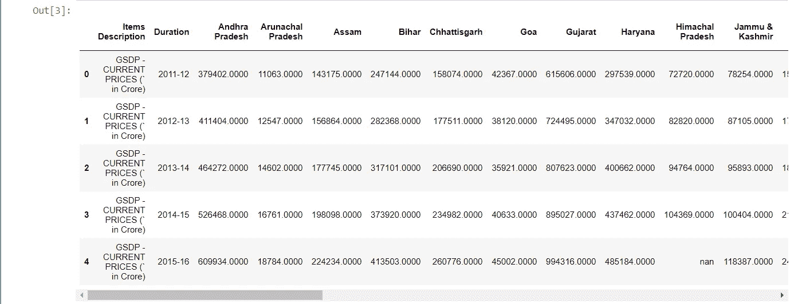

`gdp_data.shape`

输出:

(11, 36)

```
gdp_data.describe()
```

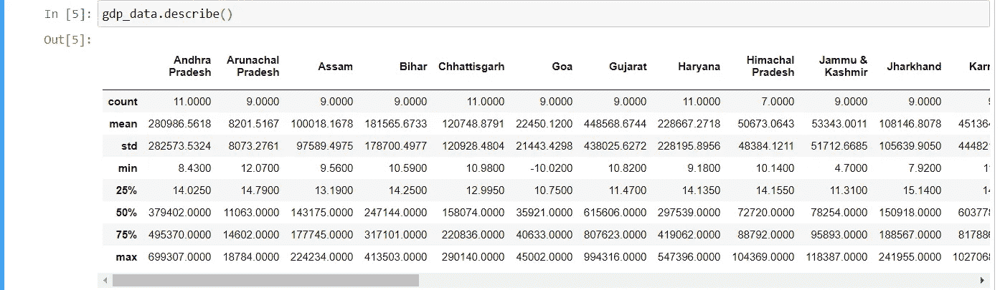

所有状态的静力学。

`gdp_data.info()`

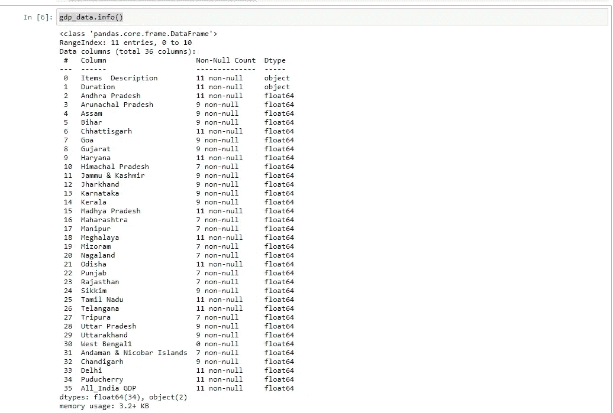

# 数据清理和预处理。

```
mean=gdp_data.mean()
mean
```

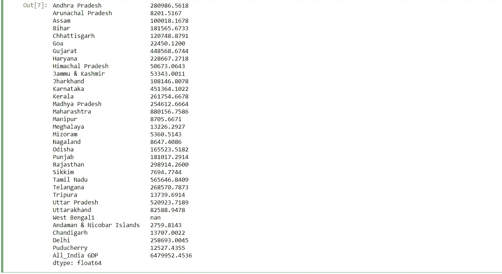

#计算 DF 中缺失值的百分比贡献

```
df_null=gdp_data.isna().mean().round(4) * 100
df_null
```

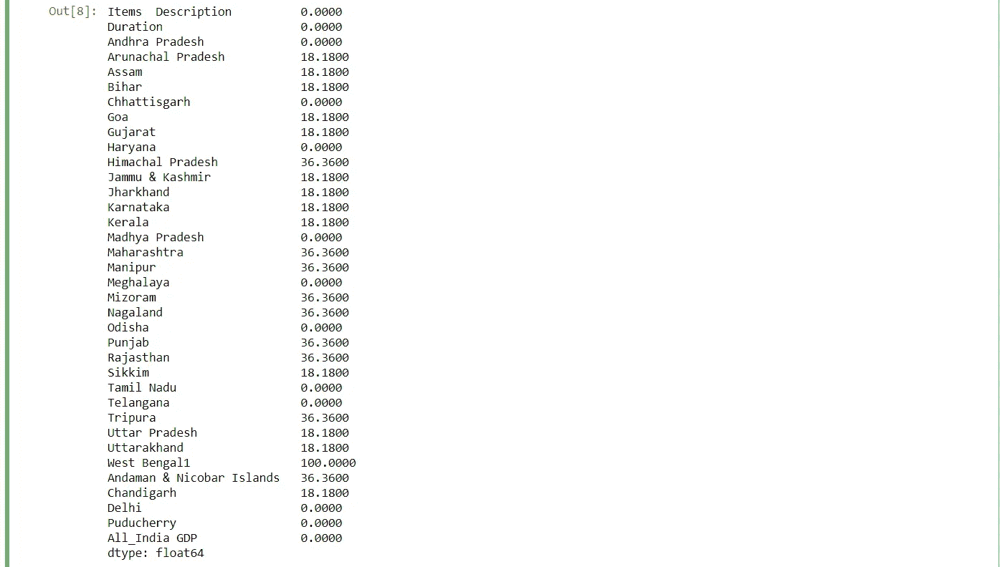

> #删除所有行都是 NaN 的列

`dfx1 = gdp_data.dropna(axis = 1, how = ‘all’)`

> #丢弃 2016 年至 2017 年期间的数据，因为它不会用于分析

```
dfx2 = dfx1[dfx1.Duration != ‘2016–17’]
```

> #丢弃 UT，因为分析不需要它

```
dfx3 = dfx2.T
dfx4 = dfx3.drop(labels = [‘Andaman & Nicobar Islands’,’Chandigarh’,’Delhi’,’Puducherry’])
```

> # 2013 年至 2014 年、2014 年至 2015 年和 2015 年至 2016 年期间的行平均值(比上年增长%)

```
dfx4_mean = dfx4.iloc[2:,6:10].mean(axis = 1).round(2).sort_values()
dfx4_mean
```

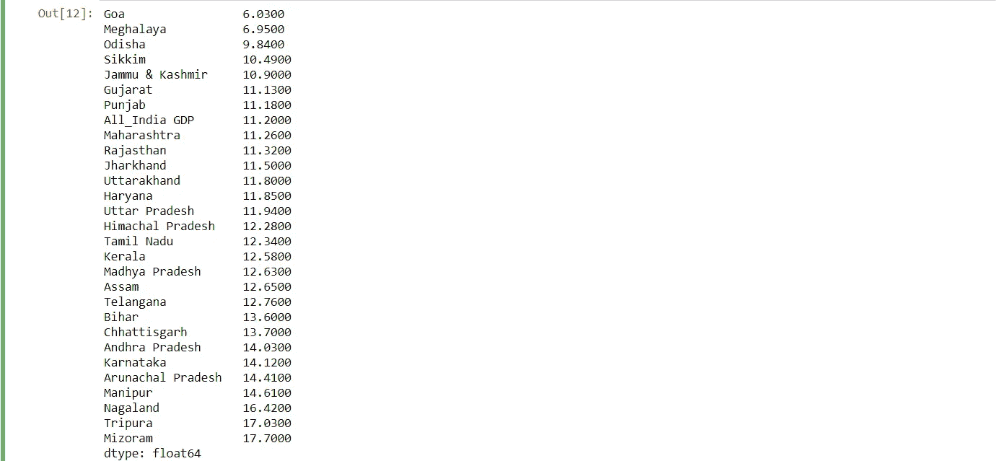

# 数据可视化和洞察提取

> # 2013 年 14 月、2014 年 15 月和 2015 年 16 月各州平均增长率柱状图

```
 plt.rcParams[‘figure.figsize’] = [11.5,8]
dfx4_mean.plot(kind=’barh’,stacked=True, colormap = ‘Set2’)
plt.title(“Avg.% Growth of States for Duration 2013–14, 2014–15 and 2015–16”, fontweight = ‘bold’)
plt.xlabel(“Avg. % Growth”, fontweight = ‘bold’)
plt.ylabel(“States”, fontweight = ‘bold’)
```

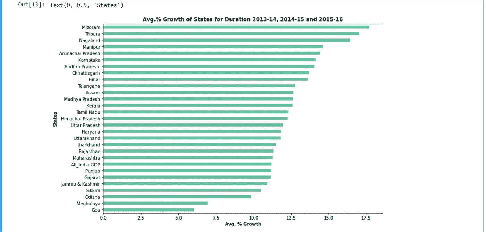

考虑到 2013-2016 年期间各邦的平均增长率，从上述图中可以看出，作为印度东部一部分的米佐拉姆邦、那加兰邦、特里普拉邦和曼尼普尔邦，与平均增长率约为 15%的同类邦相比，一直在快速增长。与其他邦相比，果阿和梅加拉亚邦正在努力发展。

> #我所在州的平均增长率与全国平均增长率的对比

```
dfx4_myhome = dfx4_mean[[‘Maharashtra’,’Gujarat’, ‘All_India GDP’]]dfx4_myhome.plot(kind=’bar’,stacked=True, colormap = ‘Dark2’)
plt.title(“Avg. % Growth of Home State vs National Avg. for Duration 2013–14, 2014–15 and 2015–16”, fontweight = ‘bold’)
plt.ylabel(“Average % Growth”, fontweight = ‘bold’)
plt.xlabel(“Home State Vs National Average”, fontweight = ‘bold’)
```

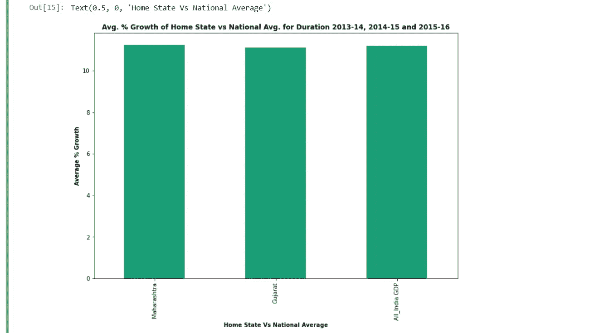

> 我的家乡马哈拉施特拉邦和古吉拉特邦的平均增长率大约是全国平均增长率(12%)。

# 2015 年至 2016 年各州的国内生产总值

> #选择 2015 年至 2016 年的 GSDP

`dfx5_total_gdp = dfx4.iloc[2:,4:5]`

> #放弃全印度的 GSDP，因为它不会包含在剧情中

`dfx6_total_gdp = dfx5_total_gdp.drop(labels = [‘All_India GDP’])`

> #所有州的 GSDP 图，包括有 NaN 的州

```
dfx6_total_gdp.sort_values(by=4).plot(kind=’bar’,stacked=True, colormap = ‘Set1’)
plt.title(“Total GDP of States for duration 2015–16” , fontweight = ‘bold’)
plt.ylabel(“Total GDP (in cr)”,fontweight = ‘bold’)
plt.xlabel(“States”,fontweight = ‘bold’)
```

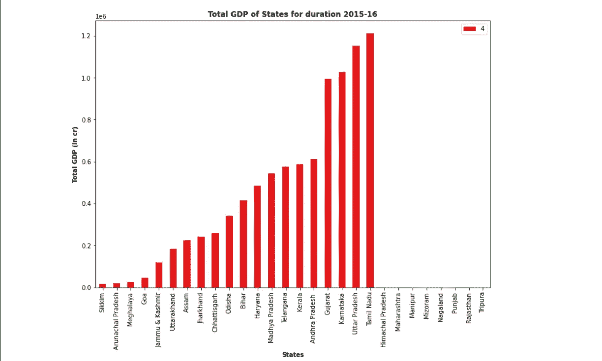

2015 年至 2016 年期间各州 GDP 总量。

> #删除 2015 年至 2016 年 GSDP 在南京的州

`dfx7_total_gdp = dfx6_total_gdp.dropna().sort_values(by = 4)`

> #所有州的 GSDP 图，不包括有 NaN 的州

```
dfx7_total_gdp.plot(kind=’bar’,stacked=True, colormap = ‘copper’)
plt.title(“Total GDP of States for duration 2015–16” , fontweight = ‘bold’)
plt.ylabel(“Total GDP (in cr)”,fontweight = ‘bold’)
plt.xlabel(“States”,fontweight = ‘bold’)
```

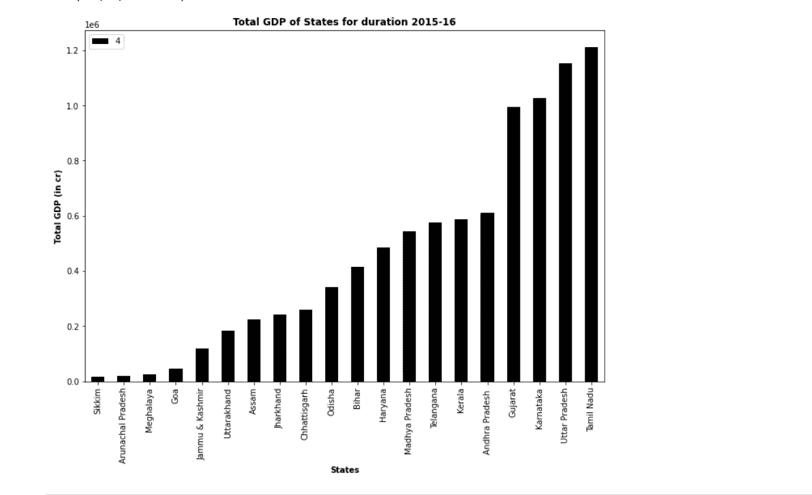

【2015 年至 2016 年期间各州国内生产总值总额

```
dfx7_total_gdp.shape
```

Out[21]:

```
(20, 1)
```

> 排名前五的 GSDP

dfx7_total_gdp.tail(5)。plot(kind='bar '，stacked=True，colormap = ' winter ')
PLT . title(" 2015-16 年前 5 个州的 GDP 总量"，fontweight = 'bold ')
PLT . ylabel(" GDP 总量(cr)"，font weight = ' bold ')
PLT . xlabel(" States "，font weight = ' bold ')

> 排名倒数 5 位的 GSDP

dfx7_total_gdp.head(5)。plot(kind='bar '，stacked=True，colormap = ' flag ')
PLT . title(" 2015-16 年后 5 个州的总 GDP "，fontweight = 'bold ')
PLT . y label("总 GDP(Cr)"，font weight = ' bold ')
PLT . xlabel(" States "，font weight = ' bold ')

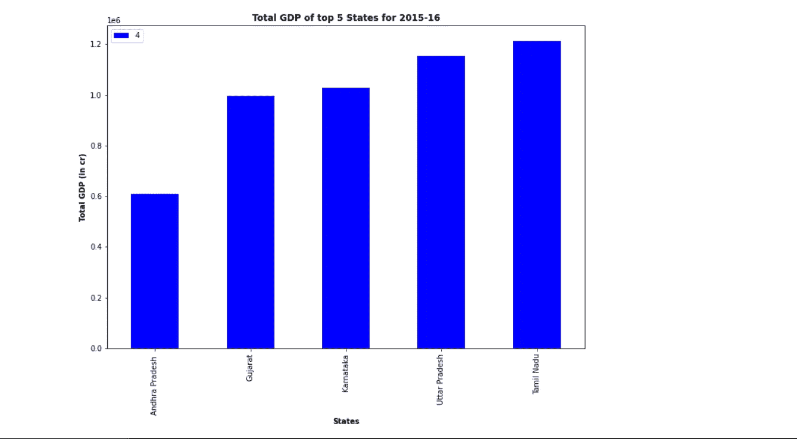

排名前五的 GSDP

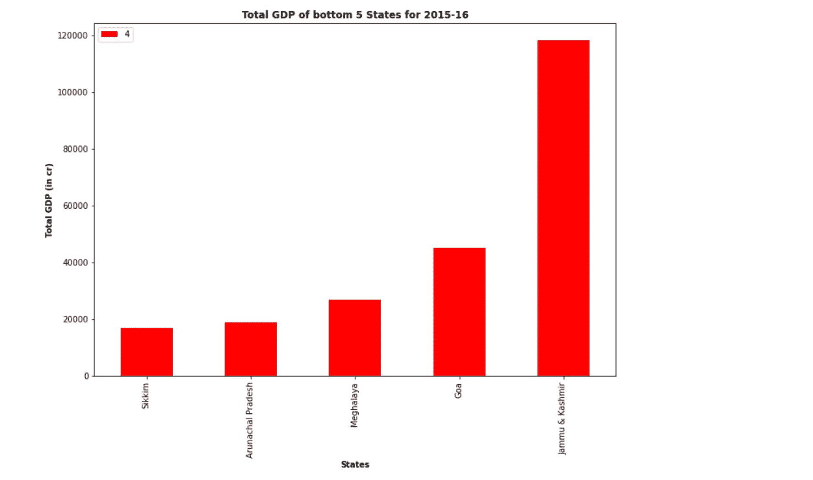

排名倒数 5 位的 GSDP

> **结论**:-考虑到 2015 年至 2016 年期间前/后 5 个州的 GSDP，从上图中可以看出，前 5 个州贡献了 GSDP 总 rd 的近 1/3(32%)。在 GSDP，排名第五的邦(安得拉邦)与排名前五的其他邦之间存在显著差异。排名最末的 5 个州仅占 GSDP 总人口的 1.5 %。J & K 的 GSDP 明显高于其他州，原因是传统的休闲旅游，探险、朝圣、精神和健康旅游的范围很广

代码/数据集可在 [Github](https://github.com/HarshalPatil20/DS_Project) 上获得

继续关注 Linkedin 。

谢谢…