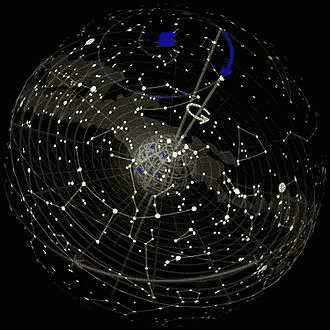

# 印度和巴比伦占星家作为第一批机器学习工程师

> 原文：<https://medium.com/analytics-vidhya/indian-and-babylon-astrologers-as-1st-machine-learning-engineers-66ba7e15d7?source=collection_archive---------2----------------------->

最近在空闲时间，我读了一些天体神学的东西，然后是**岁差**然后跳到黄道十二宫，然后是一些吠陀占星术&巴比伦占星术……然后我突然意识到印度和巴比伦占星家做了多么伟大的工作，可能也超过了 6000 年。我还意识到一件事，这些人做了世界上第一个**机器学习**项目。

**岁差**

关于**岁差**请在 Youtube 上观看非常好的视频。岁差是黄道带恒星位置的非常缓慢的变化，因此它们破坏了巴比伦占星术理论，而印度理论仍然成立。(印度占星家知道岁差)
有趣的是，第一批机器学习工程师在埃及、印度和巴比伦。他们在他们的项目中采用了和我们一样的方法。我一直认为，他们给一些事件随机分配天空状态，但是我通过收集在那个状态下发生的事情的记录了解到他们是这样做的。
很简单，他们收集天空事件的数据(天空的位置)，并检查在那些时间发生了什么，并将那些天空事件标记为幸运或不幸运。(或者当然更多的标签)。如果你认为“理解生命模式”是一个项目，这是近 25 万年来继智人之后最大的项目。(事实上，这些人试图了解一年、一个月有多少天，这是非常重要的信息。我认为这个项目变成了一个副业。)

因此，我将列出这个项目的组成部分，以及它们与今天机器学习项目的相似之处。

**训练数据:** 1)天空状态作为特征向量(X )
2)发生或关联的动作作为分类标签(Y1，Y2 …)

**训练方法** 多标签分类作为一个非常简单的神经网络。
如果火星、金星、猎户座处于这种状态- > Y1、Y5
如果火星、金星、天狼星处于这种状态- > Y2
…。

**考资料
考资料**对前任祖先的偏见。世界那一部分的地区信仰和天空事件的概念。(在某些地区，月亮神比太阳神更重要……)

**数据不足** 我想智人查了一下，收集了这么久的天空数据，但在需要王之神谕之前并没有尝试去匹配它。因此，十二宫机器学习项目的数据收集最多也就 50-100 年，因为神谕需要回答国王的问题，无法长时间给出项目期限。

在观察这些关系时，如果我们只选择穷人或富人，就会产生偏见。即使是现在，所有的占星家都以名人、富人为样本来证明预言的正确性。这是这个项目中的偏见。

**方差** 与上面相反，如果我们同时从穷人和富人中取样，我们的关系会更加分散，会引起方差。

**协变移位(自变量的移位)** 随着时间的推移，恒星在固定黄道上的位置(名字说固定，但它们不是)发生了变化。所以对于这个项目来说，X 变量随时间缓慢变化。你可以认为这是在不知道季节或添加季节参数的情况下模拟冰淇淋销售。

**先验概率转移(目标变量的转移)** 有些国王、统治者活了很长的完美时期。有些国王统治了很长时间，没有任何问题。(亚历山大大帝)。在那个时候，肯定会有一些行星倒退，或者一些不好的相位。但是这些人多年来从未有过大的厄运。但是在那些时期一定有一些时期行星位置不好...所以 Y 变量对他们来说是错误的。

**概念转变(自变量和目标变量之间关系的转变)**

就像上面的例子，如果我们在亚历山大大征服时期开始收集数据，我们将会以不同于其他时期的方式匹配坏事件和好事件的标签。或者以一种非常偏颇的方式，我们会把一切都贴上好的标签。

**樱桃挑选** 樱桃挑选是以一种有偏见的方式挑选数据来证实你的假设。选择一天内出生的名人、富人作为正确答案的例子。但是在同一个城市，还有很多其他穷人在同一时间出生。(想想大城市医院)

**递增训练数据** 一旦某样东西在多年前被标记为好或坏 4K，它就不会被改变。所以没有丰富训练数据。

**验收测试&实况系统** 当一个先知预言一个小事件时，我认为那将是验收测试。例如猜测国王的新孩子的性别。
当它是关于一场战争，或者另一个严重得多的预言时，那就是生产上部署的活系统。而且响应必须接近实时。

**上升的符号作为分配问题** 当一个项目失败时，我们明白问题中有更多的潜在因素。我们需要增加变量。老机器学习专家明白正常的生肖不足以解释多样性。
在吠陀占星术中我看到，**太阳星座，月亮星座，旭日**。他们还把每个星座分成 4 个。这意味着他们试图将线性线转换成正态分布。他们增加了细分和其他参数来划分更多的区域，以进行更精细的测量。

**P 黑客(数据疏通、数据钓鱼)**

P-value hacking 是一种利用数据分析来发现模式的方法，这些模式在统计上是有意义的，但实际上并没有潜在的影响。它对一组数据进行统计测试，直到出现一些具有统计意义的结果。例如，你可以停止收集数据，一旦你得到一个 P <0.05 and get the result you want.
认为老占星家，他们看到 1 事件，1 天空位置，就是这样。(也许他们会多次这样做，但不会太多)

**特征生成** 我在印度占星术中看到有两个概念，即 Rahu 和 Ketu。它们是人造点，被认为是在月球的轨道上。(在互联网上阅读更多内容)。这不是特征生成吗？我也说过人造的，从占星家的角度来看，它们是聪明而有用的。如果占星术声称行星和恒星影响我们，月球轨道极点肯定被认为是。

**确认偏差** 确认偏差是以一种确认或支持某人先前假设的方式来解释结果的倾向。正如我开始所说，占星家只选择确认案例，确认人们的生活。

**H0 假设缺失** 也许是我知识不足，但行星的方方面面都有意义。我希望有一些中立的。因为在每一个分布、现象中，有些组合一定是无效的。(我读到行星的某些方面是中性的，但它们仍然赋予这种组合一种意义)

**样本选择** 认为两军即将开战，两位国王都询问他们的神谕。他们都知道同样的印度占星术，并回答国王说“在这种天空状态下，会有好运”。现在，谁的命运掌握在星星里？一个会赢，一个会输。既然生命有两重性，结果就可以根据你选择的设定而正确。(我可以争辩，这也取决于国王的状态，但占星术中也有事件，被视为好坏，就像血月一样)

……………………………………………………………………………….

最后，我非常尊敬老(可能比 10K 时代更老)的印度占星学专家，在没有笔没有纸的时代，他们可以在 72 年内计算出 1 度的运动。(我当然也尊重巴比伦和埃及的人)
我真想学习和看看他们是如何记录星座和计算这些东西的。
也有印度人发现了这个奇妙的东西，据我所知他们没有明确陈述这一点，**希腊人希帕克**首先提到了这一现象。
阅读人们如何思考，发现生活模式很有趣。我是印度厨房的忠实粉丝，现在我开始阅读印度占星术，只是为了理解古代聪明人是如何试图寻找生活模式的。
虽然我不相信占星术，但他们使用的方法真的很科学，他们真的是机器学习工程师:)
我开始阅读吠陀占星术，这是一本关于古代算法设计的书。我也想阅读中国占星术和相关的东西(易经，风水…)，以了解古代聪明人的解决问题的方式。我认为搜索一个模式，收集它们在天空物体中的位置，是古代的第一个机器学习项目。