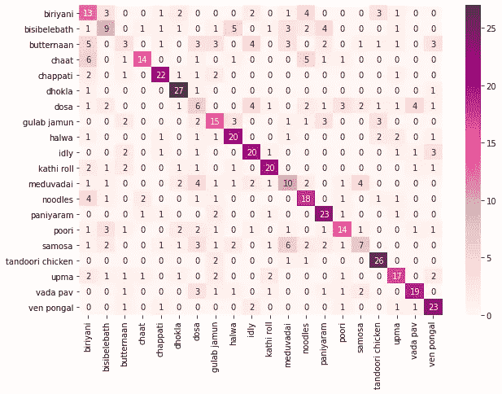

# 使用转移学习的印度食物图像分类…

> 原文：<https://medium.com/analytics-vidhya/indian-food-image-classification-using-transfer-learning-b8878187ddd1?source=collection_archive---------6----------------------->

照片由[皮勒-张力尹·普里斯克](https://unsplash.com/@pillepriske?utm_source=medium&utm_medium=referral)在 [Unsplash](https://unsplash.com?utm_source=medium&utm_medium=referral) 拍摄

**注:**该岗位要求具备 Python、深度学习、图像预处理、分类模型评估等知识。如果你不熟悉这些概念，请随意离开这篇文章。谢谢你…

Namste 各位…在这篇文章中，我们将对印度食物图片进行分类。印度以其多元文化而闻名。这种多元文化也影响了印度食物。我们的印度食物种类繁多。印度各邦和邦内的食物各不相同。我们将应用深度学习算法来识别这些食品。我们的目标是通过引人注目的例子让你熟悉深度分类网络。对于美食爱好者来说，这篇文章会有趣得多。此外，我们还应用迁移学习技术来提高分类性能。

我们使用 **Food20** 数据集进行实验。数据集在 Kaggle 平台免费获取:[数据集链接。](https://www.kaggle.com/cdart99/food20 dataset)下载 zip 文件并解压。保持提取的文件夹与 python 笔记本文件平行。该数据集包含 20 种不同印度食物的图像，每种食物有 100 个样本图像。数据已经以训练测试(训练验证)分割格式存储。火车考比是 70:30。图像的分辨率在 200 x 150 到 5760 x 3840 像素的范围内变化。

**所需库:**

我们将使用以下 python 的内置库和第三方库来执行分类实验。

**数据加载和预处理:**

首先，我们从辅助存储中加载所有图像。接下来，我们将每张图片调整为 256 x 256 的形状。我们还执行像素值的归一化。以下代码片段与预处理部分相关。

x_train 和 y_train 表示训练部分的图像数据和标签。x_val 和 y_val 代表验证或测试零件的图像数据和标签。这里，我们也将验证部分用于测试。您可以创建一个单独的测试集。

**卷积神经网络模型:**

在数据预处理之后，我们创建我们的 CNN 模型。这里，我不打算讨论卷积神经网络的基础知识。如果你是深度学习领域的初学者，请通过以下链接了解卷积:1。[卷积神经网络由吴恩达](https://www.coursera.org/learn/convolutional-neural-networks?specialization=deep-learning)，2。[CNN 简介](https://www.geeksforgeeks.org/introduction-convolution-neural-network/)，[卷积层如何工作](https://machinelearningmastery.com/convolutional-layers-for-deep-learning-neural-networks/)。下面的代码块代表了我们的 CNN 模型。

我们对输入图像数据应用一系列二维卷积和汇集操作。接下来，我们展平卷积和池化运算的输出，以创建一个密集网络。最后，我们添加了一个 SoftMax 层，用于具有 20 个节点的最终分类(我们有 20 种食物图像)。您可以试验过滤器的大小，卷积和池层的数量。下图显示了 CNN 模型每一层需要学习的参数数量。

带参数计数的 CNN 结构。

我们使用 Adam 优化器通过反向传播来更新参数值。要详细了解 Adam 优化器和反向传播，请访问以下链接: [Adam 优化器](https://www.youtube.com/watch?v=JXQT_vxqwIs)、[反向传播](https://www.youtube.com/watch?v=x_Eamf8MHwU)。我们训练 CNN 模型 200 个纪元。你用不同的历元数重复这个实验。

在训练 CNN 模型后，我们绘制了训练和验证损失图。我们还分析了该时期的准确度分数。以下代码块绘制了分析所需的图。

在 20 个时期之后，训练损失和准确性保持恒定，只有微小的变化。另一方面，验证损失在十个时期内减少，但在十个时期后开始增加。10 个时期后，验证准确度在小范围内变化。

CNN 模型的训练和验证性能

**性能得分:**

上面的代码块测试经过训练的 CNN 模型，并以精度、召回率和 F1 分数的形式输出性能。有关度量的更多细节，请点击以下链接:[维基百科](https://en.wikipedia.org/wiki/Precision_and_recall)，[Accuracy _ Precision _ Recall](https://towardsdatascience.com/accuracy-precision-recall-or-f1-331fb37c5cb9)。下表显示了 CNN 模型的分类性能。我们得到了平均 54%的 F1 分数。我们的模型在 *butternaan* 和 *dosa* 类别中表现更差。我们可以手动分析这两个类别的图像来确定原因，这将使我们获得更有用的见解。

类别精确度、召回率和 F1 分数。

**混淆矩阵:**

混淆矩阵是分类模型性能的表格表示。请不要走上它的名字；一点也不混乱。更多详情，请点击此链接:[维基百科](https://en.wikipedia.org/wiki/Confusion_matrix)。简单来说，在理想的混淆矩阵中，所有的非对角线值都必须为零。从下面的混淆矩阵，我们可以分析错误分类的图像。例如，大多数*巴特南*图像被错误分类为*比里亚尼、多萨、懒懒、古拉卜贾蒙*。

CNN 预测的混乱矩阵。

**使用*迁移学习(TL)* 进行改进:**

我们已经用简单的 CNN 模型获得了平均性能。让我们利用 TL 的力量来提高性能。在 TL 中，我们存储在解决一个问题时获得的知识，并将其应用于另一个不同但相关的问题。当我们只有非常少量的数据用于训练时，TL 可以帮助我们。在我们的例子中，我们只有每种食物的 70 张图片用于训练。TL 可以用于提高分类性能。这里，我们使用在 ImageNet 数据集上训练的模型的预训练权重。我们用我们的输入和输出层替换预训练模型的输入和输出层。

我们不会重新训练现有的模型重量。我们只训练最后一层。您可以在下图中看到可学习和不可学习参数的数量:

具有迁移学习的模型架构。

用于训练基于迁移学习的模型的代码块。

在训练了基于 TL 的模型之后，我们比较了我们的 CNN 模型和基于 TL 的模型的训练性能。下面的代码块绘制了简单 CNN 和基于 TL 的模型相对于历元的训练精度和损失值。

基于 TL 的模型在验证部分获得了更高的训练精度。与简单的 CNN 模型不同，对于基于 TL 的模型，训练精度逐渐增加。基于 TL 的模型的损失值持续下降。

简单 CNN 模型与基于迁移学习的模型的训练和验证性能比较。

**性能得分:**

上面的代码块测试了基于 TL 的模型，并打印了分类性能。基于 TL 的模型取得了 84%的 F1 分数。与简单的 CNN 模型相比，基于 TL 的模型能够更有效地对 *butternaan* 和 *dosa* 图像进行分类。

类别精确度、召回率和 F1 分数。

**混乱矩阵:**

如果我们将这个混淆矩阵与前一个相比较，我们在对角线上有更多的值。只有 *bisibelebath* 类别仍有大量误分类图像。

迁移学习模型预测的混淆矩阵。

最后，我们成功地完成了印度食物图像的分类任务。在这个实验中，我们看到了迁移学习的力量。您可以复制这个实验，并尝试使用模型超参数。我们在这里提供了笔记本文件: [GitHub 链接](https://github.com/sawan16/Indian_food_image_classification)。请在执行代码之前安装所需的库。我会建议你使用 Google Collaboratory 平台。在 Google Collaboratory 中，你不需要安装任何库，你也可以获得免费的 GPU。还有另一个食物图像数据集可在: [Tensorflow 网站( **food101** )](https://www.tensorflow.org/datasets/catalog/food101) 获得。这个数据集比 **Food20** 数据集更通用、更大。您可以使用 food101 数据集尝试上述实验，以获得更多有用的见解。

感谢你阅读这篇文章…