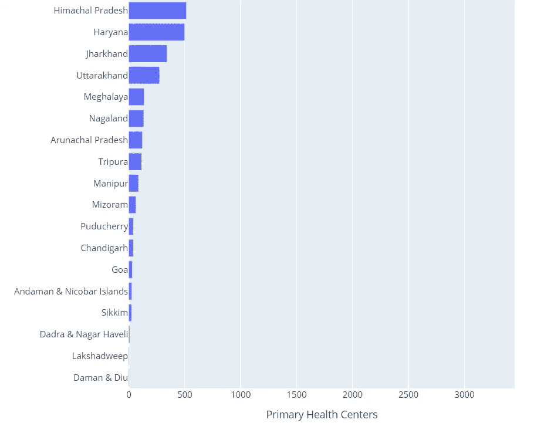
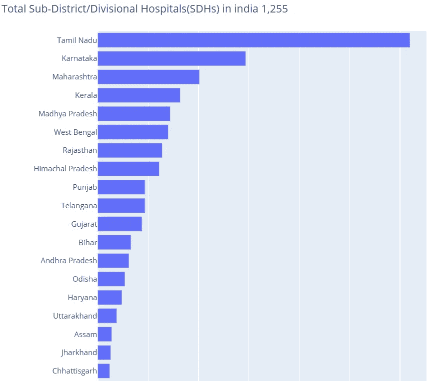

# 印度医疗保健分析第 1 部分:我们对疫情准备得如何？

> 原文：<https://medium.com/analytics-vidhya/indian-healthcare-analysis-part-1-how-prepared-were-we-for-the-epidemic-8c2459fdd9c1?source=collection_archive---------17----------------------->


奥维德袭击了印度，再次让我们措手不及。我们都见证了第二次浪潮导致的印度医疗基础设施的彻底崩溃。当我们无助地看着它的时候，整个国家都在渴望氧气，寻找床位。所以我决定调查一下我们的健康状况，以及我们为这一天做了多少准备。

# 人口分析

在分析国家的医疗基础设施之前，分析印度各邦的人口是很重要的。我会从 [**Kaggle 下载印度的人口数据。**](https://www.kaggle.com/aravindm27/india-medical-resources/#data)

```
Import pyforest
import plotly.express as pxpop=pd.read_csv("Population_density.csv")
```


为了简化，我们需要重命名 3 列。

```
pop.rename(columns={'State or union territory': 'States'}, inplace=True)
pop.rename(columns={'Density[a]': 'Density'}, inplace=True)
pop.rename(columns={'Population\n(%)': 'Population'}, inplace=True)
```


```
fig = px.bar(pop.sort_values(by="Population", ascending=True,inplace=True), x=pop['Population'], y=pop['States'], orientation='h')
fig.update_layout(uniformtext_minsize=4, uniformtext_mode='hide', autosize=False,
    xaxis_title="Population",
    yaxis_title="States",
    width=500,
    height=800,
    title_text = 'Pop of India ')
fig.show()
```


观察 : U.P .是印度人口最多的邦。它的人口几乎是人口第二多的印度的两倍。西孟加拉邦和比哈尔邦也是印度人口极其密集的邦。

## 数据下载

我已经从 [**Kaggle**](https://www.kaggle.com/dheerajmpai/hospitals-and-beds-in-india) 下载了数据，这些数据已经从[**pib.gov.in**](https://pib.gov.in/PressReleasePage.aspx?PRID=1539877)网站上废弃，并且是无版权的。我已经下载了压缩文件。解压缩时，我有多个包含医疗保健数据的 CSV 文件。


# 健康基础分析

我们可以打开笔记本开始编码。我将导入所有的库，并将 CSV 文件转换成我们将在这一部分中分析的文件的数据框架

```
 import numpy as np state_data= pd.read_csv('Hospitals_and_Beds_statewise.csv')
state_data.head()
```


> **栏目缩写**
> 
> **未命名:0 =州，CHC=公共卫生保健中心，CHC =社区卫生中心，SDH=分区医院，DH =区医院，未命名:6=床位**

通过查询数据框的最后一行，可以找到印度的医院和床位总数。

```
state_data.head(37).reset_index()
all_india_beds_PHC = state_data.loc[36,["PHC", 'CHC', 'SDH', 'DH', 'Beds']]
all_india_beds_PHC
```


我国有 70 万张病床和 30，000 个初级保健中心。

## 数据清理

我们需要重命名列 1 和列 6。我们还需要删除表格的最后一行(第 36 行),这是印度所有列的总和。

```
state_data.rename(columns={'Unnamed: 0': 'States'}, inplace=True)
state_data.rename(columns={'Unnamed: 6': 'Beds'}, inplace=True)
state_data.fillna(0,axis =0, inplace=True)
state_data.drop([36], inplace=True)
```


# 初级保健中心

另一个重要的需求是将数据类型从 object 转换为 INT。之后，我们可以开始可视化印度各邦的初级医疗保健中心。

```
 data_type_list = {
    "PHC"   : int,
    "CHC"   : int, 
    "SDH"   : int,
    "DH"    : int,
    "Total" : int,
    "Beds"  : int}state_data = state_data.astype(data_type_list)
state_data.sort_values(by='PHC', ascending=True, inplace=True)
fig = px.bar(state_data, x=state_data['PHC'], y=state_data['States'], orientation='h')
fig.update_layout(uniformtext_minsize=5, uniformtext_mode='hide', autosize=False,
    xaxis_title="Primary Health Centers",
    yaxis_title="states",
    width=800,
    height=1200,
    title_text = 'Total Primary Health Centers in india '+all_india_beds_PHC[0])fig.show()
```



观察:拉贾斯坦邦和卡纳塔克邦表现最好。这两个州的平均人口都在 600-700 万之间，并且仍然排在前 4 名。而德里、旁遮普和哈里亚纳邦的表现则令人沮丧。

# 社区健康中心

```
fig = px.bar(state_data.sort_values(by="CHC", ascending=True,inplace=True), x=state_data['CHC'], y=state_data['States'], orientation='h')
fig.update_layout(uniformtext_minsize=5, uniformtext_mode='hide', autosize=False,
    xaxis_title="Community Health Centers(CHCs)",
    yaxis_title="states",
    width=800,
    height=1200,
    title_text = 'Total Community Health Centers(CHCs) in india '+all_india_beds_PHC[1])
fig.show()
```


观察:拉贾斯坦邦在这一点上做得更好，而西孟加拉邦也有了显著的进步。就人口而言，旁遮普、特伦甘纳邦、哈里亚纳邦、比哈尔邦、德里表现不佳。

# 分区/分区医院

```
fig = px.bar(state_data.sort_values(by="SDH", ascending=True,inplace=True), x=state_data['SDH'], y=state_data['States'], orientation='h')
fig.update_layout(uniformtext_minsize=4, uniformtext_mode='hide', autosize=False,
    xaxis_title="Sub-District/Divisional Hospitals(SDHs)",
    yaxis_title="states",
    width=800,
    height=1200,
    title_text = 'Total Sub-District/Divisional Hospitals(SDHs) in india '+all_india_beds_PHC[2])
fig.show()
```



**观察**:泰米尔纳德邦与卡纳塔克邦和喀拉拉邦都表现不错。德里再次令人失望。

# 印度医院总数

```
fig = px.bar(state_data.sort_values(by="Total", ascending=True,inplace=True), 
             x=state_data['Total'], 
             y=state_data['States'], 
             orientation='h')
fig.update_layout(uniformtext_minsize=4, uniformtext_mode='hide', autosize=False,
    xaxis_title="Total PHC,CHC,SDH,DH",
    yaxis_title="states",
    width=800,
    height=1200,
    title_text = 'Total PHC,CHC,SDH,DH in india ')
fig.show()
```


# 印度的病床总数

让我们谈谈最重要的参数，这是我们的医疗基础设施让我们失望的地方。印度的病床总数是 70 万张。


```
fig = px.bar(state_data.sort_values(by="Beds", ascending=True,inplace=True), 
             x=state_data['Beds'], 
             y=state_data['States'], 
             orientation='h')
fig.update_layout(uniformtext_minsize=4, uniformtext_mode='hide', autosize=False,
    xaxis_title="Total Beds",
    yaxis_title="states",
    width=800,
    height=1200,
    title_text = 'Total Beds in india ')
fig.show()
```


**观察:**印度目前活跃病例总数为 **2，416，688，**而印度拥有的床位总数为**70 万卢比 3.9 万张**，不到总病例数的 1/3。这只是显示了我们的医疗基础设施目前是多么紧张。显然，我们通过建造临时医院设施增加了许多床位。

泰米尔纳德邦拥有最多的床位，与其他邦相比，他们在第二波中表现良好。旁遮普总共有 13k 个床位，而目前有 38k 个活跃病例，我们还没有看到旁遮普的高峰。

# 结论

唯一整体表现良好的邦是拉贾斯坦邦，这也反映在他们的 covid 管理表现中，他们比印度其他各邦更好地处理了第一波和第二波，也在疫苗接种图表中名列前茅。据我所知，旁遮普的卫生基础设施是印度最差的。U.P .已经在所有的图表中名列前茅，但是他们有压倒性的庞大人口。

