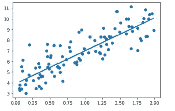
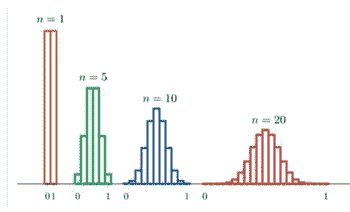
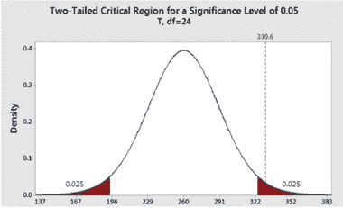
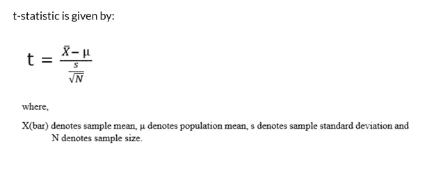
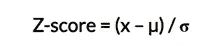
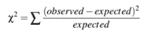
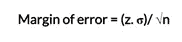
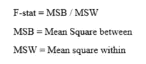

# 推理统计学。

> 原文：<https://medium.com/analytics-vidhya/inferential-statistics-dadd08dcf725?source=collection_archive---------12----------------------->

推断统计学是利用从总体中随机抽取的数据样本来说明和推断总体。

当不方便或不可能处理全部人口中的每个成员时，推断统计学是有价值的。

推理统计学帮助我们根据数据得出结论并做出预测。

推断统计学从样本中了解总体。

在推断统计学中，我们使用随机样本，因此我们可以将样本的结果推广到大群体。

在推断统计学中，我们可以计算总体随机样本数据的均值、标准差和比例。

以下类型的推理统计是最常用的，也很容易解释:

条件概率

概率分布和分布函数

可能性

回归分析

中心极限定理

假设检验

t 检验

z 检验

抽样分布

卡方检验

置信区间

方差分析

让我们看几个方法，这些方法可以用来识别依赖于用例场景的输出。

**条件概率:**

条件概率作用于特定事件 Q，给定已经发生的某个条件，即 R .那么条件概率，P(Q|R)定义为，

p(Q | R)= N(R∩Q)/N(R)；假设 N(R) > 0

N(R): —对事件 B 有利的案例总数

N(R∩Q): —总有利并发

同样，我们可以写成:

P(Q | R)= P(Q∩R)/P(R)；P(R) > 0

**概率分布和分布函数:**

与随机变量的不确定性有关的数学函数称为概率分布。它是一个随机变量的所有可能结果及其相关概率的图解。

对于随机变量 Q，CDF(累积分布函数)定义为:

f(Q)= P { SεS；Q(s) ≤ q}

还有，

F(Q) = P {Q ≤ q}

我们举个例子 P (Q > 4) = 1- P (Q ≤ 4)

= 1-{ P(Q = 1)+P(Q = 2)+P(Q = 3)+P(Q = 4)}

**概率:**

概率是所有可能事件中某一特定事件的发生率。

例子:扔硬币，找到概率的尾部。

P(T) =1/2

这里，我们做了随机实验，所有可能的结果为 H 或 t。

随机实验所有可能结果的集合称为样本空间。

这里，我们用随机变量进行运算。在统计学中，随机变量有两种类型:离散变量和连续变量。

**回归分析:**

用于发现数据趋势回归分析。例如，如果方程的值为 y = mx +b，这是关于不同 x 值的线性方程，我们可以找到 y 的值，其中有一些误差值。

让我们在散点图上绘制数值，并进行线性回归。在下面我们添加了一些 x 和 y 的值来找出它们之间的关系。

**中心极限定理:**

中心极限定理说明，当样本容量增加时，样本均值的分布变成正态分布。与人口分布形状无关。当我们的样本大于 30 时，CLT 尤其如此。所以，我们可以声明，如果我们有较大的样本量分布可以是正常的。

**假设检验:**

在统计学中，我们有许多假设，假设检验是其中的一部分。它遵循随机样本数据的若干步骤和程序，以确定假设是否正确。

有两种类型假设:

**零假设**:在零假设中，我们假设样本观察值纯属偶然。零假设由 H0 表示。

**交替假设**:交替假设是样本观察值不是偶然的。交替假设受到一些非随机情况的影响。另一种假设用 H1 或哈来表示。

假设检验的步骤

根据样本数据确定是否拒绝零假设或拒绝零假设失败的过程称为假设检验。它包括四个步骤:

1.定义假设、无效假设和替代假设。

2.定义一个研究计划，找出如何使用样本数据来评估零假设。

3.对样本数据进行一些分析，以创建一个称为“测试统计”的数字。

4.通过应用决策规则来验证零假设是否正确，从而理解结果。

如果 t-stat 的结果小于显著性水平，我们将拒绝零假设，否则，我们将无法拒绝零假设。

**T 检验:**

当样本量小于 30 且总体不标准，但样本有标准差时，我们使用 T 检验。

**Z 测试:**

当数据呈正态分布时，应用 Z 检验。我们通过计算 Z 值找到样本的 Z 统计量。z 分数由公式给出。

当给定总体均值和标准差时，我们进行 Z 检验。

**抽样分布:**

从总体中抽取样本的统计量的抽样分布称为抽样分布。当我们增加样本时，分布变得正态。当我们增加样本量时，样本的可变性降低。

**卡方检验:**

卡方检验用于比较分类数据。卡方检验有两种类型。

卡方检验确定样本数据与总体匹配的类别，即所谓的拟合优度。

当我们比较两个分类变量以确定它们是否相关时，这就是所谓的独立性检验。

卡方统计显示为:

**置信区间:**

置信区间是样本参数实际值的区间。置信区间用于提供感兴趣的样本参数的区间估计。

我们可以使用标准偏差和 z 表通过下面的公式找到误差范围。

置信区间的值为 n%表示我们对实际平均值在置信区间范围内有 n%的把握。

**ANOVA(方差分析):**

方差分析检验是用来判断实验结果是否显著的。通常在有两个以上的群体时使用，我们必须确定多个总体的均值和多个总体的方差相等的假设。

例如，来自不同公司的工程师面临相同的编码挑战。我们想看看是否有一家公司胜过其他公司。

方差分析测试有以下几种类型:

单向方差分析

双向方差分析

既然我们已经解释完了这两个统计数据，现在我们将确定差异以及何时可以使用这些统计数据。