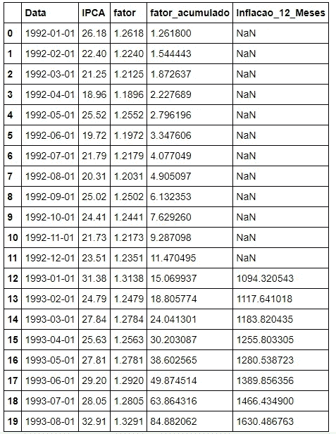
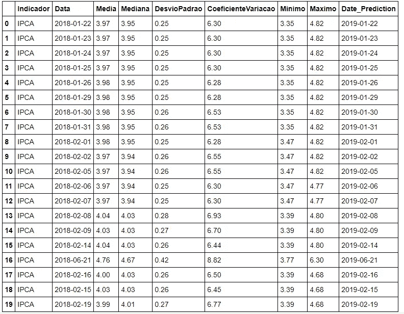
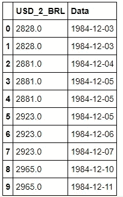
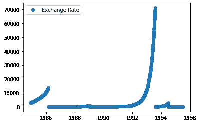
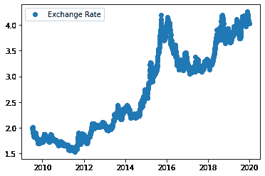
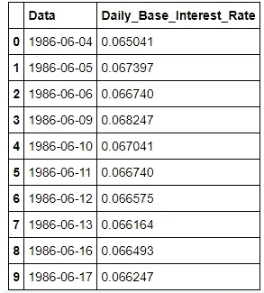

# 基于深度学习的通货膨胀预测

> 原文：<https://medium.com/analytics-vidhya/inflation-forecasting-with-deep-learning-d3067711fff1?source=collection_archive---------5----------------------->

# **摘要**

我们打算将深度学习模型的性能与主要金融机构在通胀预测领域建立的宏观经济模型进行比较。所有的分析都是根据巴西中央银行发布的数据进行的，包括对未来通货膨胀的预测。我们的分析表明，神经网络可以实现比传统模型更好的性能，在不久的将来开辟新的研究可能性。

# 介绍

通货膨胀是公共和私营部门研究的主要宏观经济指标之一。它包括给定货币在给定时间内的价值损失。虽然有些通货膨胀被认为是可取的，因为它通过货币贬值减少了实际债务负担。它可能以恶性通货膨胀的形式成为经济良好运行的克星。而大多数发达经济体近期并未经历恶性通货膨胀。在 1970-1980 年代，即使对世界主要储备货币美元来说，这也是一个真正的克星。[1][2][3]

恶性通货膨胀降低了整个社会的购买力，但最贫穷的人受到的影响最大，因为他们通常无法获得旨在保护财富免受其害的金融工具(通货膨胀保值债券、外汇、黄金、股票等)。适度的通货膨胀虽然不是灾难性的，但私营企业在借款、扩大活动和产品定价等战略决策中必须考虑到这一点。对于家庭来说，通货膨胀减少了可用于支出的实际收入，除非他们在谈判工资时有一些讨价还价的能力。中央银行通常有低通胀目标，他们手中管理这一目标的主要工具是基本利率。银行在制定自己的贷款政策时必须考虑通货膨胀。对于买方机构，如养老基金。通货膨胀侵蚀了他们的投资收益。一个通货膨胀预测工具，可以帮助这些玩家规划他们的未来。[1][2]

目前有一些通货膨胀预测模型，这些模型大多涉及传统的计量经济学模型，加上领域专家的判断。在本文中，我们将使用深度学习方法，使用全连接和 LSTM(长短期记忆)层，并将它与使用当前模型做出的预测进行比较。[4]

我们在这项工作中的重点将是巴西经济。巴西在 20 世纪 80 年代和 90 年代初经历了恶性通货膨胀，因此我们的模型有关于所有通货膨胀水平的最新数据。巴西中央银行从所有主要的地方金融机构收集未来通货膨胀的估计数，并在公开的 API 中与通货膨胀数据一起发布。我们的工作将包括开发一个神经网络算法，该算法将接收不可贸易 IPCA(巴西消费价格指数)的滞后值，以及相关的宏观经济数据(只要在预测日期之前可以获得)，并将其与金融机构的预测进行比较。[1][5]

这项工作的一个有趣之处在于，它会将其预测与经济学领域的学科领域专家团队所做的预测进行比较。如果当前模型已经处于贝叶斯理论误差中，或者是否有进一步研究和模型改进的空间，它可能会揭示洞察力。

# **简要回顾金融领域的神经网络**

神经网络不是最近才发展起来的:提出它们的第一篇论文发表于 1943 年，最近才提出了诸如递归神经网络的架构。传统的神经网络接收单个方向的输入，这称为前向传播，而递归神经网络允许一个层接收来自其自身的滞后输入，这允许在没有额外数据准备的情况下捕获时间维度。1997 年引入的 LSTM(长短期记忆)包括一个递归神经网络，该网络具有用于输入、输出和遗忘的“门”:这些门是附加层，控制滞后输入的哪一部分将被向前传递，哪一部分将被忽略。[6]

人们已经尝试在金融数据中使用神经网络。例如，股票价格预测是一个充满活力的领域，无论是在学术界还是在主要机构的自营交易部门内部。使用神经网络进行交易对高频交易特别有意义:HFT 涉及在短时间窗口(毫秒)内下单，以在市场的小幅波动中获取利润。神经网络，尤其是 LSTM 神经网络，接收过去的价格数据作为输入，并试图预测下一个市场运动。[6][7]

这项工作的目的是用神经网络进行通货膨胀预测，在以前的学术工作中也进行了研究，这些学术工作试图建立一个浅层多层感知器算法，该算法接收宏观经济数据来预测通货膨胀率。[6][8]

# **数据描述**

数据将从巴西中央银行应用程序编程接口(API)收集。从这些来源检索的利息变量将是巴西基本利率(称为 SELIC 利率)、巴西卢布汇率、巴西以前的 IPCA(消费者价格指数)以及巴西金融机构对 12 个月通货膨胀的预测。每个数据集都是从不同的 API 端点检索的。[9][10][11][12]

就 IPCA 而言，自 1992 年以来就有数据，而且是十进制格式。从 2001 年开始，该指数的预测可以从中央银行数据集中以百分比的形式检索。我们使用的 SELIC 利率是隔夜回购-本地发行的主权债券的反向回购利率，该数据可以追溯到 1986 年 6 月，并且是十进制格式。[10][12]

最相关的讨论是关于 BRL 对美元的汇率。由于巴西在 20 世纪 80 年代和 90 年代经历了恶性通货膨胀，自 1984 年以来，货币名称和名义价值已经改变了六次。因此，尽管我们将该数据命名为“美元对 BRL”，但在 1984-1994 年期间，该数据可能是美元对克鲁塞罗、克鲁扎多、克鲁扎多诺、克鲁塞罗雷亚尔或雷亚尔的汇率。在此期间，可以观察到汇率的大幅波动。我们已经决定使用美元汇率的月度百分比变化来标准化该数据集，以避免消失/爆炸梯度问题。[11]

# 给我看看代码！

这个分析将在 Python 中完成，首先我们将导入一些依赖关系:

```
**import** **urllib.request**
**import** **pandas** **as** **pd**
**import** **numpy** **as** **np**
**import** **datetime**
**import** **json**
**from** **scipy.stats** **import** linregress
**from** **numpy** **import** array
```

并定义 API 的端点:

```
StrURLPrevIPCA="https://olinda.bcb.gov.br/olinda/servico/Expectativas/versao/v1/odata/ExpectativasMercadoInflacao12Meses?$top=10000&$filter=Indicador**%20e**q%20'IPCA'**%20a**nd%20Suavizada**%20e**q%20'N'&$format=json&$select=Indicador,Data,Media,Mediana,DesvioPadrao,CoeficienteVariacao,Minimo,Maximo"StrURLIPCA="http://api.bcb.gov.br/dados/serie/bcdata.sgs.4448/dados?formato=json"StrURLUSD="https://olinda.bcb.gov.br/olinda/servico/PTAX/versao/v1/odata/CotacaoDolarPeriodo(dataInicial=@dataInicial,dataFinalCotacao=@dataFinalCotacao)?@dataInicial='01-01-1980'&@dataFinalCotacao='01-01-2020'&$top=10000&$format=json&$select=cotacaoVenda,dataHoraCotacao"StrURLSELIC="https://api.bcb.gov.br/dados/serie/bcdata.sgs.11/dados?formato=json"
```

Bacen API 非常简单，有非常好的文档，但是大部分是用葡萄牙语写的。

接下来，我们将定义一个接收上述 API 端点并返回熊猫数据帧的函数:

```
**def** getBACENDATA(columns,StringURL,value=**False**):
  **with** urllib.request.urlopen(StringURL) **as** url: JsonInter=json.loads(url.read())            
  df=pd.DataFrame(columns=columns)
**if** value:
    **for** item **in** JsonInter['value']:
      row=[]
      **for** column **in** columns:
        row.append(item[column])
      df.loc[len(df)]=row
  **else**:
    **for** item **in** JsonInter:
      row=[]
      **for** column **in** columns:
        row.append(item[column])
      df.loc[len(df)]=row
**return** df
```

下面我们将下载有效通货膨胀数据，获得自数据集开始以来的累积通货膨胀(fator_acumulado)，并获得过去 12 个月的累积通货膨胀(inflacao_12_meses):

```
StringURL=StrURLIPCA
columns=['data','valor']
df_IPCA=getBACENDATA(columns,StringURL)
df_IPCA['fator']=1+(df_IPCA['valor'].astype(float))/100
df_IPCA['fator_acumulado']=1.000000
df_IPCA['fator_acumulado'][0]=df_IPCA['fator'][0]
**for** i **in** range(1,len(df_IPCA)):
  df_IPCA['fator_acumulado'][i]=df_IPCA['fator'][i]*df_IPCA['fator_acumulado'][i-1]
df_IPCA['Inflacao_12_Meses']=(df_IPCA['fator_acumulado']/df_IPCA['fator_acumulado'].shift(12)-1)*100
df_IPCA['data']=pd.to_datetime(df_IPCA['data'],format="**%d**/%m/%Y")
df_IPCA=df_IPCA.rename(columns={"data": "Data",'valor':'IPCA'})
df_IPCA.head(20)
```

向我们展示了数据框架:



表 1:通货膨胀数据集，IPCA 一栏显示了月通货膨胀率，请注意，在此期间，巴西经历了恶性通货膨胀，因此，20-30%的月通货膨胀率相当普遍。

下一部分涉及通胀预测的收集:巴西中央银行对所有主要金融机构做出的不同指数预测进行定期调查，并作为“boletim Focus”发布，它还允许从 API 端点检索该数据:

```
StringURL=StrURLPrevIPCA
columns=['Indicador','Data','Media','Mediana','DesvioPadrao','CoeficienteVariacao','Minimo','Maximo']
df_IPCA_Prev=getBACENDATA(columns,StringURL,**True**)
df_IPCA_Prev['Date_Prediction']=pd.to_datetime(df_IPCA_Prev['Data'])+datetime.timedelta(days=365)
df_IPCA_Prev['Data']=pd.to_datetime(df_IPCA_Prev['Data'],format='%Y-%m-**%d**')
df_IPCA_Prev.head(20)
```



表 02，金融机构对巴西通货膨胀的预测，该数据集中的列是:Indicador =该日期仅指 IPCA 的指数；数据=做出预测的日期；中=一般；Mediana =中位数；DesvioPadrao =标准偏差；CoeficienteVariacao=(标准差/平均值)* 100；Minimo = minMaximo = maxDate _ Prediction = 12M 在预测日期之后。

我们将下载的下一个数据集是巴西货币对美元的汇率。最近(自 1994 年 7 月以来)，巴西货币的名称是真实的(BRL):

```
StringURL=StrURLUSD
columns=['cotacaoVenda','dataHoraCotacao']
df_USD=getBACENDATA(columns,StringURL,**True**)
df_USD['dataHoraCotacao']=df_USD['dataHoraCotacao'].values.astype('<M8[D]')
df_USD['dataHoraCotacao']=pd.to_datetime(df_USD['dataHoraCotacao'],format="**%d**/%m/%Y")
df_USD=df_USD.rename(columns={"cotacaoVenda": "USD_2_BRL","dataHoraCotacao":"Data"})
df_USD.head(10)
```



表 03，以巴西货币单位表示的购买一单位美元(2 美元 BRL)的汇率和相应的日期(数据)

让我们绘制一个图表来快速了解一种货币的恶性通货膨胀的影响:

```
**import** **matplotlib.pyplot** **as** **plt**
x_chart=pd.to_datetime(df_USD['Data'])
y_chart=df_USD['USD_2_BRL']

plt.plot(x_chart, y_chart, 'o', label='Exchange Rate')
plt.legend()
plt.show()
```



图 1:1986 年至 1996 年期间巴西货币(多种货币名称)对美元的汇率，注意曲线的不连续性，这发生在货币名称和面值改变的时候。值是名义上的，没有任何平滑或校正

```
x_chart=pd.to_datetime(df_USD['Data'][len(df_USD)-int(len(df_USD)*0.3):])
y_chart=df_USD['USD_2_BRL'][len(df_USD)-int(len(df_USD)*0.3):]

plt.plot(x_chart, y_chart, 'o', label='Exchange Rate')
plt.legend()
plt.show()
```



图 2:2010–2020 年期间巴西雷亚尔对美元的汇率:请注意，虽然可以观察到贬值，但其波动性比前一时期小得多。值是名义上的，没有任何平滑或校正。

最后，我们将下载巴西基本利率(SELIC Rate ),这是当地发行的主权债券的隔夜回购-反向回购(债券借贷)利率，该数据可以追溯到 1986 年 6 月，采用十进制格式。[10][12]



表 04: Selic 利率虽然主权债券每天 6%的利率听起来可能是一个有吸引力的投资机会，但人们应该记住，通货膨胀率与这些利率是一致的。

现在，让我们连接这些数据集:

```
df=df_IPCA[['Data',	'IPCA','Inflacao_12_Meses']].merge(df_USD, left_on='Data', right_on='Data')
df=df.merge(df_SELIC, left_on='Data', right_on='Data')
df['Inflacao_12_Meses_Shift']=df['Inflacao_12_Meses'].shift(-12)
df['USD_2_BRL_Variation']=df['USD_2_BRL'].pct_change()
```

并执行探索性分析以寻找潜在的解释变量。为此，我们将使用 scipy.stats python 包的 linregress 函数。

我们的目标是计算我们的目标变量(未来 12 个月的通货膨胀)和我们的每个变量之间的线性回归的 p 值和 R 平方。[13]

p 值表示两个变量之间的相关性为零(即完全不相关)的概率，而 R 平方表示一个变量在多大程度上解释了另一个变量的可变性。因此，低 p 值表明两个变量之间存在相关性，而高 R 平方表明该变量与我们的模型相关[13]

```
X=df.dropna(how='any')[['IPCA','USD_2_BRL_Variation','Daily_Base_Interest_Rate','Inflacao_12_Meses']]
Y=df.dropna(how='any')['Inflacao_12_Meses_Shift']
df=df.merge(df_IPCA_Prev[['Date_Prediction','Media']],left_on='Data',right_on='Date_Prediction',how='left')**for** column **in** X.columns:
        x=np.array(X[column],dtype=np.float32)
        y=np.array(Y,dtype=np.float32)
        slope, Intercept, r_value, p_value, std_err = linregress(x,y)
        print('Analysis for: ' + column +' vs Future Inflation:')
        print('p_value: '+str(p_value))
        print('R-Squared: '+str(r_value**2))Analysis for: IPCA vs Future Inflation:
p_value: 3.9022881402400923e-10
R-Squared: 0.19897545195951064
Analysis for: USD_2_BRL_Variation vs Future Inflation:
p_value: 0.0009864777146704018
R-Squared: 0.059635465282588604
Analysis for: Daily_Base_Interest_Rate vs Future Inflation:
p_value: 1.1804946786027202e-12
R-Squared: 0.24888992823722614
Analysis for: Inflacao_12_Meses vs Future Inflation:
p_value: 0.0005769016381291179
R-Squared: 0.06492842819910233
```

所有变量都有有意义的 p 值。他们各自的 R 平方很小，但是很有意义。这些数字表明，虽然通胀预测是不精确的，但我们有一组变量肯定有机会解释我们的目标变量。因此，我们将在我们的预测模型中对所有这些进行处理。

下一步将导入 tensorflow 和 keras 依赖项:

```
**from** **keras.models** **import** Sequential
**from** **keras.layers** **import** Dense, Dropout, LSTM
**import** **tensorflow** **as** **tf**
```

我们将使用具有以下层的 Keras 顺序神经网络模型:

*   一个 LSTM(长短期记忆)层，有 100 个神经元，辍学率为 0.3，重复辍学率也为 0.3。
*   辍学 0.3
*   64 个神经元的密集(完全连接)层，激活双曲正切(“tanh”)
*   辍学 0.3
*   32 个神经元的密集(完全连接)层，激活整流线性单元(“relu”)
*   辍学 0.3
*   16 个神经元的密集(完全连接)层，激活标准化指数(“softmax”)
*   辍学 0.3
*   单个神经元完全连接的线性激活层，其目标是输出回归值

上面的架构旨在捕捉 LSTM 层的时间序列行为。每个完全连接的层都有不同的激活函数，因此它可以捕捉上一层可能错过的非线性。退出率是层中的每个神经元在一轮反向传播过程中被“退出”的概率，具有正则化的效果，类似于线性回归中的套索或岭回归。虽然通常使用 0.1 的比率，但我们决定使用更高的比率，以避免过度拟合，因为我们的数据集包含很少的样本(数百行)[6][14]

使用的优化算法是自适应矩估计(“adam”)，而损失是均方误差。训练发生在 350 个纪元中。[6]

由于第一个图层是 Keras LSTM，因此必须将输入数据转换为 3D 格式，以便对该图层进行处理。3D 必须采用以下形式(样本、时间步长、特征)。样本是观察值的数量。时间步长要观察的先前时间步长的数量。以及我们想要分析的不同特征的数量。[6][15][16]

在我们的特殊情况下，我们将选择 12 个时间步长，因为我们的每个数据点代表一个月的日期，我们对每年的通货膨胀感兴趣。如前所述，特征的数量是 4。[6][15][16]

在代码中:

```
n_neurons_dense=64
dropout_ratio=0.3
model=Sequential()
model.add(LSTM(100,dropout=dropout_ratio,recurrent_dropout=dropout_ratio,input_shape=(n_steps,n_features)))
model.add(Dropout(dropout_ratio))
model.add(Dense(n_neurons_dense,activation='tanh'))
model.add(Dropout(dropout_ratio))
model.add(Dense(n_neurons_dense/2,activation='relu'))
model.add(Dropout(dropout_ratio))
model.add(Dense(n_neurons_dense/(2**2),activation='softmax'))
model.add(Dropout(dropout_ratio))
model.add(Dense(1,activation='linear'))

model.compile(optimizer='adam',loss='mse')
```

Keras LSTM 必须接收 3D 形状的数据:(样本、时间步长、要素)，我们将时间步长视为 12(相当于前一年)，并保留在上述 p 值和 R 平方建模中研究的要素:[16]

```
**def** split_sequence(df,Y,n_steps):
  columns=list(df.columns)
  X, y = list(), list()
  **for** i **in** range(len(df)):
    *# find the end of this pattern*
    end_ix = i + n_steps
    *# check if we are beyond the sequence*
    **if** end_ix > len(df)-1:
      **break**
    *# gather input and output parts of the pattern*
    seq_x, seq_y = df[columns][i:end_ix].values, Y[end_ix]
    X.append(seq_x)
    y.append(seq_y)
  **return** np.array(X), np.array(y).reshape(-1,1)X,Y_fin=split_sequence(df[['IPCA','USD_2_BRL_Variation','Daily_Base_Interest_Rate','Inflacao_12_Meses']],df['Media'],n_steps)
X,Y=split_sequence(df[['IPCA','USD_2_BRL_Variation','Daily_Base_Interest_Rate','Inflacao_12_Meses']],df['Inflacao_12_Meses_Shift'],n_steps)
```

x 是独立变量，Y 是未来 12 个月的通胀，Y-fin 是巴西金融机构预测的未来 12 个月的通胀

```
print("X Shape: "+str(X.shape))
print("Y Shape: "+str(Y.shape))
print("Y_fin Shape: "+str(Y_fin.shape))X Shape: (186, 12, 4)
Y Shape: (186, 1)
Y_fin Shape: (186, 1)
```

考虑到大量的 nan，我们减少到一个小的数据集，这导致过度拟合成为一个问题。因此，我们将进行 70%-30%的训练测试集拆分，这在 scikit-learn 机器学习中很常见，但在深度学习中并不常见。测试集将是可用的最新数据:

```
X_train=X[:int(df.shape[0]*0.7),:,:]
X_test=X[-(len(X)-int(df.shape[0]*0.7)):,:,:]
Y_Train=Y[:int(df.shape[0]*0.7)]
Y_Test=Y[-(len(X)-int(df.shape[0]*0.7)):]
Y_fin_Test=Y_fin[-(len(X)-int(df.shape[0]*0.7)):]
print(X_train.shape)
print(X_test.shape
```

并适合:

```
model.fit(X_train.astype(np.float32), Y_Train.astype(np.float32), epochs=350, verbose=1)
```

拟合之后，我们将得到我们的预测:

```
Y_pred=model.predict(X_test.astype(np.float32))
```

最后，评估:

```
**from** **sklearn.metrics** **import** mean_squared_error

df_result=pd.DataFrame()
df_result['Ground_Truth']=Y_Test.reshape(1,-1)[0]
df_result['NN_Prediction']=Y_pred.reshape(1,-1)[0]
df_result['FI_Prediction']=Y_fin_Test.reshape(1,-1)[0]
df_result=df_result.dropna(how='any')

*#Mean Squared error of neural network prediction:*
print("Mean Squared Error of neural network prediction: "+str(mean_squared_error(df_result['Ground_Truth'],df_result['NN_Prediction'])))
*#Mean squared error of predictions from Financial Institutions:*
print("Mean Squared Error of predictions from Financial Institutions: "+str(mean_squared_error(df_result['Ground_Truth'],df_result['FI_Prediction'])))Mean Squared Error of neural network prediction: 6.162676151752825
Mean Squared Error of predictions from Financial Institutions: 7.155896426248233
```

# 结论

所获得的结果表明，在金融机构中使用传统的宏观经济模型，神经网络在长期通货膨胀预测方面可以达到比专业团队更好的性能。自然，这样的结果可能会由于小数据集而波动，但是，它表明深度学习是这种预测的一种替代方法。

该模型是在各种恶性通货膨胀和轻度通货膨胀的情况下训练出来的。迁移学习对于预测不同货币的通货膨胀是可能的。由于使用的汇率是美元对 BRL，任何打算预测美国通胀的用户都应该将汇率改为黄金价格或国际货币基金组织的特别提款权(最接近全球货币)，因为没有其他法定货币具有与美元相同的全球储备地位。该模型的代码可以在 github 上公开获得。[17]

# 参考

[1] —洛佩斯和罗塞蒂—货币经济学(9 版)—ISBN 978–85–224–3969–0

[2] —曼昆，乔治—宏观经济学(第 8 版)—ISBN 978–2–4393–4002–4

[3]——圣路易斯美联储银行和世界银行——美国通货膨胀和消费者价格(系列代码:FPCPITOLZGUSA)

[4]-[https://www.oecd-ilibrary.org/economics/inflation-forecast](https://www.oecd-ilibrary.org/economics/inflation-forecast)2020 年 9 月 9 日检索

[5]-dado sabertos . BCB . gov . br-于 2020 年 9 月 7 日检索

[6] — Géron，A. —动手:用 Scikit-Learn 和 TensorFlow 进行机器学习—ISBN 978–85–508–0381–4

[7] — [罗伊·乔杜里，阿哈纳](https://content.iospress.com/search?q=author%3A%28%22Roy+Choudhury%2C+Ahana%22%29) | [阿布拉沙米，索赫拉](https://content.iospress.com/search?q=author%3A%28%22Abrishami%2C+Soheila%22%29) | [图雷克，迈克尔](https://content.iospress.com/search?q=author%3A%28%22Turek%2C+Michael%22%29) | [库马尔，皮尤什](https://content.iospress.com/search?q=author%3A%28%22Kumar%2C+Piyush%22%29) — [利用神经网络提高股票交易利润](https://content.iospress.com/articles/ai-communications/aic200629)

[8] — [地球,莱昂纳多·奥古斯托·阿马拉尔(T1)和](http://www.scielo.br/cgi-bin/wxis.exe/iah/?IsisScript=iah/iah.xis&base=article%5Edlibrary&format=iso.pft&lang=p&nextAction=lnk&indexSearch=AU&exprSearch=TERRA,+LEONARDO+AUGUSTO+AMARAL)[帕萨多尔,约翰·路易斯(T3)。通货膨胀预测中的人工神经网络:作为小型组织财务决策分析支持工具的应用。](http://www.scielo.br/cgi-bin/wxis.exe/iah/?IsisScript=iah/iah.xis&base=article%5Edlibrary&format=iso.pft&lang=p&nextAction=lnk&indexSearch=AU&exprSearch=PASSADOR,+JOAO+LUIZ)

[9] — 巴西中央银行,开放数据,终点(通货膨胀率预测):“https://olinda.bcb.gov.br/olinda/servico/Expectativas/vers/v1/data/ExpectativasMercadoInflacao12 月?$top=10000&$filter=Indicator%20eq%20'IPCA'%20and%20Shift%20eq%20'N'&$format=json&$select=Indicator,Data,Media,Mediana,偏移量,系数 Variacao,Medium,Maximo"

[10] — 巴西中央银行,开放数据,终端(通货膨胀率效应):“ [http://api.bcb.gov.br/dados/serie/bcdata.sgs.4448/dados?format=json](http://api.bcb.gov.br/dados/serie/bcdata.sgs.4448/dados?formato=json)

[11] — 巴西中央银行,开放数据,终端(美元/ BRL 交换率):“https://olinda.bcb.gov.br/olinda/servico/PTAX/vers/v1/data/CotacaoDolar 期间(dataInicial=@dataInicial,dataFinalCotacao=@dataFinalCotacao)?@dataInicial='01-01-1980'&@dataFinalCotacao='01-01-2020'&$top=10000&$format=json&$select=cotacao 销售,dataHoraCotacao"

[12] — 巴西中央银行,开放数据,终端(SELIC Interest Rate): “ [https://api.bcb.gov.br/dados/serie/bcdata.sgs.11/dados?格式=json](https://api.bcb.gov.br/dados/serie/bcdata.sgs.11/dados?formato=json)

[13]十,大卫。Çetinkaya-Rundel, 矿山巴尔 D。Christopher - OpenIntro Statisticcs, 第四版

[14] 詹姆斯,加雷斯维滕,丹妮拉;哈斯提,特雷弗 Robert Tibshirani, An Introduction to Statistical Learning 《统计学习导论》

[15] — Brownlee, Jason — How to Develop LSTM Models for Time Series Forecasting — [https://machinelearningmastery.com/how-to-develop-lstm-models-for-time-series-forecasting/](https://machinelearningmastery.com/how-to-develop-lstm-models-for-time-series-forecasting/)

[16] — Brownlee, Jason -How to Reshape Input Data for Long Short-Term Memory Networks in Keras — [https://machinelearningmastery.com/reshape-input-data-long-short-term-memory-networks-keras/](https://machinelearningmastery.com/reshape-input-data-long-short-term-memory-networks-keras/)

[17]—[https://github.com/pfmoro/Brazilian_Inflation_Modelling](https://github.com/pfmoro/Brazilian_Inflation_Modelling)