# 因变量(y)的规模对 scale 的影响

> 原文：<https://medium.com/analytics-vidhya/influence-of-dependent-variable-y-s-scale-on-aic-bic-fff3fe6d6b52?source=collection_archive---------14----------------------->

# **简介**

当考虑嵌套统计模型的模型选择标准时，我们通常会想到 AIC 和 BIC。这两个度量是基于最大化的对数似然值并权衡预测值的数量而得出的。

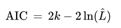

k 是预测值的数量(图片来自[维基百科](https://en.wikipedia.org/wiki/Akaike_information_criterion)

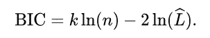

k 是预测值的数量，n 是观察值的数量。BIC 对预测者的数量施加了更重的惩罚(如果 n > 4 ),因此更喜欢简单的模型(图片来自[维基百科](https://en.wikipedia.org/wiki/Bayesian_information_criterion)

然而，因变量 y 的规模对这些指标的影响还没有得到足够的重视。

在这里，我将尝试通过一个模拟数据集来说明。

*(完整练习可在我的*[*GitHub*](https://github.com/miaow27/medium_blogs/blob/main/influence_of_y_on_aic.ipynb)*)*

# 模拟数据设置

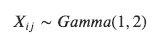

1e4 观测值有 9 个特征，每个特征都遵循伽玛分布

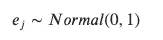

噪声遵循标准的常态

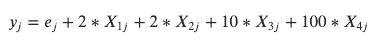

y 实际上是如何产生的。这在现实中会是未知的。

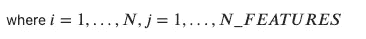

N = 1000，N 个特征= 9

# **场景**

现在，暂时忘记模拟设置。假设我们给出以下数据集:

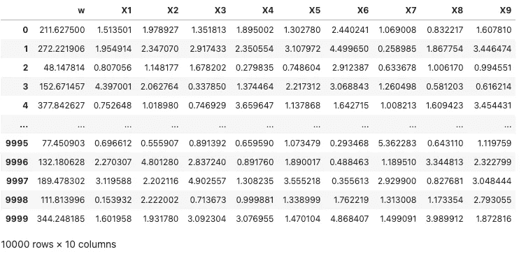

数据集 1

假设经过一些初步的探索，我们确定了两个模型(都是简单的线性回归，但是有不同的特征):

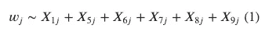

候选模型 1

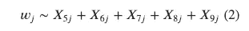

候选模型 2

我们决定使用 AIC 作为模型选择标准。由于模型 1 提供较小的 AIC，我们决定使用模型 1 作为我们的最终选择。

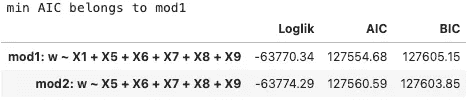

数据集 1 的模型选择结果

现在，假设我们给出另一个数据集，具有不同的结果，但具有相同的特征空间。再次，我们决定使用 AIC 和测试相同的上述模型。

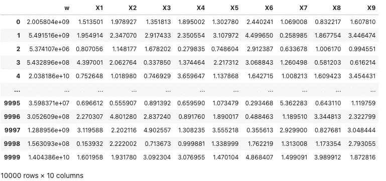

数据集 2

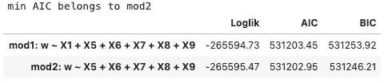

数据集 2 的模型选择结果

这一次，模型 2 的 AIC 更小。

所以，这是目前发生的事情:我们给定两个具有相同特征空间的数据集。数据集 1 对于候选模型 1 具有较小的 AIC(*w ~ x1+X5+X6+x7+x8+x9*)，而数据集 2 对于候选模型 2 具有较小的 AIC(*w ~ X5+X6+x7+x8+x9*)。

# **惊喜惊喜~**

现在，看看这个大发现:

在数据集 1 中:w = y

在数据集 2 中:w = y⁴

既然这是模拟数据，我们知道 *y* 只取决于 *X1，X2，X3，X4* 。然而，**通过改变 y 的比例，我们发现 AIC 实际上会更喜欢模型 2** ( **它不包含任何真正的预测器**！！).

# **结果的尺度变化水平**

如果我们对每个不同的数据集重复这一过程，结果变量 *w* 以如下方式创建:

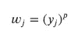

上例针对 p=1 和 p=4

当 p ≥ 3.5 时，AIC 开始选择错误的模型。**换句话说，结果中的噪声掩盖了来自该点特征的真实信号。**

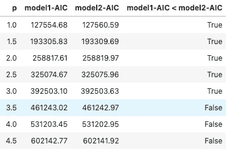

每条线代表新数据集(wj，x1j，…，x9j)上的模型选择结果，其中 wj = yj**p

# 如果 X1 对 y 的作用强 10 倍呢？

回想一下 X1 对 *y* 的作用并不太强。

*y =****2***** X1+2 * X2+10 * X3+100 * X4*

**如果我们增加 y 和 X1 的关系会怎么样，**比如说 10 次？

*y =****20***** X1+2 * X2+10 * X3+100 * X4*

当 p ≥9 时，模型 2 具有较小的 AIC

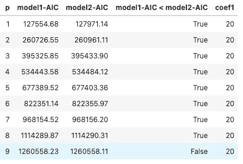

同样的练习，在一个新的数据集上，X1 对 y 的影响比以前强 10 倍

这意味着结果的规模可能会影响 AIC 选择正确模型的准确性。然而，如果特征的影响很强，那么模型将更不容易受 y 的比例的影响。

# **结论**

当使用 AIC、BIC 等指标进行模型选择时，我们需要小心，尤其是当候选模型的值**相对接近**时。

> 我们如何知道值是否接近？我们可以对结果施加一些影响(例 3 或例 4 ),看看首选型号是否互换。

我们还证明了不同的 y 值可能导致不同的选择结果。然而，如果 X 的影响更强，则选择结果的准确性将更稳健。

# **参考**

 [## 阿凯克信息准则

### 赤池信息准则(AIC)是样本外预测误差的估计量，因此相对质量…

en.wikipedia.org](https://en.wikipedia.org/wiki/Akaike_information_criterion)  [## 贝叶斯信息准则

### 在统计学中，贝叶斯信息准则(BIC)或施瓦兹信息准则(也是 SIC，SBC，SBIC)是一种…

en.wikipedia.org](https://en.wikipedia.org/wiki/Bayesian_information_criterion)