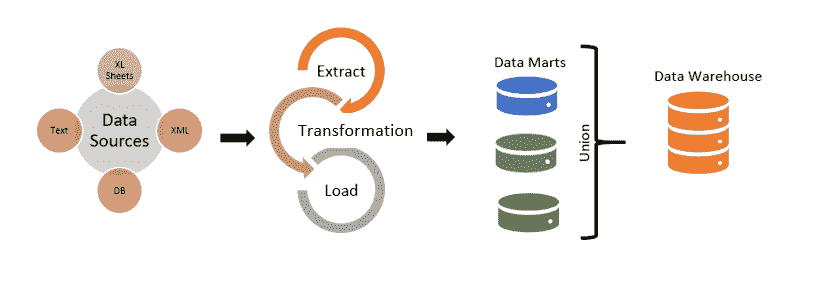

# Inmon & Kimball:数据仓库&他们的观点！

> 原文：<https://medium.com/analytics-vidhya/inmon-kimball-datawarehousing-their-views-579291acdf08?source=collection_archive---------4----------------------->

在 [Unsplash](https://unsplash.com?utm_source=medium&utm_medium=referral) 上由 [Carlos Muza](https://unsplash.com/@kmuza?utm_source=medium&utm_medium=referral) 拍摄的照片

在数据分析领域，特别是在 BI 分析领域，每当我们谈到数据仓库时，我们都会遇到“数据仓库之父”比尔·恩门爵士和 Kimball 集团创始人 Ralph Kimball 博士之间的激烈辩论。在一个典型的数据仓库中，我们从一组 [**OLTP**](https://www.ibm.com/cloud/learn/oltp) 数据源开始。这些可能是 Excel 表格、ERP 系统、文件或基本上任何其他数据源。数据到达暂存环境后， [**ETL**](https://www.geeksforgeeks.org/etl-process-in-data-warehouse/) (提取、转换、加载)工具对数据进行处理和转换，然后馈入数据仓库。现在，比尔·恩门和拉尔夫·金博尔对这种数据仓库生命周期的不同看法如下…

***【比尔·恩门(Inmon 方法)***:——比尔·恩门推出的方法被称为数据仓库的 Inmon 方法。按照他的说法，数据仓库是一个“*****非易失性*******综合型*******时变型*** *数据集合，以支持管理层的决策*他是第一个写书、召开会议、在杂志上写专栏、开设数据仓库课程的人。他的方法可以理解为更加面向企业数据模型。它关注客户、产品和供应商。按照 Inmon 的说法，数据应该在 ETL 过程之后直接输入数据仓库。然后可以根据业务流程的不同专业/部门，将数据转移到几个 [**数据集市**](https://www.talend.com/resources/what-is-data-mart/) 中，馈入报表工具。这种方法更喜欢数据是标准化的形式(3NF)。比尔·恩门的仓储方法是一种自顶向下的方法，它是面向数据的，从数据仓库开始，然后根据部门分解成多个数据集市。它会导致前期的技术工作量，但最终会提供企业级的概述。根据这种方法构建的架构可以如下图所示…****

****

****英蒙方法的示意图****

**在上图中，我们可以看到根据 Inmon 方法的数据仓库步骤，**

1.  **从不同来源提取数据，可能是财务数据、学术数据、业务数据或其他任何数据。**
2.  **接下来在数据转换步骤中所有的数据清理、空值插补、重复数据删除、 [***归一化***](https://www.javatpoint.com/dbms-normalization) 过程都完成了。**
3.  **然后将规范化的数据加载到数据仓库中。**
4.  **根据不同的部门需求，数据从数据仓库进一步划分为多个数据集市，以便在报告和预测分析中进一步使用。**

****优点:-****

*   **数据仓库充当整个业务的统一数据源。**
*   **这种方法具有非常低的数据冗余(由于标准化的数据)。因此，数据更新不规则的可能性更小，使得 ETL 过程更简单，更不容易失败。**
*   **它通过提供整体概述以及根据不同部门的需要将数据区分到多个数据集市中，简化了业务流程。**
*   **这种方法提供了更大的灵活性，因为在业务需求或源数据发生任何变化的情况下，更新数据仓库更加容易。**
*   **它可以处理不同的企业范围的报告需求。**
*   **维护成本较低。**

****缺点:-****

*   **随着时间的推移，随着多个表被添加到模型中，复杂性增加。**
*   **前期工作需要专业熟练的工人和大量的时间。**
*   **初始设置既昂贵又耗时。**
*   **需要额外的 ETL 操作，因为数据集市是在创建数据仓库之后创建的。**
*   **当数据以规范化的形式使用时，由于大量的表、连接和链接，查询变得很困难。**

*****Ralph Kimball(Kimball Approach)*:-**Kimball 在他的数据仓库方法中强调了他的 [***维度建模***](https://www.geeksforgeeks.org/dimensional-data-modeling/) 理论。与 Inmon 不同，根据 Kimball 的说法，提取的数据应该在加载到数据仓库之前存储在数据集市中。他建议使用特定于用户的数据集市来存储来自不同来源的数据。然后在 ETL 过程之后，所有的数据都被转移到数据仓库中。这里在数据仓库中，他使用了维度建模的概念，本质上是*。该模型将数据重新安排到包含数字事务数据的事实表和包含事实表的引用信息或上下文的维度表中。 [**星型模式**](https://www.geeksforgeeks.org/star-schema-in-data-warehouse-modeling/) 是维度建模的基本元素。在这个星型模式中，事实表由几个维度限定。在 Kimball 维度建模中可以构建几个星型模式，以满足各种报告需求。因此，金博尔博士提出的方法可以图解表示如下:***

******

*****金博尔方法的示意图*****

*****优点:-*****

*   ***由于 Kimball 使用维度建模技术，因此不涉及标准化，这使得数据仓库的初始阶段更容易执行。***
*   ***非规范化的数据表单使得数据查询、检索和分析更加容易，耗时更少。***
*   ***由于它专注于特定的业务流程，因此在数据库中占用的空间较少，并且易于管理。***
*   ***根据多星模式生成报告非常成功。***
*   ***构建和管理这种数据仓库需要较少的技能，因为数据源非常稳定，管理也更容易。***

*****缺点:-*****

*   ***由于它专注于特定的业务领域，整个企业级的数据分析很难实现。***
*   ***在 Kimball ETL 设计中，数据在报告之前没有完全集成；“单一真理来源”的观念已经消失了。***
*   ***由于使用非规范化的数据形式，数据冗余可能是一个大问题。向事实表中添加新的列或特性会导致复杂性。***
*   ***与英蒙的模型相比，这里的维护很困难。***

*****结论:-** 关于这场旷日持久的辩论，我们真的得出结论了吗？可能没有，我们没有，甚至我们不应该！因为他们的观点都是真实的。这两种方法都可以帮助组织在不同的场景下存储和组织数据仓库中的数据。如果我们讨论一家保险公司，我们可以使用 Inmon 方法收集数据仓库中客户的所有相关数据，然后我们可以根据保险类型区分多个数据湖中的数据。类似地，在公司办公室中，Kimball 的方法可以适用于将来自不同部门的雇员的数据存储到不同的数据集市中，进一步地，可以将这些数据集成到单个数据仓库中，以使数据规范化，并在公司内不同级别以及不同部门的雇员之间保持平稳的关系！因此，Inmon & Kimball，这两位伟人都忠于他们的观点。这场辩论并没有让我们产生任何困惑，而是产生了适用于不同用例的两种不同的解决方案。因此，让我们以一种积极的态度结束，平等地接受这两种方法。***

***如需进一步参考，请访问以下链接，这些链接对我组织这篇文章也有很大帮助！***

***【https://www.astera.com/type/blog/data-warehouse-concepts/】link 1-***

****link 2-*[*https://www.youtube.com/watch?v=Tff34jj_V-0*](https://www.youtube.com/watch?v=Tff34jj_V-0)***

***link 3-*[*https://medium . com/cloudzone/inmon-vs-Kimball-the-great-data-warehousing-debate-78 c 57 f 0b 5 e0e*](/cloudzone/inmon-vs-kimball-the-great-data-warehousing-debate-78c57f0b5e0e)**

**你好！！**