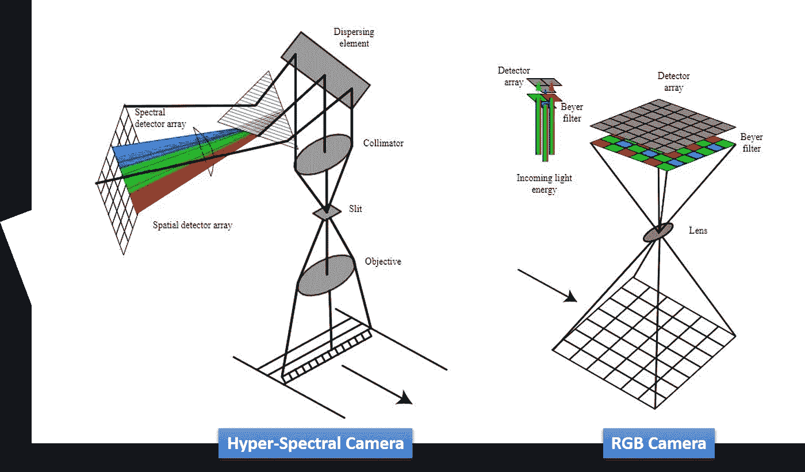
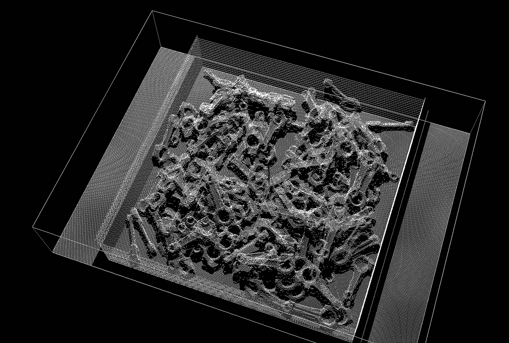
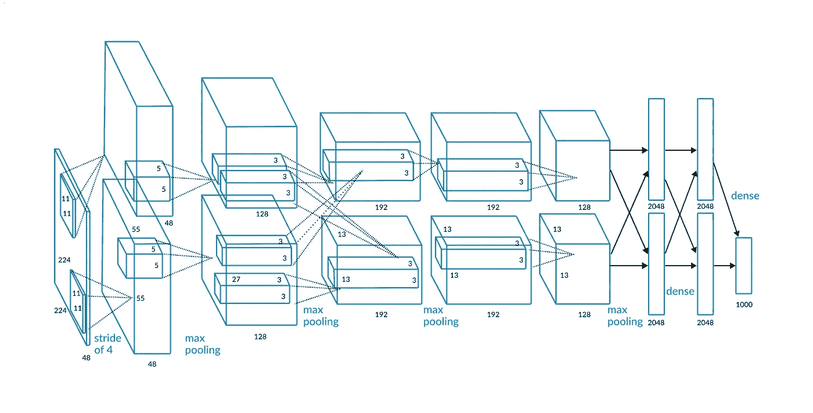

# 机器视觉的创新

> 原文：<https://medium.com/analytics-vidhya/innovations-in-machine-vision-b2c79b90538b?source=collection_archive---------11----------------------->

机器视觉是一项在原始能力和为包括制造业在内的许多不同行业增加价值的能力方面都在持续增长的技术。这主要是由于执行机器视觉应用所需的计算硬件能力的增加的能力和更低的成本。今天，有几家机器视觉公司为广泛的制造业务提供价值，从汽车到物流，以及两者之间的任何地方。

从 2009 年到 2019 年，北美机器视觉市场的总金融交易量从每分钟

Machine vision (MV) uses various algorithms to modify and analyze 2D digital images to automatically segment, detect, locate, measure, classify, etc. objects within an image. The classic MV application is defect detection, which can be done at over [1000 个零件](https://youtu.be/VGv0bMGQmSo?t=80)增长到对生产的每个产品进行 100%的实时检测，而不仅仅是每 100 个或 1000 个中的一个。这一成就是现代计算机硬件难以置信的处理速度的直接结果。这是一场真正意义上的革命，具有深远的影响，尤其是在食品和制药行业，错误可能会危及生命。

机器视觉的最新创新之一是使用超光谱(HS)相机，它能够收集场景的全光谱数据。HS 相机采用常规的 CMOS 2D 成像传感器，但包含一个棱镜或光散射装置，该装置经过精确调整，可将相机接收到的光谱投射到图像传感器的一个维度上。这使得传感器的一个维度是位置维度(例如在传送带上从左到右)，另一个维度是光谱维度(IR-UV)。由于 HS 相机工作的性质，它们必须让场景在它们下面移动(传送带)，或者相机本身必须在场景上移动(无人机/机器人携带)，并且成像的每个切片与传送带的位置或无人机/机器人的位置相结合，以产生场景的 2D 全光谱表示。使用场景的全光谱信息比使用仅包含红、绿、蓝信息的传统彩色图像更容易识别和区分材料和物质。

[T3【http://commons.wikimedia.org/wiki/User:Arbeck】T5](http://commons.wikimedia.org/wiki/User:Arbeck)

HS 在自动回收和食品加工方面已经真正起飞。在 HS 摄像机系统的输出中，很容易识别某些材料或食品缺陷的光谱特征。这些材料或缺陷的位置信息可以被工业机器人用于处理或去除有缺陷的物品，或者被固定的自动翻板系统或空气喷射器用于从肉眼看来可能是同质产品的连续流中排出目标物品。一个很好的例子是[杏仁分拣机&分级系统](https://youtu.be/BkIKBf8uSbQ)，该系统使用[端壁](http://www.headwallphotonics.com) HS 成像传感器和 FANUC 德尔塔机器人来定位并移除异物(非杏仁)和内含大量碎屑的杏仁。HS 成像也用于农业行业，方法是将 HS 相机连接到无人机上，并飞越大型农业综合体。在这种情况下，HS 图像可用于轻松识别哪些作物生长在哪些田地中，以及这些作物是茁壮成长还是苦苦挣扎。

虽然 2D 成像提供了大量的信息，并且是目前用于 MV 应用的主要技术，但是有几种不同的 3D 技术产生场景的近实时 3D 表示，这些技术开始被各种制造应用所接受。

3D MV 始于几种不同类型的 3D 摄像机中的一种，这些摄像机主要分为两类——被动式和主动式。被动 3D 技术涉及使用算法来分析从两个或更多 2D 相机观察到的同一场景，这些相机的位置是精确已知的。通过分析两个或多个 2D 图像，算法可以找到两个或多个图像中的对应点，这些对应点是场景中的同一点。一旦定位了对应点，就可以使用相机的精确位置和每个图像中该点的校准位置来计算其精确的 XYZ 位置。对于被动立体声，需要有一定量的局部变化或纹理，以便相应的算法发挥作用。

对于主动立体，使用某种类型的结构或编码光来人为地向图像添加纹理，以促进对应匹配，通常会导致计算更多的 3D 点。3D 相机系统的输出通常被称为点云或深度图像。点云是一系列 XYZ 值，详细描述了系统相对于某个参考框架(通常是相机本身)发现的每个测量位置。深度图像是 2D 灰度或彩色图像，其中像素值表示距相机的距离。白色更近，黑色更远，灰度介于两者之间。或者，红色更接近，蓝色更远，传统的彩虹色介于两者之间。3D MV 算法能够分析来自同一场景的深度图像或点云，或者有时同时分析两者，从而为应用程序输出所需的信息。

FANUC iRVision 3DA/1300 点云

MV 主要用于实时检查以及机器导航；然而，与检查相比，历史上用于机器导航的 MV 数量相对较低。MV for machine guidance 用于在真实空间中定位零件，以便某种类型的可编程机械手进行处理或加工。当机器是现代工业机器人时，这被称为视觉引导机器人或 VGR。由于 VGR 有能力使工业机器人更加灵活，它正迅速成为 MV 市场的一个大的利基市场。工业机器人是令人惊讶的可重复可编程机械手，有各种形状和大小。六轴工业机器人能够在全 3D 中操纵其工具，这意味着它可以在其工作范围内实现 3D 空间中的任何方向。VGR 始于 2D MV 技术，这意味着一个零件可以在两个维度和一个方向角上定位，通常称为 X、Y 和 R(关于 z 轴的角度)。机器人在 2D 定位零件的能力为各种应用提供了许多优势，包括更高的灵活性和更低的部署成本。在 2D VGR 之前，实现连续和可重复的零件展示需要为每个零件样式定制昂贵的夹具。

随着所有主要 MV 摄像机原始设备制造商提供的许多 3D MV 技术的出现，以及一些机器人原始设备制造商提供完全集成的机器视觉技术，如 [FANUC 的 iRVision](https://www.fanucamerica.com/products/robots/vision-products) ，3D VGR 正迅速成为一个完全属于自己的市场。3D VGR 的杀手级应用是捡垃圾箱，它被称为 VGR 的圣杯。箱柜拣选应用涉及一个工业六轴机器人，以结构化或完全非结构化的方式移除位于箱柜中的零件。如今，对于许多制造流程来说，剩下的唯一手动流程就是将零件从箱子中装载到系统中。面元拾取的挑战不仅在于 3D MV，还在于机械臂末端工具。当一个特定的部分可以在一个箱子里以无数种方式呈现时，你如何处理它？通常采用两步法，机器人从箱子中取出一个或多个零件，然后将它们放入第二个工序，在第二个工序中，2D MV 可用于为机器人提供精确的位置，以重新拾取零件并将其装入下一个制造工序。

一个很好的例子是 [FANUC 美洲](https://www.fanucamerica.com/)为一家大型汽车原始设备制造商执行的[凸轮轴仓拣选流程](https://youtu.be/2_MgcloGJ4U)。这个过程最初是机器人操作的，但是没有视觉引导。机架被设计成将原始凸轮轴保持在可重复的堆栈中，机器人将严格依靠可重复性和硬编码偏移来处理这些堆栈。这种系统经常发生故障，因为原始铸造的凸轮轴不会总是平放在彼此的顶部，有时齿条不是按规格制造的。原始设备制造商决定使用 FANUC R-2000iB/165F 六轴机器人和 FANUC iRVision 3D 区域传感器来尝试两步箱柜拾取过程，以在简单的钢制箱柜内定位以半结构化方式堆叠的凸轮轴。机器人将利用这个位置来引导它的[磁开关](https://magswitch.com/product-category/automation-products-archive/)磁性工具从箱子中取出一个凸轮轴。然后，取出的凸轮轴将被放入第二个 2D 视觉台，在那里，固定的 FANUC 红外线视觉 2D 摄像机将为机器人提供精确的位置，然后重新拾取凸轮轴并将其装入去毛刺机。有时，第一步会抽出两个凸轮轴，这将在二级 2D 视觉台上检测到，这些零件会自动弹出到地板上，因为不可能在台上正确处理两个零件。随着时间的推移，磁控开关磁性工具的改进使得双重选择非常罕见。总的来说，新系统比以前的系统表现得更好，并为原始设备制造商的流程提供了许多优势。由于箱柜容纳的零件数量是货架的五倍，因此交换频率减少了五倍，从而减少了叉车的流量。一旦对拣货流程进行了微调，系统的整体运行效率从 70%提高到 90%，甚至更高，这主要是因为系统停机次数大幅减少。

使用 FANUC iRVision 3DA/1300 区域传感器拾取凸轮轴箱

目前，深度学习是应用于机器视觉的最令人兴奋、或许也是被过度宣传的技术之一。深度学习是一种机器学习，属于非常广泛的人工智能或人工智能范畴。2012 年，一个名为 [AlexNet](https://papers.nips.cc/paper/2012/file/c399862d3b9d6b76c8436e924a68c45b-Paper.pdf) 的深度卷积神经网络(D-CNN)能够识别 120 万张图像中的 1000 个不同项目，错误率为 15.3%，用于年度 [ImageNet](http://www.image-net.org/) 大规模视觉识别竞赛。与上一年的比赛冠军相比，AlexNet 是一个巨大的进步，从那时起，AlexNet 的基本方法和设计得到了改进和扩展，其继任者在 2015 年的图像分类任务中击败了人类。AlexNet 及其继任者的巨大成功是人工智能一词在今天几乎无处不在的主要原因，当谈论任何涉及计算机辅助决策的新创新时。

AlexNet D-CNN 网络设计

深度卷积神经网络通过将图像分解成越来越小的连接数据区域(彼此相邻的像素)来工作。D-CNN 的训练是通过向网络显示成千上万具有已知分类的示例图像来完成的。需要如此多的例子来实现良好的结果，并且执行数百万次卷积计算所需的计算量很大。AlexNet 中使用的许多突破性方法之一是使用图形处理单元进行学习和推理计算。在执行 D-CNN 处理所需的计算类型时，GPU 比 CPU 效率高得多。

今天，D-CNN 被用于制造用于质量检测和零件识别的机器视觉。虽然 D-CNN 在某些任务上表现出了巨大的成功，但是 D-CNN 的实现是非常耗时的。正确训练网络所需的标记图像的数量很大，当系统未能正确分类时，没有办法知道它失败的原因。唯一的对策就是多做训练，没有确定的方法知道为了保证 100%的成功已经做了足够的训练。由于这些原因，一些行业对采用基于 D-CNN 的 MV 反应迟缓。

一个示例应用是仓库管理系统，其中 3D 传感器与传统 MV 一起使用，以识别货架上的空白空间。使用便宜得多的 2D 摄像机实现了 D-CNN 方法，与更昂贵的 3D 方法的 2.56%相比，结果误差率仅为 0.29%。另一个成功的 D-CNN 应用是为一家大型汽车原始设备制造商设计的，他们希望验证成品皮卡上是否安装了正确的踏板。考虑到运行板的种类繁多以及其中一些之间的微小差异，传统的 MV 在这种确认任务中并不成功，但是 D-CNN 方法被证明是非常准确和快速的，可以确认正确的安装。

许多 MV 硬件和软件 OEM 开始在其工具集中提供基于 D-CNN 的工具，使传统 MV 程序员能够将这项新技术融入他们的解决方案。

机器视觉继续为所有行业提供巨大的价值主张，尤其是制造业。虽然深度学习方法已经开始为某些任务轻松部署 MV，但从 MV 中实现价值的最佳方法是与专业的 MV 集成商合作，其中一些集成商在 [AIA 网站](https://www.visiononline.org/meet-our-certified-system-integrators.cfm)上列出。那些对成为视觉专家感兴趣的人，或者想了解更多关于 MV 技术方面的知识的人，AIA 还提供了一个[认证视觉专家](https://www.visiononline.org/vision/certified-vision-professional-program)培训项目。