# 在一辆有自己思想的汽车里

> 原文：<https://medium.com/analytics-vidhya/inside-a-car-with-its-own-mind-960d792c3b42?source=collection_archive---------1----------------------->

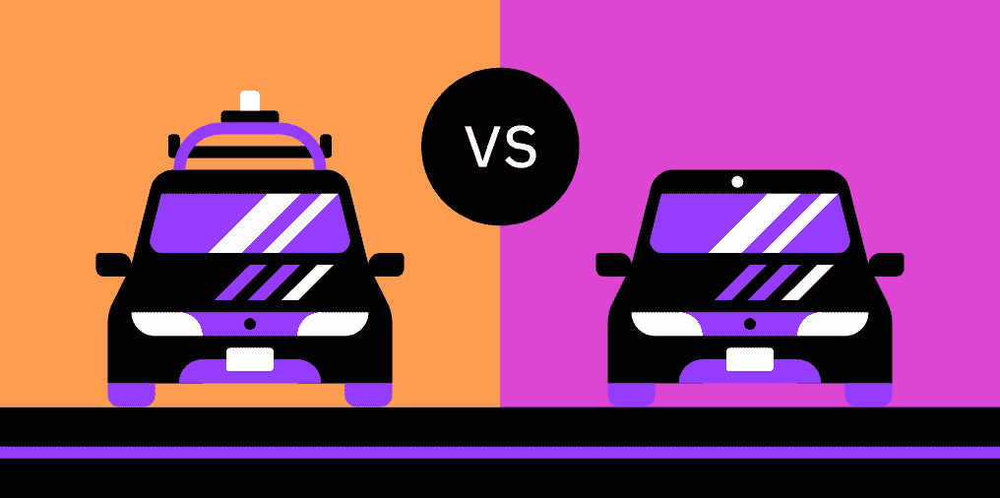

## **激光雷达 vs 计算机视觉讲解**

想象一下如果你没有眼睛。👀

当然，现在如果没有任何帮助，你就看不见了。你可以用一只狗或盲人拐杖来帮助，但你受伤的可能性仍然很高，汽车也是一样。汽车就像没有眼睛的你；他们需要有人帮忙做他们的眼睛。

现在，**每年有 135 万**人死于车祸，因为他们没有做好在汽车眼中的工作，所以人们决定解决这个问题。人们创造了自动驾驶汽车或自动驾驶汽车，这些汽车有眼睛和良好的大脑(尽管它仍然像人类一样，因为它需要首先学习)。

自动驾驶汽车是它的名字；它自己会开，但是怎么开呢？当然，就像我们需要我们的感官才能生存一样，这些汽车需要某种方式来检测它们的周围环境才能生存，所以它们使用不同的摄像头。汽车可以通过多种方式看到东西，因为它可以使用雷达、摄像头、无线电和超声波。当然，任何交通工具都不可能打开摄像机就移动；它需要人类的帮助。

我写了另一篇关于自动驾驶汽车介绍的文章。下面是一个快速回顾:

**回顾:** 五大物理特性让车辆实现自主驾驶:

1.  计算机视觉
2.  传感器融合
3.  本地化
4.  路径规划
5.  控制

计算机视觉和传感器融合一起工作，以获得对环境的理解。定位使用引导点来检测它在哪里和去哪里。路径规划就是检测它能开到哪里，应该开到哪里。控制就是将信息结合到*控制* 它想做什么。

如果你想了解这个主题的更多信息，可以阅读我的另一篇文章，这篇文章讨论了自动驾驶汽车的基础知识:(发表后给出链接)

所以你可能会问，“真正的解释在哪里？我是来学习**激光雷达和计算机视觉的？**”，那我们就*直接把*开进去吧🚗！

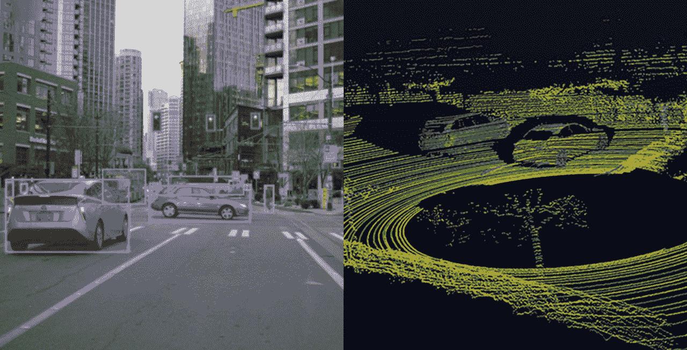

计算机视觉(右)和激光雷达——它们分别是什么样子

# 🖲激光雷达

激光雷达代表**李**光 **D** 探测 **A** 和 **R** 角。你可能之前听说过激光雷达，因为自动驾驶汽车并不是它们的唯一用途。

它们可用于创建高分辨率地图或查看特定区域。在激光雷达成为自动驾驶汽车的主要用途之前，它被用于考古和农业，因为他们需要土地的模型。

激光雷达传感器是一个位于汽车顶部的摄像头，它总是在旋转，提供 360°的视图。在旋转时，它使用紫外线脉冲(有时可以是可见光或红外线)来探测周围的物体。这些脉冲得到汽车和物体之间的距离。它通过测量光返回到传感器本身需要多长时间来获得这个精确的距离。有一个具体的公式是:

**( D = (Et x c)/2 )**

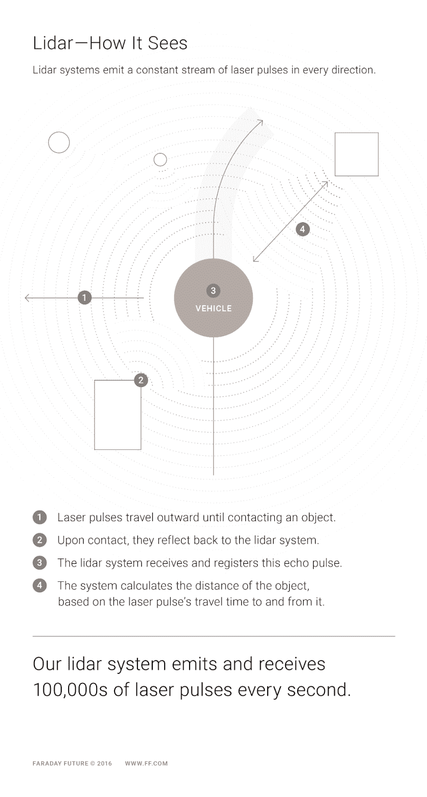

例如，如果激光雷达传感器发现道路中间的交通灯，它会将激光发送回那里，然后记录所用时间的数据**【Et】**。它使用光速**【C】**，然后将两者相乘，再除以 2，得到总距离**【D】。**

这一过程可以在距离相机 60 米的地方工作，并通过每秒发射 100，000 束光束来找到物体的距离。

这样做的意义在于检测汽车是否应该避开任何东西，如行人、道路工程或道路上的几乎任何东西。

例如，如果汽车在路上随机看到一个行人，它可以获得距离并及时减速以阻止碰撞。

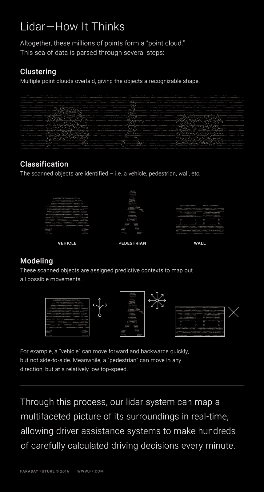

由于激光雷达传感器几乎每秒钟发出数千束光线，它几乎可以创建一个 3d 视觉地图，因为它知道周围的一切。这个地图是使用软件创建的，该软件向汽车提供关于其周围环境的信息。这有助于车辆获得全方位的环境，允许车辆在几乎任何类型的条件下行驶。

激光雷达需要与相机配合使用，因为它无法独自处理所有事情。激光雷达分三步处理。

1.  **聚类。当激光雷达感知到周围事物的大致形状时，它会使物体变得可识别**
2.  **分类。**当事物已经被粗略扫描时，它们就可以被识别和分类。
3.  **造型。**被识别的物体被预测其所有可能的运动。

现在你知道激光雷达是什么，它是如何工作的，许多自动驾驶汽车公司都在使用它。一些最受欢迎和更重要的使用激光雷达制造自动驾驶汽车的公司是:

*   Waymo
*   阿尔戈艾
*   巡航
*   奥罗拉
*   Mobileye

这些公司都是在不同的时间开始的，但 Waymo 是其中最受欢迎的(我将更多地关注 Waymo 最近在激光雷达方面的发展)。Waymo 在 2009 年开始成为自动驾驶汽车项目，谷歌是其母公司。Waymo 过去也与沃尔沃等一些卡车和汽车公司合作过。与特斯拉(我将在后面讨论)不同，Waymo 的车辆还没有在全国范围内上路，仍在开发中。Waymo 目前处于自动化的第 4 级，这是完全自动化之前的倒数第二级。

如果你不知道，有 5 个自治级别:

1.  **没有自动化/驾驶员辅助** —你需要一个真正的驾驶员来驾驶，因为没有自动驾驶
2.  **部分自动化** —汽车可以自己移动，但司机需要全程离开，并准备好接管
3.  **有条件自动化**——车辆仍然可以自动驾驶，但驾驶员接管的可能性非常低
4.  **自动化程度高** —车可以独立，但司机还是要留在驾驶座上以防万一
5.  **全自动化** —司机可以变成乘客

Waymo 仍在努力实现完全自主。Waymo 汽车通常在亚利桑那州的凤凰城。在德克萨斯州的奥斯汀、加利福尼亚州的山景城和亚利桑那州的凤凰城，有超过 25，000 辆自动驾驶汽车。Waymo 总共在世界上行驶了 50 亿英里。

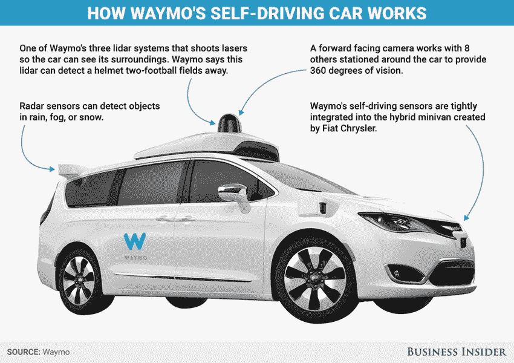

Waymo 的汽车如何工作

**💡TL；博士:**

*   LiDAR 代表**李** ght **探测**A**d**R 安歌
*   激光雷达以前已经存在，但没有用于这一目的
*   利用激光，它可以创建其环境的 3d 地图
*   它每秒钟向一个物体发送数百万束光来计算距离
*   它使用**聚类、分类和建模**来检测它的周围环境
*   最著名的自动驾驶汽车公司之一是 Waymo，它处于第 4 级自主状态

# **📷计算机视觉/摄像机**

当你试图想象带摄像头的自动驾驶汽车是什么样子时，想象一下一个令人讨厌的婚礼摄影师。嗯，也许在车辆的四周增加一些小的。

我想说的是，这不同于激光雷达。

如果你在阅读上面的内容时注意了，你会知道激光雷达使用激光来寻找距离及其周围环境。在这种情况下，摄像机都是可视的，不依赖于测距或检测。这些相机提供图像，人工智能编程软件以高精度分析它们。为了帮助你想象，摄像机或传感器分布在汽车的四周，以获得周围环境的 360*视图。

与激光雷达不同，它使用视觉数据，然后使用计算机视觉、机器学习和人工智能对这些数据进行处理。要检测图像，有两个主要步骤:

**物体分类+物体定位=物体检测**

**物体分类:**

图像分类是找出图像中的特定对象的过程。这可以探测到周围事物的大致范围，比如行人或自行车。然后，在图像定位的帮助下，它通过使用方框(如下所示)来提供对象的准确位置

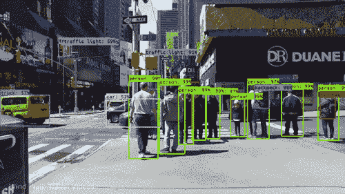

计算机视觉图像的最终结果

由于汽车不是人，不能自动知道车辆是汽车，所以需要对它进行训练。为了训练软件执行图像分类，他们训练了一个**卷积神经网络**。别担心，这并没有看起来那么难理解。

一个 **CNN** 是一种特定类型的人工神经网络，用于像素化数据(或在线图片，因为它们只是由像素组成)的图像识别。神经网络是一种基于人脑神经元的软件程序，用于复制我们如何识别或评估事物。

如果你还是迷失了，那我们就把它带到一个更小的范围。如果我给你一个苹果和一个香蕉，你怎么知道哪个是哪个？你先给出特征；例如，苹果是红色的，圆圆的，香蕉是黄色的，长长的。虽然都是水果，你还是搞清楚了。当你更小的时候，你可能第一次看到苹果，那时候你才知道这个东西，一个可食用的红色的东西，是苹果。随着年龄的增长，你开始获得更多关于不同品种苹果的知识，以识别其他水果。

就像你的大脑一样，CNN 被训练来识别不同的物体。然后，CNN 通过过滤器来挑选可能的东西(卷积)。

有时，当图像太大并且靠近相机时，你可以使用滑动框来扫描图像，这被称为**滑动窗口算法**。当查看图像时，它会通过卷积神经网络，并识别图像中的主要对象是什么。如果它显示天空或道路，它将被认为是一个错误的预测，因为它不是必要的。如果它显示有用的东西，如行人或汽车，这将是一个准确的预测。

滑动窗口算法是一个非常缓慢和耗时的过程，因此有另一种方法来更快地分类更大或更小的图像。这个过程被称为✌️.不，我说的不是短信里的 YOLO，我也没有拼错 yoyo。YOLO 代表**Y**O**O**only**L**ook**O**nce。

这意味着它只需通过 CNN 一次，就能被快速处理。它将整个图像变成一个网格，并识别关键区域。这使用线索来找出图像中的关键对象。在这个过程中，他们使用类别概率图，该图增加了不同对象可能在图片中的位置的粗略识别。使用 YOLO，它更具成本效益和更少的时间消耗，但也给出了一个很好的结果。

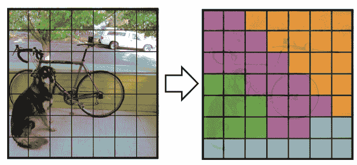

图像对象识别之前和之后的 YOLO

**物体定位:**

目标定位是该过程的第二步。这一步是找出我们试图在网格中识别的对象的确切位置。

有一个专门的程序/算法来做这个过程，叫做**非最大抑制**。这是您将边界框结果(主要的粗略轮廓)与实际边界框进行比较的时候。当我们比较这两个结果时，它们会找到图像的最佳轮廓来匹配边界框。该数字试图最接近预测框。

在训练 CNN 看到并预测边界框之后，你可以用图像本身来测试它，给你多个网格单元和多个边界框。重复上述过程，试图找到最接近实际框本身的边界框。在通过非最大值抑制算法处理图像之后，盒子将会捕捉到最佳结果。

至于结果，用物体欺骗和定位，我们得到正式的结果。

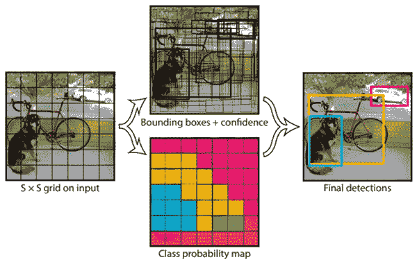

目标检测的全过程

你可能听说过特斯拉，一家制造汽车的科技公司。这家公司还制造自动驾驶车辆，并专门使用计算机视觉/相机来检测其周围环境，而不是激光雷达。特斯拉在 2014 年首次公布了其第一款自动驾驶汽车。从那时起，他们就处于自治的第二级，即部分自动化。你可能会奇怪为什么这么大的公司还在这个阶段，但这不是重点。

特斯拉正在试图找出具有成本效益和效率的方法来生产自动驾驶汽车。与 Waymo 不同，他们已经有更多的汽车上路，并且增长迅速。特斯拉曾表示，目前达到第 5 级自治“被视为一个遥远的目标”。

**💡TL；博士:**

*   **物体分类+物体定位=物体检测**
*   物体分类就是找出图像到底是什么
*   物体定位是预测它能去哪里和它确切在哪里
*   目标检测是找出所有需要的与汽车相关的信息
*   所有这三个组件构成了汽车了解环境的计算机视觉

# **🦾哪个好？激光雷达 vs 计算机视觉**

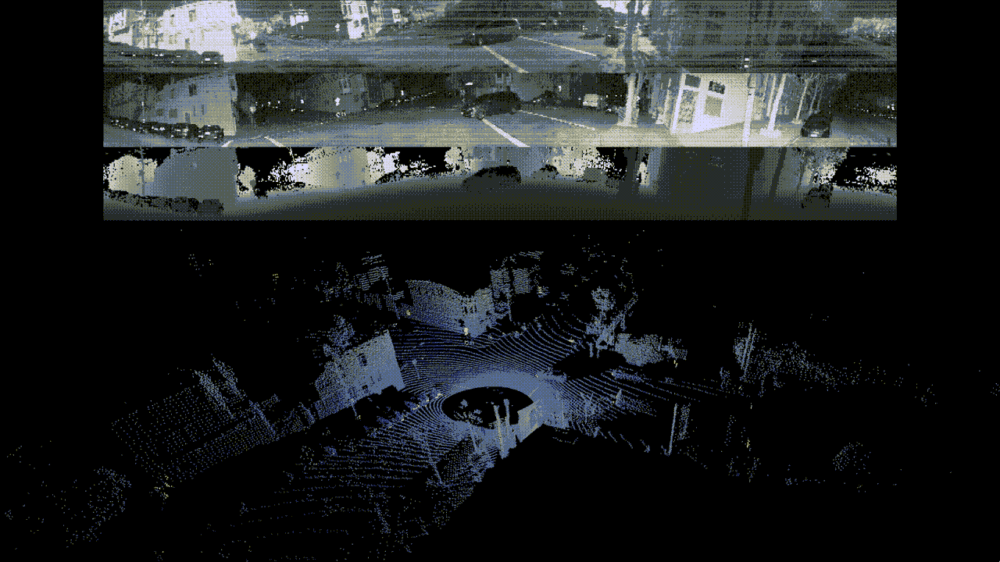

摄像机(上图)和激光雷达实时看起来是什么样子

为了决定我们的赢家，我们首先需要看看他们的优势和劣势。

**优点**

如你所知，激光雷达使用光脉冲实时创建虚拟地图。这意味着我们一直都在得到结果，确保赛车行驶平稳。这些数据可以帮助汽车通过避免所有的碰撞点来安全地机动和导航。激光雷达也能够从远处确定不同的物体。提升激光雷达积极一面的一点是它的准确性。

激光雷达技术的用户 Waymo 表示，它甚至能够读取骑自行车的人的手势，试图预测他们可能会去哪里。激光雷达可以看到这些甚至人类有时也会忽略的小细节。

激光雷达的另一个显著优势是它几乎可以给出 3d 效果。这意味着与相机甚至人类的视力相比，它可以通过阴影，阳光，甚至路过的汽车前灯看到。

虽然激光雷达具有良好的视觉或准确性，但它也节省了计算能力。这意味着激光雷达可以告诉一个物体的距离细节和它在哪里。与相机系统相比，它需要先做几个步骤来分析图像，以检查速度和距离。

一些公司已经使用激光雷达，但著名的汽车制造商也使用它。一个例子是奥迪已经开始在他们的一些汽车上使用前置激光雷达。沃尔沃还表示，他们将在 2022 年推出的一款新车型中尝试使用激光雷达。除了这些较小的公司，激光雷达更多地用于交通方式，而不是消费类公司。

对于相机或计算机视觉，埃隆马斯克(Elon Musk)有一股强大的推动力。他说摄像机是最可靠的视觉系统。他在人工智能的帮助下说话，以识别不同的物体，它比激光雷达更有优势。

当相机与计算机视觉配对时，它提供了计算成像，不断被相机分析。摄像机能做的一件非常重要的事情是从路标上读取特定的文字。这非常重要，因为当自动驾驶汽车发现绕道或施工时，它可以知道在哪里和什么时候停下来。

Elon Musk 一再表示，他不想使用激光雷达，因为他认为相机可以做得足够好。

> “整个道路系统意味着要用被动光学或相机来导航，所以一旦你解决了相机或视觉，那么自主性就解决了。不解决视觉，那就没解决。”-埃隆·马斯克

特斯拉说，他们没有创造全新的东西，而是决定几乎复制人类的眼睛，但几乎变成超人一样。他们通过在汽车周围放置八个摄像头来做到这一点，这可以使它获得完整的视图。他们还使用了雷达和机器学习能力。这使得它的视觉和反应速度比任何会开车的人都要快。

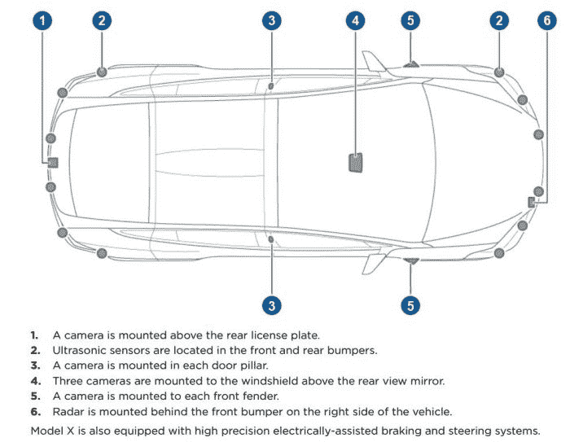

特斯拉使用摄像头的自动驾驶汽车模型

**CONS**

激光雷达的一些更不利的方面是，它有时可能有点滑稽。不，我的意思不是像笑话里那样有趣，而是不太可靠。有时在不同的天气条件下，激光雷达无法 100%清晰地看到，这是一个安全问题。即使它能确定其他物体和它们的距离，它仍然不能改变这个否定的事实。

激光雷达有时会受到**波长稳定性**和**探测器灵敏度**的影响。这意味着激光波长会改变，并受不同温度的影响。这种情况有时会发生，因为信噪比很低。信噪比会影响这一点，因为它会改变激光雷达的传感器，这会混淆一些东西，产生错误的结果。

有时当试图识别物体本身时，激光雷达不如相机有效。它也不能识别街道标志或交通灯的颜色。激光雷达还需要在用于创建图像的软件中进行更多的数据处理。

激光雷达的另一个方面，如果你还不知道，它要贵得多。一个普通的激光雷达传感器的价格高达 1000 美元。当将它放置或连接到汽车本身时，它会使拥有自动驾驶汽车的体验看起来有点笨重。

相机的一些缺点是，尽管它在观察物体方面更可靠，但它不具备激光雷达的范围探测功能。相机更擅长成像，但它们也需要其他技术的帮助来检查所有的强制需求。例如，特斯拉使用不同类型的传感器，包括雷达，来检测距离和范围。

像激光雷达一样，人们说如果有不同的天气条件，相机有时看不太清楚。他们需要比试图驾驶的人类司机更好。这也适用于光站。与激光雷达不同，由于长度不同，相机无法准确捕捉到正在发生的事情。这也是特斯拉在车辆前方使用雷达的原因(+ **雷达比激光雷达便宜多了**)。

与激光雷达相比，不同天气条件下的摄像机

相机的另一个方面是计算机视觉本身。最近，神经网络和机器学习系统无法处理从相机捕捉的大量数据。在最近的发展中，这些程序得到了更多的改进，它们现在能够比激光雷达更好地处理精确的世界输入。

# **结论**

最后的赢家是…没有人！这是一个平局(抱歉欺骗你)。现在，如果你说安全是最重要的(应该是)，那么**传感器融合**是最好的选择。传感器融合是两种传感器不同优点的混合。如果像激光雷达一样把各种传感器结合起来，就能保证最好的安全性。由于激光雷达和相机都使用人工智能软件和神经网络来处理数据，因此它们可以协同工作。

随着技术的发展，不同的算法变得越来越好，准确性和安全性将越来越高。

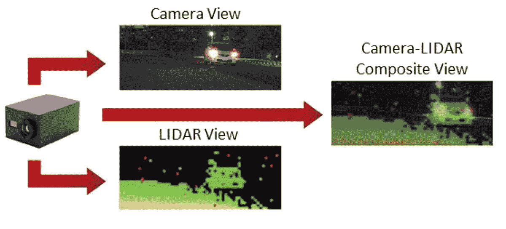

摄像机和激光雷达之间的传感器融合

这不是一件很快就会发生的事情，因为这是一个需要大量探索才能完成的大课题。可能性是无限的，因为在决策或选择方面，机器不必像人类一样。也许在接下来的几年里，会有一些不同的东西主导这个领域。在那之前，我们可以把两者的优点结合起来，形成一个整体。

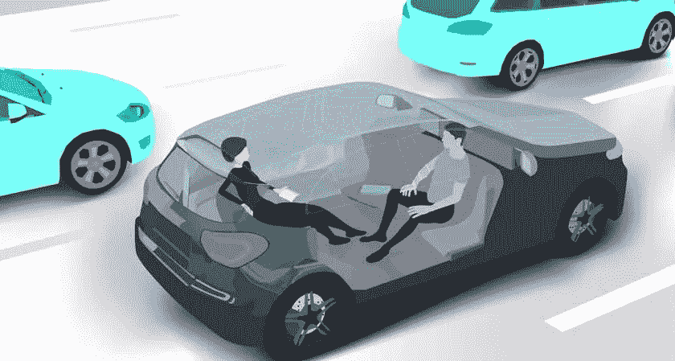

看起来很舒服的车…但是它有多安全呢？！！

如你所见，当你试图给汽车一双眼睛时，你也需要拥有它所有的感官。它不能只对一个项目起作用，因为它们都扮演不同的角色。许多公司仍然不能 100%确定使用什么，或者该技术是否值得他们花费时间。

我希望这让你很好地理解了什么是激光雷达，什么是计算机视觉。如果你喜欢这篇文章，请给**点掌声**。请务必查看我的其他一些文章。
:)