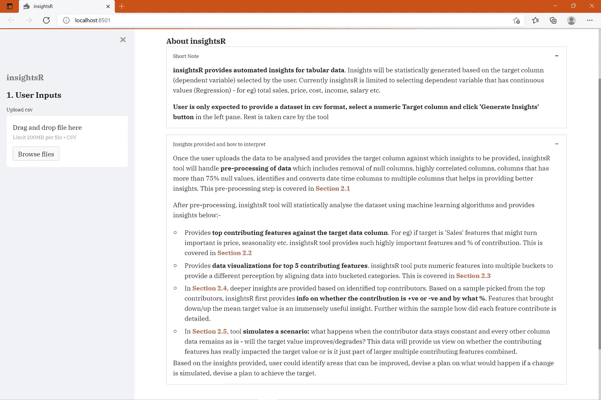
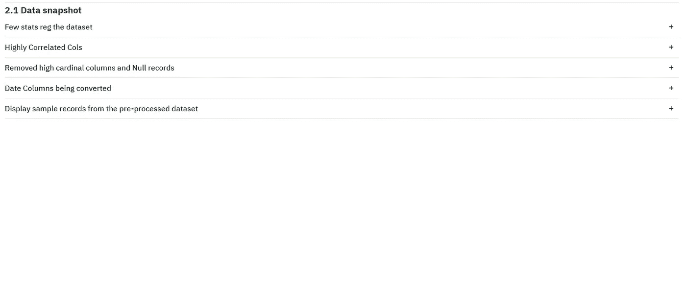
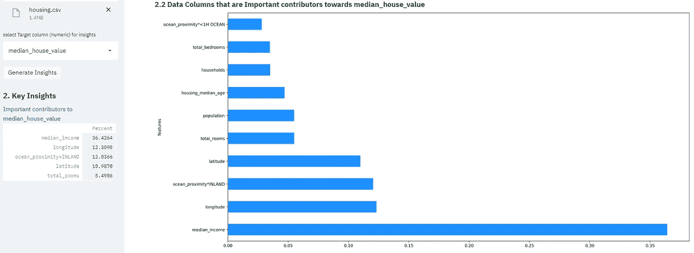
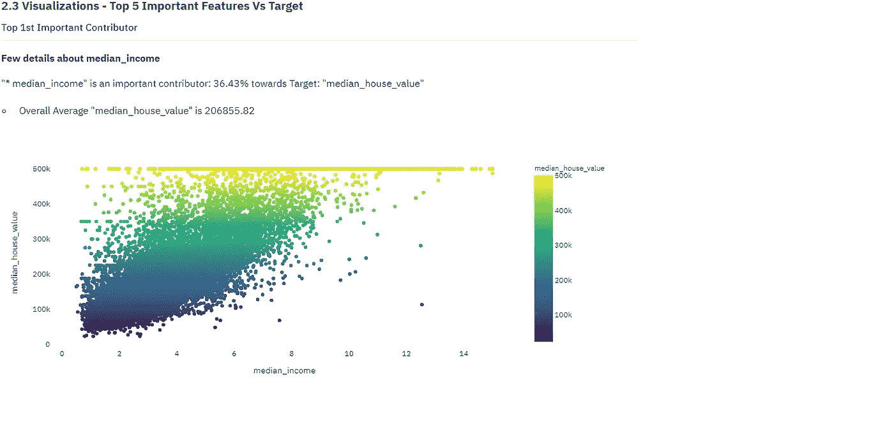
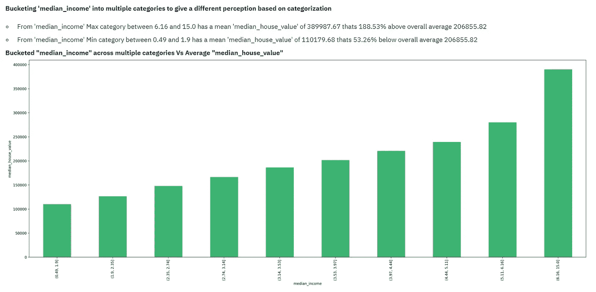
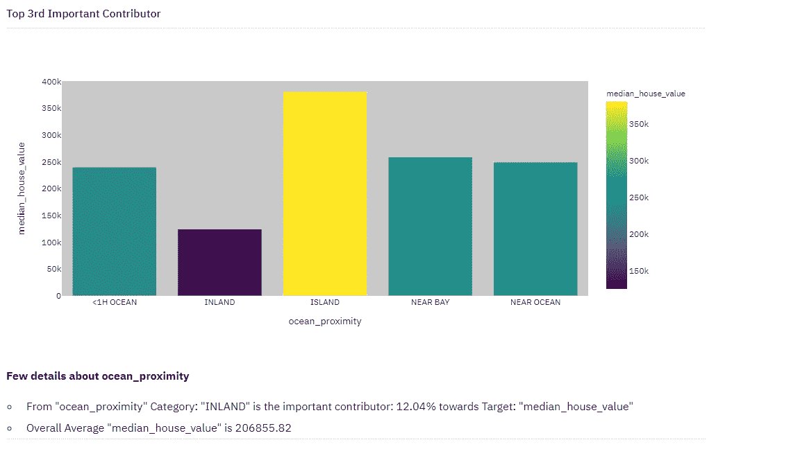
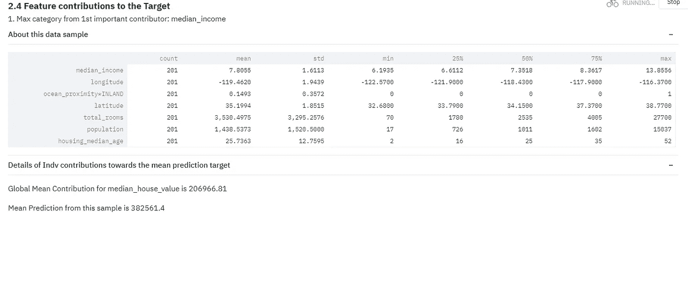
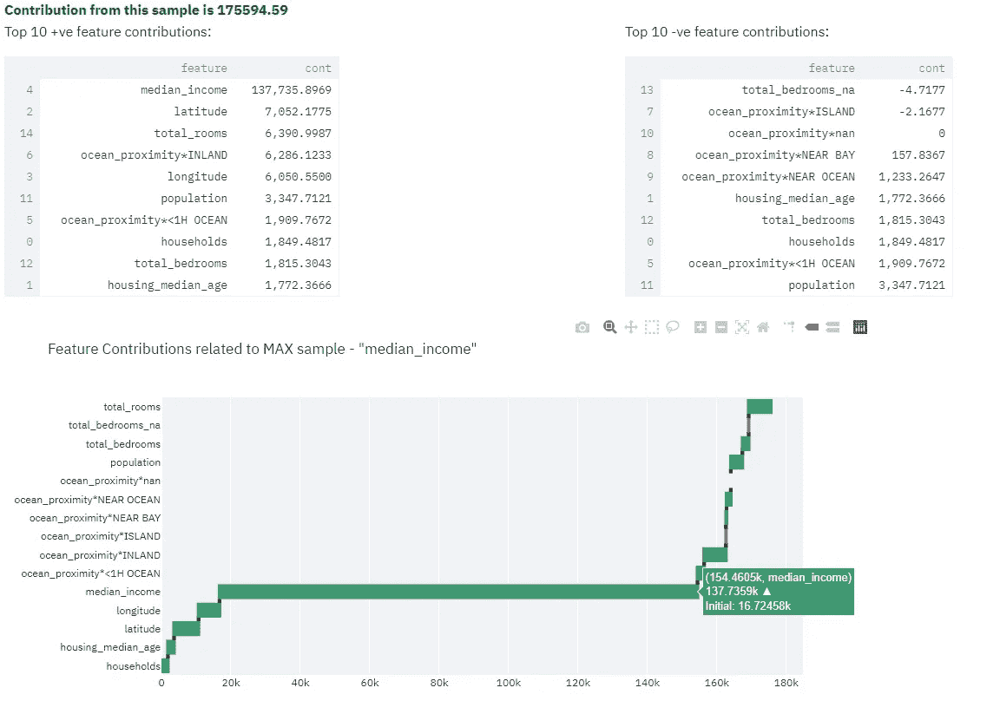
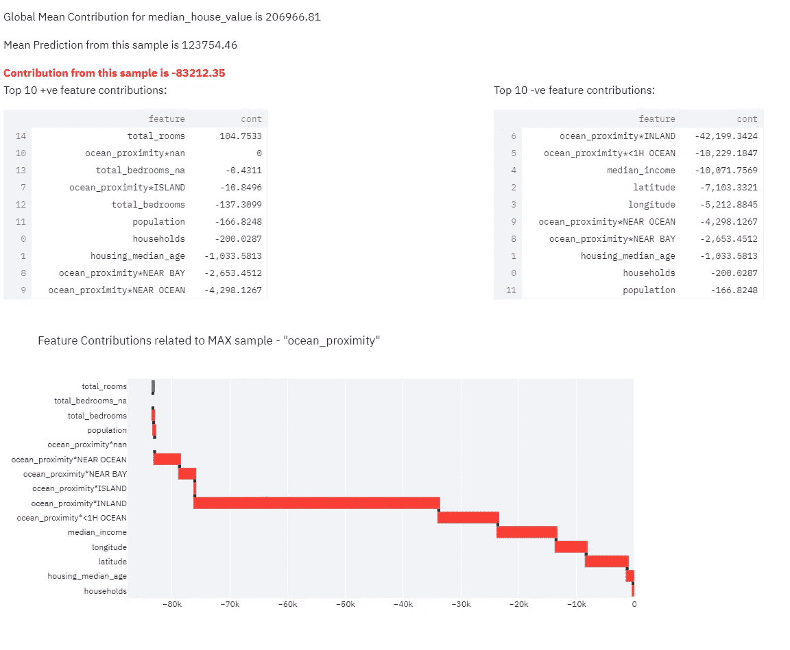
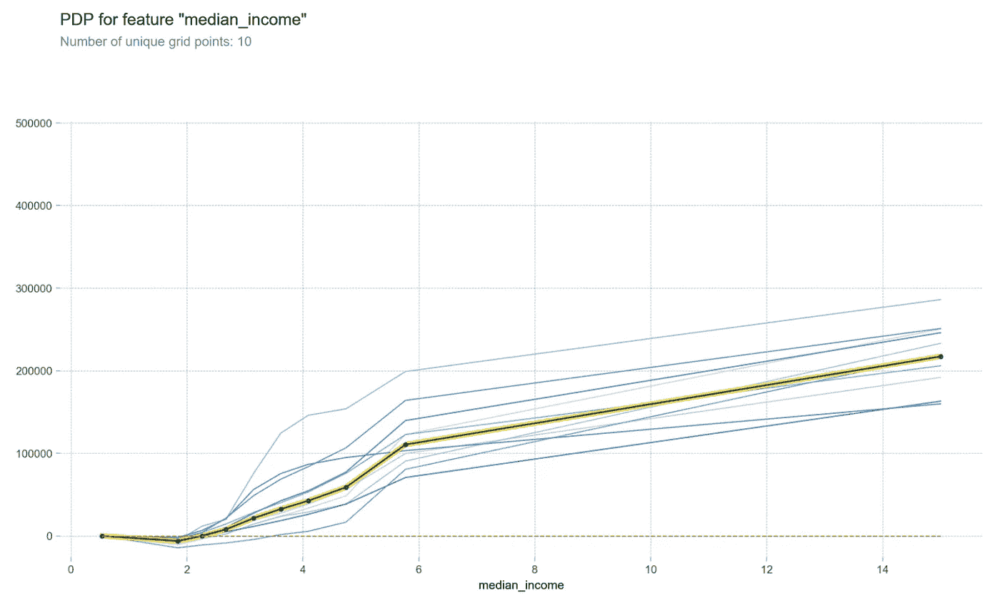

# insightsR —表格数据的自动化洞察

> 原文：<https://medium.com/analytics-vidhya/insightsr-automated-insights-for-tabular-data-8328a67de3ed?source=collection_archive---------2----------------------->

克里斯多夫·伯恩斯在 [Unsplash](https://unsplash.com?utm_source=medium&utm_medium=referral) 上拍摄的照片

**insightsR 是一个开源的 web 应用程序，它提供了对表格数据的自动化洞察**。洞察将基于用户选择的目标列(因变量)以统计方式生成。目前，insightsR 仅限于选择具有连续值的因变量(回归)，例如总销售额、价格、成本、收入、工资等。

**用户只需提供 csv 格式的数据集，选择一个数字目标列，然后单击左侧窗格中的“生成洞察”按钮。** Rest 由应用程序负责。

> **insightsR** 在线[此处](https://insightsr.herokuapp.com)
> 
> **Github** 链接[此处](https://github.com/Vinothsuku/insightsR)

insightsR 主页

## **安装**

来自 github 仓库

> git 克隆[https://github.com/Vinothsuku/insightsR.git](https://github.com/Vinothsuku/insightsR.git)

>光盘。\insightsr

> pip 安装-r 要求. txt

> streamlit run insightsr.py

打开浏览器，转到: [http://localhost:8501](http://localhost:8501/)

## **提供的见解以及如何解读**

一旦用户上传要分析的数据并提供要提供洞察的目标列，insightsR 工具将处理数据的预处理，包括删除空列、高度相关列、空值超过 75%的列，识别日期时间列并将其转换为多个列，如年、周、星期几等，这有助于提供更好的洞察。第 2.1 节介绍了这一预处理步骤

预处理后，insightsR 工具将使用机器学习算法对数据集进行统计分析，并提供以下见解

*   **主要贡献者**:向目标数据列提供主要贡献特征。例如，如果目标是“销售”,可能变得重要的特征是价格、季节性等。insightsR 工具提供了如此重要的功能和%的贡献。这将在第 2.2 节中介绍
*   **数据可视化**:提供前 5 个贡献特征的数据可视化。insightsR 工具将数字特征放入多个存储桶中，通过将数据归入存储桶类别来提供不同的感知。这将在第 2.3 节中介绍
*   **特征对目标的贡献**:在第 2.4 节中，根据确定的主要贡献者提供了更深入的见解。根据从排名靠前的贡献者中挑选的样本，insightsR 首先提供贡献是+ve 还是-ve 以及百分比的信息。降低/提高平均目标值的特性是非常有用的见解。样本中还详细介绍了每个特性是如何起作用的。
*   **数据模拟**:在第 2.5 节中，工具模拟了一个场景:当贡献者数据保持不变，所有其他值保持不变时会发生什么——目标值会提高/降低吗？该数据将为我们提供关于起作用的特征是否真正影响了目标值或者它只是更大的多个起作用的特征组合的一部分的观点。
*   在分析的基础上，用户可以识别可以改进的领域，设计一个计划，如果模拟一个变化会发生什么，设计一个计划来实现目标。

**让我们用一个样本数据集**来探索一下，在这里选择

加州住房数据集具有以下数据:经度、纬度、住房年龄中位数(房屋年龄中位数)、总房间数、总卧室数、人口数(居住在一个街区内的总人数)、家庭数(居住在一个家庭单元内的家庭总数、人群)、收入中位数、房屋价值中位数和海洋邻近度(房屋相对于海洋的位置)。

让我们探讨一下是什么因素促成了中值房价和相关分析。

**2.2 主要影响因素**
通过机器学习模型对数据进行统计处理后，得到影响目标变量的主要影响因素。在这种情况下，它是中位数 _house_value

**2.3 数据可视化**工具根据值自动将数据显示为散点图/条形图。如果是数值，工具会自动将数据分成多个类别，以便了解不同的范围及其相对于目标的值。

在下面的案例中，尽管岛屿类别具有较大的 median_house_value，但工具已确定内陆类别对确定目标值的影响最大。尽管 ocean_proximity 是一个单独的数据列，但工具会自动选取 ocean_proximity 中的每个类别，以向用户显示父类别中的哪些类别比其他 w.r.t 目标更重要

**2.4 特征对目标的贡献**
在这一部分，工具挑选出主要贡献者，挑选数据样本，并提供非常需要的信息，如贡献方向——积极/消极影响。瀑布图中详细描述了样本中的每个特性是如何受到影响的。

Here —对目标的平均贡献约为 207k，而该特定样本的预测值约为 382k。仅来自该特定样品的贡献就约为 175k。这意味着该样本增加了约 175，000 英镑，对中值房屋价值产生了积极影响。随着数据值更接近该样本，平均房价将超过约 175，000 英镑。

在这种情况下，ocean_proximity 内的内陆类别对 median_house_price 产生了负面影响。这个样本中的值已经使房价中位数从 20.7 万降到了 12.3 万。这种见解非常有用。

**2.5 数据模拟**该数据将为我们提供关于起作用的特征是否真正影响了目标值或者它只是更大的多个起作用的特征组合的一部分的观点。
在这种情况下，中值以下的收入对中值房价有非常积极的影响，这在图表中很明显。

使用 [Streamlit](https://streamlit.io/) 库将我的模型作为 web 应用程序共享。

**学分**
——我从 [fast.ai](https://fast.ai) 那里学到了很多东西，这一直是我学习深度学习的 goto。自上而下的教学方法让世界各地的许多学生受益，包括我自己。这个工具主要基于杰瑞米·霍华德教授的机器学习课程。
-向 Kaggle 学习