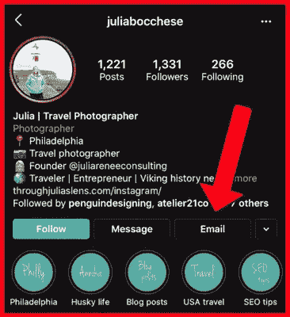

# 用 python 提取 Instagram 关注者数据

> 原文：<https://medium.com/analytics-vidhya/instagram-followers-data-scraping-with-python-ff1f925f53ab?source=collection_archive---------17----------------------->

# 你可以从 Instagram 中提取哪种类型的信息？

你从 Instagram 账户中搜集了哪些数据，比如电话号码或电子邮件地址？

*   关注者总数
*   Instagram 生物
*   Instagram 用户名
*   Instagram 类别(1500 个中的 1 个)
*   位置(10%的用户有国家/城市/街道)
*   无论是公司还是普通的 Instagram 账户
*   员额数

所有信息将帮助您进一步监控数据集。例如，如果您需要在您的关注者中搜索影响者，您可以根据关注者的数量对数据库进行排序。你很快在 Instagram 客户端看到的方法是通用的，可以用来传播与你的品牌相关的信息。

# 如何从 Instagram 关注者那里找到电话号码和电子邮件地址？

一些用户很少知道这一点，但只有 30-40%的 Instagram 处理者在他们的 Instagram 账户上有准确的信息。

有些用户很明智地添加了他们的信息，但有些人没有。

在以下几点中，你将了解如何在 Instagram 上找到电子邮件地址和手机号码:-

*   Instagram 传记:只有 10%的客户有意在个人资料中添加联系信息。有影响力的人、企业和日常用户希望有人能联系到他们，因为他们已经将自己的电子邮件地址和电话号码添加到他们的个人资料中。
*   Instagram 公司账户:只有 30%的 Instagram 客户拥有 Instagram 公司账户。在这种档案中，他们有额外的数据与他们的追随者相关，如参与度%。



# 从 Instagram 关注者那里获取数据的速度有多快？

许多数据提供商收集 Instagram 客户端信息，可以快速提取任何人的 Instagram 追随者的数据。

在让你知道如何自己做这件事之前，我想解释一下为什么有时候把提取外包出去是好的。

市场上有许多 Instagram 电子邮件刮刀工具，因此您可以在提取时验证数据，它们提供了高级瞄准选项，如年龄、性别、位置、兴趣。

# 为什么您需要额外的目标？

吸引 Instagram 的支持者是有针对性的，你可能最终会获得一群与你的公司无关的用户。

*   9000 万的 Instagram 用户是假的。
*   许多用户根本不符合你的理想定位(位置、性别、不同类型的定位或年龄)。

如果你想提取电子邮件用于电子邮件营销，那么对你的活动的影响将是负面的，即巨大的跳出率。

# 为什么需要清理刮掉的数据？

网络抽取意味着你的网中包含了大量的废物。以下是一些例子:

从 Instagram 抓取电子邮件列表可以在两种情况下使用——也可以通过电子邮件发送，或者在脸书广告中作为普通人使用。

一旦你生成你的电子邮件操作，你会抓住各种假电子邮件，有一个机会，你的业务领域可以转换成垃圾邮件。常规电子邮件将被视为垃圾邮件，无法掌握预期的目的地。

如果你作为普通观众导入列表，脸书将帮助你认识到很多联系人是假的，这可能会永久禁止你。

这就是为什么有了 [Instagram scraper](https://www.webscreenscraping.com/instagram-scraping.php) ，我们还可以确认电子邮件，并根据客户档案中的关键词提供额外的目标，如年龄、性别、电子邮件或位置。


# 如何免费提取 Instagram 关注者数据？

如果你的支持者少于 1000 人，你可以自己收集数据。要查看个人资料的更多详细信息，您需要使用 Instagram 应用程序访问所有客户端，即仅限移动用户。

通过将信息复制粘贴到工作表上来收集信息。

我们不建议访问超过 1k 的用户个人资料(你不能这样做)，因为你的帐户将被推迟。

# 用 Python 构建 Instagram 跟随者刮刀

Python 是提取任何东西的最佳方式。

使用 Python 从 Instagram 关注者那里抓取数据。以下是两个简单的窍门

1.  1.提取跟踪个人资料、位置或标签的用户 id(是的，你也可以这样做)
2.  2.提取额外信息，如类别、电子邮件等。)用于收集的所有 id/用户名。

# 抓取 Instagram 关注者(用户信息)列表

如果你需要提取用户名，追随者的，你可以应用下面给出的代码:

```
from datetime import datetime from modules import compare from modules import file_io from modules import stats from modules.scraper import Scraper from modules.utils import ask_input, ask_multiple_option groups = ['followers', 'following'] # Ask for input target = ask_input('Enter the target username: ') group = ask_multiple_option(options = groups + ['both']); print('\nEnter your Instagram credentials') username = ask_input('Username: ') password = ask_input(is_password = True) def scrape(group): differs = False scraper = Scraper(target) startTime = datetime.now() scraper.authenticate(username, password) users = scraper.get_users(group, verbose=True) scraper.close() last_users = file_io.read_last(target, group) if last_users: differs = bool(compare.get_diffs(users, last_users)) if (differs or not last_users): file_io.store(target, group, users) # Stats stats.numbers(len(users), scraper.expected_number) if (differs): stats.diff(users, last_users) print('Took ' + str(datetime.now() - startTime)) if (group == 'both'): for group in groups: scrape(group) else: scrape(group)
```

这是很难刮到特定关注者的 Instagram 账号的。

用这种技术分析拥有大量追随者的用户资料将很难提取。对于次要帐户，它必须完成工作。

执行此操作的所有需求如下:

*   点
*   还有，Instagram 凭证登录
*   Python 3
*   安装了 Chrome

# 收集关注者信息(类别、电子邮件)

如果您只需要提取 Instagram 用户档案中追踪特定账户的列表，那么您可以使用初始部分来完成此操作。如果你需要这些用户的数据，那么你需要提取额外的信息，如手机号码，类别，电子邮件地址，特定的个人资料等。

这很难做到，因为你需要 Instagram 帐户通过移动 API 登录。这里有一些你如何浏览它的例子。

```
from requests import get from bs4 import BeautifulSoup import sys import re import json from datetime import datetime URL = 'https://www.instagram.com' def get_data(username): url = '%s/%s/' % (URL, username) page = get(url, timeout=5) soup = BeautifulSoup(page.content, 'html.parser') data = soup.find_all('meta', attrs={'property': 'og:description'}) photo = soup.find_all('meta', attrs={'property': 'og:image'}) text = data[0].get('content').split() retext = re.findall( jsontext = json.loads(retext)['entry_data']['ProfilePage'][0] print(jsontext) media_likes = 0 media_comments = 0 media_views = 0 media_count = 0 media_videos = 0 media_list = [] for media in jsontext['graphql']['user']['edge_owner_to_timeline_media']['edges']: media_count += 1 media_likes += media['node']['edge_liked_by']['count'] media_comments += media['node']['edge_media_to_comment']['count'] if media['node']['is_video']: media_videos += 1 media_views += media['node']['video_view_count'] media_list.append({ 'id': '2042452950535483363', 'img_url': media['node']['thumbnail_src'], 'date_posted': datetime.fromtimestamp(media['node']['taken_at_timestamp']), 'likes': media['node']['edge_liked_by']['count'] }) else: media_list.append({ 'id': '2042452950535483363', 'img_url': media['node']['thumbnail_src'], 'date_posted': datetime.fromtimestamp(media['node']['taken_at_timestamp']), 'likes': media['node']['edge_liked_by']['count'], }) media_video_like_engagement = 0 media_video_comment_engagement = 0 if media_videos != 0: media_video_like_engagement = ( ig_tv_likes / ig_tv_videos) / (ig_tv_views / ig_tv_videos) return....
```

完整的代码，你可以点击下面的链接。

https://www.webscreenscraping.com/contact-us.php

如果你有麻烦，那么你可以上传你以前用 API 获得的用户配置文件列表，并用电子邮件地址开发它。

# 捕捉 Instagram 关注者信息

如果您没有使用 Python 的能力，但需要导出您可以利用的支持者(信息)列表，那么您可以联系 Web Screen Scraping。如果你的目标是少于 500 个追随者的帐户，那么你可以免费导出列表。你最多可以下载 50k 个粉丝。

如果你想使用 Python 抓取 Instagram 关注者的信息，那么你可以联系 Web Screen Scraping 来处理你的所有问题。

*最初发表于*[*【https://www.webscreenscraping.com】*](https://www.webscreenscraping.com/how-you-can-scrape-instagram-follower-information-with-python.php)*。*