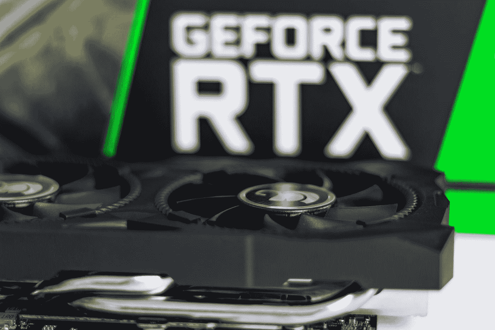
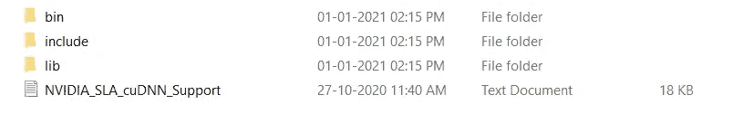
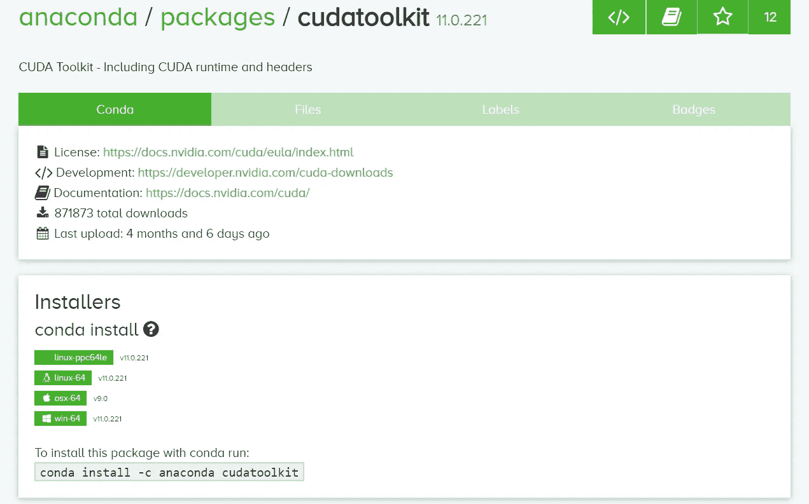
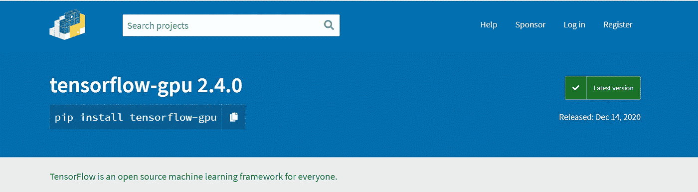

# 使用 Anaconda 在 Cuda 11.0 和 CuDnn 8 上安装 Tensorflow-gpu 2.4.0

> 原文：<https://medium.com/analytics-vidhya/install-tensorflow-gpu-2-4-0-with-cuda-11-0-and-cudnn-8-using-anaconda-8c6472c9653f?source=collection_archive---------0----------------------->



克里斯蒂安·威迪格在 [Unsplash](https://unsplash.com?utm_source=medium&utm_medium=referral) 上拍摄的照片

你有没有沮丧过，用 Cuda 装 Tensorflow Gpu 什么的；如果是的话，这个博客是为你而写的，在这里你可以找到一个简单的方法来安装最新版本的 Tensorflow GPU。CUDA 是 NVIDIA 开发的并行计算平台和编程模型，用于图形处理单元(GPU)上的一般计算。有了 CUDA，开发人员可以通过利用 GPU 的能力来显著加快计算应用程序的速度。

NVIDIA 的 CUDA 工具包提供了开发 GPU 加速应用程序所需的一切。这个 CUDA 工具包包括 GPU 加速库和 Conda 生态系统的 CUDA 运行时。欲了解带有编译器和开发工具的完整 CUDA 工具包，请访问 https://developer.nvidia.com/cuda-downloads

许可协议软件包受 CUDA Toolkit 最终用户许可协议(EULA)管辖。通过下载和使用这些包，您接受 https://docs.nvidia.com/cuda/eula/index.html CUDA EULA[的条款和条件](https://docs.nvidia.com/cuda/eula/index.html)

以下是所有库的版本列表:

***tensor flow-GPU = = 2 . 4 . 0***

***cudatoolkit = = 11.0***

***cuDnn==8***

***【python = = 3.7(或更高版本)***

> 为了成功安装 tensor flow-GPU 2.4 版，我们将遵循 6 个步骤。

1.  首先从 Nvidia 官网[这里](https://developer.nvidia.com/rdp/cudnn-download#a-collapse805-110)下载 Cuda 11.0 compactable，CuDnn 版本。然后提取出来放在一边，文件应该是这样的，



下载的 CuDnn 8 应该有这些文件。

2.用 python 3.7 或更高版本创建一个新的 Conda 环境，

```
conda create -n myenv python=3.7
```

运行上面的代码，用 python 3.7 创建一个新环境。

3.主要部分来了，现在我们需要安装 Cuda toolkit，你可以从 [Nvidia 官网](https://developer.nvidia.com/cuda-downloads?target_os=Windows&target_arch=x86_64&target_version=10&target_type=exelocal)下载或者直接使用 Anaconda 提示符分 2 步，

```
conda activate <env>conda install cudatoolkit
```



康达官方网站

只要运行上面的代码，就会在环境中安装 Cuda 11.0，让我们很开心。

4.TensorFlow 是一个用于高性能数值计算的开源软件库。其灵活的架构允许跨各种平台(CPU、GPU、TPU)轻松部署计算，从台式机到服务器集群，再到移动和边缘设备。



最初由谷歌人工智能组织谷歌大脑团队的研究人员和工程师开发，它为机器学习和深度学习提供了强大的支持，灵活的数值计算核心被用于许多其他科学领域。现在该安装 Tensorflow 了；最新的 TensorFlow 版本是 2.4，我们不需要安装 TensorFlow cause，tensorflow-gpu 包括所有。Python 让我们变得更加容易，

```
pip install tensorflow-gpu
```

以上命令安装 Tensorflow gpu 版本，Tensorflow estimator，Tensorflow base。不要在这里使用 conda cause，它会安装 Cuda 10.2 和 cuDnn 7，所以它可能会与安装的新版本冲突。

> 大多数错误，尤其是 ML 中的错误，来自版本冲突；事实上这是最糟糕的事情。

5.现在复制所有文件从 bin 文件夹的下载，cuDnn 8 文件夹。然后粘贴到 conda 环境文件夹的 bin 文件夹中，通常你可以在 C 中找到 user 的路径，

***C:\ Users \<name>\ anaconda 3 \ envs \<env name>\ Library \ bin***

把 DLL 文件粘贴到这里，就这样了！你成功了！。现在，您已经为 GPU 革命做好了准备。

虽然性能良好的 GPU 的价格仍然很高，但你可以使用在线云平台来提供培训，通常它们比英伟达的 MX 系列更快，如[谷歌合作](https://colab.research.google.com/)。如果你有最新的 GPU 版本，如 **GeForce RTX 3060 Ti 或泰坦系列**你可以使用上述步骤来利用 GPU。

事实上，这是我的第一个博客，我很高兴能得到你们所有人的反馈，请在 [Linkedin](https://www.linkedin.com/in/suriya-k-s-100877192/) 和 [Github](https://github.com/suriya-it19?tab=repositories) 上关注我，与我合作。博客上见，

谢谢你，

苏里亚