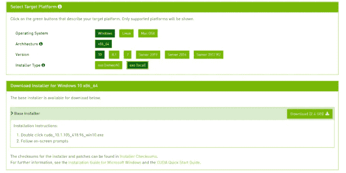

# 安装 TensorFlow GPU(已更新)

> 原文：<https://medium.com/analytics-vidhya/install-tensorflow-gpu-d36f179bf0e8?source=collection_archive---------6----------------------->

## 两步之内


在 [Unsplash](https://unsplash.com?utm_source=medium&utm_medium=referral) 上由[娜娜杜瓦](https://unsplash.com/@nanadua11?utm_source=medium&utm_medium=referral)拍摄的照片

好消息！！…..TensorFlow 提供了内置的 GPU。

太好了，但是怎么安装呢？？别担心，我们会分两步解决这个问题。

注:只有在系统配有 Nvidia 显卡的情况下，才能这样做(必须和应该)

来吧，让我们开始吧。


照片由[维克多·罗德里格兹](https://unsplash.com/@vimarovi?utm_source=medium&utm_medium=referral)在 [Unsplash](https://unsplash.com?utm_source=medium&utm_medium=referral) 上拍摄

为什么是 GPU 的？

使用 GPU，我们可以如此舒适地运行我们的神经网络问题，而不是在不寻常的事情上浪费时间(我的意思是整天坐着通过观看一个又一个时代来训练它们)。

因此，在这篇博客中，我们想知道安装过程非常容易(相信我)在 2 个步骤。

步骤:

1.  CUDA 安装
2.  张量流装置

## CUDA 安装

我们开始吧-

首先，我们需要为这个链接提供的检查安装 CUDA

[](https://developer.nvidia.com/cuda-downloads) [## CUDA 工具包 11.3 更新 1 下载

### 资源 CUDA 文档/发行说明 sMacOS 工具培训示例代码论坛 CUDA 以前版本的档案常见问题解答…

developer.nvidia.com](https://developer.nvidia.com/cuda-downloads) 

按照步骤安装 CUDA

1.  选择我们需要安装的操作系统，该体系结构是 windows 的默认体系结构，但对于 Linux 有所不同。
2.  并根据系统包含的版本进行选择。
3.  选择本地安装程序类型，然后点击出现在右上角的下载。



4.一旦下载完成，它就以 zip 文件的形式存在，只需解压 Cuda 工具包。

5.然后，将完整的文件夹移动到**我的电脑\C 盘\程序文件\Nvidia GPU 计算工具包**

6.通过用 **Nvidia GPU 计算工具包**在程序文件中制作一个单独的文件夹

7.接下来，打开控制面板— ->系统— ->高级系统设置— ->环境变量

8.将 CUDA 文件的路径添加到环境变量中，完成系统的安装。

## **张量流安装**

我知道，大部分都已经装了 TensorFlow。

但是不要担心谁没有……我是来帮助你的。

## 跟随我:

**第一步**:

转到 anaconda 提示符下，键入**pip install tensor flow = = 2 . 3 . 4**安装这个特定版本是不固定的，您可以使用任何版本，但在我的情况下，我已经安装了那个特定版本。

**第二步**:

一旦完成，然后开始用 **pip 安装 tensorflow-gpu==2.3.4** 安装与 tensorflow 版本匹配的 GPU。

完成了！！


怎么才能知道是不是装的？？很少怀疑

因此，让我们通过键入以下命令来开始检查您的 IDE...

```
#import package 
import tensorflow as tftf.test.is_built_with_cuda()tf.test.is_gpu_available(cuda_only=False, min_cuda_compute_capability=None)
```

就这样，如果我们真的成功了，那么 GPU 就毫无疑问地安装成功了...

正如我所承诺的，它是通过 2 个初始步骤完成的。

忘了说了。读者们，你们成功了。


谢谢:)学习愉快。

取得联系:

[](https://www.linkedin.com/in/akshithkumar-05/) [## Akshith Kumar -技术作家-机器学习| LinkedIn

### 查看 Akshith Kumar 在世界上最大的职业社区 LinkedIn 上的个人资料。阿克什思有 5 份工作列在…

www.linkedin.com](https://www.linkedin.com/in/akshithkumar-05/)