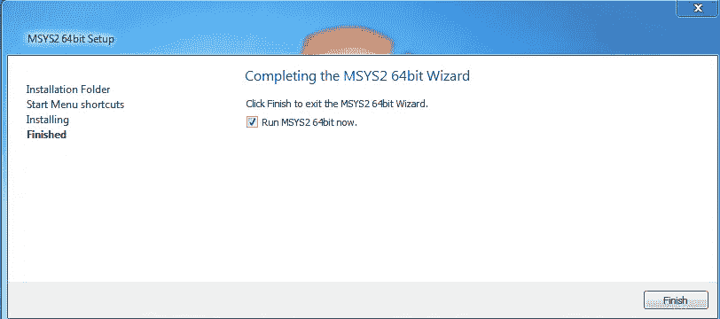
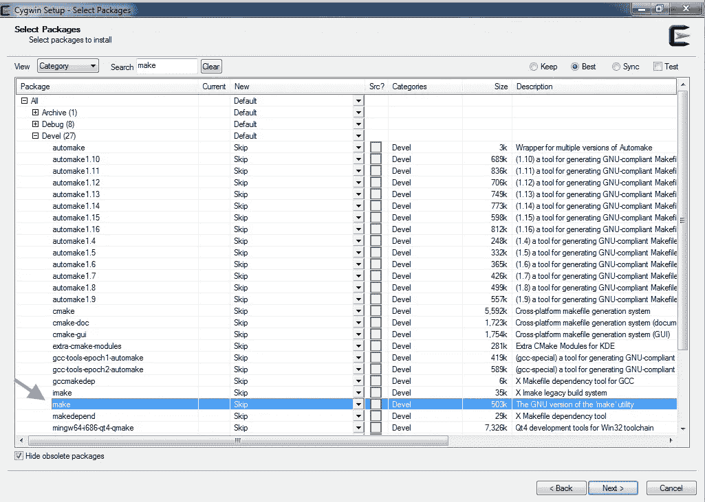

# 在 windows 下安装 Mingw 和 Cygwin C/C++编译器

> 原文：<https://medium.com/analytics-vidhya/install-the-mingw-and-the-cygwin-c-c-compilers-under-windows-655b314e644a?source=collection_archive---------15----------------------->

在 windows 下编译 C 和 C++，以及其他种类的源代码文件的两个 ***选项是:`cygwin-gcc`编译器，和`mingw-gcc`编译器。***

对于源代码，使用了***posix api****，`cygwin-gcc`编译器可以使用，它提供了 POSIX API 的实质性实现，由`cygwin1.dll`库提供。*

*`cygwin-gcc`，也可以用来编译源代码，其中使用了 windows api。在这两种情况下，`cygwin1.dll`库必须对正在执行的程序可用。*

*对于只使用 ***windows api*** 的源代码，可以使用`mingw-gcc`编译器。产生的可执行文件，不依赖于`cygwin1.dll`，它只依赖于 windows 库。*

*要安装这些编译器，有两个类似 unix 的 ***环境*** ，它们以 windows 可执行文件的形式提供 unix 命令，第一个是`Cygwin`环境，第二个是`MSYS2`环境。*

*两个环境，提供两个编译器，`MSYS2`环境提供*一个* ***包管理器*** ，`pacman`，允许安装包，而 Cygwin 不提供包管理器，包安装是通过安装程序完成的，每次要安装或删除包时。*

# *MSYS2*

## *装置*

*要安装`MSYS2`，从 [MSYS2 网站](https://www.msys2.org/)下载 安装程序，双击即可。*

****点击下一步*** ，在第一个屏幕上，下一步为安装文件夹，下一步为开始菜单快捷方式，之后 msys2 将开始安装。*

******

*一旦安装完成， ***三个快捷方式将在开始菜单中*** 创建。*

**

*一个将启动`MSYS2 Mingw 64`终端，另一个将启动`MSYS2 Mingw 32`终端，最后一个将启动`MSYS2 MSYS` 终端。 ***这三种发射器*** 的区别，在于路径:*

```
*MINGW32# echo $PATH
/mingw32/bin:/usr/local/bin:/usr/bin:/bin:/c/Windows/System32:/c/Windows:/c/Windows/System32/Wbem:/c/Windows/System32/WindowsPowerShell/v1.0/:/usr/bin/site_perl:/usr/bin/vendor_perl:/usr/bin/core_perl
#Has /mingw32/bin , prepended , and is 
#missing /opt/bin comparing to MSYS
#path . Differs from MINGW64 path , 
#by just the prepended directory . MINGW64# echo $PATH
/mingw64/bin:/usr/local/bin:/usr/bin:/bin:/c/Windows/System32:/c/Windows:/c/Windows/System32/Wbem:/c/Windows/System32/WindowsPowerShell/v1.0/:/usr/bin/site_perl:/usr/bin/vendor_perl:/usr/bin/core_perl
#Has /mingw64/bin prepended , 
#and is missing /opt/bin , 
#when comparing to MSYS .
#Only differs by the prepended 
#path , from MINGW32 . MSYS# echo $PATH
/usr/local/bin:/usr/bin:/bin:/opt/bin:/c/Windows/System32:/c/Windows:/c/Windows/System32/Wbem:/c/Windows/System32/WindowsPowerShell/v1.0/:/usr/bin/site_perl:/usr/bin/vendor_perl:/usr/bin/core_perl*
```

*点击完成，这个 ***就会运行***`MSYS2 MSYS terminal`。*

****

*从打开的终端， ***安装*** `mingw-w64`编译器，和`cygwin-gcc`编译器，首先发出这条命令:*

```
*$ pacman --sync --refresh --sysupgrade 
#Sync the packages , refreshing the 
#database , and upgrading outdated 
#packages . 
:: Synchronizing package databases...
 mingw32                         870.9 KiB   268 KiB/s 00:03 [################################] 100%
 mingw32.sig                     438.0   B  0.00   B/s 00:00 [################################] 100%
 mingw64                         874.5 KiB   290 KiB/s 00:03 [################################] 100%
 mingw64.sig                     438.0   B  0.00   B/s 00:00 [################################] 100%
 msys                            295.4 KiB   231 KiB/s 00:01 [################################] 100%
 msys.sig                        438.0   B  0.00   B/s 00:00 [################################] 100%
:: Starting core system upgrade...
 there is nothing to do
:: Starting full system upgrade...
resolving dependencies...
looking for conflicting packages...Packages (18) bsdtar-3.5.1-1  dash-0.5.11.3-1  gdbm-1.19-1  glib2-2.66.4-2  gnupg-2.2.27-1
              icu-68.2-1  libgdbm-1.19-1  libgpg-error-1.41-2  libgpgme-1.15.1-1  libhogweed-3.7-1
              libnettle-3.7-1  libp11-kit-0.23.22-2  libxml2-2.9.10-7  msys2-keyring-1~20210123-1
              nettle-3.7-1  p11-kit-0.23.22-2  tzcode-2020f-1  wget-1.21.1-2Total Download Size:   18.17 MiB
Total Installed Size:  67.88 MiB
Net Upgrade Size:       1.22 MiB:: Proceed with installation? [Y/n] y
:: Retrieving packages...
 libhogweed-3.7-1-x86_64         183.4 KiB   230 KiB/s 00:01 [################################] 100%
 libnettle-3.7-1-x86_64          129.3 KiB   237 KiB/s 00:01 [################################] 100
...
...*
```

****下一个发出*** 这个命令:*

```
*$ pacman -S --needed base-devel msys2-devel mingw-w64-x86_64-toolchain 
#sync the packages .
#install only the non installed
#packages from the group of
#packages base-devel , and 
#the group of packages msys2-devel 
#which contain a c/c++ posix 
#compiler , and install 
# mingw-w64-x86_64-toolchain
#for a windows c/c++ compiler .
warning: file-5.39-2 is up to date -- skipping
warning: gawk-5.1.0-1 is up to date -- skipping
warning: gettext-0.19.8.1-1 is up to date -- skipping
warning: grep-3.0-2 is up to date -- skipping
warning: pacman-5.2.2-9 is up to date -- skipping
warning: perl-5.32.0-2 is up to date -- skipping
warning: sed-4.8-1 is up to date -- skipping
warning: wget-1.21.1-2 is up to date -- skipping
:: There are 48 members in group base-devel:
:: Repository msys
   1) asciidoc  2) autoconf  3) autoconf2.13  4) autogen  5) automake-wrapper  6) automake1.10
   7) automake1.11  8) automake1.12  9) automake1.13  10) automake1.14  11) automake1.15
   12) automake1.16  13) automake1.6  14) automake1.7  15) automake1.8  16) automake1.9  17) bison
   18) btyacc  19) diffstat  20) diffutils  21) dos2unix  22) flex  23) gdb  24) gettext-devel
   25) gperf  26) groff  27) help2man  28) intltool  29) libtool  30) libunrar  31) libunrar-devel
   32) m4  33) make  34) man-db  35) pactoys-git  36) patch  37) patchutils  38) pkgconf
   39) pkgfile  40) quilt  41) reflex  42) scons  43) swig  44) texinfo  45) texinfo-tex  46) ttyrec
   47) unrar  48) xmltoEnter a selection (default=all):
warning: gcc-libs-10.2.0-1 is up to date -- skipping
:: There are 7 members in group msys2-devel:
:: Repository msys
   1) binutils  2) cocom  3) gcc  4) gcc-fortran  5) msys2-runtime-devel  6) msys2-w32api-headers
   7) msys2-w32api-runtimeEnter a selection (default=all):
:: There are 19 members in group mingw-w64-x86_64-toolchain:
:: Repository mingw64
   1) mingw-w64-x86_64-binutils  2) mingw-w64-x86_64-crt-git  3) mingw-w64-x86_64-gcc
   4) mingw-w64-x86_64-gcc-ada  5) mingw-w64-x86_64-gcc-fortran  6) mingw-w64-x86_64-gcc-libgfortran
   7) mingw-w64-x86_64-gcc-libs  8) mingw-w64-x86_64-gcc-objc  9) mingw-w64-x86_64-gdb
   10) mingw-w64-x86_64-gdb-multiarch  11) mingw-w64-x86_64-headers-git
   12) mingw-w64-x86_64-libgccjit  13) mingw-w64-x86_64-libmangle-git
   14) mingw-w64-x86_64-libwinpthread-git  15) mingw-w64-x86_64-make  16) mingw-w64-x86_64-pkgconf
   17) mingw-w64-x86_64-tools-git  18) mingw-w64-x86_64-winpthreads-git
   19) mingw-w64-x86_64-winstorecompat-gitEnter a selection (default=all):
resolving dependencies...
looking for conflicting packages...Packages (133) docbook-xml-4.5-2  docbook-xsl-1.79.2-1  expat-2.2.10-1  isl-0.22.1-1
               libarchive-3.5.1-1  libatomic_ops-7.6.10-1  libgc-8.0.4-1  libguile-2.2.7-1
               libiconv-devel-1.16-2  libltdl-2.4.6-9  libpcre16-8.44-1  libpcre2_16-10.36-1
               libpcre2_32-10.36-1  libpcre2posix-10.36-1  libpcre32-8.44-1  libpcrecpp-8.44-1
               libpcreposix-8.44-1  libpipeline-1.5.3-2  mingw-w64-x86_64-bzip2-1.0.8-2
               mingw-w64-x86_64-ca-certificates-20200601-2  mingw-w64-x86_64-expat-2.2.10-1
               mingw-w64-x86_64-gettext-0.19.8.1-10  mingw-w64-x86_64-gmp-6.2.1-1
               mingw-w64-x86_64-isl-0.23-1  mingw-w64-x86_64-libffi-3.3-3
               mingw-w64-x86_64-libiconv-1.16-2  mingw-w64-x86_64-libsystre-1.0.1-4
               mingw-w64-x86_64-libtasn1-4.16.0-1  mingw-w64-x86_64-libtre-git-r128.6fb7206-2
               mingw-w64-x86_64-mpc-1.2.1-1  mingw-w64-x86_64-mpdecimal-2.5.0-1
               mingw-w64-x86_64-mpfr-4.1.0-3  mingw-w64-x86_64-ncurses-6.2-2
               mingw-w64-x86_64-openssl-1.1.1.i-1  mingw-w64-x86_64-p11-kit-0.23.22-1
               mingw-w64-x86_64-python-3.8.7-3  mingw-w64-x86_64-readline-8.0.004-2
               mingw-w64-x86_64-sqlite3-3.34.1-1  mingw-w64-x86_64-tcl-8.6.11-2
               mingw-w64-x86_64-termcap-1.3.1-6  mingw-w64-x86_64-tk-8.6.11.1-1
               mingw-w64-x86_64-windows-default-manifest-6.4-3  mingw-w64-x86_64-xxhash-0.8.0-1
               mingw-w64-x86_64-xz-5.2.5-2  mingw-w64-x86_64-zlib-1.2.11-9
               mingw-w64-x86_64-zstd-1.4.8-2  mpc-1.1.0-1  mpdecimal-2.5.0-1  pcre-8.44-1
               pcre2-10.36-1  perl-Locale-Gettext-1.07-7  perl-Module-Build-0.4231-1
               perl-Test-Pod-1.52-1  perl-XML-Parser-2.46-3  perl-YAML-Syck-1.32-4
               perl-inc-latest-0.500-1  python-3.8.7-1  tar-1.33-1  windows-default-manifest-6.4-1
               asciidoc-9.0.4-1  autoconf-2.69-5  autoconf2.13-2.13-3  autogen-5.18.16-1
               automake-wrapper-11-1  automake1.10-1.10.3-4  automake1.11-1.11.6-4
               automake1.12-1.12.6-4  automake1.13-1.13.4-5  automake1.14-1.14.1-4
               automake1.15-1.15.1-2  automake1.16-1.16.2-2  automake1.6-1.6.3-3
               automake1.7-1.7.9-3  automake1.8-1.8.5-4  automake1.9-1.9.6-3  binutils-2.35.1-1
               bison-3.7.4-1  btyacc-20200910-1  cocom-0.996-2  diffstat-1.63-1  diffutils-3.7-1
               dos2unix-7.4.2-1  flex-2.6.4-1  gcc-10.2.0-1  gcc-fortran-10.2.0-1  gdb-9.2-3
               gettext-devel-0.19.8.1-1  gperf-3.1-2  groff-1.22.4-1  help2man-1.47.16-1
               intltool-0.51.0-2  libtool-2.4.6-9  libunrar-6.0.3-1  libunrar-devel-6.0.3-1
               m4-1.4.18-2  make-4.3-1  man-db-2.9.3-1  mingw-w64-x86_64-binutils-2.35.1-3
               mingw-w64-x86_64-crt-git-9.0.0.6090.ad98746a-1  mingw-w64-x86_64-gcc-10.2.0-6
               mingw-w64-x86_64-gcc-ada-10.2.0-6  mingw-w64-x86_64-gcc-fortran-10.2.0-6
               mingw-w64-x86_64-gcc-libgfortran-10.2.0-6  mingw-w64-x86_64-gcc-libs-10.2.0-6
               mingw-w64-x86_64-gcc-objc-10.2.0-6  mingw-w64-x86_64-gdb-10.1-2
               mingw-w64-x86_64-gdb-multiarch-10.1-2
               mingw-w64-x86_64-headers-git-9.0.0.6090.ad98746a-1
               mingw-w64-x86_64-libgccjit-10.2.0-6
               mingw-w64-x86_64-libmangle-git-9.0.0.6090.ad98746a-1
               mingw-w64-x86_64-libwinpthread-git-9.0.0.6090.ad98746a-1  mingw-w64-x86_64-make-4.3-1
               mingw-w64-x86_64-pkgconf-1.7.3-5  mingw-w64-x86_64-tools-git-9.0.0.6090.ad98746a-1
               mingw-w64-x86_64-winpthreads-git-9.0.0.6090.ad98746a-1
               mingw-w64-x86_64-winstorecompat-git-9.0.0.6090.ad98746a-1
               msys2-runtime-devel-3.1.7-4  msys2-w32api-headers-8.0.0.5683.629fd2b1-1
               msys2-w32api-runtime-8.0.0.5683.629fd2b1-1  pactoys-git-r2.07ca37f-1  patch-2.7.6-1
               patchutils-0.4.2-1  pkgconf-1.7.3-2  pkgfile-21-1  quilt-0.66-2  reflex-20200715-1
               scons-3.1.2-4  swig-4.0.2-1  texinfo-6.7-3  texinfo-tex-6.7-3  ttyrec-1.0.8-2
               unrar-6.0.3-1  xmlto-0.0.28-2Total Download Size:    247.69 MiB
Total Installed Size:  1603.39 MiB:: Proceed with installation? [Y/n] y
:: Retrieving packages...
 mingw-w64-x86_64-libiconv-...   744.5 KiB   270 KiB/s 00:03 [################################] 100%
 mingw-w64-x86_64-zlib-1.2....   101.4 KiB   186 KiB/s 00:01 [################################] 100%*
```

*能够编译 posix 源代码的 Cygwin 编译器 ***可以从已经打开的终端*** 访问，即`MSYS2 MSYS terminal` ，因为它在路径中。*

```
*$ g++ --version
g++ (GCC) 10.2.0
Copyright (C) 2020 Free Software Foundation, Inc.
This is free software; see the source for copying conditions.  There is NO
warranty; not even for MERCHANTABILITY or FITNESS FOR A PARTICULAR PURPOSE.#Optionally Create a source file
#containing posix api , and 
#compile it .$ nano test.c
#Paste the following content .#include <termios.h>
/*Contains the definitions
  used by the terminal I/O
  interfaces .*/#include<stdio.h>
/*Include the standard input
  and output */int main(void ){
  printf("%d" , IGNPAR );
  /*Print the value of the constant ,
    ignore characters with parity
    errors . */ }#control-x followed by a 
#yes , and an enter to exit 
#nano and save the source file .$ cc test.c
#Compile the source file .$./a.exe
#Execute the compiled source file .
4*
```

*MinGW 64 编译器，它产生不依赖于`cygwin1.dll`的 windows 可执行文件，并且不能编译 posix 源代码 ***可从*** 终端`MSYS2 MinGW 64`访问，可通过点击开始菜单中的快捷方式`MSYS2 MinGW 64-bit`获得。*

```
*$ g++ --version
g++.exe (Rev6, Built by MSYS2 project) 10.2.0
Copyright (C) 2020 Free Software Foundation, Inc.
This is free software; see the source for copying conditions.  There is NO
warranty; not even for MERCHANTABILITY or FITNESS FOR A PARTICULAR PURPOSE*
```

## *使用 pacman 进行包管理*

> ***简介***

*`pacman` 是`MSYS2`使用的软件包管理器，它 ***将*** 软件包安装到`MSYS2`安装目录下的子目录中，默认为`C:\msys64`。*

*`pacman` 配置了三个 ***库*** ，可以从中安装包。*

*第一个是*`***msys2***`***仓库*** ，其中相关的目录是`/etc`和`/usr`，以及哪些已安装的软件包，可以使用终端`MSYS2 MSYS`访问。这个库包含 Cygwin 编译器，它依赖于`cygwin1.dll`库生成 windows 可执行文件。**

**emacs 就是一个从`msys2`仓库安装的应用程序的例子。**

```
**$ which emacs
#Path of the accessible 
#emacs .
/usr/bin/emacs**
```

****

*****后两个是***`mingw32`、`mingw64`库，相关目录有:`/mingw32`、`/mingw64`。**

**他们安装的软件包可以通过`MSYS2 MinGW 32-bit`和`MSYS2 MinGW 64-bit`快捷方式访问。**

**emacs 就是从`mingw64`库安装的应用程序的一个例子。**

```
**$ which emacs
#Path of the accessible 
#emacs .
/mingw64/bin/emacs**
```

****

*****在`C:\msys64`下找到的，与 posix 相关的其他目录*** 有:`/bin`、`/dev`、`/home`、`/opt`、`/proc`、`/tmp`、`/var`。 ***windows 磁盘驱动器*** ，可以使用`/c` 或`/d`或…**

**pacman `--sync`操作是 ***用于同步*** 包。包同步操作后面必须跟一个选项，该选项是此操作将执行的操作的选项。**

> ****更新软件包****

**要 ***更新包数据库***`--sync --refresh` 都可以用，要强制刷新包数据库，即使是最新的也可以用`--sync --refresh --refresh` 。**

```
**$ pacman --sync --refresh
#--sync operation is used for 
#package synchronization . Package
#synchronization take some options .
#The --refresh option is used to 
#refresh the database . 
:: Synchronizing package databases...
 mingw32               870.9 KiB   527 KiB/s 00:02 [#####################] 100%
 mingw32.sig           438.0   B  0.00   B/s 00:00 [#####################] 100%
 mingw64               874.5 KiB   496 KiB/s 00:02 [#####################] 100%
 mingw64.sig           438.0   B  0.00   B/s 00:00 [#####################] 100%
 msys                  295.4 KiB   421 KiB/s 00:01 [#####################] 100%
 msys.sig              438.0   B  0.00   B/s 00:00 [#####################] 100%**
```

> ****升级软件包****

**要 ***升级所有过期的*** 包，可以使用`--sync --sysupgrade` 。**

```
**$ pacman --sync --refresh --sysupgrade 
#The sync operation is performed , 
#It is passed the refresh option ,
#to refresh the database , and the 
#sysupgrade option , to upgrade ,
#all of the installed packages .
:: Synchronizing package databases...
 mingw32 is up to date
 mingw64 is up to date
 msys is up to date
:: Starting core system upgrade...
 there is nothing to do
:: Starting full system upgrade...
resolving dependencies...
looking for conflicting packages...Packages (18) bsdtar-3.5.1-1  dash-0.5.11.3-1  gdbm-1.19-1  glib2-2.66.4-2
              gnupg-2.2.27-1  icu-68.2-1  libgdbm-1.19-1  libgpg-error-1.41-2
              libgpgme-1.15.1-1  libhogweed-3.7-1  libnettle-3.7-1
              libp11-kit-0.23.22-2  libxml2-2.9.10-7
              msys2-keyring-1~20210123-1  nettle-3.7-1  p11-kit-0.23.22-2
              tzcode-2020f-1  wget-1.21.1-2Total Download Size:   18.17 MiB
Total Installed Size:  67.88 MiB
Net Upgrade Size:       1.22 MiB:: Proceed with installation? [Y/n]
:: Retrieving packages...
 libhogweed-3.7-1...   183.4 KiB   294 KiB/s 00:01 [#####################] 100%
...
...**
```

> ****搜索并获取包信息****

**要搜索一个包，可以使用下列 选项之一。**

**`--sync --groups`，将列出所有可用的 ***组*** 。组是一组相关的软件包，可以一起安装。可以提供可选的组名，在这种情况下，将显示属于该组的包。**

```
**$ pacman --sync --groups
#--sync operation is used to 
#sync the packages . It takes
#options , the --groups option
#will list all the available
#groups of packages .
mingw-w64-i686-arm-none-eabi-toolchain
kf5
mingw-w64-i686-avr-toolchain
mingw-w64-i686-toolchain
mingw-w64-i686-eda
mingw-w64-i686
mingw-w64-i686-gimp-plugins
kde-applications
kdebase
mingw-w64-i686-qt
mingw-w64-i686-qt5
mingw-w64-i686-qt-static
mingw-w64-i686-qt5-static
mingw-w64-i686-riscv64-unknown-elf-toolchain
mingw-w64-i686-vulkan-devel
tesseract-data
mingw-w64-x86_64-arm-none-eabi-toolchain
mingw-w64-x86_64-avr-toolchain
mingw-w64-x86_64-toolchain
mingw-w64-x86_64-eda
mingw-w64-x86_64
mingw-w64-x86_64-gimp-plugins
mingw-w64-x86_64-qt
mingw-w64-x86_64-qt5
mingw-w64-x86_64-qt-static
mingw-w64-x86_64-qt5-static
mingw-w64-x86_64-riscv64-unknown-elf-toolchain
mingw-w64-x86_64-vulkan-devel
libraries
development
base-devel
msys2-devel
VCS
base
compression
sys-utils
Database
vim-plugins
net-utils
editors
python-modules
midipix-cross-toolchain
midipix-cross
mingw-w64-cross-toolchain
mingw-w64-cross
mingw-w64-cross-clang-toolchain
perl-modules
utilities$ pacman --sync --groups --groups base
#View all the packages related 
#to the group base . 
base bzip2
base coreutils
base findutils
base flex
base gawk
base getent
base grep
base gzip
base inetutils
base libargp
base lndir
base msys2-launcher
base ncurses
base pactoys-git
base pkgfile
base sed
base tftp-hpa
base time
base ttyrec
base which**
```

**到 ***列出所有可用的*** 包`--sync --list`可以使用。可以选择指定存储库的名称，以便只列出该存储库中的包。**

```
**$ pacman --sync --list msys
#List only the packages that 
#are available from the msys
#repository . 
msys ansible 2.9.11-1
msys apr 1.7.0-1
msys apr-devel 1.7.0-1
msys apr-util 1.6.1-1
msys apr-util-devel 1.6.1-1
msys asciidoc 9.0.4-1
msys aspell 0.60.8-1
msys aspell-devel 0.60.8-1
msys aspell6-en 2019.10.06-1
msys atool 0.39.0-1
msys autoconf 2.69-5
msys autoconf-archive 2019.01.06-1
msys autoconf2.13 2.13-3
msys autogen 5.18.16-1
msys automake-wrapper 11-1
msys automake1.10 1.10.3-4
msys automake1.11 1.11.6-4
msys automake1.12 1.12.6-4
msys automake1.13 1.13.4-5
msys automake1.14 1.14.1-4
msys automake1.15 1.15.1-2
msys automake1.16 1.16.2-2
msys automake1.6 1.6.3-3
msys automake1.7 1.7.9-3
msys automake1.8 1.8.5-4
....
....**
```

**使用 regex 搜索特定的 ***包。`--sync --search theRegex`可以使用。*****

```
**$ pacman --sync --search 'emac.*'
#Search for all the packages , 
#that contain emac , and end 
#with zero or more character .
mingw32/mingw-w64-i686-emacs 27.1-2
    The extensible, customizable, self-documenting, real-time display editor (mingw-w64)
mingw32/mingw-w64-i686-liberime 0.0.5-2
    An emacs dynamic module provide librime bindings for emacs (mingw-w64)
mingw64/mingw-w64-x86_64-emacs 27.1-2
    The extensible, customizable, self-documenting, real-time display editor (mingw-w64)
mingw64/mingw-w64-x86_64-liberime 0.0.5-2
    An emacs dynamic module provide librime bindings for emacs (mingw-w64)
msys/cmake-emacs 3.19.3-1
    A cross-platform open-source make system (Emacs mode)
msys/emacs 27.1-2 (editors)
    The extensible, customizable, self-documenting, real-time display editor (msys2)
msys/ninja-emacs 1.10.2-1
    Ninja is a small build system with a focus on speed (Emacs mode)**
```

**要查看所有 ***套餐信息*** ，可以使用`--sync --info`。它有一个可选的包名，在这种情况下，只显示与这个包相关的信息。**

```
**$ pacman --sync --info emacs 
#View information related to 
#the emacs package .
Repository      : msys
Name            : emacs
Version         : 27.1-2
Description     : The extensible, customizable, self-documenting, real-time display editor (msys2)
Architecture    : x86_64
URL             : [https://www.gnu.org/software/emacs/](https://www.gnu.org/software/emacs/)
Licenses        : GPL3
Groups          : editors
Provides        : None
Depends On      : ncurses  zlib  libxml2  libiconv  libcrypt  libgnutls  glib2  libhogweed
Optional Deps   : None
Conflicts With  : None
Replaces        : None
Download Size   : 32.58 MiB
Installed Size  : 163.28 MiB
Packager        : CI (msys2-autobuild/6e7d6a99/328625740)
Build Date      : Mon Oct 26 02:56:47 2020
Validated By    : MD5 Sum  SHA-256 Sum  Signature**
```

**最后套餐详情， ***可在*[msys 2 套餐网站](https://packages.msys2.org/updates)上查看** *。***

> ****安装软件包****

**通过在`--sync`后指定 软件包名称，可以安装 ***软件包。可以同时安装多个软件包。还可以指定一个组名，以安装该组中包含的所有软件包。组是一组相关的包。*****

```
**$ pacman --sync vim
#Install the vim editor 
resolving dependencies...
looking for conflicting packages...Packages (1) vim-8.2.1895-1Total Download Size:    7.78 MiB
Total Installed Size:  47.67 MiB:: Proceed with installation? [Y/n] y
:: Retrieving packages...
 vim-8.2.1895-1-x...     2.5 MiB   573 KiB/s 00:09 [######---------------]  ....$ pacman --sync editors
#Install all the editors , found ,
#in the editors group . They
#are emacs , nano , and vim .
:: There are 3 members in group editors:
:: Repository msys
   1) emacs  2) nano  3) vimEnter a selection (default=all):
...**
```

> ****卸载软件包****

**要 ***卸载一个*** 包，或者一组包，其中一组是一组包，可以使用`--remove`。**

```
**$ pacman --remove vim
#Remove the vim editor .
checking dependencies...
:: pacman-contrib optionally requires vimPackages (1) vim-8.2.1895-1Total Removed Size:  47.67 MiB:: Do you want to remove these packages? [Y/n] y
:: Processing package changes...
(1/1) removing vim                                 [#####################] 100%**
```

# **Cygwin**

**Cygwin ***是*** 开源软件的集合，比如`vim`，或者`sed`，使用 posix api，编译后在 windows 下运行。这只是一组 windows 可执行文件，或者说 windows 程序。posix api 由 Cygwin 通过`cygwin1.dll`库提供。**

**Cygwin 安装程序 ***可以从***[官网](https://cygwin.com/setup-x86_64.exe)下载，可以用来安装或者卸载 windows 应用。**

**一旦包被下载，只要双击它，这将运行它。在第一个 ***屏幕上选择*** 下一步，选择从互联网安装，点击下一步进入安装根目录，点击下一步进入本地包目录，点击下一步进入互联网连接设置，选择任意下载站点，点击下一步。**

************************

**在搜索框中， ***输入 gcc*** ，然后展开 Devel 下的包选择，如果想安装支持 posix 和 windows api 的 Cygwin C 和 C++编译器，选择`gcc-core`和`gcc-g++`，或者选择`mingw64-x86_64-gcc-core`和`mingw64-x86_64-gcc-g++`，安装只支持 windows api 的 mingw64 C 和 C++编译器。**

****

**之后 ***搜索用于调试的 gdb*** 并选择。**

****

**接下来 ***搜索 make*** ，用于自动化编译过程，并选择它。**

****

**选择 ***您可能喜欢的任何附加包*** ，例如 emacs 或 nano，它们都可以在编辑器下找到。选择完软件包后，单击 next，然后在 review and confirm changes 屏幕上单击 next，等待安装完成。**

********

**最后点击 ***完成时提示*** 创建桌面，并开始菜单图标。**

****

**一旦完成，你将有一个名为 Cygwin64 终端的桌面图标。双击 ***即可启动*** 终端。**

****

****windows 驱动**可从`cygdrive/c`或`cygdrive/d`访问……要获取一个包的**信息，在[包列表页面](https://cygwin.com/packages/package_list.html)中点击一个包，会显示其信息。可以使用**、 [Cygwin 包搜索页面](https://cygwin.com/packages/)搜索包内容。**

***最初发表于 2021 年 1 月 27 日 https://twiserandom.com*[](https://twiserandom.com/microsoft/windows/install-the-mingw-and-the-cygwin-c-cpp-compilers-under-windows/)**。****