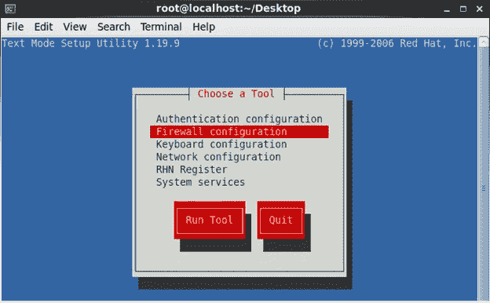
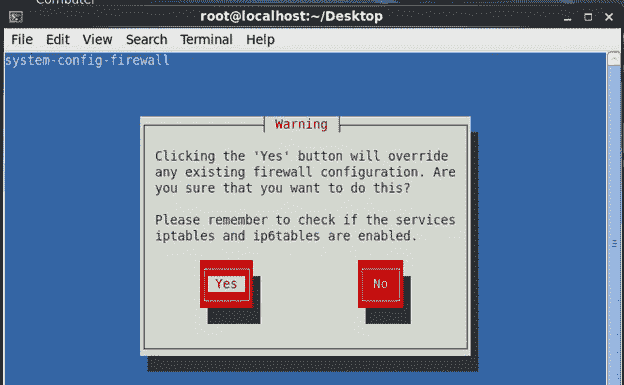

# 在虚拟机(VMware)上安装 Red Hat Enterprise Linux

> 原文：<https://medium.com/analytics-vidhya/installation-of-red-hat-enterprise-linux-on-virtual-machine-vmware-372339fab02d?source=collection_archive---------14----------------------->

## 简介:

Red Hat Enterprise Linux (RHEL)是为商业市场开发的 Linux 操作系统的发行版。RHEL 以前被称为红帽 Linux 高级服务器。

RHEL 操作系统(OS)支持物理、[虚拟化](https://searchservervirtualization.techtarget.com/definition/virtualization)和[云](https://searchcloudcomputing.techtarget.com/definition/cloud-computing)环境中的各种工作负载。RHEL 版本适用于服务器、大型机、SAP 应用、台式机和 OpenStack。

## **让我们开始安装:**

我们必须做三件基本事情:

1.  创建 Linux 虚拟机。
2.  设备和 DNS 配置。
3.  YUM 配置。

*   **首先安装 VMware workstation，然后单击创建新虚拟机选项。**


图片来源:[https://medium.com/@ankitgupta_974](/@ankitgupta_974)

*   **然后选择典型选项，然后点击下一步。**


图片来源:[https://medium.com/@ankitgupta_974](/@ankitgupta_974)

*   **现在选择第二个选项“已安装的光盘镜像文件”,然后浏览 linux ISO 文件，然后单击下一步。**


图片来源:[https://medium.com/@ankitgupta_974](/@ankitgupta_974)

*   **提供您将在用户和 root 帐户中使用的用户名和密码。**


图片来源:[https://medium.com/@ankitgupta_974](/@ankitgupta_974)

*   **现在输入虚拟机名称，它将自动使用虚拟机的默认路径。**


图片来源:[https://medium.com/@ankitgupta_974](/@ankitgupta_974)

*   **设置磁盘空间，选择第一个选项将虚拟磁盘存储在单个文件上，然后单击下一个。**


图片来源:[https://medium.com/@ankitgupta_974](/@ankitgupta_974)

*   **现在点击完成**


图片来源:[https://medium.com/@ankitgupta_974](/@ankitgupta_974)

*   现在您的虚拟机正在安装。


图片来源:[https://medium.com/@ankitgupta_974](/@ankitgupta_974)


图片来源:[https://medium.com/@ankitgupta_974](/@ankitgupta_974)


图片来源:[https://medium.com/@ankitgupta_974](/@ankitgupta_974)

*   **现在选择‘其他’。**


图片来源:[https://medium.com/@ankitgupta_974](/@ankitgupta_974)

*   **输入 root 用户名，选择登录，然后输入您之前在安装时输入的密码**


图片来源:【https://medium.com/@ankitgupta_974 

*   **现在右击虚拟机窗口并选择终端，现在终端窗口打开。使用 setup 命令并按 enter 键。**


图片来源:[https://medium.com/@ankitgupta_974](/@ankitgupta_974)

*   **现在，选择防火墙配置回车。**



图片来源:[https://medium.com/@ankitgupta_974](/@ankitgupta_974)

*   **进入启用选项，按空格键，然后选择确定。**


图片来源:[https://medium.com/@ankitgupta_974](/@ankitgupta_974)

*   **点击是按钮。**



图片来源:[https://medium.com/@ankitgupta_974](/@ankitgupta_974)

*   **选择网络配置并选择运行工具。**


图片来源:[https://medium.com/@ankitgupta_974](/@ankitgupta_974)

*   **选择设备配置，按保存并退出按钮。**


图片来源:[https://medium.com/@ankitgupta_974](/@ankitgupta_974)

*   **选择下图所示的第一个选项。**


图片来源:[https://medium.com/@ankitgupta_974](/@ankitgupta_974)

*   **写下主机名、主 DNS、辅助 DNS，然后点击确定按钮。重新启动虚拟机..**


图片来源:[https://medium.com/@ankitgupta_974](/@ankitgupta_974)

*   **提供静态 IP，该 IP 就是您的虚拟机 IP。设置默认网关，然后按“确定”按钮。**


图片来源:[https://medium.com/@ankitgupta_974](/@ankitgupta_974)

*   **进入虚拟机— >点击设置— >选择 CD/DVD(SDATA) — >选择“用作 ISO 镜像”选项，然后浏览 RHEL 的 ISO 镜像。在“设备状态”中，勾选“已连接”和“开机时已连接”复选框。**


图片来源:【https://medium.com/@ankitgupta_974 

*   **现在一个 RHEL 文件夹将会打开。**


图片来源:[https://medium.com/@ankitgupta_974](/@ankitgupta_974)

*   **打开终端，在终端上键入以下所有命令。**

```
**cd /var/**
```

通过这个命令，您可以到达 var 目录。

```
ls
```

命令列出所有目录。

```
mkdir
```

做一个目录。

```
**cd /var/ftp**
```

进入 ftp。

*   创建一个目录名**“pub”。**


*   **现在“pub”是一个空目录，所以使用下面的命令复制 pub 目录中的“Packages”文件夹，并按回车键，然后在 pub 中复制“Package”文件夹。**

```
**“cp -R Packages /var/ftp/pub”** 
```


图片来源:【https://medium.com/@ankitgupta_974 

*   **现在进入包文件夹，运行下面终端图像中显示的命令。**


图片来源:[https://medium.com/@ankitgupta_974](/@ankitgupta_974)

*   **现在运行命令来配置 yum。使用命令如下图所示。**


图片来源:[https://medium.com/@ankitgupta_974](/@ankitgupta_974)

*   **现在从使用命令返回到“pub”返回一步。**

```
**cd ..** 
```

*   **现在运行以下命令。**

```
**“createrepo -v Packages”**
```


图片来源:[https://medium.com/@ankitgupta_974](/@ankitgupta_974)

*   **运行命令到达 yum.repos.d 位置。**

```
**cd /etc/yum.repos.d** 
```


图片来源:[https://medium.com/@ankitgupta_974](/@ankitgupta_974)

*   现在编辑路径并给出所有信息，如下所示。


图片来源:[https://medium.com/@ankitgupta_974](/@ankitgupta_974)

```
**press Esc ->colon(:)->wq!(for save and exit)**
```

*   **再次键入命令进行检查。**

```
**vi testing.repo
Type Command for cleaning**
```

*   **键入清洗命令。**

```
**yum clean all**
```

*   **键入安装 java 的命令。**

```
**yum install java**
```


图片来源:[https://medium.com/@ankitgupta_974](/@ankitgupta_974)

**安装完成。**

**作者领英:**

[https://www.linkedin.com/in/ankit-gupta2/](https://www.linkedin.com/in/ankit-gupta2/)

[](/analytics-vidhya/extract-the-useful-data-from-jason-file-for-data-sceince-34ed5ae0b350) [## 从 JSON 文件中提取有用数据用于机器学习

### 如何从一个 JSON 文件中提取数据用于 Python 中的机器学习模型

medium.com](/analytics-vidhya/extract-the-useful-data-from-jason-file-for-data-sceince-34ed5ae0b350) [](/analytics-vidhya/installation-of-opencv-in-simple-and-easy-way-15556edca7a4) [## 安装 OPENCV 的 5 个简单易行的步骤

### 在这个有趣的教程中，我们将学习在 Ubuntu 系统中设置 OpenCV-Python。以下步骤针对 Ubuntu 16.04 进行了测试…

medium.com](/analytics-vidhya/installation-of-opencv-in-simple-and-easy-way-15556edca7a4) 

**感谢您的阅读，如果您喜欢请点击拍手按钮。**

**关注我们，了解更多简单有趣的内容。**

**更多内容请看**[**AnalyticsVidhya**](https://medium.com/analytics-vidhya)**。**