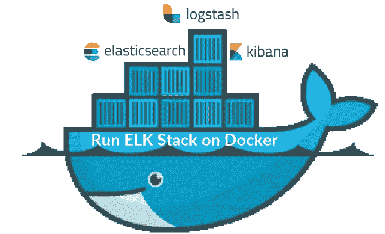
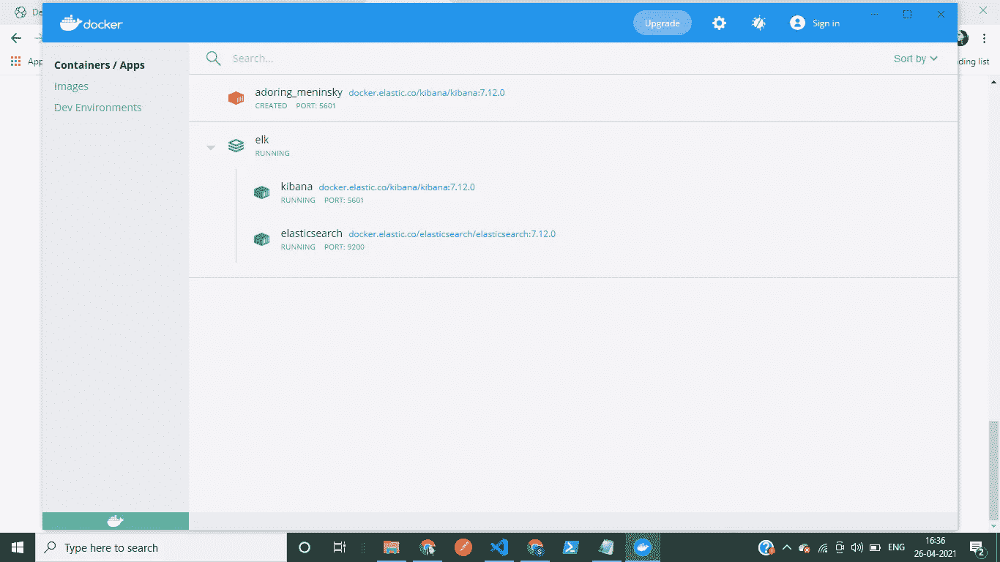
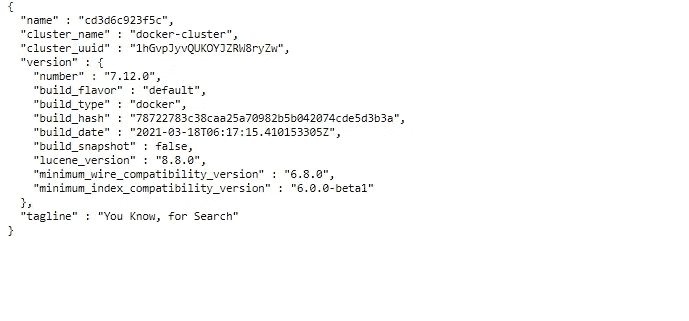
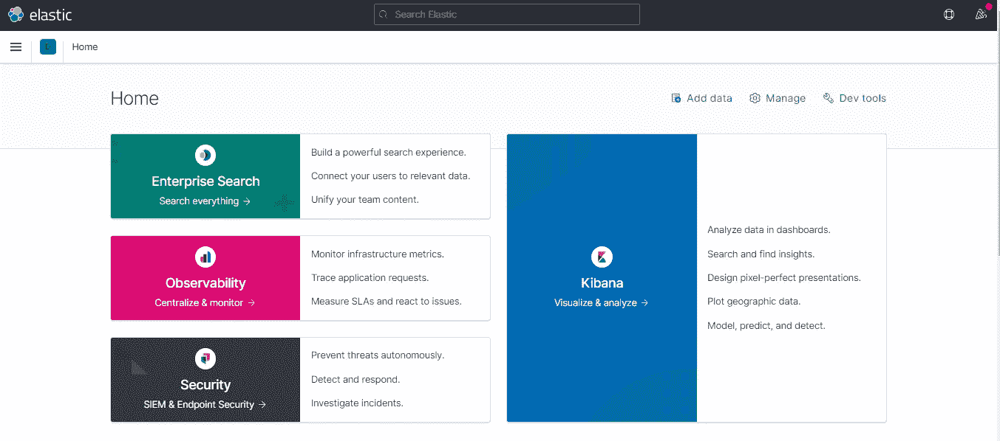

# 在 Docker 中安装 ELK 堆栈

> 原文：<https://medium.com/analytics-vidhya/installing-elk-stack-in-docker-828df335e421?source=collection_archive---------0----------------------->

## 实现 Docker 有困难吗？下面是最直白的指南！

作者:[里沙卜·古普塔](https://www.linkedin.com/in/rishabh-gupta-1ba899195/)，[谢尔维·加尔格](https://www.linkedin.com/in/shelvi-garg-3a7421108/)

这是关于如何通过 Docker 安装 ELK-elastic search 堆栈的最中肯的教程。如果你按照一步一步的指导去做，你将不会遇到麻烦。

在继续之前，我假设您已经下载了 Docker 桌面。如果你还没有这里的链接:【https://www.docker.com/products/docker-desktop】T4



图片来源:[中等](https://www.google.com/url?sa=i&url=https%3A%2F%2Fmedium.com%2Ftech-tajawal%2Felk-stack-docker-playground-for-devops-221179ca00dd&psig=AOvVaw1-dlREgB0GigcqmtYPQZki&ust=1619521401764000&source=images&cd=vfe&ved=0CA0QjhxqFwoTCODJ1snhm_ACFQAAAAAdAAAAABAN)

步骤 1:创建一个名为 ELK 的目录/文件夹。

步骤 2:在 IDE 中打开 ELK 目录(在我的例子中是 VS 代码)。

第三步:在这个目录下创建一个名为 docker-compose.yml 的文件。

步骤 4:复制粘贴以下命令:(它提到了一些关于我们想要安装的依赖项的东西，包括弹性搜索和 Kibana)

```
version: "3.7"services:
  elasticsearch:
    image: docker.elastic.co/elasticsearch/elasticsearch:7.12.0
    container_name: elasticsearch
    restart: always
    environment:
      - xpack.security.enabled=false
      - discovery.type=single-node
    ulimits: 
      memlock:
        soft: -1 
        hard: -1
      nofile:
        soft: 65536
        hard: 65536
    cap_add: 
      - IPC_LOCK
    volumes:
      - elasticsearch-data-volume:/usr/share/elasticsearch/data
    ports:
      - "9200:9200"
  kibana:
    container_name: kibana
    image: docker.elastic.co/kibana/kibana:7.12.0
    restart: always
    environment:
      SERVER_NAME: kibana
      ELASTICSEARCH_HOSTS: [http://elasticsearch:9200](http://elasticsearch:9200)
    ports:
      - "5601:5601"
    depends_on:
      - elasticsearchvolumes: 
  elasticsearch-data-volume:
    driver: local
```

步骤 5:保存文件并在同一个目录终端下运行下面的命令。

```
docker-compose -f docker-compose.yml up -d
```

您将看到系统正在下载您的 ELK 堆栈。

第 6 步:下载完成后，你可以进入 Docker 桌面，查找在那里创建的两个新的 Docker 容器(如图所示),也可以在终端上键入:

```
docker container ls
```



Docker 桌面容器:作者图片

第 7 步:你可以运行 Elasticseacrh 和 Kibana 容器，如果它还没有从 Docker 桌面运行，运行容器名称前面提供的按钮。

您也可以运行和停止它以备将来使用

第八步:最后一步是最终看到最终结果。

进入 [http://localhost:5601/](http://localhost:5601/) (我们为 Kibana 提供的 localhost 服务器)和[http://localhost:9200/](http://localhost:9200/)(elastic search 主机服务器)检查其是否工作正常。

您将在 9200 上看到类似这样的内容:



作者图片

和 5601 类似的东西:



作者图片

如果两个屏幕都出现了，那么恭喜你，你已经成功跨越了学习 elk stack 的最大障碍！

*…。如果你喜欢这个博客，请随意留下一些由衷的掌声！:)*