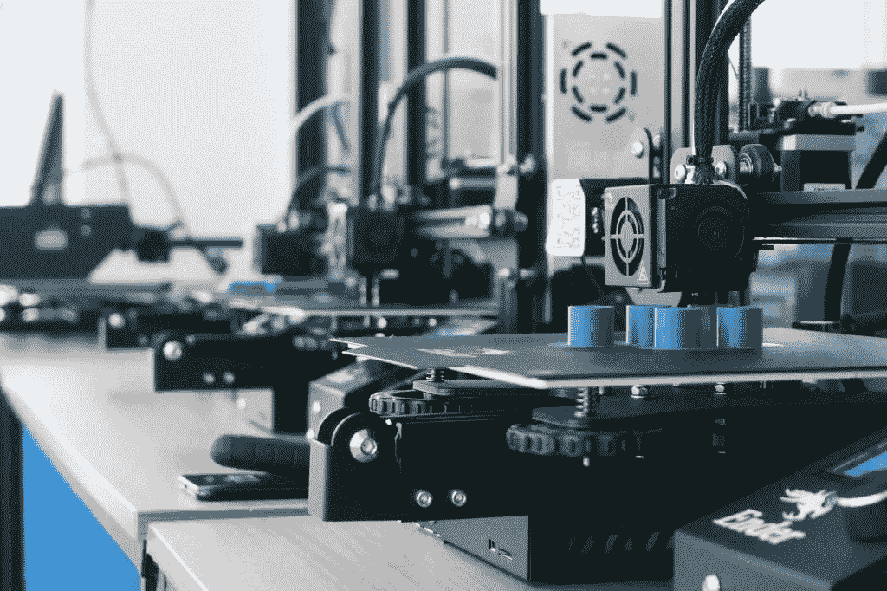
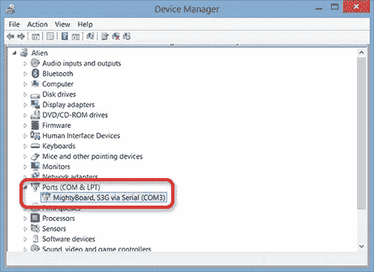
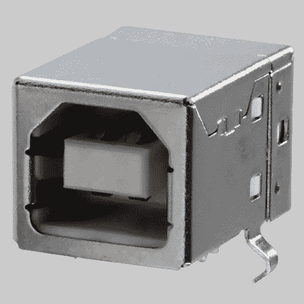
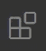
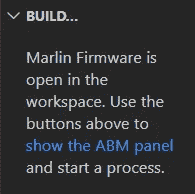

# 在任何打印机上安装最新版本的 Marlin

> 原文：<https://medium.com/analytics-vidhya/installing-the-latest-version-of-marlin-on-any-printer-fd9cec3dc0f0?source=collection_archive---------10----------------------->

这将是一个简单的指南，用大约 3 个步骤在几乎任何 3D 打印机上安装 Marlin。

# 下载马林鱼

**第一步是从 GitHub 下载马林固件文件。**这个有两个选项。第一个也是最常用的是[固件版本](https://github.com/MarlinFirmware/Marlin/releases/tag/2.0.7.2)。第二个是 [bugfix 分支](https://github.com/MarlinFirmware/Marlin/tree/bugfix-2.0.x)。不同之处在于后者包含对当前版本 Marlin 中可能存在的错误的修复。你可以根据自己的意愿做出选择，但是如果其中一个不起作用，另一个很可能会成功。

**您应该将 Marlin 文件夹重新放置到永久存储器中，以便在需要更改或启用功能时使用。**

# 获取配置文件

下一步对于让 Marlin 在特定的 3D 打印机上正常工作非常重要。配置文件将包含固件理解打印机规格的重要信息。这包括床尺寸、挤出机数量、e-steps 等。上一步下载的固件包含默认配置文件，您可以使用适当的信息对这些文件进行定制，以便与您的打印机配合使用。

**幸运的是，他们还在** [**配置示例**](https://github.com/MarlinFirmware/Configurations/tree/import-2.0.x/config/examples) **提供了很多针对流行 3D 打印机的预配置文件。** Delta 打印机在[单独的目录下](https://github.com/MarlinFirmware/Configurations/tree/import-2.0.x/config/examples/delta)。浏览列表，找到您的 3D 打印机，并下载文件夹中的文件，为最后一步做好准备。

# 安装到您的打印机

最后一步稍微长一点，但仍然出奇的简单。马林背后的团队在让这个过程变得简单方面做得很好，所以如果可以的话，请确保在[**pat reon**](https://www.patreon.com/thinkyhead)**上支持他们。**

# 检查 USB 连接

在进一步操作之前，您应该确保可以通过 USB 连接到打印机。要做到这一点，导航到设备管理器，并检查“端口”子菜单的东西可以被识别为您的打印机后，插入它。尝试连接和断开打印机，以判断它是否是正确的设备。

**如果你的打印机没有出现在设备管理器的任何地方，很可能它没有自带引导程序。**

# 安装马林

安装 Marlin 最简单的方法是通过 Visual Studio 代码和一个名为 PlatformIO 的插件。**因此你首先需要下载并安装** [**Visual Studio 代码**](https://code.visualstudio.com/) ，不要与 Visual Studio 社区混淆。安装完成后，打开它。

从此处，通过所示图标(左侧)导航至“扩展”选项卡。从这里搜索“PlatformIO IDE”并安装同名的扩展。另外，一定要从同一个选项卡中搜索并安装“自动构建马林”。

在编译 Marlin 之前，您需要将配置文件移动到正确的位置。**为此，取下载的配置文件(Configuration.h，Configuration_adv.h 等。)并将它们直接移动到预下载的马林固件目录内的“马林”文件夹中。**它会要求替换一些已经在这个文件夹中的文件；接受请求。

现在导航到文件>>打开文件夹…并打开下载的马林目录。确保您已经打开了父目录，而不是包含配置文件的“Marlin”目录。

在 Visual Studio 代码中打开文件夹后，单击显示的图标(左)。

现在点击显示面板中的蓝色文本“显示 ABM 面板”(右)。

假设其他一切都如预期的那样，您只需在单击上传之前确保您的打印机已连接。

*原载于 2021 年 2 月 11 日 https://kgdavidson.co.uk***。**