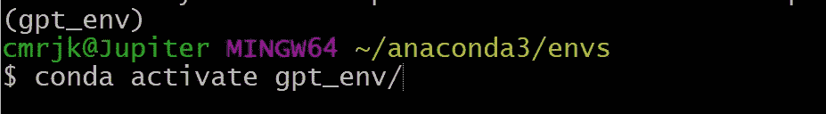
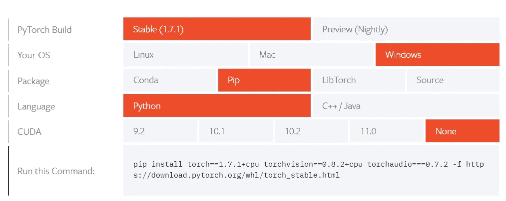

# 满足 GPT 新协议的要求。TensorFlow，PyTorch 和 Transformers。

> 原文：<https://medium.com/analytics-vidhya/installing-the-requirements-for-gpt-2-tensorflow-pytorch-and-transformers-9105348f10f4?source=collection_archive---------3----------------------->

"我变成了张量流，环境的破坏者."


美国能源部— [*三位一体与超越:原子弹电影*](https://en.wikipedia.org/wiki/Trinity_and_Beyond)

各位数据爱好者，你们好。我目前正在做一个有趣的人工智能写作项目，将使用 GPT-2。我为安装这样做的需求而心痛不已，并迷失在大量似乎没有帮助的信息中。所以我想我会分享我的成功故事，以防它可以帮助其他人也经历这场斗争。

**第一步:创建虚拟环境**

我假设您已经完成了安装 anaconda 的第 0 步，在我的例子中，我使用 gitbash 作为我的命令行界面。我也在 Windows 10 上运行，如果你在不同的系统上，这可能会改变事情，特别是如果你打算安装 pytorch。我将在第 3 步中展示它是如何完成的。好的免责声明结束。我们走吧。

1.  使用代表“更改目录”的`$ cd`转到 GIT BASH 中的主目录。
2.  如果您在主目录中安装了 anaconda，那么使用`$ cd anaconda3/envs`进入 Anaconda 环境。如果不在那里，你可以使用`$ where conda`找到你安装 anaconda 的地方
3.  创造新的环境。我将我的新环境命名为 *gpt_env* ，但是你可以用你喜欢的任何东西来代替它。**重要提示:使用 PYTHON 3.7 或更早的模型。**到目前为止 python 的最新版本 3.9 将无法有效地与 TensorFlow 一起工作。3.8 将与 TensorFlow 2 一起工作，但如果你打算训练 gpt-2，你将需要一个旧的 TensorFlow 和一个旧的 python 版本。
    `$ conda create --name gpt_env python=3.7`

**第二步:激活新环境**

使用 conda activate 激活新环境。
`$ conda activate gpt_env/`
在你的 CLI 中你应该能确定我们处于新的环境中。我的环境出现在用户名之前。



第三步:开始安装必要的库

我建议先安装 TensorFlow，因为它有很多依赖项，如果安装过程顺序不对，可能会搞砸。我很艰难地学会了这一点，所以你不必…希望如此。

需要特别注意的是，TensorFlow 2(本文发布时 TF 的当前版本)不允许在没有一些创造性修改的情况下对 gpt2 进行训练/微调。如果你打算微调 gpt2，我建议安装 TensorFlow 版。更多详情可点击此处:[用 pip 安装 TensorFlow】。正如我上面提到的，TensorFlow 2 适用于 Python 8 及以上版本，而 TensorFlow 1.15 适用于 Python 7 及以下版本。](https://www.tensorflow.org/install/pip)

```
#If you intend to just generate text
$ pip install tensorflow #If you intend to fine-tune gpt-2 
$ pip install tensorflow==1.15
```

接下来我安装了 PyTorch。PyTorch 非常适合 gpt-2 文本生成，这也是我使用它的原因。你需要去[本地启动| PyTorch](https://pytorch.org/get-started/locally/) 并列出你的安装规格。



```
$ pip install torch==1.7.1+cpu torchvision==0.8.2+cpu torchaudio===0.7.2 -f [https://download.pytorch.org/whl/torch_stable.html](https://download.pytorch.org/whl/torch_stable.html)
```

接下来，我安装了来自 huggingface.co 的变压器。下面是安装指南:【huggingface.co】安装—变压器 4.3.0 文档。

```
$ pip install transformers
```

**第四步:安装 GPT-2**

我发现了几种做这件事的方法。对于我的简单用例，我决定在我的系统上安装 gpt-2。它可以在 python 项目索引中找到:py [gpt-2-simple PyPI](https://pypi.org/project/gpt-2-simple/) 。它可以通过在 CLI 中输入以下内容来安装。

```
pip install gpt-2-simple
```

第五步:运行朱庇特实验室，用 GPT 2 号接管世界！

现在你要开始有趣的部分了！我希望这对你有用。如果你有任何问题，请在下面评论，让我知道！
为了进行测试，你可以跟随这个视频:[用 Python 编写 OpenAI 的 GPT-2 语言生成](https://www.youtube.com/watch?v=YvVQgvAz9dY&t=325s)来自一个叫 James Briggs 的家伙。GPT 2 号能做的事情真是太棒了！祝你好运！

**演职员表** :
杰西·陶(Jesse Tao)非常棒，在我经历了很多挣扎之后，他给了我明智的建议，并指导我完成了这个过程。他帮我解决了这个问题。查看他的网站[杰西的数据科学之旅(jesseptao.com)](https://jesseptao.com/)
和:[詹姆斯·布里格斯——YouTube](https://www.youtube.com/channel/UCv83tO5cePwHMt1952IVVHw)