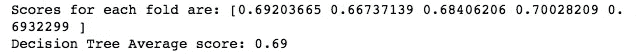

# 基于机器学习集成分类器的保险索赔预测

> 原文：<https://medium.com/analytics-vidhya/insurance-claim-prediction-using-machine-learning-ensemble-classifier-14652907a65e?source=collection_archive---------5----------------------->

图片由来自 [Pixabay](https://pixabay.com/?utm_source=link-attribution&utm_medium=referral&utm_campaign=image&utm_content=5975484) 的 [Dimitris Vetsikas](https://pixabay.com/users/dimitrisvetsikas1969-1857980/?utm_source=link-attribution&utm_medium=referral&utm_campaign=image&utm_content=5975484) 拍摄

# **问题**

据 Willis Towers 称，超过三分之二的保险公司报告称，预测分析帮助他们减少了开支和承保问题。随着人工智能的兴起，保险公司越来越多地采用机器学习来实现关键目标，如降低成本、增强承保和欺诈检测。特别是使用机器学习，保险公司可以有效地筛选案例，以极大的准确性评估它们，并做出准确的成本预测。

事实上，麦肯锡估计，仅在德国，保险公司通过在医疗保险中采用机器学习系统，每年就可以节省大约 5 亿欧元。这一事实强调了采用机器学习对于任何保险公司的重要性。

本文探讨了预测分析在财产保险中的应用。它基于发布在基于 Olusola 保险公司的 [Zindi](https://zindi.africa/hackathons/insurance-prediction) 平台上的基于知识的挑战。该公司提供建筑保险，防止火灾或故意破坏造成的损失。在这篇文章中，我们将建立一个预测模型，以确定一个建筑是否会在某个时期内有保险索赔。

预测将侧重于集成方法(随机森林和 XGBoost)和支持向量机(SVM)。将提供性能比较，并选择最佳模型来构建最终模型。

完整的代码可以在[这里](https://github.com/wanyangajnr/eda/blob/main/insurance_prediction.ipynb)获得

## **数据集**

***客户 Id:*** *投保人的识别号*

***观察年份:*** *被保险人保单的观察年份*

***保险期间:*** *奥卢索拉保险中保单的持续时间*

***住宅:*** *这栋楼是不是住宅楼*

***建筑物已绘:*** *建筑物是否已绘(N-已绘，V-未绘)*

***建筑有围栏:*** *建筑有无围栏(N- Fences，V —无围栏)*

***花园:*** *建筑有无花园(V —有花园，O —无花园)*

***聚落:*** *建筑所在区域。(R —农村地区，U —城市地区)。*

***建筑尺寸:*** *以平方米为单位的被保险建筑尺寸*

***建筑类型:*** *建筑的类型(类型 1、2、3、4)*

***入住日期:*** *大楼首次入住日期*

***窗户数量:*** *建筑窗户数量*

***地理编码:*** *被保险建筑的地理编码*

***索赔:*** *目标变量(0:无索赔，1:保险期内至少有一次索赔)*

训练集有 7，160 个观察值，而测试数据有 3，069 个观察值。

## **识别和替换缺失值**

第一步是检查我们的数据是否有任何缺失值，因为这可能会对分析的所有其他部分产生很大影响。不出我们所料，数据中有大量缺失值。具体来说，有缺失值的变量如下:建筑尺寸(106)、占用日期(508)和地理编码(102)。处理缺失值有两种主要方法，一种是用趋势的中心度量(均值、中值或众数)来替换它们，另一种是完全删除它们。均值和中值适用于连续变量，而模式适用于分类变量。

建筑尺寸和入住日期在本质上是连续的，我们需要了解底层的分布。为此，我们使用了箱线图。

从箱线图中，我们可以看出两个变量都是偏态分布。因此，选择中值来替换缺失值。由于地理编码本质上是分类的，因此选择模式来替换缺失值。

## 探索性数据分析

根据 IBM 的说法，探索性数据分析(EDA)是数据科学家主要通过采用可视化方法来分析数据集并总结其主要特征的一种方法。它有助于发现模式，检测异常或离群值，并发现模式。在这种情况下，我们使用了几种可视化方法来更好地理解我们的**数据集**。

箱线图揭示了建筑尺寸和入住日期中异常值的存在。然而，由于集合方法对异常值不[敏感，该项目忽略了异常值。](/towards-artificial-intelligence/handling-outliers-in-machine-learning-f842d8f4c1dc)

通过分类条形图揭示的分类变量的见解如下:

与粉刷过的建筑相比，未粉刷过的建筑更有可能提出索赔(差异非常显著)。

与城市地区的建筑相比，农村地区的建筑申请的机会稍高。

与有花园的建筑相比，没有花园的建筑申请的几率稍高。

与有围栏的建筑相比，没有围栏的建筑索赔的几率稍高。

## **特色工程**

我喜欢把特征工程看作是任何数据科学家的游乐场。创造力和领域专业知识在这个领域发挥作用。简而言之，特征工程是数据科学家能够从现有特征中创建更多输入(特征)的过程。我们的数据比较简单，除了对分类变量进行编码之外，没有涉及很多特征工程。

## **在 One-Hot 编码和标签编码之间进行试验**

特征工程中采用的编码方法主要有两种，一种是热编码，一种是标签编码。通常，在顺序不重要的情况下，首选一种热编码，而在顺序不太重要的情况下，首选标签编码。为了这个项目的利益和获得更多的知识，两种编码方法都被使用，并且模型被评估性能。有趣的是，这两种编码方法的性能没有差别。然而，这可能是由于大多数分类变量本质上是二元的。用具有更多类别的变量来测试这两种编码方法是很有趣的。在我们的例子中，我们选择使用基于特征重要性分析的结果变量的标签编码，这更符合实际。

## **交叉验证和模型性能比较**

使用 k-fold 交叉验证比较模型性能。在四个模型(决策树、SVM、随机森林和梯度增强)中，梯度增强是表现最好的模型，精度为 0.79，被选为首选模型。

## **特征重要性分析**

使用特征重要性分析，选择以下变量作为与模型最相关的变量(重要性> 0)；建筑尺寸、地理编码、保险期、建筑类型、入住日期和观察年份。

## **最终型号**

使用网格搜索交叉验证获得最终模型。网格搜索是一种参数搜索，通过利用交叉验证方案，彻底考虑所有参数组合。使用这种方法，可以得到精确度为 0.79 的最佳模型。

## **测试集的预测**

使用最终模型，运行测试集并获得预测集。

## **结论**

在本文中，我们已经能够说明不同机器学习算法的使用，特别是索赔预测中的集成方法。尽管每个问题表现不同，但我们可以得出结论，梯度提升对于大多数分类问题表现得非常好。看看深度学习模型如何对抗经典的集成方法将是有趣的。

## **来源**

关于支线剧情

 [## 教程:Python 支线剧情

### 使用 Kaggle 笔记本探索和运行机器学习代码|使用来自 UCI 心脏病研究中心的数据

www.kaggle.com](https://www.kaggle.com/asimislam/tutorial-python-subplots) 

关于热点编码和基数

 [## 分类变量和一次性编码

### 使用 Kaggle 笔记本探索和运行机器学习代码|使用 Kaggle 的房价竞争数据…

www.kaggle.com](https://www.kaggle.com/enessari/categorical-variables-and-one-hot-encoding) 

异常值检测和剔除以及对异常值敏感(或不敏感)的模型

 [## 机器学习中异常值的处理

### 简单且易于实施的方法

pub.towardsai.net](https://pub.towardsai.net/handling-outliers-in-machine-learning-f842d8f4c1dc)