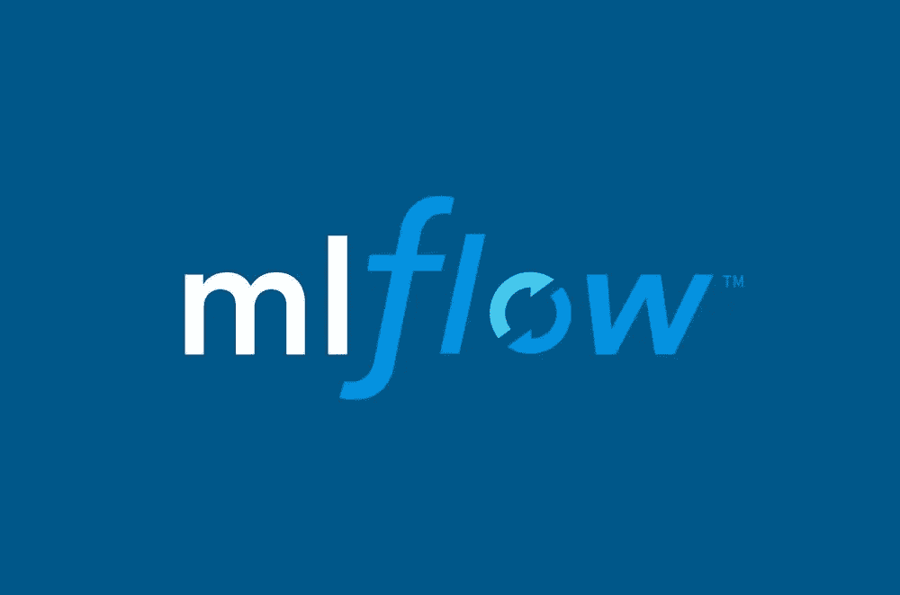
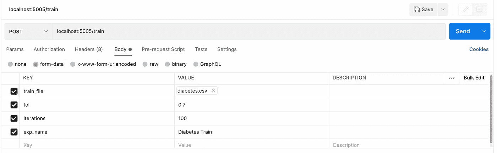
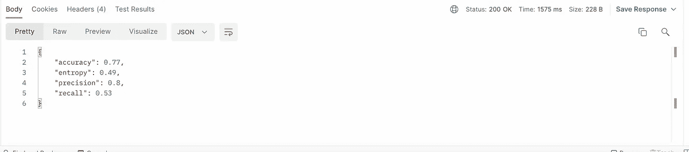
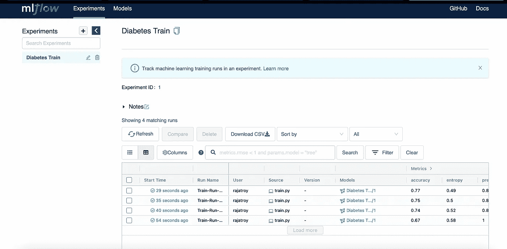
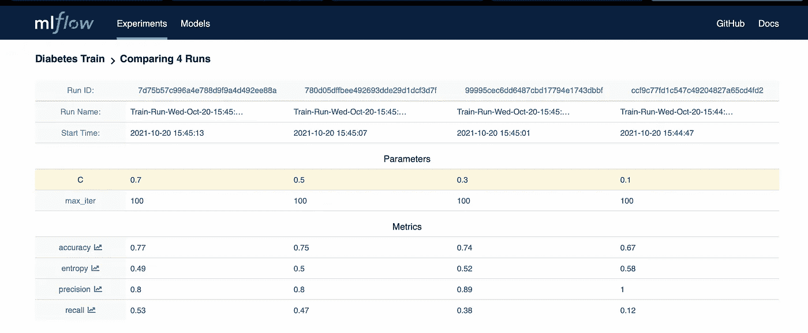
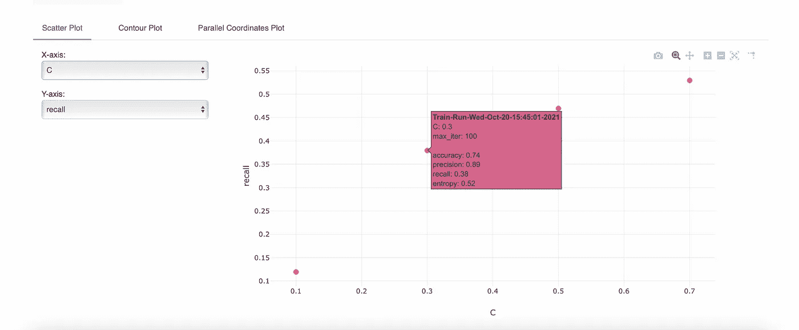
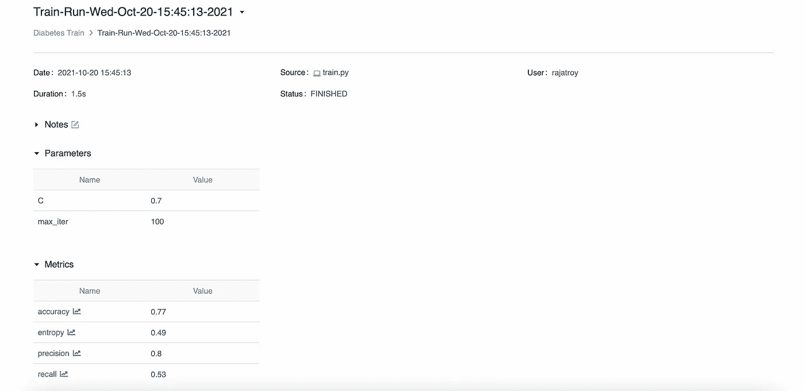
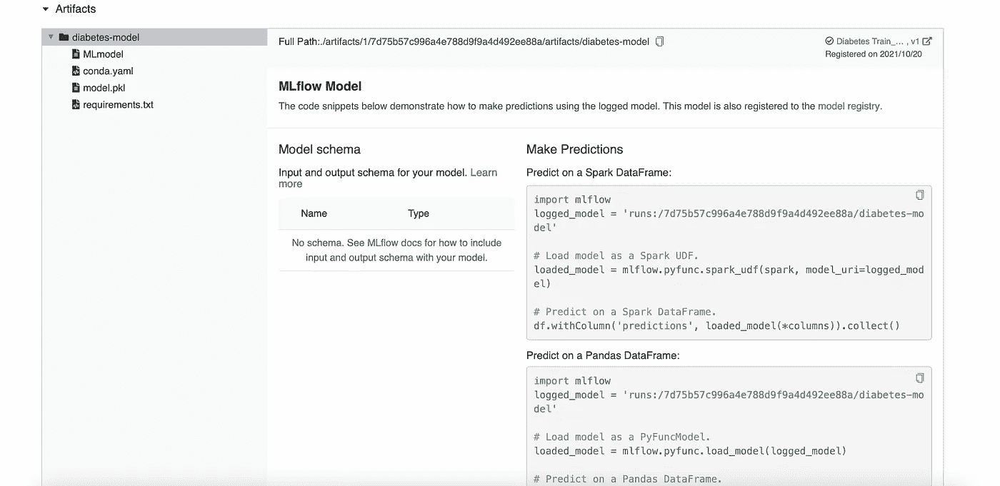

# 将 MLflow 模型日志记录集成到 Scikit-Learn 管道

> 原文：<https://medium.com/analytics-vidhya/integrate-mlflow-model-logging-to-scikit-learn-pipeline-6f74e5c601c3?source=collection_archive---------1----------------------->



# MLflow 简介

MLflow 是一个开源工具，具有模型跟踪、日志记录和注册等功能。它可以用于在数据科学团队内部轻松访问机器学习模型，还可以通过记录用于训练特定模型的参数来轻松重现实验。

MLflow 还可以很好地集成到 CI/CD 管道中，并且在 MLOps 期间，数据科学家和 ML 工程师可以与部署工程师合作开发和部署 ML 模型的新版本，并监控其性能。

以下是 MLflow 的功能-

**MLflow Tracking** —帮助记录和跟踪每个 ML 实验，以及比较每次运行的结果。

**MLflow 项目** —让您的 ML 代码可重用，并打包您的代码与其他数据科学家共享。

**MLflow Models** —将您的 ML 模型与其他模型工件一起以串行格式存储，这使得部署模型进行推理更加容易。

**MLflow Model Registry** —通过模型版本化协作管理您的 ML 模型，并将其从活动状态过渡到试运行状态，然后过渡到生产状态。

**注:**这不是 MLflow 教程。只有 MLflow 登录到管道的实现。如果您对 MLflow 不熟悉，我建议您在继续之前通读[文档](https://mlflow.org/docs/latest/index.html)。

# 什么是 Scikit-Learn 管道？

训练 ML 模型是一个迭代过程。该模型需要根据用例以及收集的新数据量以设定的频率重新训练。需要有一种机制将数据接收到训练管道中，执行特征工程，训练模型并保存新模型。

[Scikit-Learn Pipeline](https://scikit-learn.org/stable/modules/generated/sklearn.pipeline.Pipeline.html) 由多个步骤组成，从用于缩放数字特征和编码分类特征的转换器开始，到基于转换数据进行学习的估计器结束。

# 培训模型管道

该应用程序的最终目标是部署一个模型训练服务，并公开一个 REST 端点，我们可以通过该端点发送数据和模型参数。

一旦端点被调用，数据将被分割以训练和测试，并被摄取到训练管道中以训练模型。在成功的训练之后，我们将使用测试数据来记录使用 MLflow 的模型的不同度量，并且还将模型/工件记录到 MLflow。

我们将在此演示中使用的数据集是糖尿病预测数据集，它有 8 个特征，目标列是结果，由二进制值 0 表示糖尿病阴性病例，1 表示糖尿病阳性病例。数据集链接这里是[这里是](https://www.kaggle.com/uciml/pima-indians-diabetes-database)。

```
# read data
dia_df = pd.read_csv('../data/diabetes.csv')# split data into train/test
X_train, X_test, y_train, y_test = train_test_split(dia_df.drop('Outcome', axis=1), dia_df['Outcome'], test_size=0.3, random_state=123)#creating a pipeline
model_pipeline = Pipeline(steps=[('scaler', MinMaxScaler()), ('model', LogisticRegression())])# fit model
model_pipeline.fit(X_train, y_train)
```

上面提供的代码是 scikit-learn 管道的基本实现。接下来，我们将看到如何使用 MLflow 记录模型的指标。

```
# compare various metrics of model
def get_metrics(y_true, y_pred, y_pred_prob):
    acc = accuracy_score(y_true, y_pred)
    prec = precision_score(y_true, y_pred)
    recall = recall_score(y_true, y_pred)
    entropy = log_loss(y_true, y_pred_prob)
    return {'accuracy': round(acc, 2), 'precision': round(prec, 2), 'recall': round(recall, 2), 'entropy': round(entropy, 2)}# log model metrics with MLflow
def log_model(experiment_name, run_name, run_metrics, run_params=None):
    mlflow.set_experiment(experiment_name)
    with mlflow.start_run(run_name=run_name):
        if not run_params == None:
            for name in run_params:
                mlflow.log_param(run_params[name])
        for name in run_metrics:
            mlflow.log_metric(name, run_metrics[name])

    print('Run - %s is logged to Experiment - %s' %(run_name, experiment_name))
```

# 创建定制培训渠道

自定义训练管道继承自 Scikit-Learn 管道类，因此所有功能(如 fit、transform 和 predict)都已经存在。我们唯一要做的是将模型日志添加到我们的定制培训管道类中。下面是代码。

```
class TrainingPipeline(Pipeline):'''Class -> TrainingPipeline, ParentClass -> Sklearn-PipelineExtends from Scikit-Learn Pipeline class. Additional functionality to track model metrics and log model artifacts with mlflowparams:steps: list of tuple (similar to Scikit-Learn Pipeline class)'''def __init__(self, steps):super().__init__(steps)def fit(self, X_train, y_train):self.__pipeline = super().fit(X_train, y_train)return self.__pipelinedef get_metrics(self, y_true, y_pred, y_pred_prob):acc = accuracy_score(y_true, y_pred)prec = precision_score(y_true, y_pred)recall = recall_score(y_true, y_pred)entropy = log_loss(y_true, y_pred_prob)return {'accuracy': round(acc, 2), 'precision': round(prec, 2), 'recall': round(recall, 2), 'entropy': round(entropy, 2)}def make_model_name(self, experiment_name, run_name):clock_time = time.ctime().replace(' ', '-')return experiment_name + '_' + run_name + '_' + clock_timedef log_model(self, model_key, X_test, y_test, experiment_name, run_name, run_params=None):model = self.__pipeline.get_params()[model_key]y_pred = self.__pipeline.predict(X_test)y_pred_prob = self.__pipeline.predict_proba(X_test)run_metrics = self.get_metrics(y_test, y_pred, y_pred_prob)mlflow.set_experiment(experiment_name)mlflow.set_tracking_uri('http://localhost:5000')with mlflow.start_run(run_name=run_name):if not run_params == None:for name in run_params:mlflow.log_param(name, run_params[name])for name in run_metrics:mlflow.log_metric(name, run_metrics[name])model_name = self.make_model_name(experiment_name, run_name)mlflow.sklearn.log_model(sk_model=self.__pipeline, artifact_path='diabetes-model', registered_model_name=model_name)print('Run - %s is logged to Experiment - %s' %(run_name, experiment_name))return run_metrics
```

# 训练模型的 REST API

我们使用 flask 来公开用于训练模型的 REST API。这是一个接受表单数据的 POST 请求。请求有效负载由一个用于训练和模型参数的 csv 文件组成。在示例中，我们使用糖尿病数据集进行训练，因此最终模型是逻辑回归。

```
def run_train_pipeline(dia_df, tol, iterations, experiment_name, run_name):'''method which executes the training pipelineparams:dia_df : diabetes dataframetol : C (tolerance) value for regularizationiterations : maximum iterations for training Logistic Regression modelexperiment_name : MLflow experiment namerun_name : Set run name inside each experiment'''X_train, X_test, y_train, y_test = train_test_split(dia_df.drop('Outcome', axis=1), dia_df['Outcome'], test_size=0.3, random_state=123)train_pipeline = TrainingPipeline(steps=[('scaler', MinMaxScaler()), ('model', LogisticRegression(C=tol, max_iter=iterations))])run_params = {'C': tol, 'max_iter': iterations}train_pipeline.fit(X_train, y_train)return train_pipeline.log_model('model', X_test, y_test, experiment_name, run_name, run_params=run_params)
```

当触发训练 API 时，执行 run_train_pipeline 方法。该方法的目的是将数据分为训练集和测试集，初始化训练管道类，拟合模型并记录模型度量和工件。

```
@app.route('/train', methods=['POST'])def train():if request.method == 'POST':csv_file = request.files['train_file']if csv_file == None:raise ValueError('Train File is not provided.')file_name = csv_file.filenameif file_name.split('.')[1] == 'csv':clock_time = time.ctime().replace(' ', '-')save_file = './temp/' + file_name.split('.')[0] + '_' + clock_time + '.csv'csv_file.save(save_file)tol = float(request.form['tol'])iterations = int(request.form['iterations'])experiment_name = request.form['exp_name']run_name = 'Train-Run-' + clock_timedia_df = pd.read_csv(save_file)metrics = run_train_pipeline(dia_df, tol, iterations, experiment_name, run_name)return jsonify(metrics)else:raise TypeError('Invalid file type. App only accepts csv files.')
```

这里，我们公开了一个/train 端点，可以调用它来发送数据和训练模型。整个管道将负责模型训练和记录。

# 结果

让我们讨论一下调用/train API 后 MLflow 中生成的一些结果。我们从调用 API 开始，在请求体中发送文件、模型参数和实验名称。



API 会将指标作为响应返回给我们。但是培训管道已经在 MLflow 的后端记录了这些指标。以便我们可以比较模型性能的结果。



对于这个例子，我尝试了不同的公差值，并相应地记录了度量标准。这是 MLflow 日志。

这里，MLflow 仪表板显示了糖尿病训练实验下的各种运行。



我们甚至可以比较这些运行和可视化图形，并了解哪个模型表现更好。模型参数和指标都记录在 MLflow 中。



现在，回到实验，选择最佳模型。我们还可以在 artifacts 部分看到保存到 MLflow 中的模型，并为推断做好准备。



下面是用熊猫数据框架对模型进行评分的代码片段。

```
import mlflow logged_model = 'runs:/7d75b57c996a4e788d9f9a4d492ee88a/diabetes-model' # Load model as a PyFuncModel. 
loaded_model = mlflow.pyfunc.load_model(logged_model)

# Predict on a Pandas DataFrame. 
import pandas as pd 
loaded_model.predict(pd.DataFrame(data))
```

# 结论

MLflow 是维护 ML 模型和创建可重复实验的强大工具。本文通过一个小例子来说明如何在 Scikit-Learn 管道中实现 MLflow。然而，MLflow 的使用并不局限于 Scikit-Learn，它也可以用于其他框架。

如果您喜欢这篇文章，并且您想自己尝试代码。这里是 [github 链接](https://github.com/iamrajatroy/Data-Science-Lab/blob/main/mlflow/train.py)。