# 将 Rstudio 与 Github 集成

> 原文：<https://medium.com/analytics-vidhya/integrating-rstudio-with-github-1f931584548?source=collection_archive---------8----------------------->

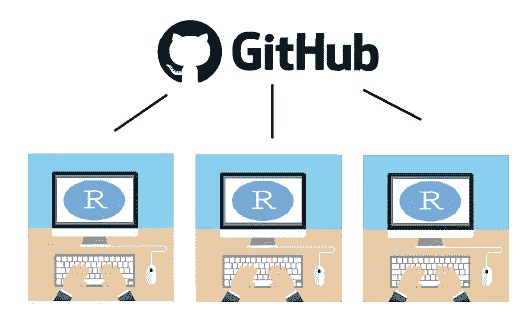

所以你已经运行了 Rstudio，并且在网上听说了一个可以存储代码的地方，叫做 Github。很好，现在怎么办？在这篇文章中，我将帮助介绍 Github 和一些唾手可得的成果，我认为许多初学者可以用最简单的技术方式利用它们并从中受益，或者至少以我刚开始时觉得有意义的方式。然后我会谈到为什么以及如何在您的工作流程中快速集成 Rstudio。

我的目标是:让你尽快上手，尽快离开这篇文章，这样你就可以开始从这个令人惊叹的生态系统中受益。

所以列出我们要做的事情…

*   什么是 Github。
*   它的重要性。
*   如何整合，用分步图。
*   带着一个你可以开始工作的可用项目离开！

# 什么是 Github？让我们剖析一下这个名字。

**Github** 是一个开源(免费)的基于网络的版本控制系统(Github 中的“git ”),通过全球社区(hub)促进协同工作和共享

**Git** :一个版本控制系统，允许跟踪文件或项目的所有修改和变更

Hub:你可以在这个社交平台上创建一个账户，人们可以在这个平台上查看、分享或复制代码。

想想类似于 **google docs** 的 Github，但是有更好的版本控制系统和社交网络平台。

*潜在雇主或雇员不会在意你的 google docs 账户，但很可能会在意你的 Github 个人资料！*

# 为什么 Rstudio + Github >谷歌文档

1.  与他人合作编写代码。
2.  查看正在进行的增量更改，并在需要时返回到以前的版本。
3.  能够在任何计算机上保存、打开和存储您的工作，并直接存储到云中。
4.  用作作品集向你的奶奶或精通技术的朋友展示你的优秀项目*(别忘了打开* ***黑暗模式*** *主题！).*

完美的 T21！让我们开始吧…

# **安装:**

*   Windows 在这里下载 **Git** [，Mac](https://git-scm.com/download/win) 在这里下载[(Mac 安装我建议遵循**家酿**选项)，安装时选择默认选项即可。](https://git-scm.com/download/mac)

# **Github 账户&首次回购**

*   在 [Github](http://github.com) 上创建一个账户。
*   **启动您的第一个存储库**和**复制**存储库 URL！

你可以把存储库想象成一个包含项目文件和版本历史的主文件夹！

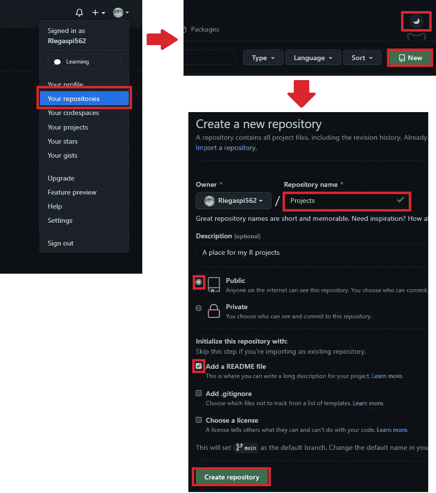

一个**。readme 文件**是一个文件，您可以在其中留下描述或任何其他重要注释，以便您的查看者在进入您的存储库之前阅读。

**创建存储库后，复制 HTTPS 的 URL！**

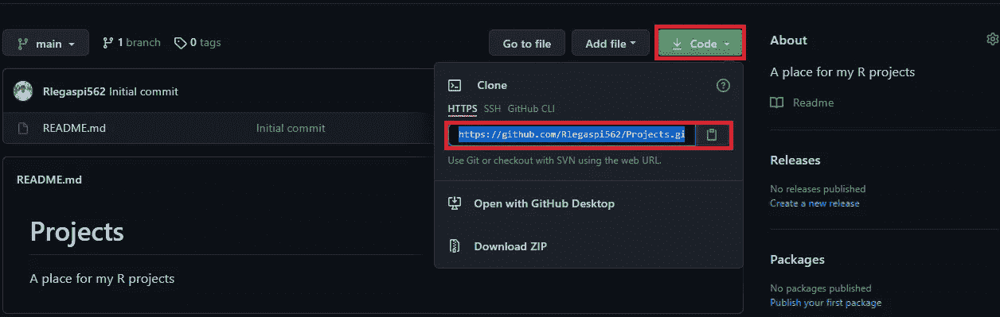

# **接通 Rstudio**

Spectacul-R！让我们打开 Rstudio 并快速设置 Git。

*   点击工具>全局选项> Git/SVN
*   通过选中复选框启用版本控制，然后单击应用

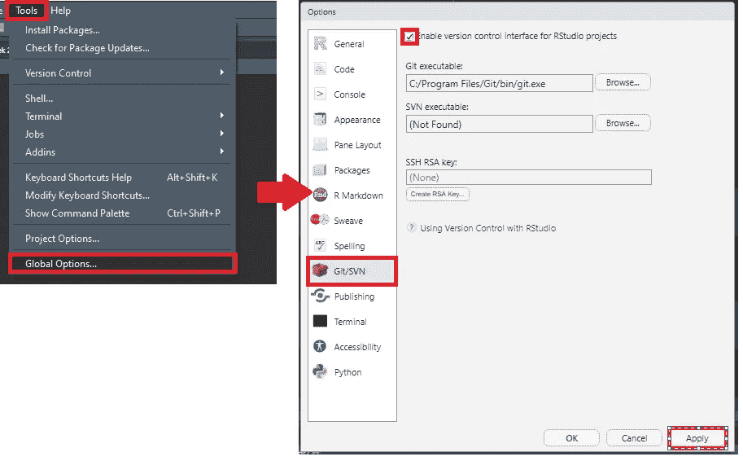

创建您的第一个版本控制项目…

*   单击文件>新建项目>版本控制> Git

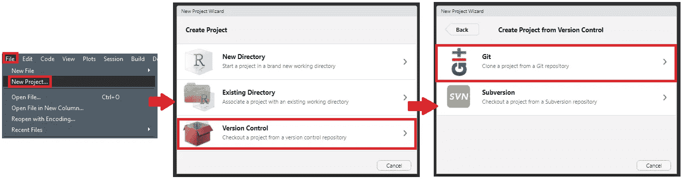

*   然后将您从 Github 资源库复制的 URL 粘贴到资源库 URL 框中

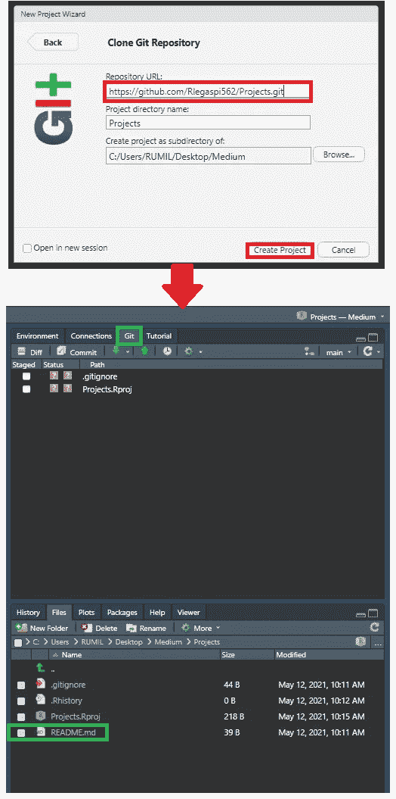

太好了，所以如果你在右上角看到这个新的**“Git”标签**，你就知道你来对地方了。这意味着 git 已经与您的新 R 项目集成，您甚至可以看到相同的内容。之前的自述文件！

# 你的第一次承诺！

*   让我们创建一个 Rmarkdown 文件！

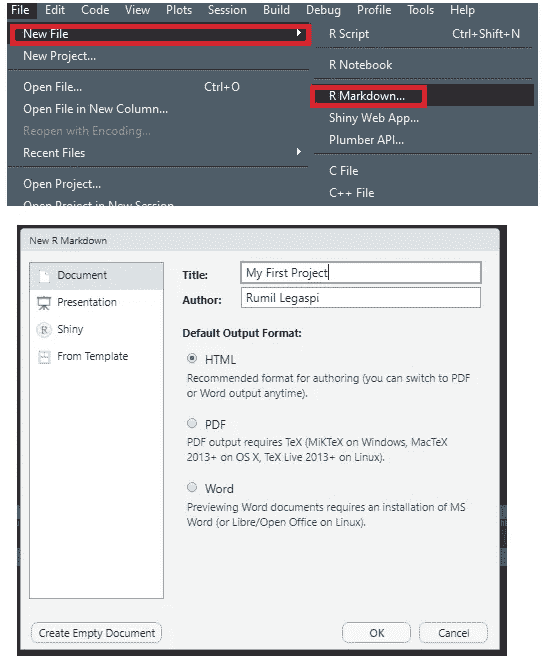

*   编织成 html 并另存为 firstmarkdown.rmd。

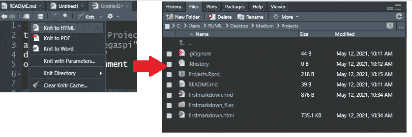

*针织(导出)将自动保存文件，并注意位于右下窗格的文件部分中的新 html 和其他文件。*

好了，我们已经创建了一个新项目，添加了一个新的 markdown 文件，甚至导出了一个 html 输出文件。让我们把所有这些变化和新的文件推到我们的 github！

*   让**通过选中复选框来准备**(准备或选择我们要发送的文件)

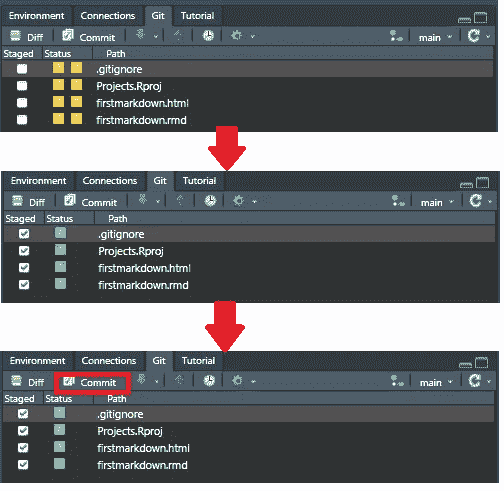

按下 commit 后，您将被带到这个新窗口，在这里您可以查看项目的更改和历史记录。

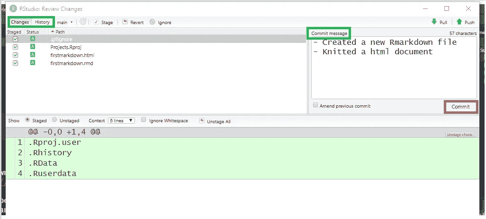

通过**提交，你实际上保存了**你所做的工作，以及一条帮助描述你所做工作的信息，以供将来参考。

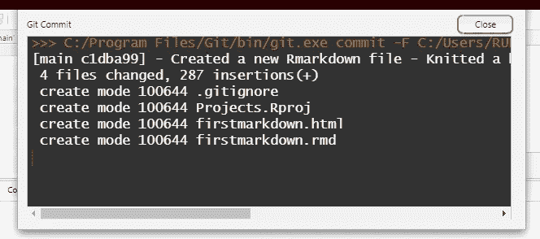

如果有任何错误，这些窗口将会弹出并通知您。

# 然后最后我们推 GITHUB 宝贝！

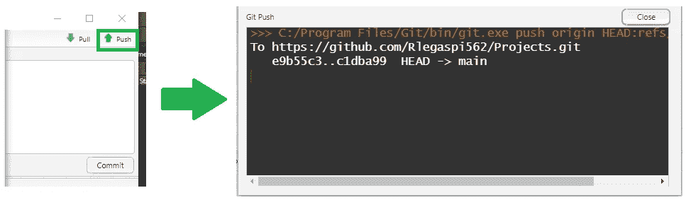

让我们回到我们的 github，看看我们的文件。

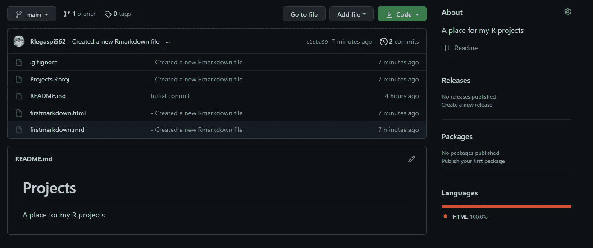

很好，我们所有的文件都在那里！

# 最后的话

如果你已经走了这么远，恭喜你！我非常期待看到你将如何在你的程序员之旅中使用它。为了避免混淆，我还遗漏了很多其他的东西，但是我绝对推荐查看这些全面的指南，以获得更深入的细节。

这个叫大卫·凯斯的人绝对是一个天才

*   [如何用 R 使用 Git/Github](https://rfortherestofus.com/2021/02/how-to-use-git-github-with-r/)
*   [与 git 和 Github 合作](https://www.sds.pub/getting-started.html)

欢迎点击这里查看我的 githhub，如果你有任何问题或者想聊天，请不要犹豫。祝你过得愉快！