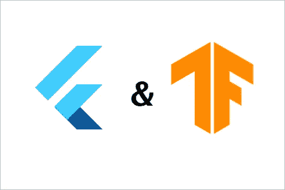
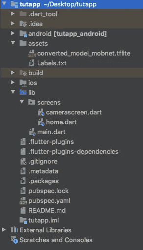

# 将 TensorFlow Lite 与 Flutter 集成用于计算机视觉

> 原文：<https://medium.com/analytics-vidhya/integrating-tensorflowlite-with-flutter-for-computer-vision-6c82d1e5bccd?source=collection_archive---------7----------------------->



你有没有想过制作一个使用人工智能在旅途中进行预测的移动应用程序？你并不孤单。作为我在学校项目的一部分，我必须制作一个使用人工智能对植物疾病进行分类的移动应用程序。你们中的一些人可能已经猜到我使用了 CNN(卷积神经网络)。我用 TensorFlow 对人工智能进行了编码和训练。但最困难的部分出现在我需要将人工智能放入应用程序的时候。

我试着用传统的方法制作一个 android 应用程序，并且真的成功了。但是它被组装得很糟糕，这时候 Flutter 出现了。


图片来自 [https://flutter.dev](https://flutter.dev)

Flutter 是谷歌的 UI 工具包，用于从单一代码库为[移动](https://flutter.dev/docs)、[网络](https://flutter.dev/web)和[桌面](https://flutter.dev/desktop)构建漂亮的本地编译应用。

尽管设置 TensorFlow Lite 来使用 Flutter 比我第一次尝试要容易，但这仍然是一场噩梦。我在这里让你尝试制作比我更容易使用人工智能的 Flutter 应用程序。

本教程不谈论编码的人工智能，只是 TensorFlow 建兴文件与 Flutter 的集成。如果你想了解更多关于人工智能编码的知识，我有一个 3 部分组成的博客。敬请关注！

在这篇博客中，我将向你展示如何使用计算机视觉制作一个 Flutter 应用程序。不过，我会假设你有一些颤振方面的经验。

首先，您需要一个模型的 TensorFlow Lite 文件。然后创建一个新的颤振项目。我将在我的桌面上做这个项目，你可以在任何你想做的地方做。在终端/命令提示符下键入:

```
cd desktop
flutter create tutapp
```

在您让 Flutter 创建一个项目文件之后，您可以在编辑器中打开它。本教程我将使用 Android Studio，但是您可以使用任何编辑器。

首先删除“test”文件夹，因为这会给我们带来问题。

在真实设备中运行您的应用程序，因为我们需要使用摄像头的实时反馈。

如果你刚刚开始使用 Flutter，你看到的大部分只是一个“入门”代码。可以放心删除，开始做自己的 app。我将使用我在**我的**应用中使用的人工智能模型。

在 lib 文件夹中，创建另一个名为“屏幕”的文件夹。在 screens 文件夹中创建两个名为 home.dart 和 camerascreen.dart 的 dart 文件，然后在主目录中创建一个名为“assets”的文件夹。这个文件夹将有 TensorFlow Lite 模型和一个. txt 文件用于我们的标签。



现在，在您的 pubspec.yaml 文件中，您需要添加 2 个依赖项。这是我们运行应用程序所需的两件事。

```
camera: 0.5.8+5
tflite:
```

之后，您需要向下滚动并更改以下内容:

```
// assets:
//  - assets/....           (<- Something over here)
```

对此:

```
assets:
  - assets/
```

这将向 Flutter 声明我们拥有资产(我们的。tflite 文件和我们的标签文件),这些资源位于 assets 文件夹中。

我们将制作一个非常基本的应用程序，因为我只想向您展示如何集成 TensorFlow Lite。在 main.dart 文件中键入以下代码:

```
import 'package:flutter/material.dart';
import 'package:tutapp/screens/home.dart';
import 'package:camera/camera.dart';

List<CameraDescription> cameras;
Future<void> main() async {
  WidgetsFlutterBinding.*ensureInitialized*();
  cameras = await availableCameras();
  runApp(MaterialApp(
    debugShowCheckedModeBanner: false,
    home: MyHomePage(
      cameras,
    ),
  ));
}
```

这段代码只是从设备中获取所有相机的列表，并把它们放在一个列表中，这样我们就可以使用任何我们想要的相机。然后，我们设置我们的应用程序的主页。

在 home.dart 文件中，键入以下代码:

```
import 'package:flutter/material.dart';
import 'package:camera/camera.dart';
import 'package:tflite/tflite.dart';
import 'camerascreen.dart';

class MyHomePage extends StatefulWidget {
  final List<CameraDescription> cameras;

  MyHomePage(this.cameras);
  @override
  _MyHomePageState createState() => _MyHomePageState();
}

class _MyHomePageState extends State<MyHomePage> {
  String predOne = '';

  @override
  void initState() {
    super.initState();
    loadTfliteModel();
  }

  loadTfliteModel() async {
    String res;
    res = await Tflite.*loadModel*(
        model: "assets/converted_model_mobnet.tflite",
        labels: "assets/Labels.txt");
    print(res);
  }

  setRecognitions(outputs) {
    setState(() {
      predOne = outputs[0]['label'];
    });
  }

  @override
  Widget build(BuildContext context) {
    return Scaffold(
      backgroundColor: Colors.*blueGrey*,
      appBar: AppBar(
        centerTitle: true,
        title: Text(
          "TensorFlow Lite App",
        ),
        backgroundColor: Colors.*teal*,
      ),
      body: Stack(
        children: [
          Camera(widget.cameras, setRecognitions),
          Align(
            alignment: Alignment.*bottomCenter*,
            child: Container(
              height: 100.0,
              decoration: BoxDecoration(
                  color: Colors.*blueGrey*,
                  boxShadow: [BoxShadow(color: Colors.*black*, blurRadius: 20.0)],
                  borderRadius: BorderRadius.only(
                      topLeft: Radius.circular(50.0),
                      topRight: Radius.circular(50.0))),
              child: Column(
                crossAxisAlignment: CrossAxisAlignment.stretch,
                children: [
                  SizedBox(
                    height: 30.0,
                  ),
                  Text(
                    "$predOne",
                    textAlign: TextAlign.center,
                    style: TextStyle(
                        color: Colors.*tealAccent*,
                        fontWeight: FontWeight.*bold*,
                        fontSize: 20.0),
                  ),
                ],
              ),
            ),
          )
        ],
      ),
    );
  }
}
```

我已经设计了我的应用程序，有一个简单的应用程序栏和一个显示预测的底部栏，在下面我会显示直播摄像头。

此时，您会看到一些错误。那是因为我们还没有声明一个叫“相机”的小部件。我们现在就去做。在 camerascreen.dart 文件中键入以下代码:

```
import 'package:flutter/material.dart';
import 'package:camera/camera.dart';
import 'package:tflite/tflite.dart';

typedef void Callback(List<dynamic> list);

class Camera extends StatefulWidget {
  final List<CameraDescription> cameras;
  final Callback setRecognitions;

  Camera(this.cameras, this.setRecognitions);
  @override
  _CameraState createState() => _CameraState();
}

class _CameraState extends State<Camera> {
  CameraController cameraController;
  bool isDetecting = false;

  @override
  void initState() {
    super.initState();
    cameraController =
        CameraController(widget.cameras.first, ResolutionPreset.high);
    cameraController.initialize().then((value) {
      if (!mounted) {
        return;
      }
      setState(() {});

      cameraController.startImageStream((image) {
        if (!isDetecting) {
          isDetecting = true;
          Tflite.*runModelOnFrame*(
            bytesList: image.planes.map((plane) {
              return plane.bytes;
            }).toList(),
            imageHeight: image.height,
            imageWidth: image.width,
            numResults: 1,
          ).then((value) {
            if (value.isNotEmpty) {
              widget.setRecognitions(value);
              isDetecting = false;
            }
          });
        }
      });
    });
  }

  @override
  void dispose() {
    cameraController?.dispose();
    super.dispose();
  }

  @override
  Widget build(BuildContext context) {
    if (!cameraController.value.isInitialized) {
      return Container();
    }

    return Transform.scale(
      scale: 1 / cameraController.value.aspectRatio,
      child: Center(
        child: AspectRatio(
          aspectRatio: cameraController.value.aspectRatio,
          child: CameraPreview(cameraController),
        ),
      ),
    );
  }
}
```

我们希望检测每一帧，因此我们称之为“Tflite”。 *runModelOnFrame* "每次微件(相机)重建时。我们通过将必要的代码放入“initState”中来实现这一点。因为这个任务是一个异步任务，我们让 Flutter 知道(使用布尔 isDetecting)现在我们希望我们的应用程序进行预测，而现在我们没有。AspectRatio 是显示摄像头馈送所必需的，Transform 小部件只是将视频馈送缩放到设备的屏幕大小，以便摄像头馈送和屏幕边缘之间没有任何难看的间隙。我们将“setRecognitions”回调传递给这个小部件，这是我们在 home.dart 中定义的，因为我们希望将输出传递给主页，在主页上我们将标签分配给一个变量，然后将该变量显示为预测。

就是这样！您可以修改代码来显示预测的可信度，甚至可以从“Tflite”中获得 2 或 3 个顶级标签。 *runModelOnFrame* 方法。为了显示这些变量，你可能需要进行空间调整，而 Flutter 很容易做到这一点。但除此之外，我们准备好了！

需要记住的几件事是:您需要确保 Labels.txt 文件的条目数与 TensorFlow 模型的训练类数相同。此外，当你第一次尝试打开应用程序时，它可能无法工作，因为你需要给它访问手机摄像头的权限。只需重启应用程序，你就可以了。

所以这就是你如何用计算机视觉制作一个 Flutter 应用程序。如果你想了解**如何**制作这些模型，请继续关注，因为接下来的三篇博客将会是关于这些的。如果你喜欢这个博客，分享它并在 Medium 上关注我。

感谢您的阅读！