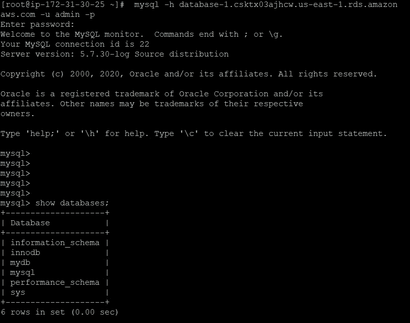

# 在 AWS Cloud 上集成 WordPress 和 AWS RDS

> 原文：<https://medium.com/analytics-vidhya/integrating-wordpress-with-aws-rds-on-aws-cloud-670edc59dc63?source=collection_archive---------3----------------------->


# AWS RDS

Amazon 关系数据库服务(Amazon RDS)使得在云中设置、操作和扩展关系数据库变得很容易。它提供经济高效且可调整大小的容量，同时自动执行耗时的管理任务，如硬件配置、数据库设置、修补和备份。它让您可以专注于您的应用程序，从而为它们提供所需的快速性能、高可用性、安全性和兼容性。

Amazon RDS 可用于多种数据库实例类型，针对内存、性能或 I/O 进行了优化，并为您提供了六种熟悉的数据库引擎可供选择，包括 Amazon Aurora、PostgreSQL、MySQL、MariaDB、Oracle 数据库和 SQL Server。您可以使用 AWS 数据库迁移服务轻松地将现有数据库迁移或复制到 Amazon RDS

# wordpress 软件

WordPress 是开源软件，这意味着任何人都可以研究它的代码，并为它编写应用程序(插件)和模板(主题)。

# 任务描述

1.创建 AWS EC2 实例

2.用 Apache Webserver 配置实例。

3.下载 PHP 应用程序名“WordPress”。

4.因为 WordPress 将数据存储在 MySQL 数据库服务器的后端。因此，您需要使用 AWS RDS 服务使用免费层设置一个 MySQL 服务器。

5.向 WordPress 应用程序提供端点/连接字符串以使其工作。

# 步骤:

1.  使用 AWS dashboard 或 cli 启动 EC2 实例来部署 WordPress(确保允许 sg 中的所有流量)


2.使用 Putty 连接到 EC2 实例，并安装必要的库。

```
dnf install httpd -ydnf install wget vim -ydnf install [https://dl.fedoraproject.org/pub/epel/epel-release-latest-8.noarch.rpm](https://dl.fedoraproject.org/pub/epel/epel-release-latest-8.noarch.rpm)dnf install [https://rpms.remirepo.net/enterprise/remi-release-8.rpm](https://rpms.remirepo.net/enterprise/remi-release-8.rpm)dnf module install php:remi-7.4 dnf install php-mysqlnd -y
```

3.启动 httpd 服务器

```
systemctl start httpd
systemctl enable httpd
```


4.在浏览器中键入公共 IP，并检查 httpd 服务器是否已启动

```
########you can even check using
systemctl status httpd
```


5.从网上下载 WordPress 代码并解压到/var/www/html 文件夹中

```
wget [https://wordpress.org/latest.tar.gz](https://wordpress.org/latest.tar.gz)tar -xvzf latest.tar.gz -C /var/www/html
```

6.使用安装 mysql

```
dnf install mysql -y
```

7.为 WordPress 创建 RDS 数据库

*   打开亚马逊 RDS，点击创建数据库
*   选择 mysql 作为数据库类型
*   在**模板**部分，选择**自由层**。
*   **数据库实例标识符** — `**default**`
*   **主用户名** — `**default**`
*   **主密码** —选择一个密码。
*   **确认密码—** 重新输入密码
*   **可用区—** 美国东部-1
*   **初始数据库名称—** mydb


8.创建数据库后，它将提供端点 url，并确保允许 sg 中的所有流量


9.检查与数据库的连接，使用

```
mysql -h endpoint url -u admin -p 
```



10.使用以下方式连接到 WordPress

```
public_ip/wordpress
```


*   提供数据库名称、用户名、密码、端点 Url


11.最终 WordPress 与 mysql 建立了连接

