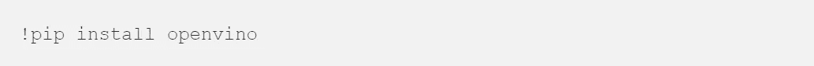
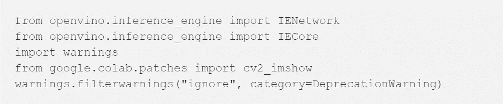
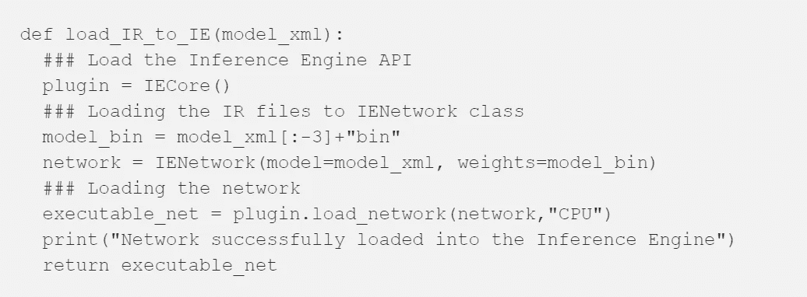
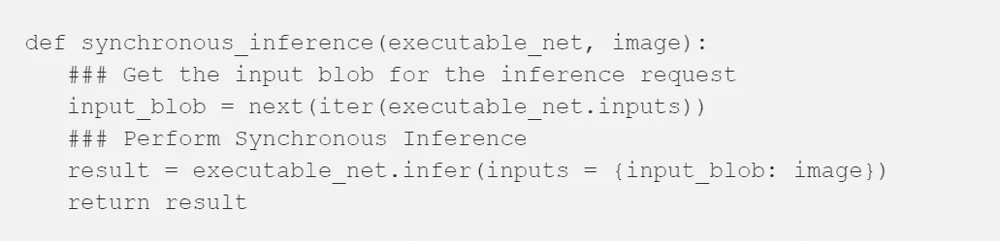
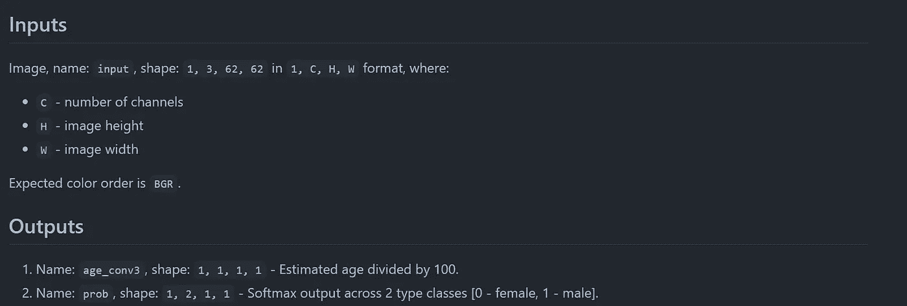
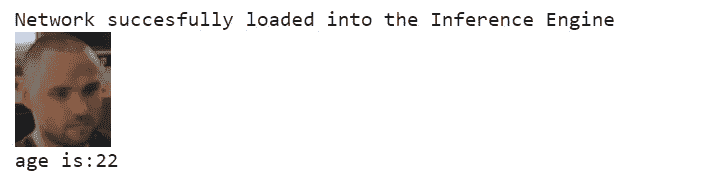
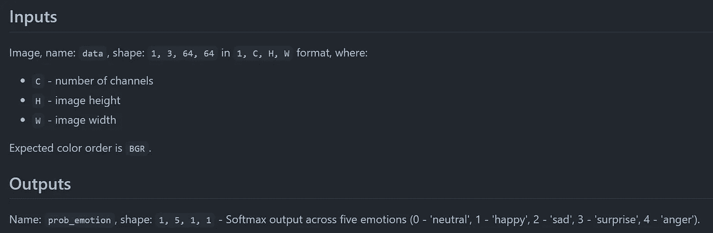
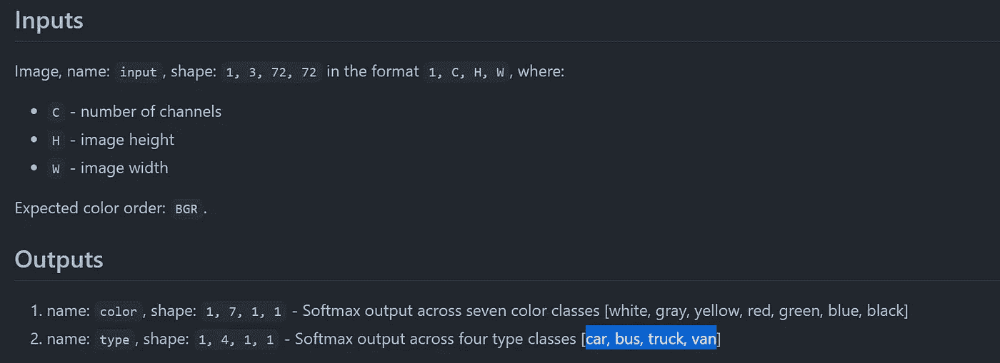

# Google Colab 上的英特尔 OpenVINO

> 原文：<https://medium.com/analytics-vidhya/intel-openvino-on-google-colab-20ac8d2eede6?source=collection_archive---------6----------------------->

英特尔的 OpenVINO 发行版使 ***人工智能推理*** 变得快速而简单。推理基本上是模型获得了所有教育(训练)并需要通过基于其能力推断新信息来炫耀的阶段。


来源:[https://software . Intel . com/content/www/us/en/develop/tools/open vino-toolkit . html](https://software.intel.com/content/www/us/en/develop/tools/openvino-toolkit.html)

OpenVINO 框架使得跨各种架构的推断和部署变得非常容易。更多关于框架的[在这里](https://software.intel.com/content/www/us/en/develop/tools/openvino-toolkit.html)。

本教程将教你如何在 Google Colab 上测试 OpenVINO 的能力。

# 一般来说，使用 OpenVINO 的步骤是:

—使用来自 [**英特尔模型动物园**](https://github.com/IntelAI/models) 的 ***预训练模型*** 或使用您自己的 ***模型(构建)***

—使用推理引擎生成 xml 和 bin 文件(优化)

—使用您首选的环境进行部署

# 使用 Google Colab 部署

首先，我们将关注第三步。这里，**假设**您已经有了 xml 和 bin 文件。我在我的存储库中添加了一些用于英特尔预训练模型的 xml 和 bin 文件。请随意使用:[https://github . com/jojo 96/Intel-open vino-colab/tree/main/models](https://github.com/jojo96/intel-openvino-colab/tree/main/models)

**安装库:**



**进行必要的导入:**



**获取可执行网络:**



**推断时间:**



**TLDR** > >使用本笔记本:[**https://github . com/jojo 96/Intel-open vino-colab/blob/main/notebooks/all models . ipynb**](https://github.com/jojo96/intel-openvino-colab/blob/main/notebooks/AllModels.ipynb)

# 一些使用案例:

这里用到的所有 xml 和 bin 文件都可以在我的 repo:[https://github . com/jojo 96/Intel-open vino-colab/tree/main/models](https://github.com/jojo96/intel-openvino-colab/tree/main/models)

**年龄检测示例:**

**年龄-性别-识别-零售-0013** :这种经过预先训练的英特尔模型能够检测出[18–75]年龄组的人。下面的代码片段决定了*一个人的年龄。*



来源:[https://github . com/openvinotoolkit/open _ model _ zoo/tree/master/models/Intel/age-gender-recognition-retail-0013](https://github.com/openvinotoolkit/open_model_zoo/tree/master/models/intel/age-gender-recognition-retail-0013)

```
#age detection age-gender-recognition-retail-0013en = load_IR_to_IE('age.xml')import cv2
image = cv2.imread('age1.png')**#input image for age prediction**
resized = cv2.resize(image, (62,62), interpolation = cv2.INTER_AREA)from torchvision import transforms
tran = transforms.ToTensor()  # Convert the numpy array or PIL.Image #read image to (C, H, W) Tensor format and /255 normalize to [0, #1.0]
img_tensor = tran(resized)
img_tensor = img_tensor.unsqueeze_(0)res = synchronous_inference(en, img_tensor)
cv2_imshow(cv2.imread('age1.png'))**#input image for age prediction**
print("age is:"+str(round(res['age_conv3'][0][0][0][0]*100)))
```



输出

**情感检测示例(型号:** [**情感-识别-零售-0003**](https://github.com/openvinotoolkit/open_model_zoo/tree/master/models/intel/emotions-recognition-retail-0003) **):**



来源:[https://github . com/openvinotoolkit/open _ model _ zoo/tree/master/models/Intel/emotions-recognition-retail-0003](https://github.com/openvinotoolkit/open_model_zoo/tree/master/models/intel/emotions-recognition-retail-0003)

```
#emotion detection emotions-recognition-retail-0003en = load_IR_to_IE('**emo.xml**')import cv2
image = cv2.imread('angry.jpg')**#input image for emotion prediction**
resized = cv2.resize(image, (64,64), interpolation = cv2.INTER_AREA)from torchvision import transforms
tran = transforms.ToTensor()  # Convert the numpy array or PIL.Image #read image to (C, H, W) Tensor format and /255 normalize to [0, #1.0]
img_tensor = tran(resized)
img_tensor = img_tensor.unsqueeze_(0)res = synchronous_inference(en, img_tensor)
cv2_imshow(cv2.imread('angry.jpg'))**#input image for emotion #prediction**print(res)
```

结果:包含 5 个情感概率浮点数的数组，顺序为:( **0:中性，1:快乐，2:悲伤，3:惊讶，4:愤怒**)

**车辆检测示例(型号:** [**车辆-属性-识别-护栏-0039**](https://github.com/openvinotoolkit/open_model_zoo/tree/master/models/intel/vehicle-attributes-recognition-barrier-0039) **):**



来源:[https://github . com/openvinotoolkit/open _ model _ zoo/tree/master/models/Intel/vehicle-attributes-recognition-barrier-0039](https://github.com/openvinotoolkit/open_model_zoo/tree/master/models/intel/vehicle-attributes-recognition-barrier-0039)

```
#vehicle detectionen = load_IR_to_IE('vehicle.xml')import cv2
image = cv2.imread('truck.jpg')**#input image for vehicle prediction**
resized = cv2.resize(image, (72,72), interpolation = cv2.INTER_AREA)from torchvision import transformstran = transforms.ToTensor() 
img_tensor = tran(resized)
img_tensor = img_tensor.unsqueeze_(0)res = synchronous_inference(en, img_tensor)cv2_imshow(cv2.imread('truck.jpg'))**#input image for #vehicle prediction**print(res)
```

点击此处查看整个笔记本:

# 奖金

耶！你已经走到这一步了。一份小礼物🍀

因此，下面的笔记本可以用于从[英特尔模型动物园](https://github.com/openvinotoolkit/open_model_zoo/tree/master/models/intel)的模型生成 xml 和 bin 文件。有一个完整的例子展示了 xml 和 bijn 文件的生成和预测。

*参考资料:这里很多代码都是由*[*https://github.com/alihussainia/openvino-colab*](https://github.com/alihussainia/openvino-colab)修改改编而来