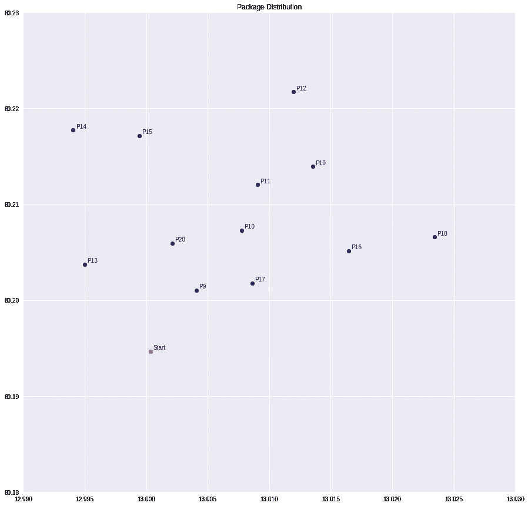
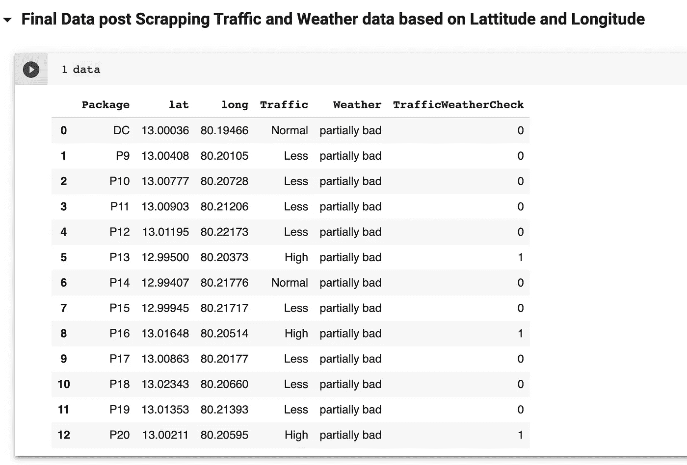
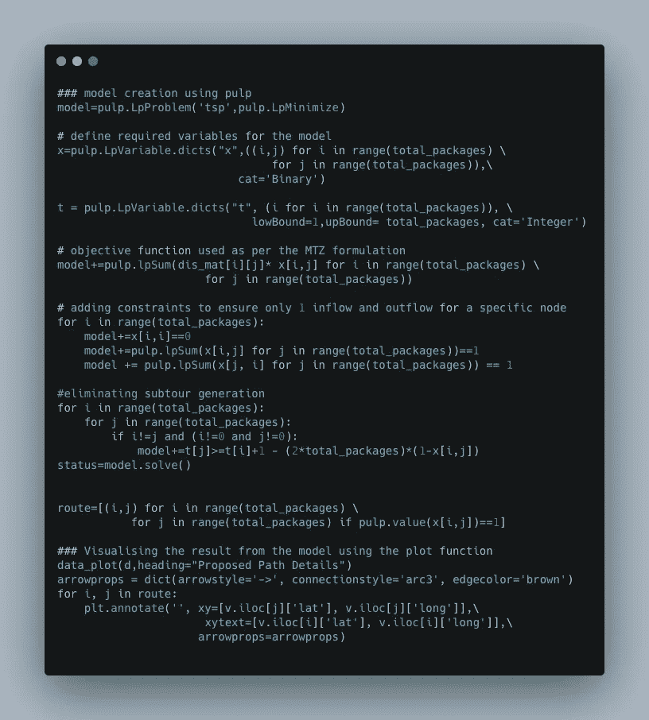
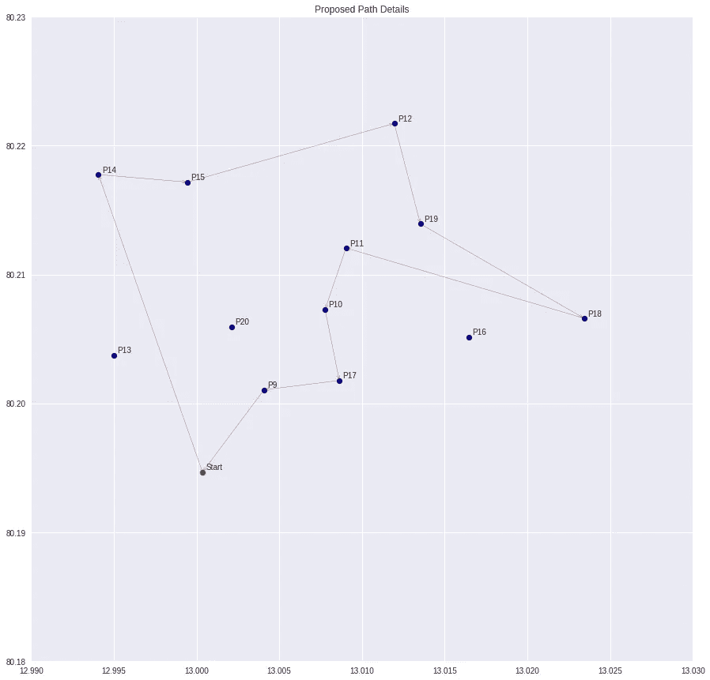

# 使用实时交通和天气数据的 MTZ 公式智能递送助手

> 原文：<https://medium.com/analytics-vidhya/intelligent-delivery-assistant-with-mtz-formulation-using-real-time-traffic-and-weather-data-10964ca7574a?source=collection_archive---------6----------------------->


布雷特·乔丹在 [Unsplash](https://unsplash.com?utm_source=medium&utm_medium=referral) 上的照片

在当前的十年中，产品的交付已经成为一种必须，而不是一种没有选择的设施。在疫情期间，这已经被证明了很多。在优化递送策略方面有很多研究，这些研究侧重于提高客户满意度，并鼓励递送合作伙伴递送更多包裹。在本文中，我们将看到一种以更简单的方式实现的优化方法，用于帮助交付合作伙伴嵌入实时交通和天气数据。

我们的原型就叫送快递的名字吧！！！！

Delivery express 根据距离、交通和天气数据优化递送路径。

*   【HERE.com】为我们提供实时交通数据，这些数据是基于 2 个 lat: long 对作为我们感兴趣区域的包围盒来采集的。更多信息请点击[此处](https://developer.here.com/documentation/traffic-data-service/dev_guide/topics/apply-bounding-box-filter.html) …
*   [Openweathermap](https://openweathermap.org/api) 为我们提供特定位置的实时天气数据信息。
*   我们使用一个由经度对组成的样本数据集，这些经度对是当天的交货地点。
*   最后，我们将收集的所有信息嵌入 MTZ 公式，以实现更好的交付优化。[纸浆](https://pypi.org/project/PuLP/) python 包用于模型准备。

[**Miller-Tucker-zem Lin**](https://en.wikipedia.org/wiki/Travelling_salesman_problem)是一种传统的 TSP 算法，它基于作为权重参数的距离以及为避免任何子路线、重复路径创建而添加的约束来优化路径。在我们的实验中，我们将在算法中引入一些实时交通和天气情况。

**样本数据:**

```
 ------------Package data----------------    
Package  lat      long     Traffic  Weather 
DC   13.00036  80.19466      NaN      NaN 
P9   13.00408  80.20105      NaN      NaN 
P10  13.00777  80.20728      NaN      NaN 
P11  13.00903  80.21206      NaN      NaN 
P12  13.01195  80.22173      NaN      NaN 
P13  12.99500  80.20373      NaN      NaN 
P14  12.99407  80.21776      NaN      NaN      
P15  12.99945  80.21717      NaN      NaN     
P16  13.01648  80.20514      NaN      NaN      
P17  13.00863  80.20177      NaN      NaN     
P18  13.02343  80.20660      NaN      NaN     
P19  13.01353  80.21393      NaN      NaN  
P20  13.00211  80.20595      NaN      NaN 
  --------------------------------------
```



图 1:基于 Lat long 对绘制的样本数据

**抓取流量数据使用此处:**

这里提供了基于纬度和经度对的边界框的实时交通数据。有关数据收集的更多信息，请访问[此处](https://www.here.com/platform/traffic-solutions/real-time-traffic-information)。

```
import requestsmyreq=requests.get("https://traffic.ls.hereapi.com/traffic/6.2/flow.xml?apiKey=<apikey>&bbox=12.968437582654817, 80.15070295546795;13.015591299483422, 80.22396372312538&responseattributes=sh,fc")
```

**使用打开的天气图抓取天气数据:**

我们已经使用了 [OpenWeatherMap](https://openweathermap.org/current) ，它提供了地球上任何地方的当前天气数据，包括 200，000 多个城市！基于地理坐标。

我们根据代码和描述将天气状况分为非常糟糕、糟糕、正常和良好。这里可以找到详细设置[。](https://openweathermap.org/weather-conditions)

```
VBad_WeatherCodes = [202,212,221,232,503,504,511,602,622,781,762]Bad_WeatherCodes = [200,201,210,211,230,231,500,501,502,520,521,522,531,601,611,615,621,731,751,761,771]normal_WeatherCodes = [300,301,302,310,311,312,313,314,321,600,615,620,701,711,721,741]Good_WeatherCodes = [800,801,802,803,804]req = requests.get("http://api.openweathermap.org/data/2.5/weather?lat=12.97612&lon=80.15710&appid=<appID>&units=metric")weather_data=req.json()
```

最后，解析请求以获取基于纬度-经度对查询的位置的当前天气状态。



图 2:抓取实时交通和天气数据后的最终数据

我们已经添加了值为[0，1]的 TrafficWeatherCheck 度量，用于根据编码列表指示该包是否可以交付。

```
trafficEncoding = ["Less","Normal"]weatherEncoding = ["good","partially bad"]for index,rows in data.iterrows():if rows[3] in trafficEncoding and rows[4] in weatherEncoding:data.at[index,'TrafficWeatherCheck'] = 0else:data.at[index,'TrafficWeatherCheck'] = 1
```

最后，我们在模型准备中使用它们来获取考虑距离、交通和天气条件的最佳可能路径。

为了代码清晰，我们使用了碳元素，



图 3:使用纸浆实现 MTZ 配方的模型代码

**输出:**

我们的模型显示了从起始位置向所有包裹建议的最佳路径，跳过 P20 和 P16，即具有恶劣天气或恶劣交通条件，并最终返回到起始位置。考虑到交通和天气等环境因素，Delivery Express 可以帮助配送合作伙伴挑选合适的包裹进行配送，同时他也有一个要在整个城市进行配送的包裹列表。它通过最大限度地减少交通和天气干扰所浪费的时间和精力，最大限度地提高了交付合作伙伴的生产力。



图 4:显示预计交付路径的输出图

[完整代码](https://colab.research.google.com/drive/1OxjHYhZD5TWjB5mbDADOd-VnE7bFfqWD?usp=sharing) …！！！

**参考文献:**

[](https://www.here.com/platform/traffic-solutions/real-time-traffic-information) [## 实时交通信息和数据|此处

### 交通拥堵和事故造成的延误成本高昂、耗时，而且直到现在都难以预测…

www.here.com](https://www.here.com/platform/traffic-solutions/real-time-traffic-information) [](https://openweathermap.org/current) [## 当前天气数据

### 访问地球上任何地方的当前天气数据。我们收集和处理来自不同来源的天气数据，例如…

openweathermap.org](https://openweathermap.org/current)